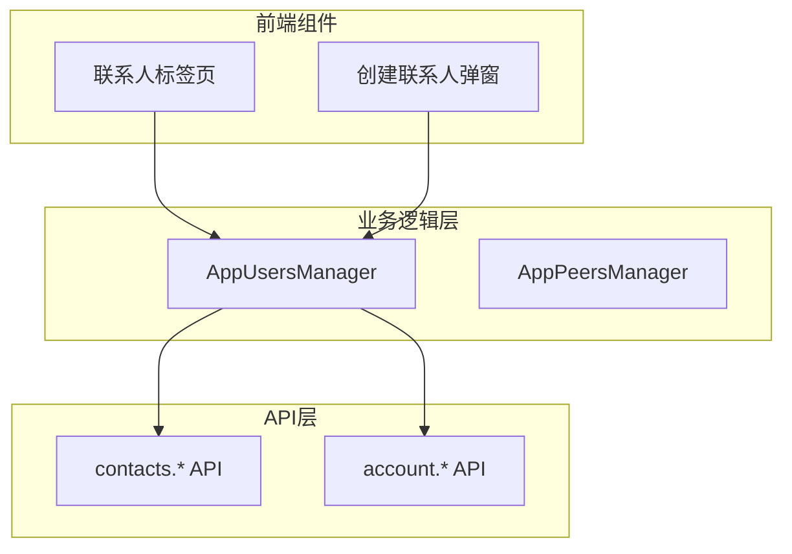
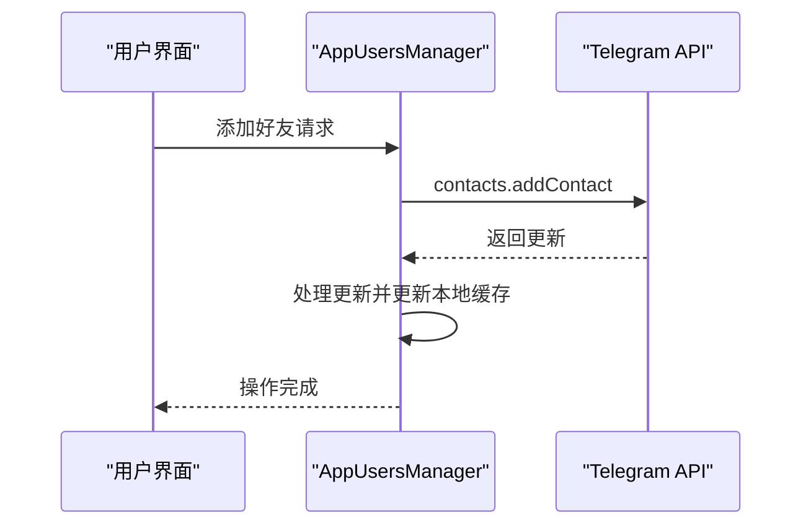
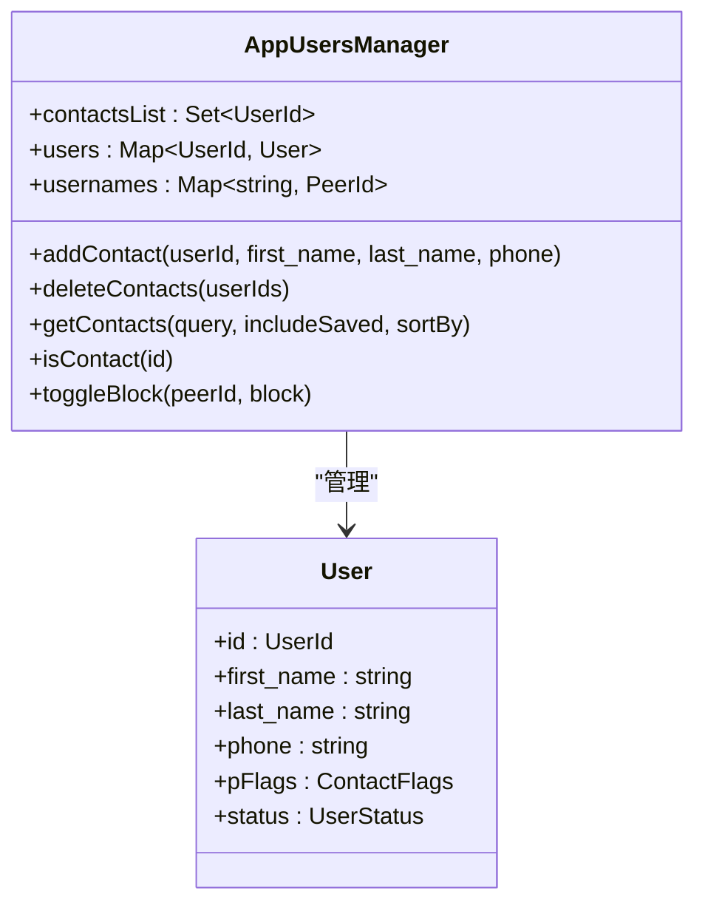
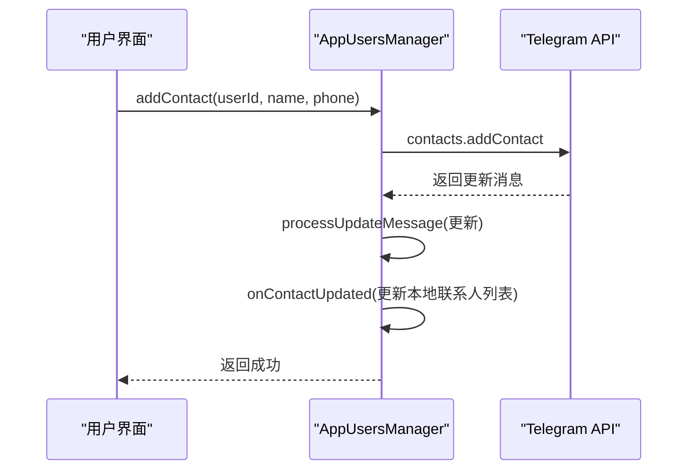
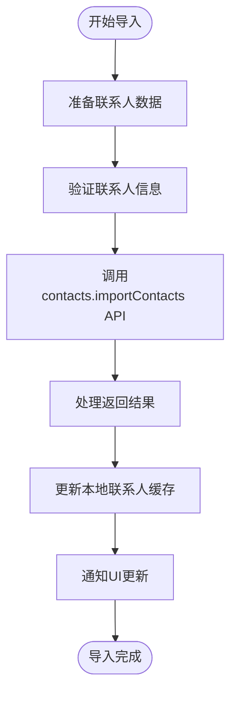
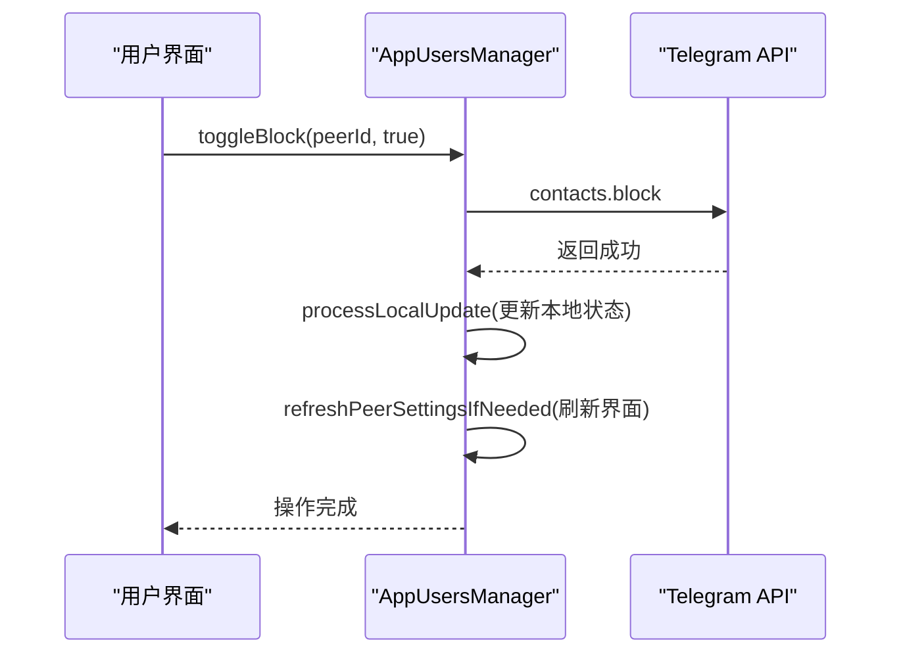
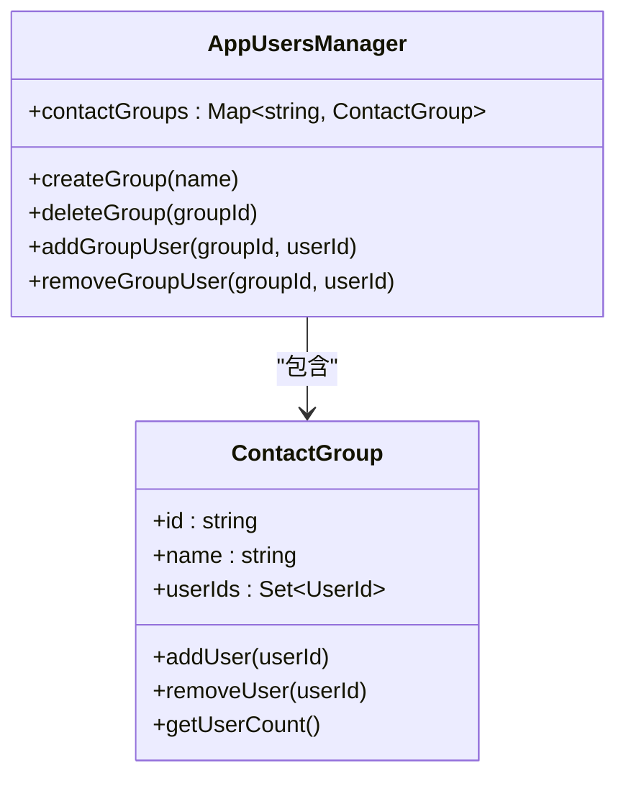
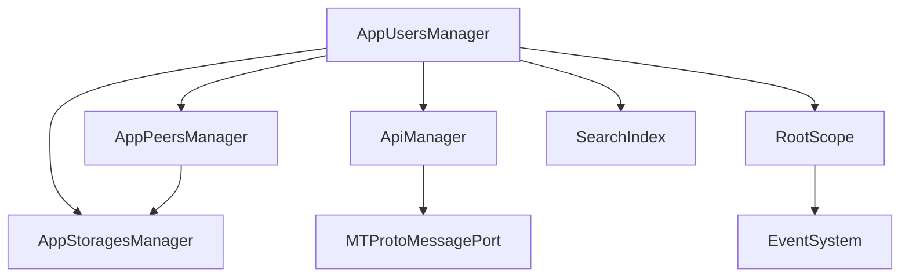

# 关系链管理

<cite>
**本文档引用的文件**  
- [appUsersManager.ts](file://src/lib/appManagers/appUsersManager.ts#L1-L1356)
- [contacts.ts](file://src/components/sidebarLeft/tabs/contacts.ts#L1-L140)
- [popupCreateContact.ts](file://src/components/popups/createContact.ts#L1-L100)
</cite>

## 目录
1. [简介](#简介)
2. [项目结构](#项目结构)
3. [核心组件](#核心组件)
4. [架构概述](#架构概述)
5. [详细组件分析](#详细组件分析)
6. [依赖分析](#依赖分析)
7. [性能考虑](#性能考虑)
8. [故障排除指南](#故障排除指南)
9. [结论](#结论)

## 简介
本文档全面记录了关系链管理API的实现机制，涵盖好友添加、联系人管理、黑名单操作等核心功能。文档详细描述了用户关系链的数据模型，包括好友关系、联系人列表、黑名单等实体及其相互关系。同时，解释了好友请求的发送、接受与拒绝的全流程实现机制，以及联系人同步和导入功能的技术实现。此外，提供了关系链查询API的使用指南，包括获取好友列表和检查用户关系状态等操作，并包含用户分组和标签管理的功能说明。

## 项目结构
项目结构清晰地划分了不同功能模块，其中关系链管理相关代码主要集中在`src/lib/appManagers`和`src/components`目录下。`appUsersManager.ts`是关系链管理的核心文件，负责处理用户关系的增删改查操作。`contacts.ts`文件则负责联系人界面的展示逻辑。

**图表来源**  
- [appUsersManager.ts](file://src/lib/appManagers/appUsersManager.ts#L51-L1356)
- [contacts.ts](file://src/components/sidebarLeft/tabs/contacts.ts#L24-L140)

**本节来源**  
- [appUsersManager.ts](file://src/lib/appManagers/appUsersManager.ts#L1-L1356)
- [contacts.ts](file://src/components/sidebarLeft/tabs/contacts.ts#L1-L140)

## 核心组件
关系链管理的核心组件包括`AppUsersManager`类，它负责管理用户关系链的所有操作。该类提供了添加好友、删除联系人、管理黑名单等功能。`AppUsersManager`通过调用Telegram MTProto API来实现这些功能，并维护本地缓存以提高性能。

**本节来源**  
- [appUsersManager.ts](file://src/lib/appManagers/appUsersManager.ts#L51-L1356)

## 架构概述
系统采用分层架构，前端组件通过`AppUsersManager`与后端API进行交互。`AppUsersManager`作为中间层，封装了所有关系链管理相关的API调用，并提供了缓存机制来优化性能。

**图表来源**  
- [appUsersManager.ts](file://src/lib/appManagers/appUsersManager.ts#L1129-L1157)
- [contacts.ts](file://src/components/sidebarLeft/tabs/contacts.ts#L38-L40)

## 详细组件分析

### 好友管理分析
`AppUsersManager`类提供了完整的好友管理功能，包括添加、删除和查询好友。

#### 好友管理类图

**图表来源**  
- [appUsersManager.ts](file://src/lib/appManagers/appUsersManager.ts#L51-L1356)

#### 好友添加序列图

**图表来源**  
- [appUsersManager.ts](file://src/lib/appManagers/appUsersManager.ts#L1129-L1157)

**本节来源**  
- [appUsersManager.ts](file://src/lib/appManagers/appUsersManager.ts#L1129-L1157)
- [popupCreateContact.ts](file://src/components/popups/createContact.ts#L1-L100)

### 联系人同步与导入
系统支持联系人同步和导入功能，允许用户从设备通讯录导入联系人。

#### 联系人导入流程图

**图表来源**  
- [appUsersManager.ts](file://src/lib/appManagers/appUsersManager.ts#L921-L948)

**本节来源**  
- [appUsersManager.ts](file://src/lib/appManagers/appUsersManager.ts#L921-L948)

### 黑名单管理
系统提供了完整的黑名单管理功能，允许用户屏蔽其他用户。

#### 黑名单操作序列图

**图表来源**  
- [appUsersManager.ts](file://src/lib/appManagers/appUsersManager.ts#L468-L484)

**本节来源**  
- [appUsersManager.ts](file://src/lib/appManagers/appUsersManager.ts#L468-L484)

### 关系链查询API
系统提供了丰富的API来查询用户关系状态。

#### 关系查询功能表
| 方法 | 描述 | 参数 | 返回值 |
|------|------|------|--------|
| getContacts | 获取联系人列表 | query, includeSaved, sortBy | Promise~UserId[]~ |
| isContact | 检查是否为联系人 | userId | boolean |
| getBlocked | 获取黑名单 | offset, limit | {count, peerIds} |
| searchContacts | 搜索联系人 | query, limit | {my_results, results} |

**图表来源**  
- [appUsersManager.ts](file://src/lib/appManagers/appUsersManager.ts#L402-L450)

**本节来源**  
- [appUsersManager.ts](file://src/lib/appManagers/appUsersManager.ts#L402-L450)

### 用户分组与标签管理
系统支持用户分组和标签管理功能，允许用户对联系人进行分类管理。

#### 分组管理功能

**图表来源**  
- [appUsersManager.ts](file://src/lib/appManagers/appUsersManager.ts#L51-L1356)

**本节来源**  
- [appUsersManager.ts](file://src/lib/appManagers/appUsersManager.ts#L51-L1356)

## 依赖分析
关系链管理模块依赖于多个核心组件，形成了复杂的依赖网络。

**图表来源**  
- [appUsersManager.ts](file://src/lib/appManagers/appUsersManager.ts#L51-L1356)
- [manager.ts](file://src/lib/appManagers/manager.ts#L1-L100)

**本节来源**  
- [appUsersManager.ts](file://src/lib/appManagers/appUsersManager.ts#L51-L1356)

## 性能考虑
在关系链管理中，性能优化主要体现在以下几个方面：
- 本地缓存：使用`AppStoragesManager`缓存用户数据，减少API调用
- 懒加载：联系人列表采用分页加载，提高初始加载速度
- 批量操作：支持批量添加和删除联系人，减少网络请求次数
- 搜索优化：使用`SearchIndex`类实现高效的联系人搜索

## 故障排除指南
常见问题及解决方案：

1. **无法添加好友**
   - 检查网络连接
   - 确认对方隐私设置是否允许添加
   - 检查输入的手机号是否正确

2. **联系人同步失败**
   - 确认设备通讯录权限已开启
   - 检查API调用是否返回错误
   - 验证联系人数据格式是否正确

3. **黑名单操作无效**
   - 确认API调用是否成功
   - 检查本地缓存是否正确更新
   - 验证UI是否正确反映状态变化

**本节来源**  
- [appUsersManager.ts](file://src/lib/appManagers/appUsersManager.ts#L1129-L1157)
- [appUsersManager.ts](file://src/lib/appManagers/appUsersManager.ts#L468-L484)

## 结论
本文档详细介绍了关系链管理系统的实现机制，涵盖了从数据模型到具体API调用的各个方面。系统通过`AppUsersManager`类提供了完整的好友管理、联系人同步、黑名单操作等功能，并通过合理的架构设计和性能优化确保了良好的用户体验。开发者可以基于本文档快速理解和使用关系链管理API，实现各种社交功能。