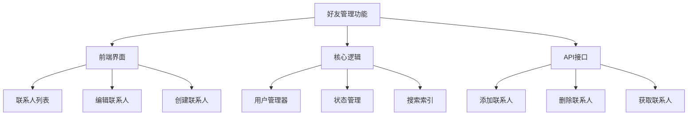
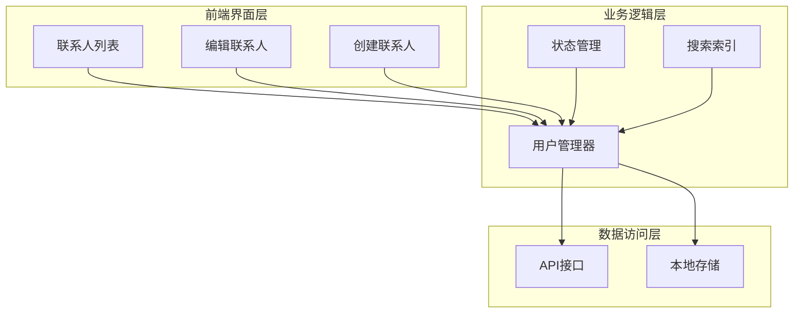
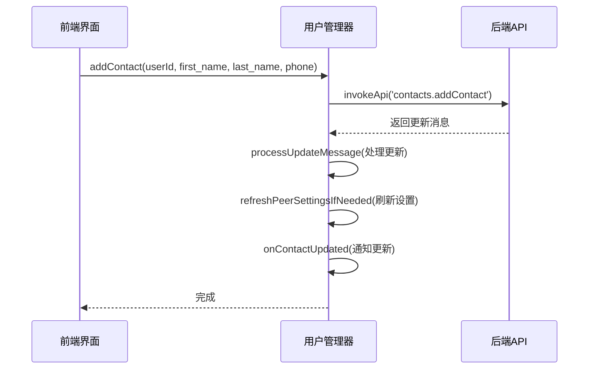
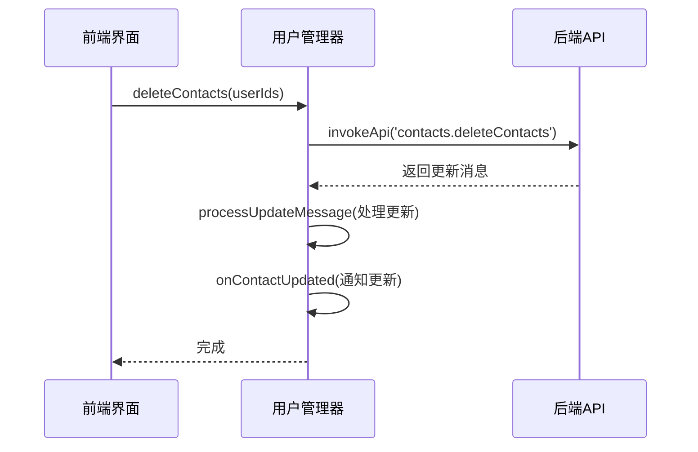
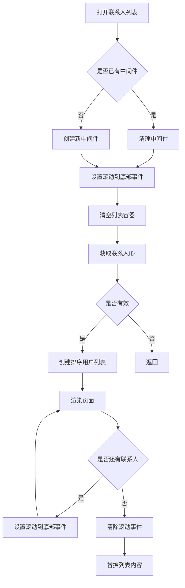
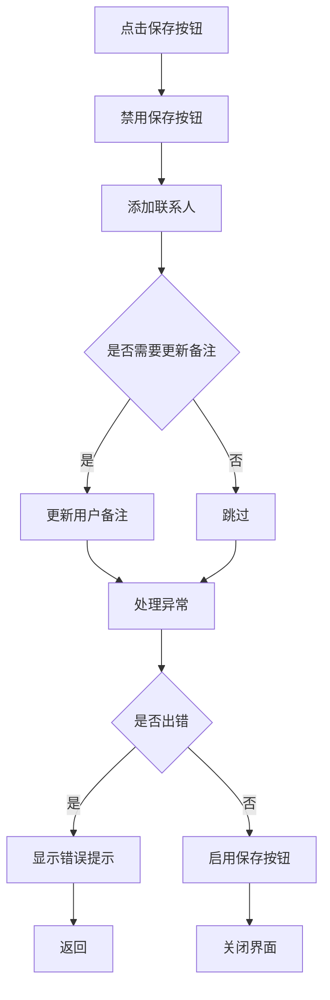
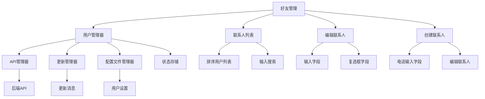

# 好友管理

<cite>
**本文档引用的文件**   
- [appUsersManager.ts](file://src/lib/appManagers/appUsersManager.ts)
- [contacts.ts](file://src/components/sidebarLeft/tabs/contacts.ts)
- [editContact.ts](file://src/components/sidebarRight/tabs/editContact.ts)
- [createContact.ts](file://src/components/popups/createContact.ts)
- [layer.d.ts](file://src/layer.d.ts)
</cite>

## 目录
1. [简介](#简介)
2. [项目结构](#项目结构)
3. [核心组件](#核心组件)
4. [架构概述](#架构概述)
5. [详细组件分析](#详细组件分析)
6. [依赖分析](#依赖分析)
7. [性能考虑](#性能考虑)
8. [故障排除指南](#故障排除指南)
9. [结论](#结论)

## 简介
本文档全面记录了Telegram Web客户端中好友管理功能的实现细节。重点描述了添加好友、删除好友、查看好友列表等接口的技术实现机制，详细说明了好友关系的数据模型、好友请求流程、前端交互和后端通信过程。通过实际代码示例展示常见操作的实现方式，并提供错误处理和异常情况的解决方案。

## 项目结构
项目中的好友管理功能主要分布在以下几个目录中：
- `src/components/sidebarLeft/tabs/contacts.ts`：联系人列表界面
- `src/components/sidebarRight/tabs/editContact.ts`：编辑联系人界面
- `src/components/popups/createContact.ts`：创建联系人弹窗
- `src/lib/appManagers/appUsersManager.ts`：用户管理核心逻辑
- `src/layer.d.ts`：API接口定义



**Diagram sources**
- [contacts.ts](file://src/components/sidebarLeft/tabs/contacts.ts)
- [editContact.ts](file://src/components/sidebarRight/tabs/editContact.ts)
- [appUsersManager.ts](file://src/lib/appManagers/appUsersManager.ts)

**Section sources**
- [contacts.ts](file://src/components/sidebarLeft/tabs/contacts.ts)
- [editContact.ts](file://src/components/sidebarRight/tabs/editContact.ts)
- [createContact.ts](file://src/components/popups/createContact.ts)

## 核心组件
好友管理功能的核心组件包括用户管理器（AppUsersManager）、联系人列表界面、编辑联系人界面和创建联系人弹窗。这些组件协同工作，实现了完整的好友管理功能。

**Section sources**
- [appUsersManager.ts](file://src/lib/appManagers/appUsersManager.ts#L51-L1356)
- [contacts.ts](file://src/components/sidebarLeft/tabs/contacts.ts#L1-L140)

## 架构概述
好友管理功能采用分层架构设计，分为前端界面层、业务逻辑层和数据访问层。前端界面负责用户交互，业务逻辑层处理核心功能，数据访问层与后端API通信。



**Diagram sources**
- [appUsersManager.ts](file://src/lib/appManagers/appUsersManager.ts#L51-L1356)
- [contacts.ts](file://src/components/sidebarLeft/tabs/contacts.ts#L1-L140)
- [editContact.ts](file://src/components/sidebarRight/tabs/editContact.ts#L1-L271)

## 详细组件分析

### 用户管理器分析
用户管理器（AppUsersManager）是好友管理功能的核心，负责处理所有与用户相关的操作。

#### 类图
```mermaid
classDiagram
class AppUsersManager {
+users : {[userId : UserId] : User}
+usernames : {[username : string] : PeerId}
+contactsIndex : SearchIndex~UserId~
+contactsList : Set~UserId~
+getContacts(query : string, includeSaved : boolean, sortBy : string) : Promise~UserId[]~
+getContactsPeerIds(query : string, includeSaved : boolean, sortBy : string, limit : number) : Promise~PeerId[]~
+addContact(userId : UserId, first_name : string, last_name : string, phone : string, addPhonePrivacyException : boolean) : Promise~void~
+deleteContacts(userIds : UserId[]) : Promise~void~
+toggleBlock(peerId : PeerId, block : boolean, blockMyStoriesFrom : boolean) : Promise~void~
+isContact(id : UserId) : boolean
+isRegularUser(id : UserId) : boolean
+isNonContactUser(id : UserId) : boolean
}
class SearchIndex {
+indexObject(id : UserId, text : string) : void
+search(query : string) : Set~UserId~
}
AppUsersManager --> SearchIndex : "使用"
```

**Diagram sources**
- [appUsersManager.ts](file://src/lib/appManagers/appUsersManager.ts#L51-L1356)

#### 添加好友流程


**Diagram sources**
- [appUsersManager.ts](file://src/lib/appManagers/appUsersManager.ts#L1129-L1155)

#### 删除好友流程


**Diagram sources**
- [appUsersManager.ts](file://src/lib/appManagers/appUsersManager.ts#L1159-L1169)

**Section sources**
- [appUsersManager.ts](file://src/lib/appManagers/appUsersManager.ts#L1129-L1169)

### 联系人列表分析
联系人列表界面负责显示用户的好友列表，并提供搜索和添加功能。

#### 流程图


**Diagram sources**
- [contacts.ts](file://src/components/sidebarLeft/tabs/contacts.ts#L100-L137)

**Section sources**
- [contacts.ts](file://src/components/sidebarLeft/tabs/contacts.ts#L100-L137)

### 编辑联系人分析
编辑联系人界面提供修改联系人信息和删除联系人的功能。

#### 流程图


**Diagram sources**
- [editContact.ts](file://src/components/sidebarRight/tabs/editContact.ts#L245-L268)

**Section sources**
- [editContact.ts](file://src/components/sidebarRight/tabs/editContact.ts#L245-L268)

## 依赖分析
好友管理功能依赖于多个核心模块和外部服务，形成了复杂的依赖关系网络。



**Diagram sources**
- [appUsersManager.ts](file://src/lib/appManagers/appUsersManager.ts#L51-L1356)
- [contacts.ts](file://src/components/sidebarLeft/tabs/contacts.ts#L1-L140)
- [editContact.ts](file://src/components/sidebarRight/tabs/editContact.ts#L1-L271)
- [createContact.ts](file://src/components/popups/createContact.ts#L1-L90)

**Section sources**
- [appUsersManager.ts](file://src/lib/appManagers/appUsersManager.ts#L51-L1356)
- [contacts.ts](file://src/components/sidebarLeft/tabs/contacts.ts#L1-L140)
- [editContact.ts](file://src/components/sidebarRight/tabs/editContact.ts#L1-L271)
- [createContact.ts](file://src/components/popups/createContact.ts#L1-L90)

## 性能考虑
好友管理功能在性能方面做了多项优化：

1. **搜索索引优化**：使用SearchIndex类对联系人进行索引，提高搜索效率
2. **分页加载**：联系人列表采用分页加载机制，避免一次性加载过多数据
3. **缓存机制**：对用户数据进行本地缓存，减少重复请求
4. **中间件管理**：使用中间件机制管理异步操作，避免内存泄漏

**Section sources**
- [appUsersManager.ts](file://src/lib/appManagers/appUsersManager.ts#L56-L58)
- [contacts.ts](file://src/components/sidebarLeft/tabs/contacts.ts#L58-L59)

## 故障排除指南
### 常见问题及解决方案

| 问题 | 原因 | 解决方案 |
|------|------|----------|
| 无法添加好友 | 用户不存在 | 检查手机号是否正确，确认对方已注册Telegram |
| 重复添加好友 | 未检查联系人状态 | 在添加前调用isContact方法检查是否已是好友 |
| 删除好友失败 | 网络连接问题 | 检查网络连接，重试操作 |
| 联系人列表不更新 | 缓存未刷新 | 调用refreshPeerSettingsIfNeeded方法刷新缓存 |

### 错误处理机制
系统通过以下方式处理异常情况：
- 使用Promise的catch方法捕获异步操作错误
- 显示友好的错误提示信息
- 提供重试机制
- 记录错误日志用于调试

**Section sources**
- [appUsersManager.ts](file://src/lib/appManagers/appUsersManager.ts#L1144-L1155)
- [editContact.ts](file://src/components/sidebarRight/tabs/editContact.ts#L260-L263)

## 结论
Telegram Web客户端的好友管理功能通过清晰的分层架构和模块化设计，实现了高效、稳定的好友管理体验。核心的用户管理器封装了复杂的业务逻辑，前端界面提供了友好的用户交互，两者通过清晰的接口进行通信。系统在性能优化、错误处理和用户体验方面都做了充分考虑，为用户提供了一个可靠的好友管理解决方案。