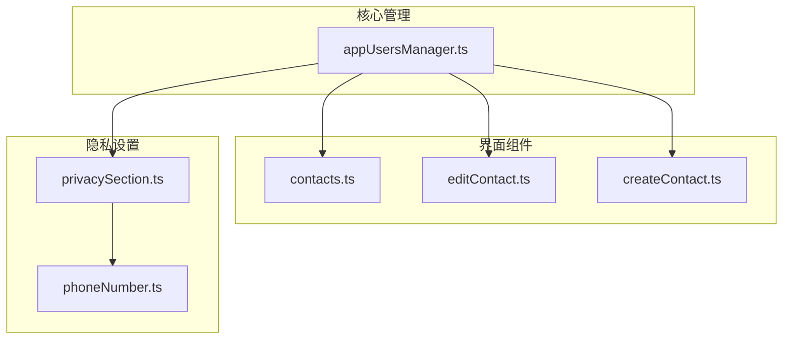
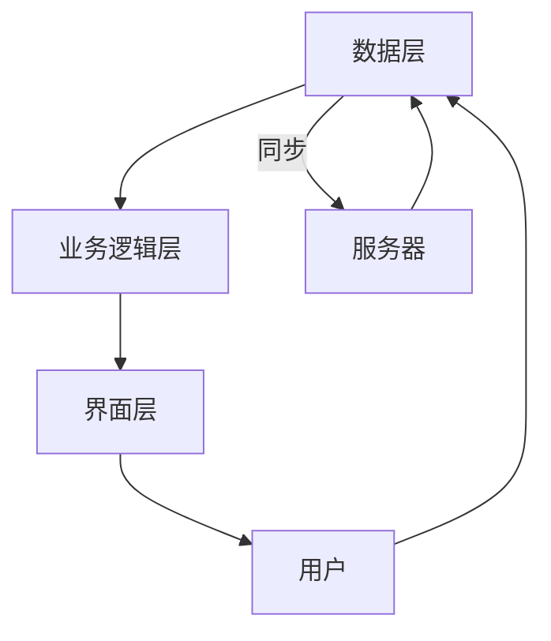
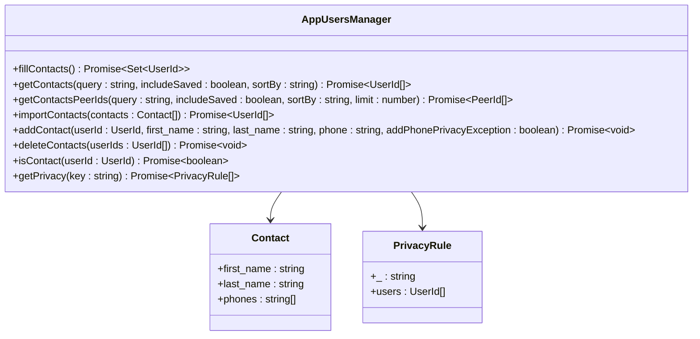
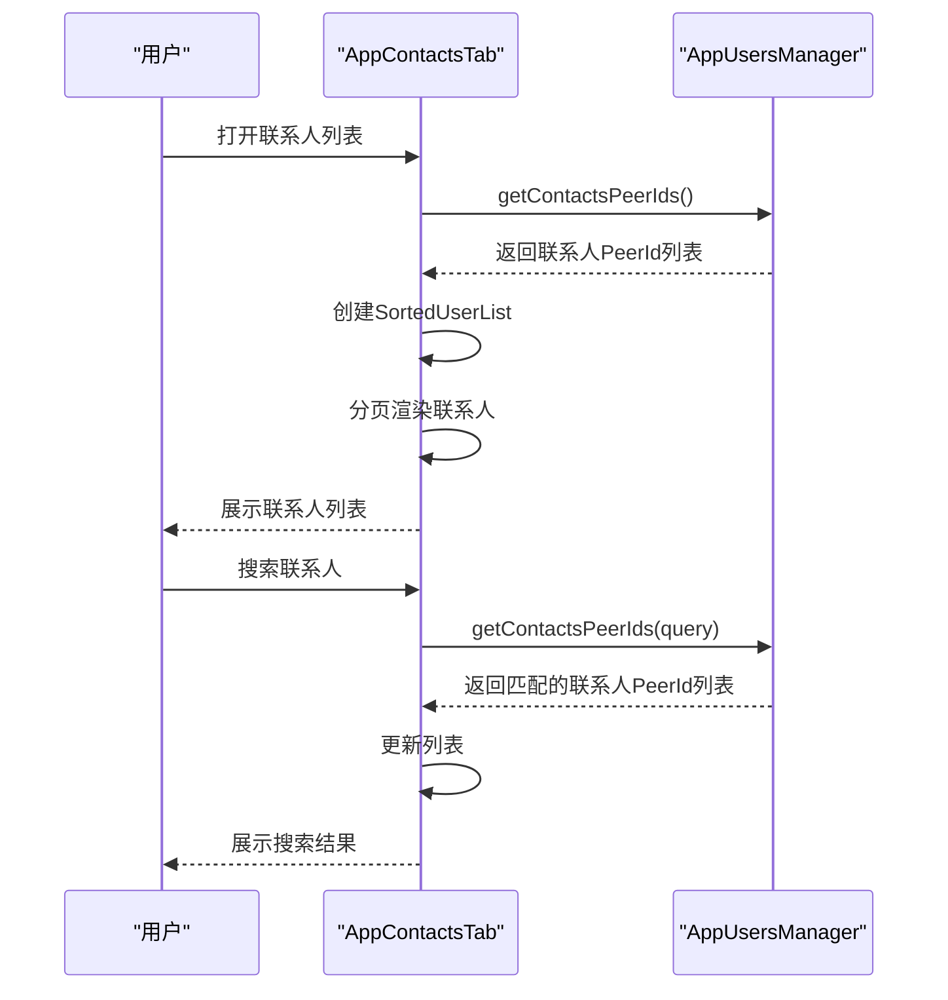
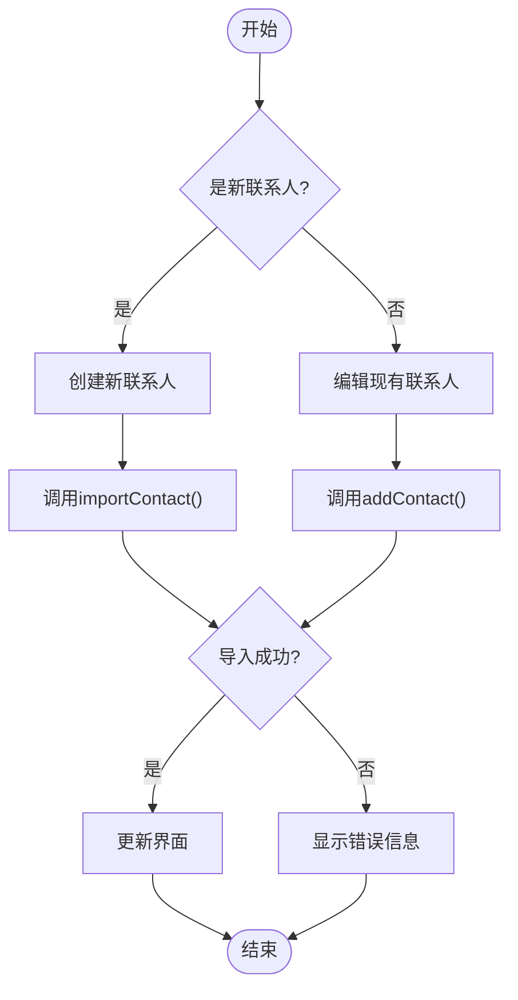
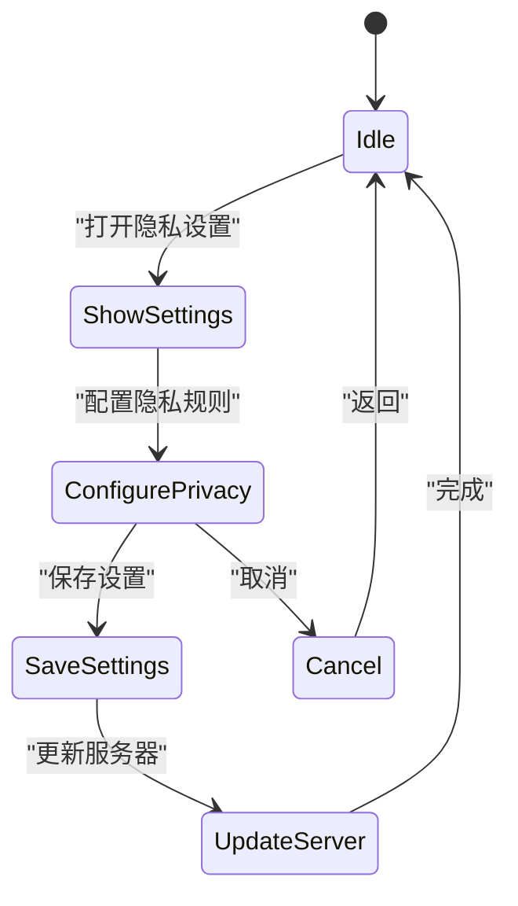
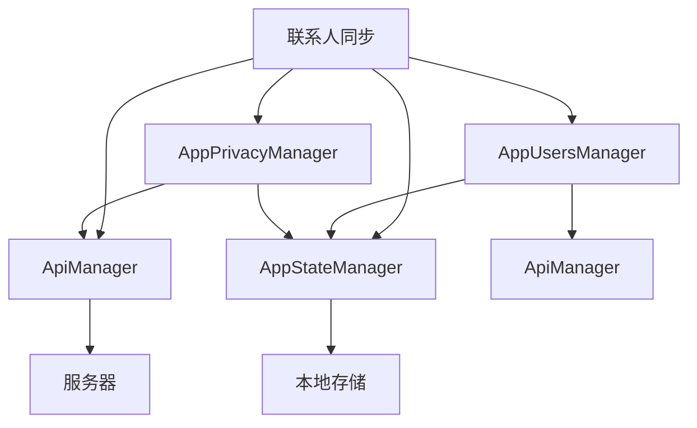

# 联系人同步

<cite>
**本文档引用的文件**  
- [appUsersManager.ts](file://src/lib/appManagers/appUsersManager.ts)
- [contacts.ts](file://src/components/sidebarLeft/tabs/contacts.ts)
- [editContact.ts](file://src/components/sidebarRight/tabs/editContact.ts)
- [createContact.ts](file://src/components/popups/createContact.ts)
- [privacySection.ts](file://src/components/privacySection.ts)
- [phoneNumber.ts](file://src/components/sidebarLeft/tabs/privacy/phoneNumber.ts)
</cite>

## 目录
1. [简介](#简介)
2. [项目结构](#项目结构)
3. [核心组件](#核心组件)
4. [架构概述](#架构概述)
5. [详细组件分析](#详细组件分析)
6. [依赖分析](#依赖分析)
7. [性能考虑](#性能考虑)
8. [故障排除指南](#故障排除指南)
9. [结论](#结论)

## 简介
本文档全面记录了联系人同步功能的实现细节，包括联系人导入、联系人列表管理、联系人信息同步等接口的实现。文档详细描述了联系人数据模型，包括联系人姓名、手机号、头像等属性及其与用户账户的关系。同时，文档说明了联系人同步的实现机制，包括本地通讯录读取、联系人匹配、信息更新等流程，并通过实际代码示例展示如何实现联系人导入、联系人信息更新、联系人搜索等常见操作。此外，文档还解释了联系人隐私设置对同步功能的影响，以及跨设备联系人同步的实现方式，并提供了性能优化建议，如大规模联系人数据的分批处理。

## 项目结构
项目结构清晰地组织了联系人同步功能的相关文件。核心功能主要集中在`src/lib/appManagers`目录下的`appUsersManager.ts`文件中，该文件负责管理用户和联系人数据。联系人界面相关的组件位于`src/components`目录下，包括联系人列表、联系人编辑和联系人创建等功能。

**图示来源**  
- [appUsersManager.ts](file://src/lib/appManagers/appUsersManager.ts)
- [contacts.ts](file://src/components/sidebarLeft/tabs/contacts.ts)
- [editContact.ts](file://src/components/sidebarRight/tabs/editContact.ts)
- [createContact.ts](file://src/components/popups/createContact.ts)
- [privacySection.ts](file://src/components/privacySection.ts)
- [phoneNumber.ts](file://src/components/sidebarLeft/tabs/privacy/phoneNumber.ts)

**本节来源**  
- [appUsersManager.ts](file://src/lib/appManagers/appUsersManager.ts)
- [contacts.ts](file://src/components/sidebarLeft/tabs/contacts.ts)

## 核心组件
联系人同步功能的核心组件包括联系人数据管理、联系人列表展示、联系人编辑和创建功能，以及联系人隐私设置。这些组件协同工作，实现了完整的联系人同步体验。

**本节来源**  
- [appUsersManager.ts](file://src/lib/appManagers/appUsersManager.ts)
- [contacts.ts](file://src/components/sidebarLeft/tabs/contacts.ts)
- [editContact.ts](file://src/components/sidebarRight/tabs/editContact.ts)
- [createContact.ts](file://src/components/popups/createContact.ts)

## 架构概述
联系人同步功能的架构分为数据层、业务逻辑层和界面层。数据层由`appUsersManager`负责，管理联系人数据的存储和同步。业务逻辑层处理联系人导入、更新和删除等操作。界面层则负责展示联系人列表、编辑联系人信息和创建新联系人。

**图示来源**  
- [appUsersManager.ts](file://src/lib/appManagers/appUsersManager.ts)
- [contacts.ts](file://src/components/sidebarLeft/tabs/contacts.ts)

## 详细组件分析

### 联系人数据管理分析
联系人数据管理是联系人同步功能的核心。`appUsersManager`类负责管理所有用户和联系人数据，包括联系人列表的填充、联系人信息的更新和联系人隐私设置的管理。

**图示来源**  
- [appUsersManager.ts](file://src/lib/appManagers/appUsersManager.ts)

**本节来源**  
- [appUsersManager.ts](file://src/lib/appManagers/appUsersManager.ts)

### 联系人列表展示分析
联系人列表展示功能由`AppContactsTab`类实现，该类负责展示联系人列表并处理用户交互。

**图示来源**  
- [contacts.ts](file://src/components/sidebarLeft/tabs/contacts.ts)
- [appUsersManager.ts](file://src/lib/appManagers/appUsersManager.ts)

**本节来源**  
- [contacts.ts](file://src/components/sidebarLeft/tabs/contacts.ts)

### 联系人编辑和创建分析
联系人编辑和创建功能由`AppEditContactTab`和`PopupCreateContact`类实现，分别负责编辑现有联系人和创建新联系人。

**图示来源**  
- [editContact.ts](file://src/components/sidebarRight/tabs/editContact.ts)
- [createContact.ts](file://src/components/popups/createContact.ts)
- [appUsersManager.ts](file://src/lib/appManagers/appUsersManager.ts)

**本节来源**  
- [editContact.ts](file://src/components/sidebarRight/tabs/editContact.ts)
- [createContact.ts](file://src/components/popups/createContact.ts)

### 联系人隐私设置分析
联系人隐私设置功能由`AppPrivacyPhoneNumberTab`类实现，负责管理用户手机号的隐私设置。

**图示来源**  
- [phoneNumber.ts](file://src/components/sidebarLeft/tabs/privacy/phoneNumber.ts)

**本节来源**  
- [phoneNumber.ts](file://src/components/sidebarLeft/tabs/privacy/phoneNumber.ts)

## 依赖分析
联系人同步功能依赖于多个核心组件和外部服务。主要依赖包括用户管理器、隐私管理器、API管理器和状态存储。

**图示来源**  
- [appUsersManager.ts](file://src/lib/appManagers/appUsersManager.ts)
- [phoneNumber.ts](file://src/components/sidebarLeft/tabs/privacy/phoneNumber.ts)

**本节来源**  
- [appUsersManager.ts](file://src/lib/appManagers/appUsersManager.ts)
- [phoneNumber.ts](file://src/components/sidebarLeft/tabs/privacy/phoneNumber.ts)

## 性能考虑
在处理大规模联系人数据时，需要考虑性能优化。建议采用分批处理的方式，避免一次性加载过多数据导致性能问题。同时，合理使用缓存机制，减少重复的网络请求。

## 故障排除指南
当联系人同步功能出现问题时，可以按照以下步骤进行排查：
1. 检查网络连接是否正常
2. 确认用户权限设置是否正确
3. 查看API调用日志，确认是否有错误返回
4. 检查本地存储是否正常
5. 验证联系人数据格式是否正确

**本节来源**  
- [appUsersManager.ts](file://src/lib/appManagers/appUsersManager.ts)
- [editContact.ts](file://src/components/sidebarRight/tabs/editContact.ts)

## 结论
本文档全面记录了联系人同步功能的实现细节，包括联系人导入、联系人列表管理、联系人信息同步等接口的实现。通过详细的代码分析和图表展示，为开发者提供了完整的参考。建议在实际开发中，遵循文档中的最佳实践，确保联系人同步功能的稳定性和性能。