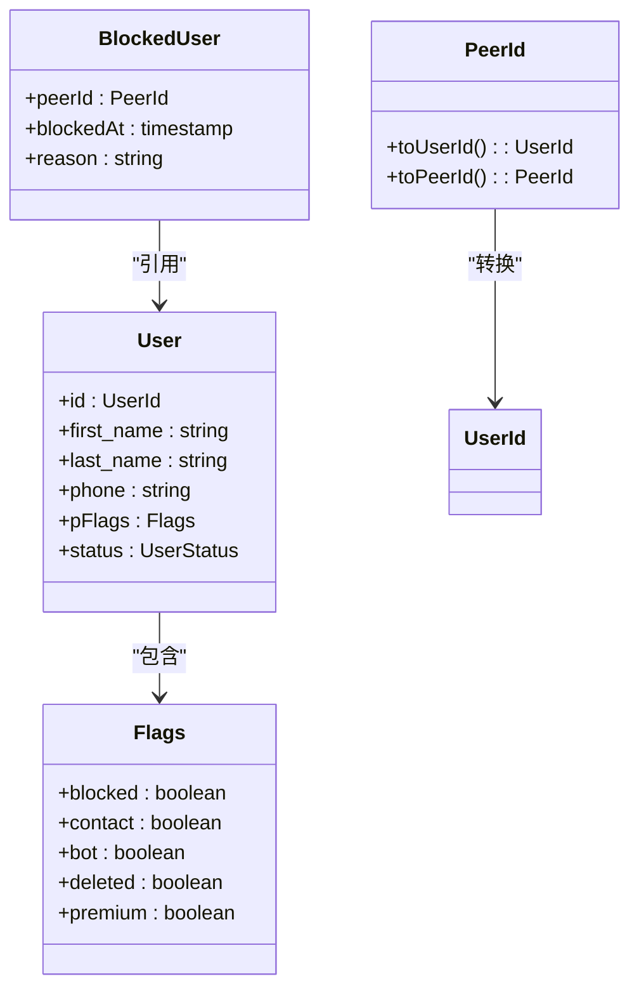
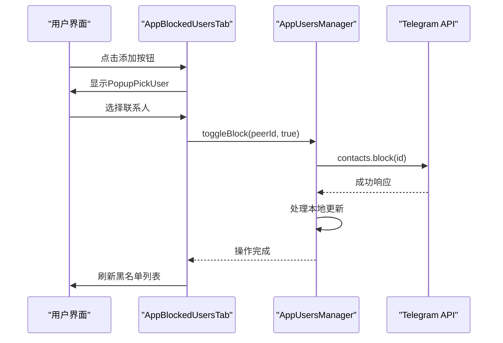
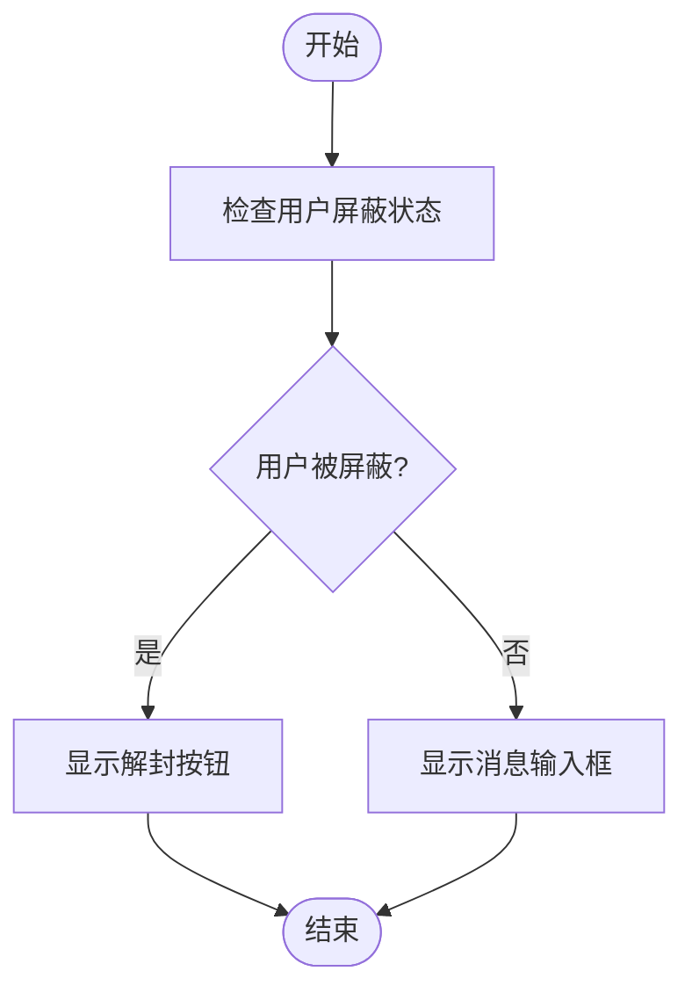
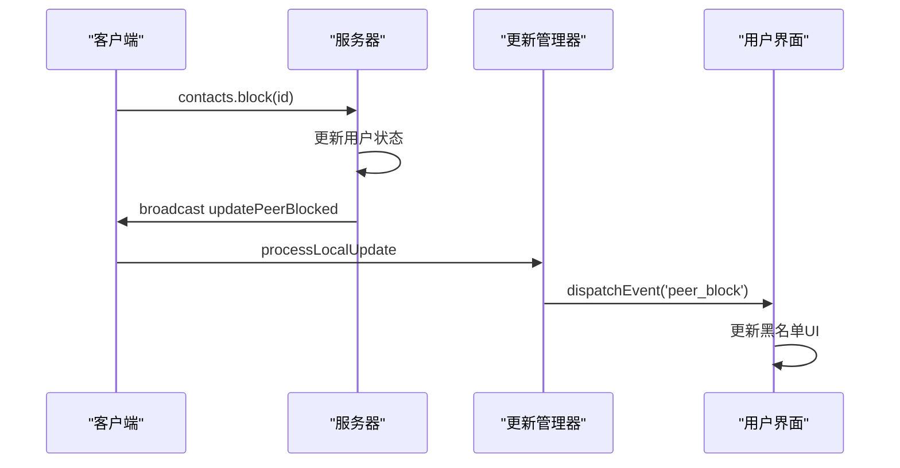

# 黑名单管理

<cite>
**本文档引用文件**  
- [blockedUsers.ts](file://src/components/sidebarLeft/tabs/blockedUsers.ts)
- [appUsersManager.ts](file://src/lib/appManagers/appUsersManager.ts)
- [appProfileManager.ts](file://src/lib/appManagers/appProfileManager.ts)
- [privacyAndSecurity.ts](file://src/components/sidebarLeft/tabs/privacyAndSecurity.ts)
- [topbar.ts](file://src/components/chat/topbar.ts)
- [input.ts](file://src/components/chat/input.ts)
</cite>

## 目录
1. [简介](#简介)
2. [黑名单数据模型](#黑名单数据模型)
3. [核心功能实现](#核心功能实现)
4. [黑名单操作对系统行为的影响](#黑名单操作对系统行为的影响)
5. [黑名单与好友关系的互斥性](#黑名单与好友关系的互斥性)
6. [跨设备同步机制](#跨设备同步机制)
7. [异常情况处理](#异常情况处理)
8. [接口实现细节](#接口实现细节)

## 简介
黑名单管理功能允许用户阻止特定联系人，从而限制其消息收发、通话请求等交互行为。本系统通过`AppUsersManager`和`AppBlockedUsersTab`等核心组件实现黑名单的添加、移除和查看功能。用户可以在隐私设置中访问黑名单列表，并通过上下文菜单执行解封操作。系统通过API调用与服务器同步黑名单状态，确保跨设备一致性。

**Section sources**
- [blockedUsers.ts](file://src/components/sidebarLeft/tabs/blockedUsers.ts#L1-L180)
- [privacyAndSecurity.ts](file://src/components/sidebarLeft/tabs/privacyAndSecurity.ts#L45-L486)

## 黑名单数据模型
黑名单数据模型基于用户标识符（PeerId）进行管理，包含被屏蔽用户的唯一标识、屏蔽状态和相关元数据。在`AppUsersManager`中，用户对象的`pFlags`属性包含`blocked`标志位，用于表示用户是否被屏蔽。黑名单条目通过`contacts.getBlocked` API方法获取，返回包含用户和群组的综合列表。数据模型支持分页加载，每次请求可获取指定数量的黑名单条目。

**Diagram sources**
- [appUsersManager.ts](file://src/lib/appManagers/appUsersManager.ts#L50-L1354)
- [blockedUsers.ts](file://src/components/sidebarLeft/tabs/blockedUsers.ts#L25-L27)

## 核心功能实现
黑名单的核心功能由`AppUsersManager.toggleBlock`方法实现，该方法通过调用`contacts.block`或`contacts.unblock` API来切换用户的屏蔽状态。`AppBlockedUsersTab`组件负责展示黑名单用户列表，支持通过`PopupPickUser`选择联系人进行屏蔽操作。列表采用虚拟滚动技术，通过`LOAD_COUNT`常量控制每次加载的用户数量，实现高效渲染。上下文菜单通过`ButtonMenuSync`组件实现，允许用户右键解封联系人。

**Diagram sources**
- [appUsersManager.ts](file://src/lib/appManagers/appUsersManager.ts#L467-L483)
- [blockedUsers.ts](file://src/components/sidebarLeft/tabs/blockedUsers.ts#L43-L52)

## 黑名单操作对系统行为的影响
黑名单操作直接影响消息收发和通话请求等交互行为。当用户被屏蔽后，其消息将无法送达，通话请求会被自动拒绝。在`topbar.ts`中，`canWriteToPeer`方法检查用户是否被屏蔽，决定是否显示消息输入框。`input.ts`中的`unblockUser`方法提供了解封功能，允许用户恢复与被屏蔽联系人的通信。系统通过`rootScope`事件总线广播`peer_block`事件，通知所有相关组件更新UI状态。

**Diagram sources**
- [topbar.ts](file://src/components/chat/topbar.ts#L688-L700)
- [input.ts](file://src/components/chat/input.ts#L1561-L1562)

## 黑名单与好友关系的互斥性
黑名单与好友关系具有互斥性，被屏蔽的用户将自动从联系人列表中移除。`AppUsersManager`中的`isContact`方法检查用户是否为联系人，而`toggleBlock`操作会更新用户的`pFlags.contact`标志位。在隐私设置中，被屏蔽用户的管理独立于联系人管理，确保两种关系的清晰分离。这种设计防止了用户同时处于好友和黑名单中的矛盾状态。

**Section sources**
- [appUsersManager.ts](file://src/lib/appManagers/appUsersManager.ts#L766-L769)

## 跨设备同步机制
黑名单状态通过Telegram的同步机制实现跨设备一致性。当`toggleBlock`方法调用API后，服务器会广播`updatePeerBlocked`更新，由`apiUpdatesManager`处理。`appProfileManager`监听此更新并刷新相关用户的设置。`rootScope`事件系统确保所有活跃的UI组件及时响应状态变化。这种基于事件的架构保证了黑名单状态在所有设备上的实时同步。

**Diagram sources**
- [appUsersManager.ts](file://src/lib/appManagers/appUsersManager.ts#L472-L479)
- [appProfileManager.ts](file://src/lib/appManagers/appProfileManager.ts#L1078-L1104)

## 异常情况处理
系统对黑名单操作中的异常情况进行了全面处理。`toggleBlock`方法返回Promise，允许调用者处理API错误。在UI层面，`attachClickEvent`的监听器设置确保操作的原子性，防止重复提交。加载状态通过`loading`标志位管理，避免重复请求。对于网络错误或API限制，系统会显示适当的错误提示，并保持UI的响应性。

**Section sources**
- [blockedUsers.ts](file://src/components/sidebarLeft/tabs/blockedUsers.ts#L147-L165)

## 接口实现细节
黑名单管理接口通过`AppUsersManager`类提供，主要方法包括：
- `toggleBlock(peerId: PeerId, block: boolean)`: 切换用户屏蔽状态
- `getBlocked(offset: number, limit: number)`: 获取分页的黑名单列表
- `isBlocked(peerId: PeerId)`: 检查用户是否被屏蔽

这些方法封装了底层API调用，提供简洁的接口供UI组件使用。`blockedUsers.ts`中的`AppBlockedUsersTab`实现了完整的UI逻辑，包括列表渲染、上下文菜单和分页加载。接口设计遵循单一职责原则，确保功能的可维护性和可测试性。

**Section sources**
- [appUsersManager.ts](file://src/lib/appManagers/appUsersManager.ts#L467-L483)
- [appUsersManager.ts](file://src/lib/appManagers/appUsersManager.ts#L990-L999)
- [blockedUsers.ts](file://src/components/sidebarLeft/tabs/blockedUsers.ts#L24-L180)