# 用户API

<cite>
**本文档引用的文件**   
- [appUsersManager.ts](file://src/lib/appManagers/appUsersManager.ts)
- [appPrivacyManager.ts](file://src/lib/appManagers/appPrivacyManager.ts)
- [appProfileManager.ts](file://src/lib/appManagers/appProfileManager.ts)
- [appPeersManager.ts](file://src/lib/appManagers/appPeersManager.ts)
- [appAvatarsManager.ts](file://src/lib/appManagers/appAvatarsManager.ts)
- [appUsernamesManager.ts](file://src/lib/appManagers/appUsernamesManager.ts)
- [getPeerActiveUsernames.ts](file://src/lib/appManagers/utils/peers/getPeerActiveUsernames.ts)
- [canSendToUser.ts](file://src/lib/appManagers/utils/users/canSendToUser.ts)
</cite>

## 目录
1. [简介](#简介)
2. [用户数据模型](#用户数据模型)
3. [用户信息获取API](#用户信息获取api)
4. [联系人管理API](#联系人管理api)
5. [用户状态更新机制](#用户状态更新机制)
6. [用户搜索与发现](#用户搜索与发现)
7. [用户头像管理](#用户头像管理)
8. [用户名管理](#用户名管理)
9. [在线状态管理](#在线状态管理)
10. [用户隐私设置与可见性控制](#用户隐私设置与可见性控制)
11. [用户关系链与好友请求](#用户关系链与好友请求)

## 简介

本文档全面记录了用户API的详细功能，包括用户信息获取、联系人管理、用户状态更新等核心接口。文档详细描述了用户数据模型，包括用户属性、关系和权限系统。同时，说明了用户搜索和发现功能的实现方式，解释了用户头像、用户名和在线状态的管理机制，并提供了用户隐私设置和可见性控制的API使用指南。最后，文档包含了用户关系链处理和好友请求的完整流程说明。

**Section sources**
- [appUsersManager.ts](file://src/lib/appManagers/appUsersManager.ts#L1-L800)
- [appPrivacyManager.ts](file://src/lib/appManagers/appPrivacyManager.ts#L1-L118)

## 用户数据模型

用户数据模型是整个用户系统的核心，包含了用户的基本信息、状态、权限和关系。用户对象（User）包含以下主要属性：

- **基本属性**：`id`、`first_name`、`last_name`、`username`、`phone`
- **状态属性**：`status`（用户在线状态）
- **权限标志**：`pFlags` 对象，包含 `bot`、`premium`、`verified`、`scam`、`fake`、`contact`、`mutual_contact` 等布尔值
- **扩展属性**：`emoji_status`（表情状态）、`photo`（用户头像）、`usernames`（多个用户名）

用户通过 `PeerId` 进行标识，`PeerId` 可以是用户（user）或聊天（chat）的标识符。用户与聊天通过 `appPeersManager` 进行统一管理。

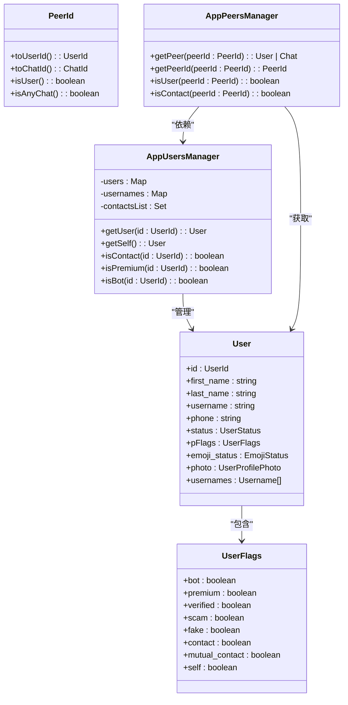

**Diagram sources **
- [appUsersManager.ts](file://src/lib/appManagers/appUsersManager.ts#L35-L800)
- [appPeersManager.ts](file://src/lib/appManagers/appPeersManager.ts#L28-L371)

**Section sources**
- [appUsersManager.ts](file://src/lib/appManagers/appUsersManager.ts#L35-L800)
- [appPeersManager.ts](file://src/lib/appManagers/appPeersManager.ts#L28-L371)

## 用户信息获取API

用户信息获取API提供了多种方式来获取用户数据，包括单个用户、多个用户和用户完整资料的获取。

### 获取单个用户信息

通过 `getUser` 方法可以获取指定用户ID的用户信息。该方法会从本地缓存中返回用户对象，如果用户信息不存在，则返回 `undefined`。

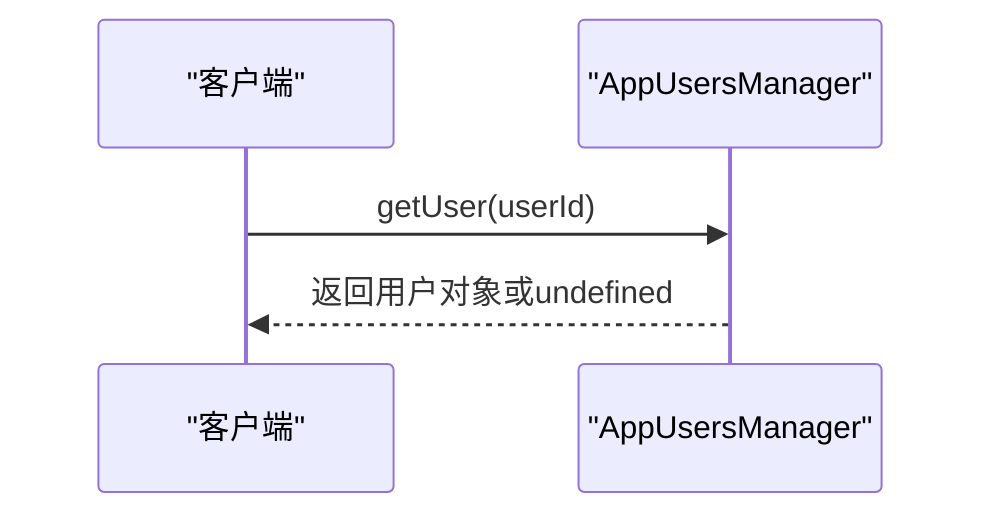

**Diagram sources **
- [appUsersManager.ts](file://src/lib/appManagers/appUsersManager.ts#L726-L732)

### 获取多个用户信息

通过 `getApiUsers` 方法可以从服务器批量获取多个用户的信息。该方法会调用 `users.getUsers` API，并将返回的用户数据保存到本地缓存中。

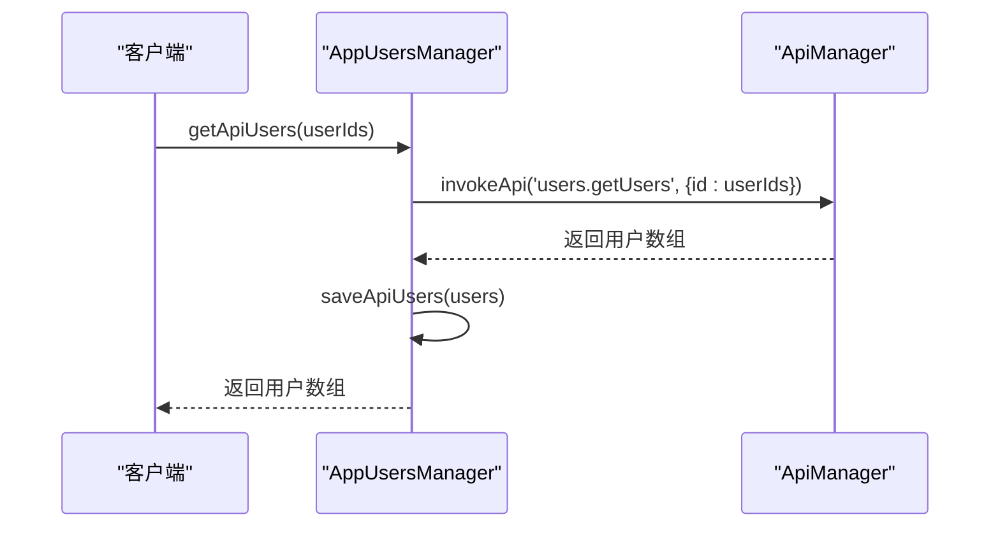

**Diagram sources **
- [appUsersManager.ts](file://src/lib/appManagers/appUsersManager.ts#L742-L748)

### 获取用户完整资料

通过 `getProfile` 方法可以获取用户的完整资料（UserFull），包括用户的个人简介、关联的聊天、通知设置等详细信息。该方法会缓存结果，避免频繁请求。

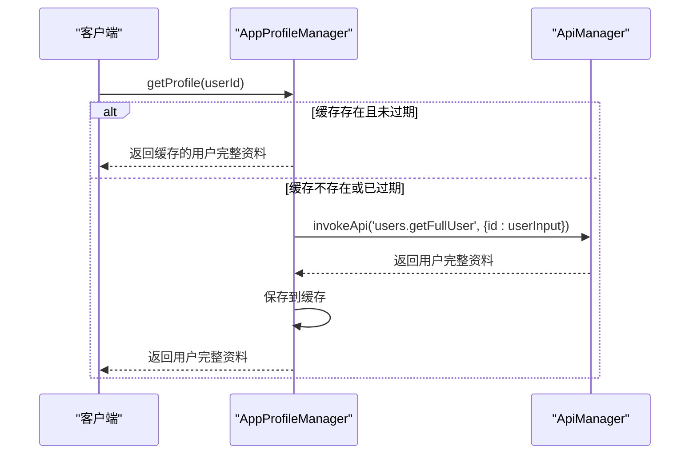

**Diagram sources **
- [appProfileManager.ts](file://src/lib/appManagers/appProfileManager.ts#L125-L177)

**Section sources**
- [appUsersManager.ts](file://src/lib/appManagers/appUsersManager.ts#L726-L753)
- [appProfileManager.ts](file://src/lib/appManagers/appProfileManager.ts#L125-L177)

## 联系人管理API

联系人管理API提供了添加、删除、查询联系人以及处理联系人列表的功能。

### 获取联系人列表

`getContacts` 方法用于获取用户的联系人列表。该方法会首先填充联系人列表，然后根据查询条件进行过滤和排序。

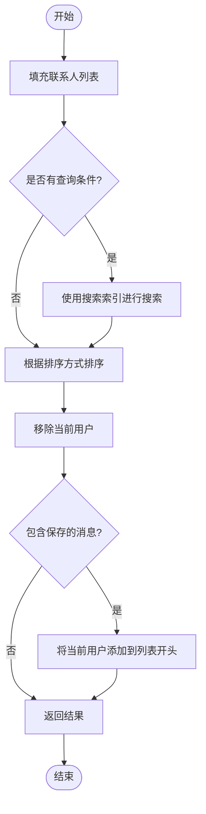

**Diagram sources **
- [appUsersManager.ts](file://src/lib/appManagers/appUsersManager.ts#L402-L449)

### 添加联系人

通过 `addContact` 方法可以将用户添加为联系人。该方法会调用 `contacts.addContact` API，并更新本地缓存。

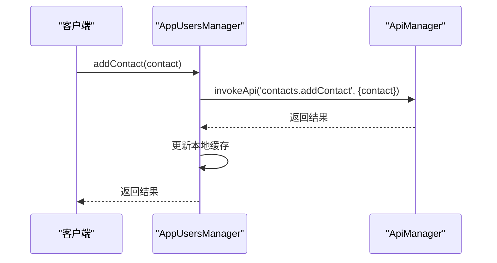

### 删除联系人

通过 `deleteContact` 方法可以将用户从联系人列表中删除。该方法会调用 `contacts.deleteContact` API，并更新本地缓存。

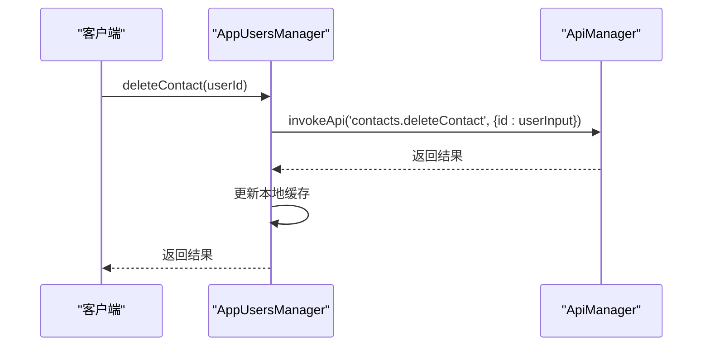

**Section sources**
- [appUsersManager.ts](file://src/lib/appManagers/appUsersManager.ts#L298-L333)
- [appUsersManager.ts](file://src/lib/appManagers/appUsersManager.ts#L372-L382)

## 用户状态更新机制

用户状态更新机制负责处理用户在线状态、用户名、表情状态等信息的更新。

### 在线状态更新

当收到 `updateUserStatus` 更新时，`AppUsersManager` 会更新用户的状态信息，并触发相应的事件。

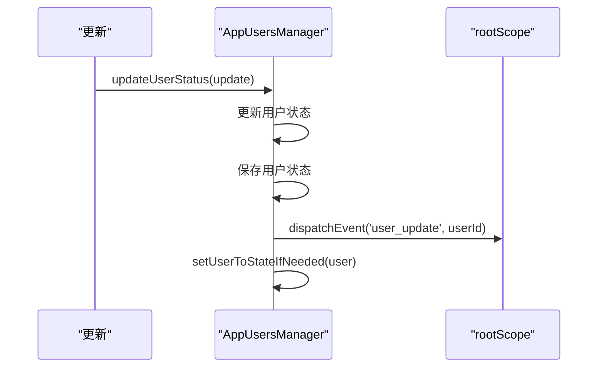

**Diagram sources **
- [appUsersManager.ts](file://src/lib/appManagers/appUsersManager.ts#L77-L90)

### 用户名更新

当收到 `updateUserName` 更新时，`AppUsersManager` 会更新用户的姓名和用户名信息。

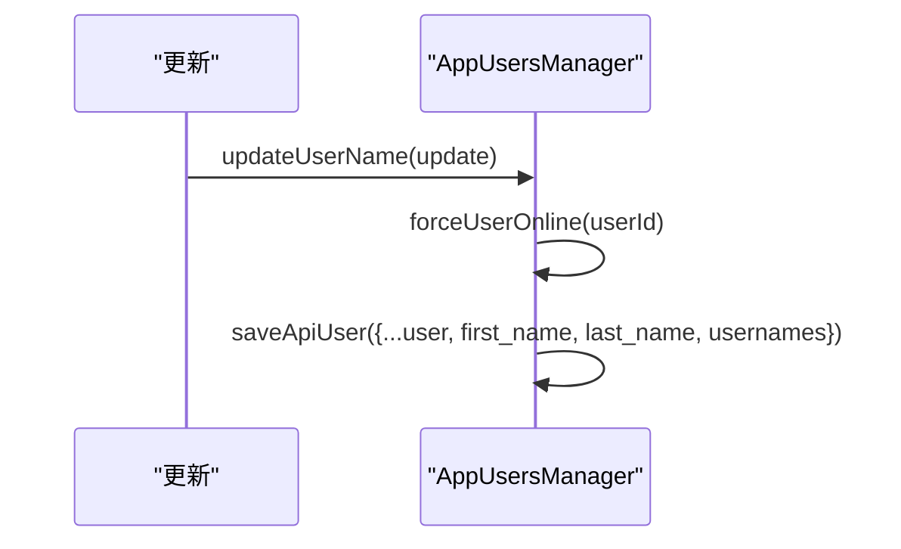

**Diagram sources **
- [appUsersManager.ts](file://src/lib/appManagers/appUsersManager.ts#L115-L130)

### 表情状态更新

当收到 `updateUserEmojiStatus` 更新时，`AppUsersManager` 会更新用户的表情状态。

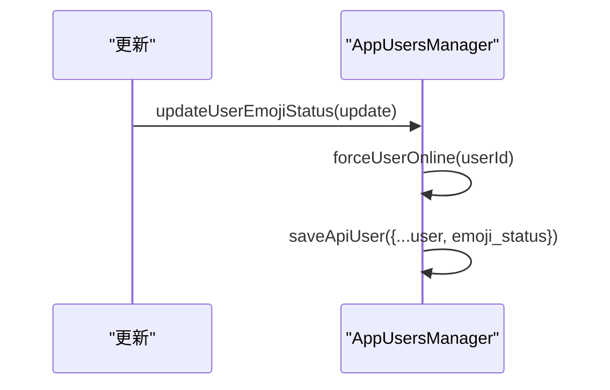

**Section sources**
- [appUsersManager.ts](file://src/lib/appManagers/appUsersManager.ts#L77-L150)

## 用户搜索与发现

用户搜索与发现功能通过搜索索引实现，支持对用户姓名、电话、用户名等信息的模糊搜索。

### 搜索索引创建

`createSearchIndex` 方法创建一个搜索索引，用于存储和搜索用户信息。

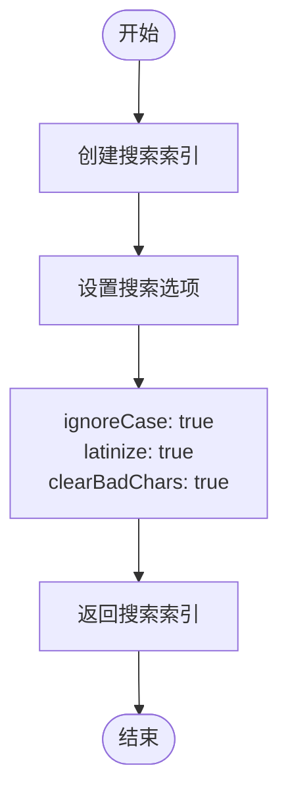

**Diagram sources **
- [appUsersManager.ts](file://src/lib/appManagers/appUsersManager.ts#L493-L495)

### 用户搜索实现

用户搜索通过 `getContacts` 方法实现，该方法使用搜索索引对联系人列表进行过滤。

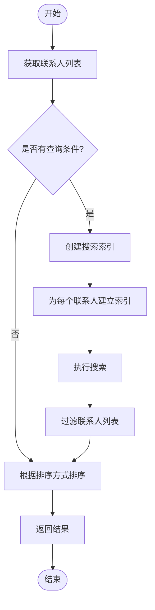

**Diagram sources **
- [appUsersManager.ts](file://src/lib/appManagers/appUsersManager.ts#L402-L449)

**Section sources**
- [appUsersManager.ts](file://src/lib/appManagers/appUsersManager.ts#L39-L45)
- [appUsersManager.ts](file://src/lib/appManagers/appUsersManager.ts#L402-L449)

## 用户头像管理

用户头像管理由 `AppAvatarsManager` 负责，提供了头像的加载、缓存和更新功能。

### 头像加载流程

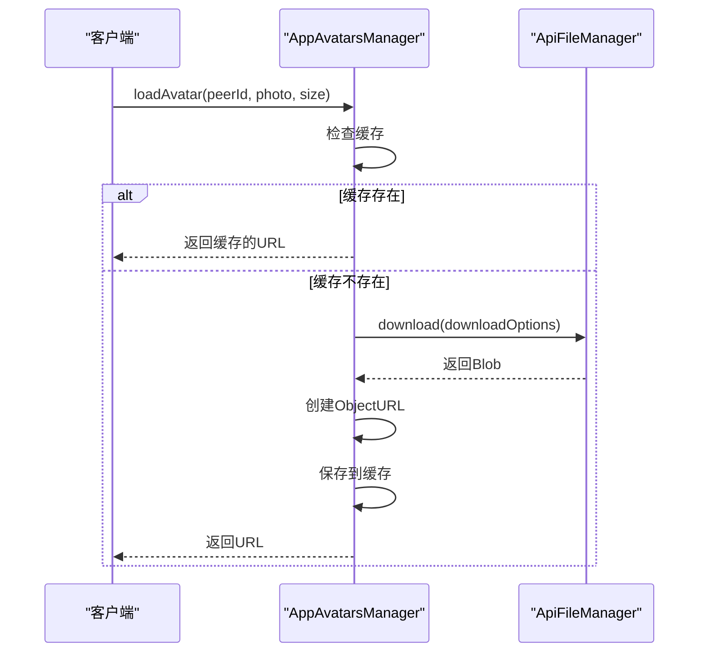

**Diagram sources **
- [appAvatarsManager.ts](file://src/lib/appManagers/appAvatarsManager.ts#L52-L84)

### 头像更新机制

当用户头像更新时，`AppAvatarsManager` 会收到 `avatar_update` 事件，并清除相应的缓存。

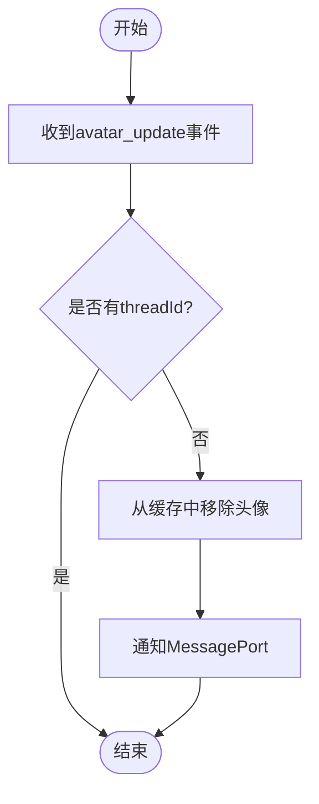

**Diagram sources **
- [appAvatarsManager.ts](file://src/lib/appManagers/appAvatarsManager.ts#L23-L29)

**Section sources**
- [appAvatarsManager.ts](file://src/lib/appManagers/appAvatarsManager.ts#L15-L87)

## 用户名管理

用户名管理由 `AppUsernamesManager` 负责，提供了用户名的激活、停用和重新排序功能。

### 激活/停用用户名

`toggleUsername` 方法用于激活或停用用户名。根据 `peerId` 的不同，该方法会调用不同的API。

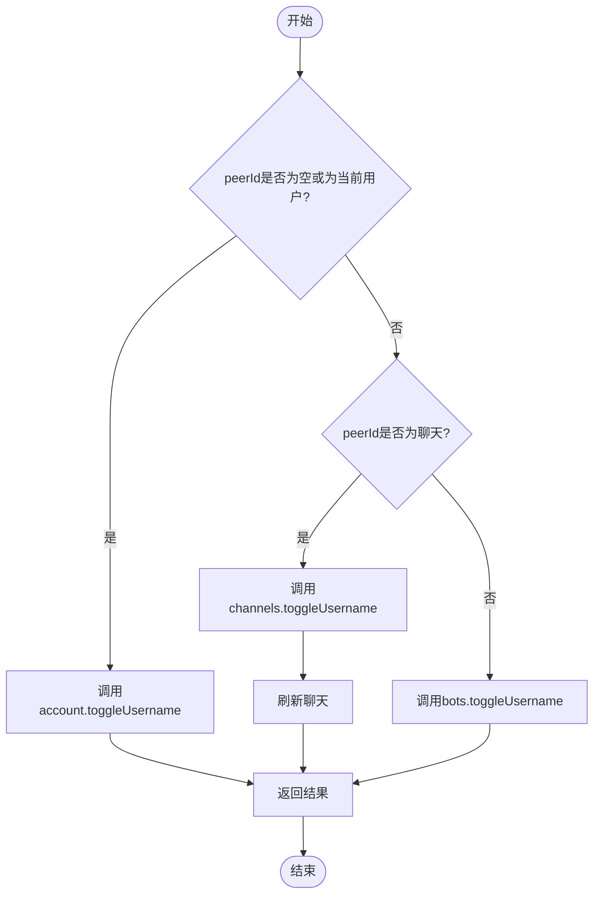

**Diagram sources **
- [appUsernamesManager.ts](file://src/lib/appManagers/appUsernamesManager.ts#L10-L37)

### 重新排序用户名

`reorderUsernames` 方法用于重新排序用户名。与 `toggleUsername` 类似，该方法会根据 `peerId` 调用不同的API。

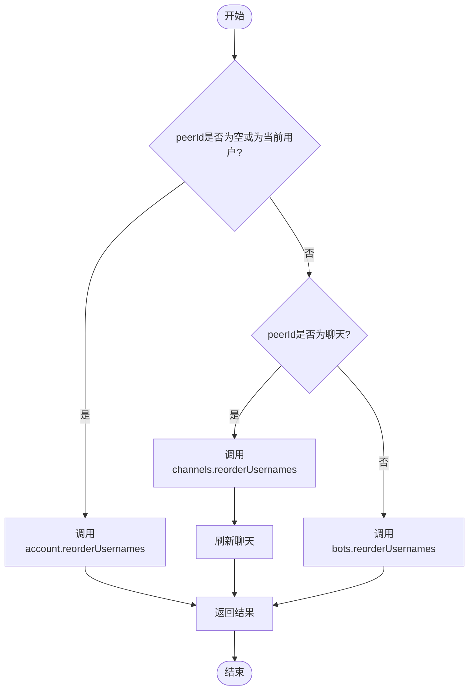

**Diagram sources **
- [appUsernamesManager.ts](file://src/lib/appManagers/appUsernamesManager.ts#L39-L63)

**Section sources**
- [appUsernamesManager.ts](file://src/lib/appManagers/appUsernamesManager.ts#L9-L64)

## 在线状态管理

在线状态管理负责处理用户的在线状态显示和排序。

### 在线状态判断

`getUserStatusForSort` 方法用于获取用户状态的排序值，该值用于联系人列表的排序。

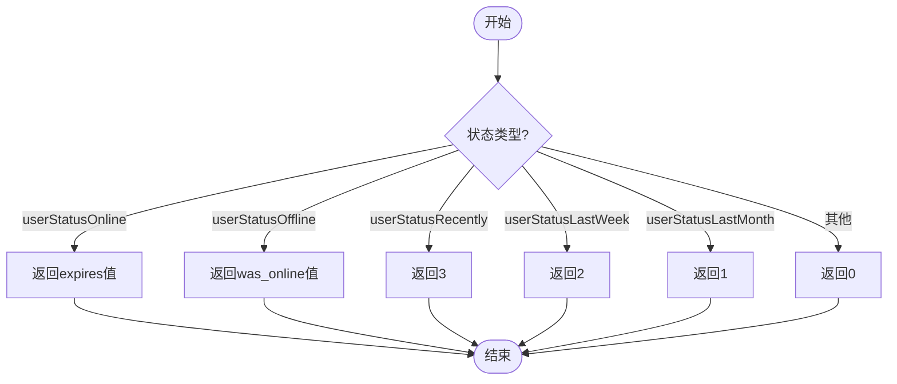

**Diagram sources **
- [appUsersManager.ts](file://src/lib/appManagers/appUsersManager.ts#L692-L724)

### 在线可见性判断

`isUserOnlineVisible` 方法用于判断用户是否在线可见。

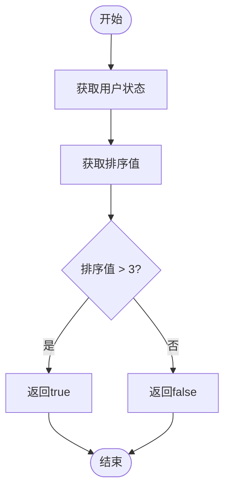

**Section sources**
- [appUsersManager.ts](file://src/lib/appManagers/appUsersManager.ts#L688-L690)
- [appUsersManager.ts](file://src/lib/appManagers/appUsersManager.ts#L692-L724)

## 用户隐私设置与可见性控制

用户隐私设置与可见性控制由 `AppPrivacyManager` 负责，提供了隐私规则的设置和获取功能。

### 隐私规则设置

`setPrivacy` 方法用于设置用户的隐私规则。该方法会调用 `account.setPrivacy` API，并更新本地缓存。

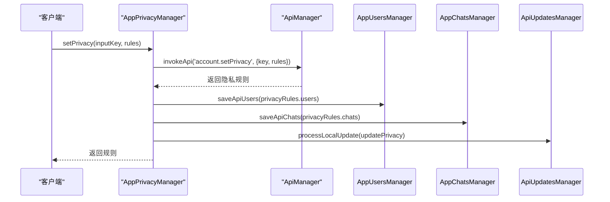

**Diagram sources **
- [appPrivacyManager.ts](file://src/lib/appManagers/appPrivacyManager.ts#L33-L59)

### 隐私规则获取

`getPrivacy` 方法用于获取用户的隐私规则。该方法会先检查本地缓存，如果缓存不存在则从服务器获取。

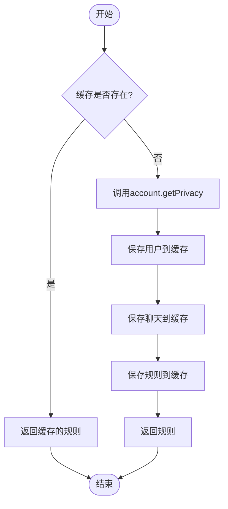

**Diagram sources **
- [appPrivacyManager.ts](file://src/lib/appManagers/appPrivacyManager.ts#L62-L80)

### 内容可见性设置

`setContentSettings` 方法用于设置内容可见性，如敏感内容的显示。

```mermaid
sequenceDiagram
participant Client as "客户端"
participant AppPrivacyManager as "AppPrivacyManager"
participant ApiManager as "ApiManager"
Client->>AppPrivacyManager : setContentSettings(settings)
AppPrivacyManager->>ApiManager : invokeApi('account.setContentSettings', settings)
ApiManager-->>AppPrivacyManager : 完成
AppPrivacyManager->>ApiManager : getAppConfig(true)
AppPrivacyManager->>AppPrivacyManager : getContentSettings(true)
AppPrivacyManager-->>Client : 完成
```

**Section sources**
- [appPrivacyManager.ts](file://src/lib/appManagers/appPrivacyManager.ts#L33-L117)

## 用户关系链与好友请求

用户关系链与好友请求功能通过联系人管理和隐私设置实现。

### 好友请求流程

好友请求的完整流程包括添加联系人、处理隐私设置和更新本地状态。

```mermaid
sequenceDiagram
participant UserA as "用户A"
participant UserB as "用户B"
participant AppUsersManager as "AppUsersManager"
participant ApiManager as "ApiManager"
UserA->>AppUsersManager : 请求添加UserB为联系人
AppUsersManager->>ApiManager : invokeApi('contacts.addContact', {contact})
ApiManager-->>AppUsersManager : 返回结果
AppUsersManager->>AppUsersManager : 更新本地缓存
AppUsersManager->>AppUsersManager : pushContact(userId)
AppUsersManager->>UserB : 收到updateContactLink更新
UserB->>AppUsersManager : 处理联系人更新
AppUsersManager->>AppUsersManager : onContactUpdated(userId, isContact)
AppUsersManager->>UserA : 好友请求成功
```

### 好友关系管理

好友关系的管理通过 `isContact` 方法实现，该方法检查用户是否在联系人列表中。

```mermaid
flowchart TD
Start([开始]) --> CheckInList["检查用户ID是否在contactsList中"]
CheckInList --> CheckUserFlags{"用户pFlags.contact是否为true?"}
CheckInList --> |是| ReturnTrue["返回true"]
CheckUserFlags --> |是| ReturnTrue
CheckUserFlags --> |否| ReturnFalse["返回false"]
ReturnTrue --> End([结束])
ReturnFalse --> End
```

**Section sources**
- [appUsersManager.ts](file://src/lib/appManagers/appUsersManager.ts#L767-L769)
- [appUsersManager.ts](file://src/lib/appManagers/appUsersManager.ts#L372-L382)