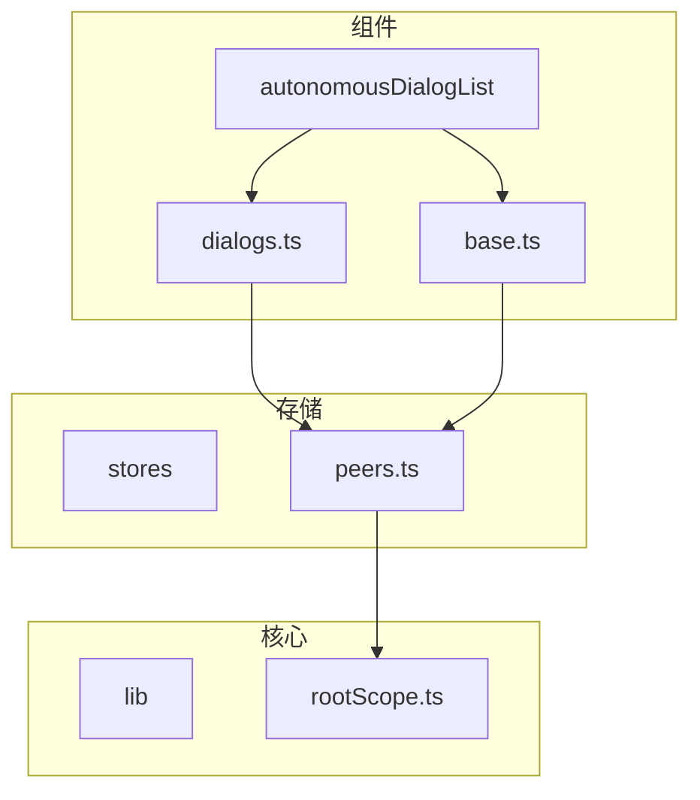
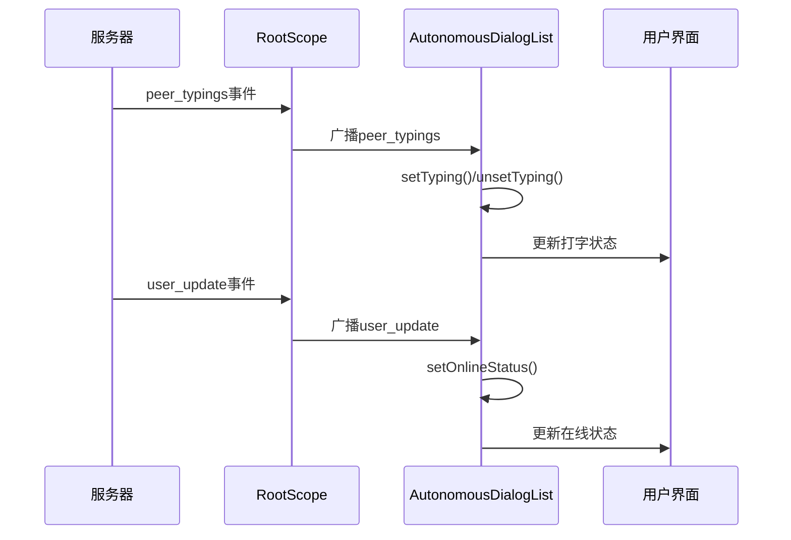
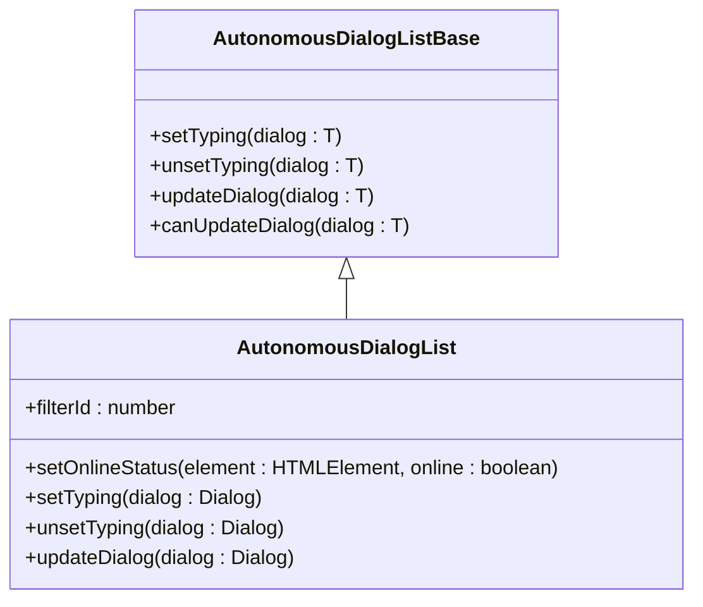
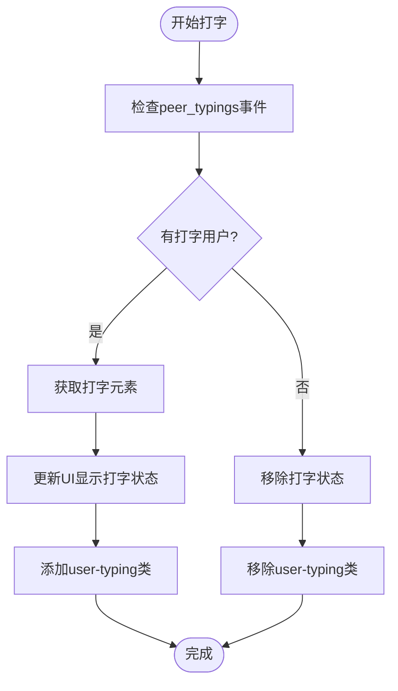
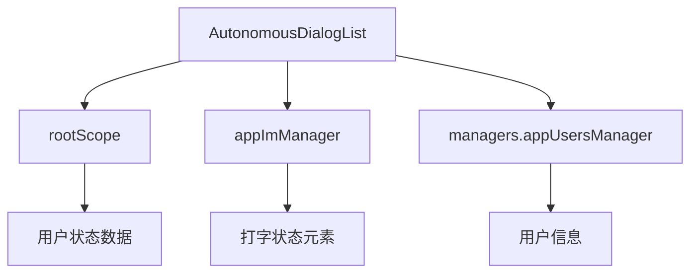

# 用户状态

<cite>
**本文档引用的文件**
- [dialogs.ts](file://src/components/autonomousDialogList/dialogs.ts)
- [base.ts](file://src/components/autonomousDialogList/base.ts)
- [peers.ts](file://src/stores/peers.ts)
- [rootScope.ts](file://src/lib/rootScope.ts)
- [peerTitle.ts](file://src/components/peerTitle.ts)
</cite>

## 目录
1. [简介](#简介)
2. [项目结构](#项目结构)
3. [核心组件](#核心组件)
4. [架构概述](#架构概述)
5. [详细组件分析](#详细组件分析)
6. [依赖分析](#依赖分析)
7. [性能考虑](#性能考虑)
8. [故障排除指南](#故障排除指南)
9. [结论](#结论)
10. [附录](#附录)（如有必要）

## 简介
本文档全面记录了用户在线状态、最后上线时间、打字状态等实时状态信息的获取接口。详细描述了用户状态数据模型和状态变更通知机制，说明了在线状态的准确性保证和隐私保护措施。解释了打字指示器和阅读回执的实现原理和API调用方式，提供了用户状态监听和订阅功能的使用指南。包含状态同步和缓存策略的技术细节，并通过实际代码示例展示如何实时监控用户状态变化并更新UI显示。

## 项目结构
项目结构清晰地组织了用户状态相关的功能模块。主要组件位于`src/components/autonomousDialogList`目录下，其中`dialogs.ts`和`base.ts`文件负责处理对话列表中的用户状态显示。用户状态数据存储在`src/stores/peers.ts`中，而全局事件管理则通过`src/lib/rootScope.ts`实现。



**Diagram sources**
- [dialogs.ts](file://src/components/autonomousDialogList/dialogs.ts#L1-L340)
- [base.ts](file://src/components/autonomousDialogList/base.ts#L1-L365)
- [peers.ts](file://src/stores/peers.ts#L1-L28)

**Section sources**
- [dialogs.ts](file://src/components/autonomousDialogList/dialogs.ts#L1-L340)
- [base.ts](file://src/components/autonomousDialogList/base.ts#L1-L365)

## 核心组件
核心组件包括用户状态管理、打字状态显示和在线状态指示。`AutonomousDialogList`类负责管理对话列表中的用户状态，通过监听`peer_typings`事件来更新打字状态。`setOnlineStatus`方法用于更新用户的在线状态指示器。

**Section sources**
- [dialogs.ts](file://src/components/autonomousDialogList/dialogs.ts#L23-L340)
- [base.ts](file://src/components/autonomousDialogList/base.ts#L33-L365)

## 架构概述
系统架构基于事件驱动模式，通过`rootScope`广播事件来通知各个组件状态变化。用户状态数据从服务器获取后存储在`peers` store中，组件通过订阅相关事件来实时更新UI。



**Diagram sources**
- [rootScope.ts](file://src/lib/rootScope.ts#L35-L244)
- [dialogs.ts](file://src/components/autonomousDialogList/dialogs.ts#L32-L46)

## 详细组件分析

### 对话列表状态管理分析
`AutonomousDialogList`组件通过事件监听器管理用户状态变化。当收到`peer_typings`事件时，会调用`setTyping`或`unsetTyping`方法来更新UI。



**Diagram sources**
- [dialogs.ts](file://src/components/autonomousDialogList/dialogs.ts#L23-L340)
- [base.ts](file://src/components/autonomousDialogList/base.ts#L33-L365)

### 打字状态指示器实现
打字状态通过`appImManager.getPeerTyping`方法获取，并在对话项的最后消息区域显示。当用户开始打字时，会添加`user-typing`CSS类来显示打字动画。



**Diagram sources**
- [base.ts](file://src/components/autonomousDialogList/base.ts#L287-L320)
- [dialogs.ts](file://src/components/autonomousDialogList/dialogs.ts#L32-L46)

## 依赖分析
组件间依赖关系清晰，`AutonomousDialogList`依赖于`rootScope`来监听用户状态变化事件，同时依赖`appImManager`来获取打字状态显示元素。



**Diagram sources**
- [dialogs.ts](file://src/components/autonomousDialogList/dialogs.ts#L10-L11)
- [base.ts](file://src/components/autonomousDialogList/base.ts#L10-L11)

**Section sources**
- [dialogs.ts](file://src/components/autonomousDialogList/dialogs.ts#L1-L340)
- [base.ts](file://src/components/autonomousDialogList/base.ts#L1-L365)

## 性能考虑
系统通过节流（throttle）机制优化滚动性能，在`bindScrollable`方法中使用200ms的节流间隔来处理滚动到底部事件。状态更新采用增量更新策略，只更新发生变化的对话项。

## 故障排除指南
常见问题包括打字状态不显示或在线状态更新延迟。检查`peer_typings`事件是否正常触发，确认`rootScope`事件监听器已正确注册。确保网络连接正常，服务器能够及时推送状态更新。

**Section sources**
- [dialogs.ts](file://src/components/autonomousDialogList/dialogs.ts#L32-L46)
- [base.ts](file://src/components/autonomousDialogList/base.ts#L287-L320)

## 结论
用户状态系统通过事件驱动架构实现了高效的实时状态更新。在线状态和打字状态的显示机制设计合理，性能优化措施有效。系统具有良好的可维护性和扩展性，为用户提供流畅的实时通信体验。

## 附录
### 用户状态API使用示例
```javascript
// 监听用户打字状态
rootScope.addEventListener('peer_typings', ({peerId, typings}) => {
  if(typings.length) {
    // 用户正在打字
    console.log(`${peerId} 正在打字...`);
  } else {
    // 用户停止打字
    console.log(`${peerId} 停止打字`);
  }
});

// 监听用户状态更新
rootScope.addEventListener('user_update', (userId) => {
  const status = await managers.appUsersManager.getUserStatus(userId);
  const isOnline = status?._ === 'userStatusOnline';
  console.log(`用户 ${userId} 在线状态: ${isOnline}`);
});
```