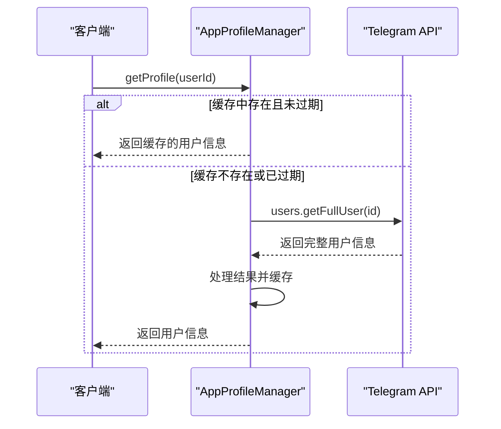
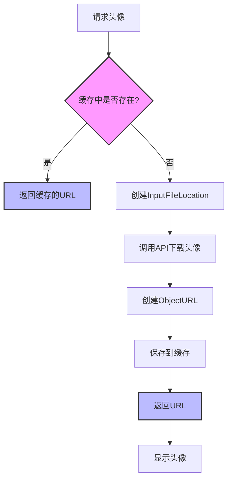
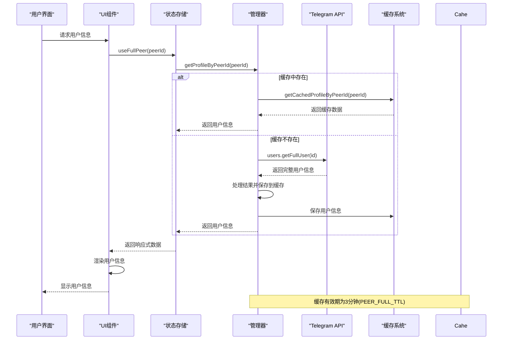

# 用户信息获取

<cite>
**本文档引用的文件**   
- [appProfileManager.ts](file://src/lib/appManagers/appProfileManager.ts)
- [appUsersManager.ts](file://src/lib/appManagers/appUsersManager.ts)
- [avatarNew.tsx](file://src/components/avatarNew.tsx)
- [appAvatarsManager.ts](file://src/lib/appManagers/appAvatarsManager.ts)
- [layer.d.ts](file://src/layer.d.ts)
- [fullPeers.ts](file://src/stores/fullPeers.ts)
</cite>

## 目录
1. [简介](#简介)
2. [用户数据模型](#用户数据模型)
3. [用户信息获取API](#用户信息获取api)
4. [用户信息缓存机制](#用户信息缓存机制)
5. [用户头像获取](#用户头像获取)
6. [用户信息同步流程](#用户信息同步流程)
7. [错误处理与边界情况](#错误处理与边界情况)

## 简介
本文档详细记录了Telegram Web客户端中用户信息获取功能的实现。系统通过API接口获取用户基本信息（如用户ID、昵称、头像、联系方式等），并详细描述了用户数据模型结构、缓存机制、同步流程以及头像获取方法。文档还提供了实际代码示例，展示如何调用这些API并处理响应数据。

## 用户数据模型
用户信息在系统中通过两个主要的数据结构进行管理：`User` 和 `UserFull`。`User` 结构包含用户的基本信息，而 `UserFull` 结构则包含更详细的用户资料。

### User数据结构
`User` 数据结构定义了用户的基本属性，包括：

```typescript
export namespace User {
  export type user = {
    _: 'user',
    pFlags: Partial<{
      self?: true,
      contact?: true,
      mutual_contact?: true,
      deleted?: true,
      bot?: true,
      verified?: true,
      restricted?: true,
      premium?: true,
    }>,
    id: string | number,
    access_hash?: string | number,
    first_name?: string,
    last_name?: string,
    username?: string,
    phone?: string,
    photo?: UserProfilePhoto,
    status?: UserStatus,
    lang_code?: string,
    sortName?: string
  };
}
```

**关键属性说明：**
- `id`: 用户唯一标识符
- `first_name` 和 `last_name`: 用户的名和姓
- `username`: 用户名，用于@提及
- `phone`: 用户手机号码
- `photo`: 用户头像信息
- `status`: 用户在线状态
- `pFlags`: 用户属性标志，如是否为机器人、是否验证、是否为高级用户等

### UserFull数据结构
`UserFull` 数据结构包含更详细的用户信息：

```typescript
export namespace UserFull {
  export type userFull = {
    _: 'userFull',
    pFlags: Partial<{
      blocked?: true,
      phone_calls_available?: true,
      video_calls_available?: true,
      can_pin_message?: true,
      stories_pinned_available?: true,
    }>,
    id: string | number,
    about?: string,
    settings: PeerSettings,
    profile_photo?: Photo,
    notify_settings: PeerNotifySettings,
    bot_info?: BotInfo,
    pinned_msg_id?: number,
    common_chats_count: number,
    birthday?: Birthday,
    business_intro?: BusinessIntro,
    note?: TextWithEntities
  };
}
```

**关键属性说明：**
- `about`: 用户个人简介
- `profile_photo`: 用户个人头像
- `settings`: 用户设置信息
- `notify_settings`: 通知设置
- `bot_info`: 如果是机器人，包含机器人信息
- `common_chats_count`: 与当前用户共同的聊天数量
- `birthday`: 用户生日信息
- `business_intro`: 商业账户介绍
- `note`: 联系人备注

**Section sources**
- [layer.d.ts](file://src/layer.d.ts#L535-L595)
- [layer.d.ts](file://src/layer.d.ts#L2245-L2307)

## 用户信息获取API
系统提供了多个API接口用于获取用户信息，主要通过 `AppProfileManager` 和 `AppUsersManager` 两个管理器类实现。

### 获取用户基本信息
通过 `getProfile` 方法获取用户的完整信息：



**Diagram sources**
- [appProfileManager.ts](file://src/lib/appManagers/appProfileManager.ts#L125-L176)

### 获取用户头像
通过 `getFullPhoto` 方法获取用户的头像信息：

```javascript
public async getFullPhoto(peerId: PeerId) {
  const profile = await this.getProfileByPeerId(peerId);
  switch(profile._) {
    case 'userFull':
      return profile.profile_photo;
    case 'channelFull':
    case 'chatFull':
      return profile.chat_photo;
  }
}
```

### 获取用户联系人
通过 `getContacts` 方法获取用户的联系人列表：

```javascript
public getContacts(query?: string, includeSaved = false, sortBy: 'name' | 'online' | 'none' | 'rating' = 'name') {
  const contactListPromise = this.fillContacts().promise;
  return Promise.all([
    contactListPromise,
    sortBy === 'rating' && this.getTopPeers('correspondents')
  ]).then(([_contactsList, topPeers]) => {
    let contactsList = [..._contactsList];
    // 处理查询、排序等逻辑
    return contactsList;
  });
}
```

**Section sources**
- [appProfileManager.ts](file://src/lib/appManagers/appProfileManager.ts#L125-L176)
- [appUsersManager.ts](file://src/lib/appManagers/appUsersManager.ts#L402-L449)

## 用户信息缓存机制
系统实现了高效的用户信息缓存机制，以减少API调用次数并提高性能。

### 缓存策略
系统使用内存缓存和IndexedDB持久化存储相结合的方式：

```mermaid
classDiagram
class PeersStorage {
+neededPeers : Map<PeerId, Set<PeersStorageKey>>
+singlePeerMap : Map<PeersStorageKey, Set<PeerId>>
+requestPeer(peerId : PeerId, key : PeersStorageKey)
+releasePeer(peerId : PeerId, key : PeersStorageKey)
+requestPeersForKey(peerIds : Set<PeerId>, key : PeersStorageKey)
+isPeerNeeded(peerId : PeerId)
}
class AppUsersManager {
+users : {[userId : UserId] : User}
+usernames : {[username : string] : PeerId}
+contactsList : Set<UserId>
+contactsIndex : SearchIndex<UserId>
+saveApiUser(user : MTUser, override? : boolean)
+saveApiUsers(apiUsers : MTUser[], override? : boolean)
+getUser(id : User | UserId)
}
class AppProfileManager {
+usersFull : {[id : UserId] : UserFull.userFull}
+chatsFull : {[id : ChatId] : ChatFull}
+fullExpiration : {[peerId : PeerId] : number}
+getCachedFullUser(userId : UserId)
+getCachedFullChat(chatId : ChatId)
+modifyCachedFullUser(userId : UserId, modify : (fullUser : UserFull) => boolean | void)
}
PeersStorage --> AppUsersManager : "管理用户缓存"
PeersStorage --> AppProfileManager : "管理用户完整信息缓存"
AppUsersManager --> AppProfileManager : "提供用户基本信息"
```

**Diagram sources**
- [peers.ts](file://src/lib/storages/peers.ts#L46-L109)
- [appUsersManager.ts](file://src/lib/appManagers/appUsersManager.ts#L54-L56)
- [appProfileManager.ts](file://src/lib/appManagers/appProfileManager.ts#L49-L51)

### 缓存更新时机
缓存的更新主要通过以下几种方式触发：

1. **API响应处理**：当从API获取到用户信息后，立即更新缓存
2. **事件驱动更新**：监听用户信息变更事件，如 `user_update`、`user_full_update` 等
3. **定时刷新**：定期检查缓存的有效性并刷新过期数据

```javascript
protected after() {
  this.apiUpdatesManager.addMultipleEventsListeners({
    updateUserStatus: (update) => {
      const userId = update.user_id;
      const user = this.users[userId];
      if(user) {
        user.status = update.status;
        this.saveUserStatus(user.status);
        this.rootScope.dispatchEvent('user_update', userId);
      }
    },
    
    updateUserName: (update) => {
      const userId = update.user_id;
      const user = this.users[userId];
      if(user) {
        this.saveApiUser({
          ...user,
          first_name: update.first_name,
          last_name: update.last_name,
          username: undefined,
          usernames: update.usernames
        }, true);
      }
    },
    
    updateUserEmojiStatus: (update) => {
      const userId = update.user_id;
      const user = this.users[userId];
      if(user) {
        this.saveApiUser({
          ...user,
          emoji_status: update.emoji_status
        }, true);
      }
    }
  });
}
```

### 缓存失效处理
系统通过TTL（Time To Live）机制管理缓存的有效期：

```javascript
public getProfile(id: UserId, override?: boolean) {
  if(this.usersFull[id] && !override && Date.now() < this.fullExpiration[id.toPeerId()]) {
    return this.usersFull[id];
  }
  
  // 缓存已过期或不存在，重新获取
  return this.apiManager.invokeApiSingleProcess({
    method: 'users.getFullUser',
    params: {
      id: this.appUsersManager.getUserInput(id)
    },
    processResult: (usersUserFull) => {
      // 处理结果
      this.usersFull[id] = userFull;
      this.fullExpiration[peerId] = Date.now() + PEER_FULL_TTL; // 设置新的过期时间
      return userFull;
    }
  });
}
```

**Section sources**
- [appProfileManager.ts](file://src/lib/appManagers/appProfileManager.ts#L125-L176)
- [appUsersManager.ts](file://src/lib/appManagers/appUsersManager.ts#L70-L150)
- [mtproto_config.ts](file://src/lib/mtproto/mtproto_config.ts#L40)

## 用户头像获取
用户头像的获取和显示是系统的重要功能，涉及缓存、预加载和动画效果等多个方面。

### 头像获取流程
头像获取通过 `AppAvatarsManager` 管理器实现，流程如下：



**Diagram sources**
- [appAvatarsManager.ts](file://src/lib/appManagers/appAvatarsManager.ts#L52-L85)

### 不同尺寸头像的获取
系统支持获取不同尺寸的头像，主要通过 `PeerPhotoSize` 枚举定义：

```typescript
export type PeerPhotoSize = 'photo_small' | 'photo_big';
```

在获取头像时，可以通过指定尺寸参数来获取相应大小的头像：

```javascript
public loadAvatar(peerId: PeerId, photo: UserProfilePhoto.userProfilePhoto | ChatPhoto.chatPhoto, size: PeerPhotoSize) {
  const saved = this.savedAvatarURLs[peerId] ??= {};
  if(saved[size]) {
    return saved[size];
  }
  
  const peerPhotoFileLocation: InputFileLocation.inputPeerPhotoFileLocation = {
    _: 'inputPeerPhotoFileLocation',
    pFlags: {},
    peer: this.appPeersManager.getInputPeerById(peerId),
    photo_id: photo.photo_id
  };
  
  const downloadOptions: DownloadOptions = {dcId: photo.dc_id, location: peerPhotoFileLocation};
  if(size === 'photo_big') {
    peerPhotoFileLocation.pFlags.big = true;
    downloadOptions.limitPart = 512 * 1024;
  }
  
  const promise = this.apiFileManager.download(downloadOptions);
  return saved[size] = promise.then((blob) => {
    const url = saved[size] = URL.createObjectURL(blob);
    return url;
  });
}
```

### 默认头像处理
当用户没有设置头像时，系统会根据用户名生成默认头像：

```javascript
const _render = async(onlyThumb?: boolean) => {
  // ... 其他代码
  
  if(!avatarRendered && !isAvatarCached) {
    let color: string;
    if(peerId && (peerId !== myId || !isDialog)) {
      color = getPeerAvatarColorByPeer(peer);
    }
    
    const abbr = getPeerInitials(peer);
    set({
      abbreviature: documentFragmentToNodes(abbr),
      color,
      isForum: _isForum,
      isSubscribed: _isSubscribed,
      isMonoforum: !!linkedMonoforumPeer,
      storiesSegments
    });
    isSet = true;
  }
  
  // ... 其他代码
};
```

**Section sources**
- [appAvatarsManager.ts](file://src/lib/appManagers/appAvatarsManager.ts#L52-L85)
- [avatarNew.tsx](file://src/components/avatarNew.tsx#L546-L708)

## 用户信息同步流程
用户信息从服务器获取到本地存储再到UI展示的完整同步流程如下：



**Diagram sources**
- [fullPeers.ts](file://src/stores/fullPeers.ts#L1-L58)
- [appProfileManager.ts](file://src/lib/appManagers/appProfileManager.ts#L125-L176)

## 错误处理与边界情况
系统在用户信息获取过程中实现了完善的错误处理机制，以应对各种边界情况。

### 错误处理策略
系统使用Promise链式调用和try-catch机制处理异步操作中的错误：

```javascript
public getProfile(id: UserId, override?: boolean) {
  if(this.usersFull[id] && !override && Date.now() < this.fullExpiration[id.toPeerId()]) {
    return this.usersFull[id];
  }
  
  return this.apiManager.invokeApiSingleProcess({
    method: 'users.getFullUser',
    params: {
      id: this.appUsersManager.getUserInput(id)
    },
    processResult: (usersUserFull) => {
      try {
        this.appChatsManager.saveApiChats(usersUserFull.chats, true);
        this.appUsersManager.saveApiUsers(usersUserFull.users);
        
        const userFull = usersUserFull.full_user;
        const peerId = id.toPeerId(false);
        if(userFull.profile_photo) {
          userFull.profile_photo = this.appPhotosManager.savePhoto(userFull.profile_photo, {type: 'profilePhoto', peerId});
        }
        
        // 其他处理逻辑
        this.usersFull[id] = userFull;
        this.fullExpiration[peerId] = Date.now() + PEER_FULL_TTL;
        
        this.rootScope.dispatchEvent('user_full_update', id);
        return userFull;
      } catch(error) {
        console.error('处理用户信息失败:', error);
        throw error;
      }
    }
  });
}
```

### 边界情况处理
系统考虑了多种边界情况，包括：

1. **用户被删除或不存在**
2. **网络连接失败**
3. **API限流**
4. **缓存过期**
5. **用户信息不完整**

```javascript
public getUser(id: User | UserId) {
  if(isObject<User>(id)) {
    return id;
  }
  
  return this.users[id];
}

public hasUser(id: UserId, allowMin?: boolean) {
  const user = this.users[id];
  return isObject(user) && (allowMin || !user.pFlags.min);
}
```

**Section sources**
- [appProfileManager.ts](file://src/lib/appManagers/appProfileManager.ts#L125-L176)
- [appUsersManager.ts](file://src/lib/appManagers/appUsersManager.ts#L726-L730)
- [appUsersManager.ts](file://src/lib/appManagers/appUsersManager.ts#L790-L793)