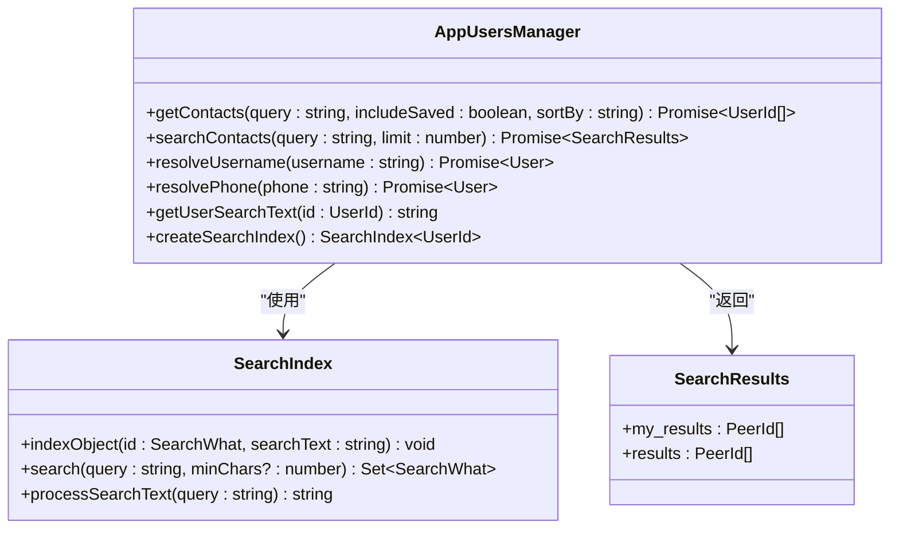
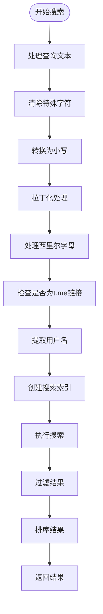
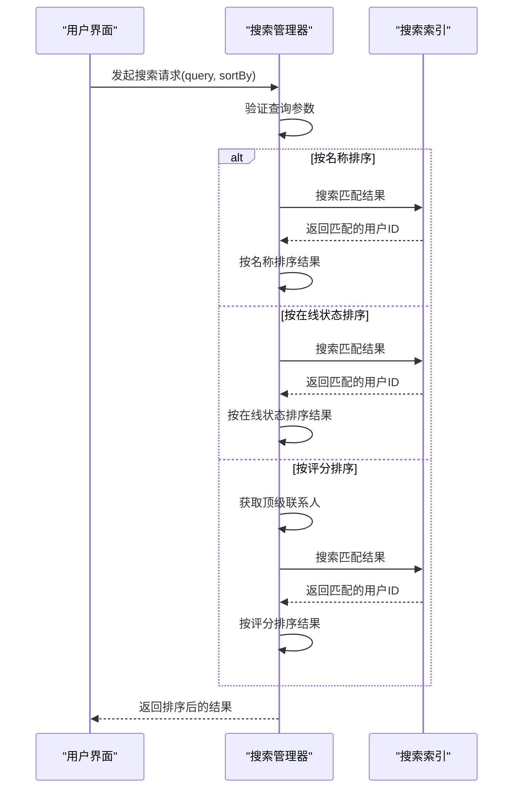
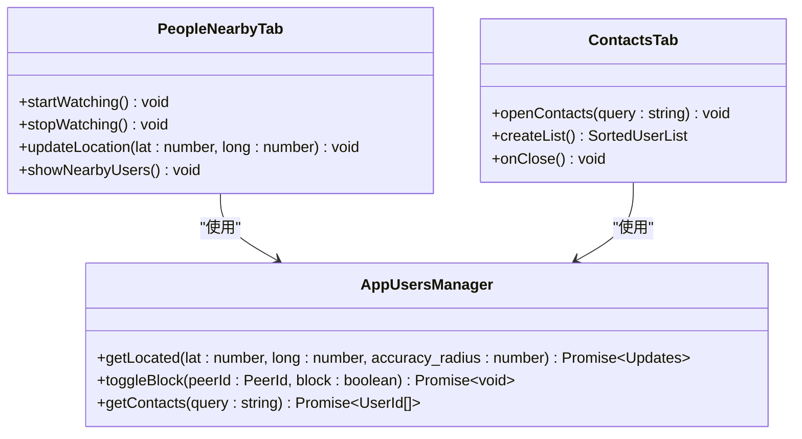
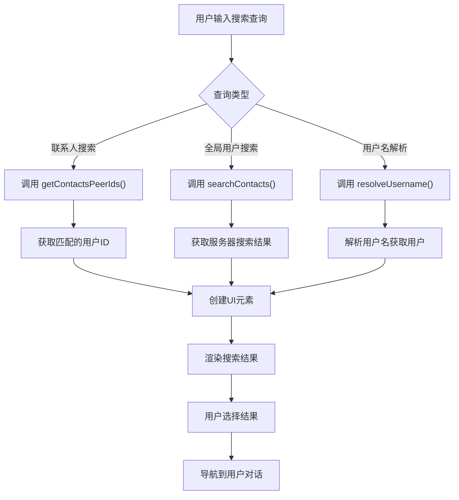

# 用户搜索与发现

<cite>
**本文档引用的文件**   
- [appUsersManager.ts](file://src/lib/appManagers/appUsersManager.ts)
- [searchIndex.ts](file://src/lib/searchIndex.ts)
- [cleanSearchText.ts](file://src/helpers/cleanSearchText.ts)
- [latinizeMap.ts](file://src/config/latinizeMap.ts)
- [appSearch.ts](file://src/components/appSearch.ts)
- [contacts.ts](file://src/components/sidebarLeft/tabs/contacts.ts)
- [peopleNearby.ts](file://src/components/sidebarLeft/tabs/peopleNearby.ts)
- [topbarSearch.tsx](file://src/components/chat/topbarSearch.tsx)
- [chat.ts](file://src/components/chat/chat.ts)
</cite>

## 目录
1. [简介](#简介)
2. [用户搜索API接口](#用户搜索api接口)
3. [搜索算法与过滤条件](#搜索算法与过滤条件)
4. [搜索结果排序策略](#搜索结果排序策略)
5. [分页处理机制](#分页处理机制)
6. [用户发现功能](#用户发现功能)
7. [性能优化策略](#性能优化策略)
8. [代码实现示例](#代码实现示例)
9. [结论](#结论)

## 简介
本项目实现了完整的用户搜索与发现功能，包括按用户名、昵称、手机号等条件搜索用户，以及联系人同步和附近的人等功能。系统采用客户端索引与服务器搜索相结合的方式，通过模糊匹配、拼音匹配等算法提供高效的搜索体验。搜索功能支持多种排序策略，包括按名称、在线状态和评分排序。用户发现功能基于地理位置服务，允许用户发现附近的其他用户。系统还实现了缓存机制和查询优化，确保搜索性能的高效性。

**Section sources**
- [appUsersManager.ts](file://src/lib/appManagers/appUsersManager.ts#L1-L200)

## 用户搜索API接口
用户搜索功能通过`AppUsersManager`类中的多个API方法实现。核心搜索接口包括`getContacts`、`searchContacts`和`resolveUsername`等方法。`getContacts`方法用于获取联系人列表，支持按查询条件过滤和多种排序方式。`searchContacts`方法通过调用Telegram API的`contacts.search`接口，在服务器端搜索用户。`resolveUsername`方法用于解析用户名并获取对应的用户信息。

搜索接口支持多种参数，包括查询字符串、是否包含已保存的对话、排序方式等。系统还实现了`resolvePhone`方法，用于通过手机号解析用户信息。所有搜索请求都经过适当的错误处理和缓存管理，确保用户体验的流畅性。

**Diagram sources **
- [appUsersManager.ts](file://src/lib/appManagers/appUsersManager.ts#L402-L466)
- [searchIndex.ts](file://src/lib/searchIndex.ts#L20-L128)

## 搜索算法与过滤条件
搜索系统实现了复杂的搜索算法，支持模糊匹配、拼音匹配和关键词权重计算。核心搜索算法基于`SearchIndex`类，该类维护一个用户搜索文本的索引。`getUserSearchText`方法构建用户的搜索文本，包含用户的姓名、手机号、用户名等多个字段。

系统使用`processSearchText`函数处理搜索查询，该函数执行多种文本预处理操作，包括清除特殊字符、转换为小写和拉丁化处理。对于西里尔字母，系统还实现了特殊的转换逻辑，将俄文字母转换为对应的拉丁字母，实现拼音匹配功能。

搜索算法支持多关键词查询，用户可以输入多个关键词进行搜索。系统还处理了`t.me/username`这样的URL格式，自动提取用户名进行搜索。搜索结果通过精确匹配和模糊匹配相结合的方式返回，确保搜索的准确性和全面性。

**Diagram sources **
- [cleanSearchText.ts](file://src/helpers/cleanSearchText.ts#L1-L96)
- [appUsersManager.ts](file://src/lib/appManagers/appUsersManager.ts#L384-L400)

## 搜索结果排序策略
搜索结果支持多种排序策略，包括按名称、在线状态和评分排序。默认情况下，搜索结果按名称排序，使用`localeCompare`方法进行本地化比较，确保正确的字母顺序。按在线状态排序时，系统将用户状态转换为数值进行比较，使在线用户排在前面。

评分排序策略基于用户的互动频率，系统通过`getTopPeers`方法获取高互动用户的列表，并根据评分进行排序。对于搜索查询，系统将评分映射到联系人列表中，然后按评分降序排列。这种排序策略确保最常联系的用户在搜索结果中排名靠前。

系统还实现了特殊的排序逻辑，将当前用户（"Saved Messages"）包含在搜索结果中，并根据搜索条件决定其位置。当搜索结果为空时，系统会显示适当的提示信息，提升用户体验。

**Diagram sources **
- [appUsersManager.ts](file://src/lib/appManagers/appUsersManager.ts#L402-L449)
- [appSearch.ts](file://src/components/appSearch.ts#L137-L146)

## 分页处理机制
搜索系统的分页处理机制通过`AppSearch`类实现。该类管理搜索结果的加载和显示，支持无限滚动和按需加载。当用户滚动到列表底部时，系统自动加载更多结果，提供流畅的用户体验。

分页机制基于`minMsgId`和`loadedCount`等状态变量，跟踪已加载的消息和用户。搜索请求包含`limit`参数，控制每次请求返回的结果数量。系统还实现了搜索防抖机制，避免用户快速输入时产生过多的API请求。

对于联系人搜索，系统在客户端维护完整的联系人索引，搜索操作在本地执行，无需分页。而对于全局用户搜索，系统依赖服务器端的分页，通过`offset`参数获取后续结果。这种混合分页策略平衡了性能和用户体验。

**Section sources**
- [appSearch.ts](file://src/components/appSearch.ts#L148-L157)
- [appUsersManager.ts](file://src/lib/appManagers/appUsersManager.ts#L1050-L1076)

## 用户发现功能
用户发现功能包括联系人同步和附近的人等特性。联系人同步通过`getContacts`方法实现，该方法从服务器获取用户的联系人列表，并在本地建立搜索索引。当联系人列表更新时，系统自动同步索引，确保搜索结果的实时性。

"附近的人"功能基于地理位置服务，通过`getLocated`方法实现。该方法调用Telegram API的`contacts.getLocated`接口，传入用户的经纬度和精度半径，获取附近的用户列表。系统还实现了位置可见性控制，用户可以选择是否向他人显示自己的位置。

用户发现功能还包括`toggleBlock`方法，允许用户屏蔽其他用户。该方法调用`contacts.block`或`contacts.unblock` API，更新用户的屏蔽状态，并通过更新系统通知界面变化。

**Diagram sources **
- [peopleNearby.ts](file://src/components/sidebarLeft/tabs/peopleNearby.ts#L29-L146)
- [contacts.ts](file://src/components/sidebarLeft/tabs/contacts.ts#L69-L112)

## 性能优化策略
系统实现了多种性能优化策略，包括索引构建、缓存机制和查询优化。核心优化是客户端搜索索引，通过`SearchIndex`类在内存中维护用户数据的全文索引。索引在应用启动时构建，并在联系人变化时动态更新，确保搜索的高效性。

缓存机制应用于多个层面，包括API响应缓存和用户数据缓存。`searchContacts`方法使用`invokeApiCacheable`调用，对搜索结果进行60秒的缓存，减少重复请求。用户数据在`appUsersManager`中持久化存储，避免频繁的API调用。

查询优化方面，系统实现了搜索防抖，避免用户快速输入时产生过多请求。搜索算法优化了字符串匹配逻辑，使用`indexOf`方法进行快速查找，并通过预处理减少比较次数。对于大型联系人列表，系统采用增量加载策略，只在需要时渲染可见的列表项。

**Section sources**
- [appUsersManager.ts](file://src/lib/appManagers/appUsersManager.ts#L1063-L1066)
- [searchIndex.ts](file://src/lib/searchIndex.ts#L63-L106)
- [appSearch.ts](file://src/components/appSearch.ts#L142-L146)

## 代码实现示例
用户搜索功能的实现涉及多个组件的协同工作。`AppSearch`类作为搜索功能的核心，管理搜索输入、结果展示和分页加载。`InputSearch`组件处理用户输入，`Scrollable`组件管理滚动和虚拟列表渲染。

在聊天界面中，`ChatSearch`类集成搜索功能，允许用户在特定聊天中搜索消息。该类创建搜索界面，包括搜索框、结果列表和导航控件。搜索结果通过`appDialogsManager.addDialogAndSetLastMessage`方法渲染为对话项。

联系人搜索在侧边栏的联系人标签页中实现，通过`SortedUserList`类管理排序和过滤。当用户输入搜索查询时，系统调用`getContactsPeerIds`方法获取匹配的用户ID，然后创建相应的UI元素。

**Diagram sources **
- [topbarSearch.tsx](file://src/components/chat/topbarSearch.tsx#L127-L195)
- [chat.ts](file://src/components/chat/chat.ts#L1-L100)

## 结论
本系统实现了功能完整、性能高效的用户搜索与发现功能。通过客户端索引与服务器搜索相结合的方式，系统在保证搜索准确性的同时，提供了快速的响应速度。搜索算法支持多种匹配模式，包括模糊匹配和拼音匹配，满足不同用户的搜索习惯。

用户发现功能基于地理位置服务，为用户提供了发现附近联系人的能力。系统的模块化设计使得各个功能组件可以独立工作，同时也能够协同配合，提供一致的用户体验。性能优化策略有效减少了网络请求和计算开销，确保在各种设备上都能流畅运行。

未来可以进一步优化搜索算法，引入机器学习模型预测用户意图，提供更智能的搜索建议。同时可以增强隐私控制，让用户对搜索和发现功能有更精细的控制权。