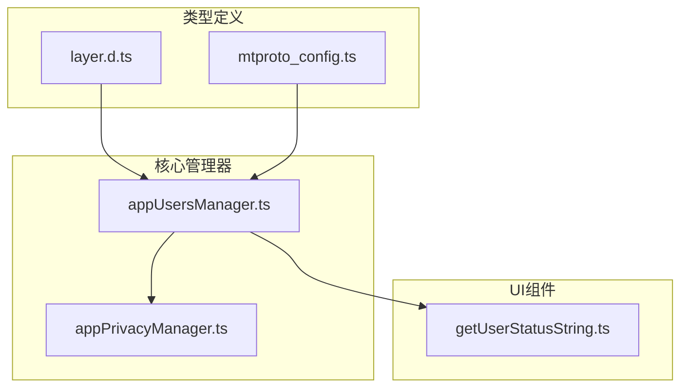
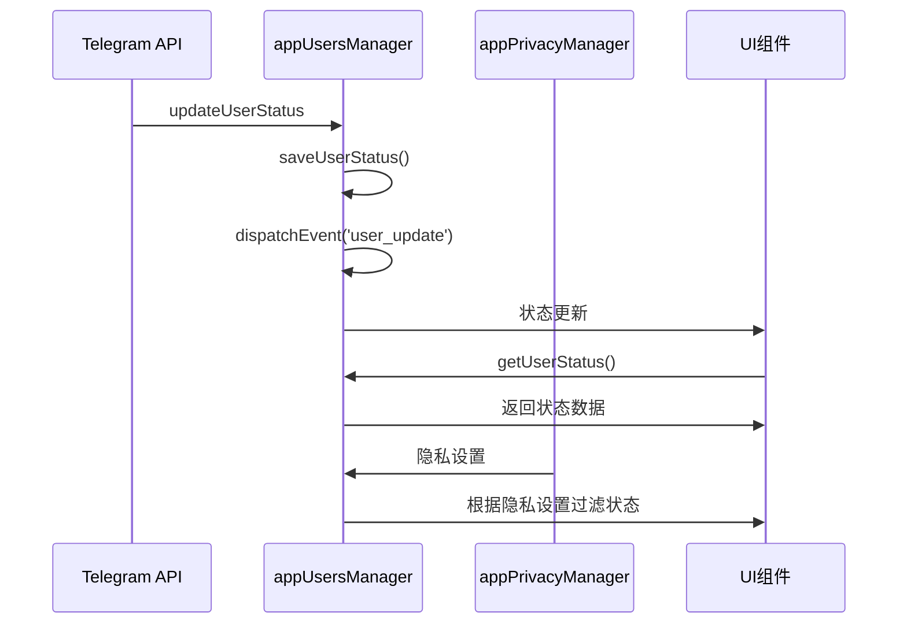
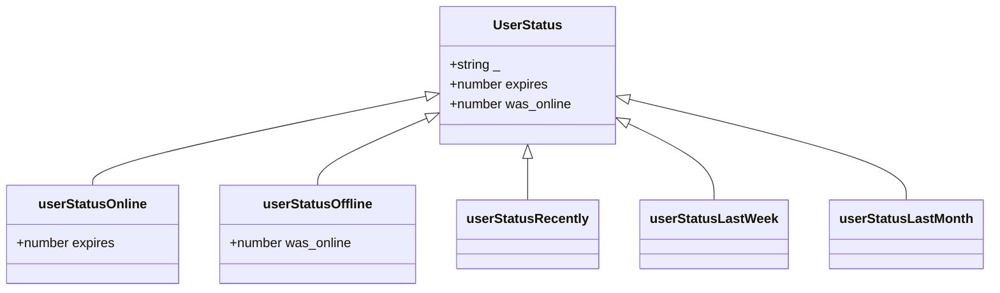
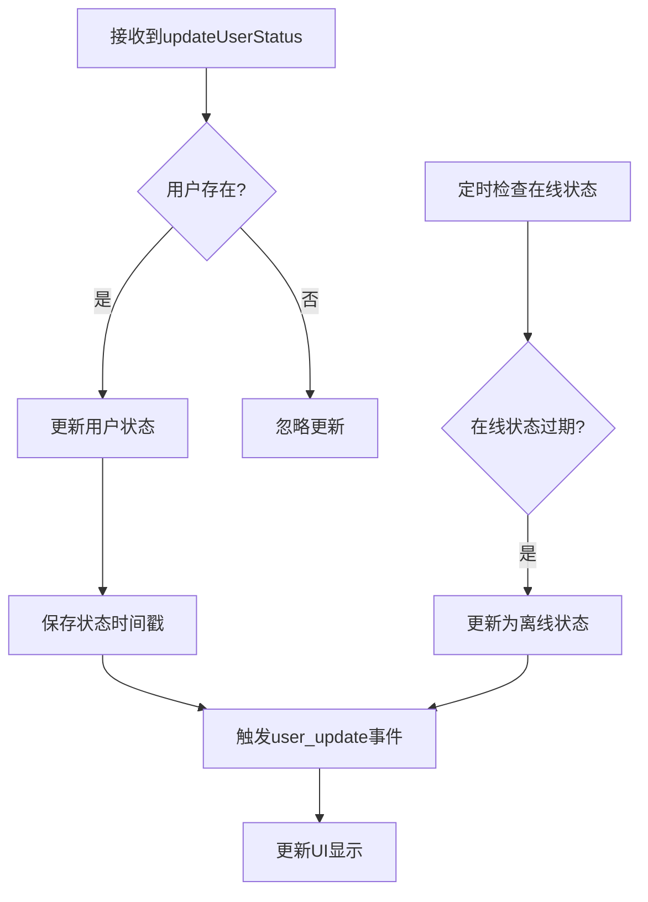
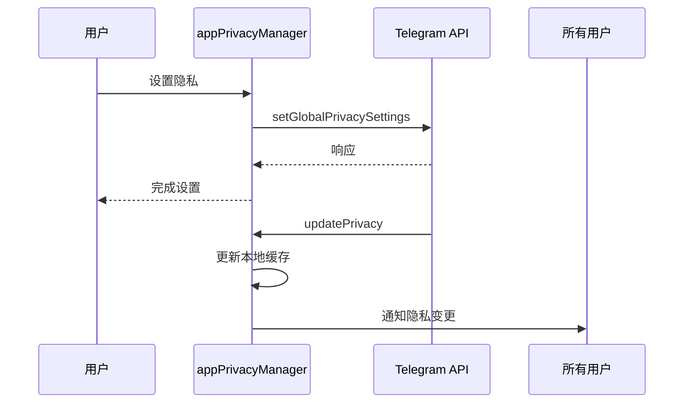
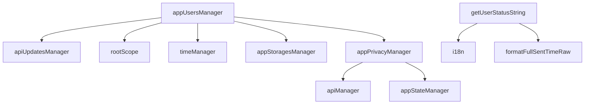

# 用户状态查询

<cite>
**本文档引用的文件**   
- [appUsersManager.ts](file://src/lib/appManagers/appUsersManager.ts)
- [getUserStatusString.ts](file://src/components/wrappers/getUserStatusString.ts)
- [appPrivacyManager.ts](file://src/lib/appManagers/appPrivacyManager.ts)
- [mtproto_config.ts](file://src/lib/mtproto/mtproto_config.ts)
- [layer.d.ts](file://src/layer.d.ts)
</cite>

## 目录
1. [简介](#简介)
2. [项目结构](#项目结构)
3. [核心组件](#核心组件)
4. [架构概述](#架构概述)
5. [详细组件分析](#详细组件分析)
6. [依赖分析](#依赖分析)
7. [性能考虑](#性能考虑)
8. [故障排除指南](#故障排除指南)
9. [结论](#结论)
10. [附录](#附录)（如有必要）

## 简介
本文档全面记录了Telegram Web客户端中用户状态查询功能的实现。该功能允许用户查询其他用户的在线状态、最后上线时间等状态信息。系统通过API接口提供用户状态数据模型，包括在线、离线、最近上线等状态的定义和表示方式。状态信息的实时更新机制包括心跳检测、状态同步和事件通知。隐私控制策略定义了不同用户关系下的状态可见性规则。文档还提供了查询用户状态的API使用指南，包括批量查询和单个查询的使用场景，并通过实际代码示例展示如何订阅用户状态变化并实时更新UI。

## 项目结构
项目结构显示了用户状态相关功能分布在多个目录中。核心用户状态管理逻辑位于`src/lib/appManagers/appUsersManager.ts`中，而用户状态的显示逻辑位于`src/components/wrappers/getUserStatusString.ts`中。隐私设置管理位于`src/lib/appManagers/appPrivacyManager.ts`中。类型定义在`src/layer.d.ts`中，而常量定义在`src/lib/mtproto/mtproto_config.ts`中。



**图表来源**
- [appUsersManager.ts](file://src/lib/appManagers/appUsersManager.ts#L1-L1356)
- [getUserStatusString.ts](file://src/components/wrappers/getUserStatusString.ts#L1-L103)
- [appPrivacyManager.ts](file://src/lib/appManagers/appPrivacyManager.ts#L1-L117)
- [mtproto_config.ts](file://src/lib/mtproto/mtproto_config.ts#L1-L50)
- [layer.d.ts](file://src/layer.d.ts#L620-L664)

**章节来源**
- [appUsersManager.ts](file://src/lib/appManagers/appUsersManager.ts#L1-L1356)
- [getUserStatusString.ts](file://src/components/wrappers/getUserStatusString.ts#L1-L103)

## 核心组件
核心组件包括用户状态管理器（appUsersManager）、用户状态显示组件（getUserStatusString）和隐私管理器（appPrivacyManager）。appUsersManager负责管理用户状态数据，处理状态更新，并提供API查询接口。getUserStatusString组件负责将用户状态数据转换为用户界面可读的字符串。appPrivacyManager处理用户隐私设置，包括状态可见性规则。

**章节来源**
- [appUsersManager.ts](file://src/lib/appManagers/appUsersManager.ts#L1-L1356)
- [getUserStatusString.ts](file://src/components/wrappers/getUserStatusString.ts#L1-L103)
- [appPrivacyManager.ts](file://src/lib/appManagers/appPrivacyManager.ts#L1-L117)

## 架构概述
系统架构采用分层设计，前端UI组件通过事件系统与核心管理器通信。用户状态数据从Telegram API获取，经过appUsersManager处理后存储在内存中。当状态发生变化时，通过rootScope事件系统通知所有监听者。隐私设置由appPrivacyManager管理，影响状态信息的可见性。



**图表来源**
- [appUsersManager.ts](file://src/lib/appManagers/appUsersManager.ts#L76-L90)
- [appPrivacyManager.ts](file://src/lib/appManagers/appPrivacyManager.ts#L87-L89)
- [getUserStatusString.ts](file://src/components/wrappers/getUserStatusString.ts#L13-L102)

## 详细组件分析

### 用户状态管理器分析
用户状态管理器（appUsersManager）是用户状态功能的核心。它负责从API接收用户状态更新，管理本地用户状态缓存，并提供查询接口。

#### 用户状态数据模型


**图表来源**
- [layer.d.ts](file://src/layer.d.ts#L623-L664)

#### 状态更新机制


**图表来源**
- [appUsersManager.ts](file://src/lib/appManagers/appUsersManager.ts#L77-L90)
- [appUsersManager.ts](file://src/lib/appManagers/appUsersManager.ts#L853-L869)

**章节来源**
- [appUsersManager.ts](file://src/lib/appManagers/appUsersManager.ts#L1-L1356)

### 用户状态显示分析
用户状态显示组件负责将内部状态数据转换为用户友好的显示文本。

#### 状态显示逻辑
```mermaid
flowchart TD
A[获取用户状态] --> B{用户是机器人?}
B --> |是| C[显示机器人信息]
B --> |否| D{用户是支持账号?}
D --> |是| E[显示支持状态]
D --> |否| F{状态类型}
F --> G[在线]
F --> H[最近上线]
F --> I[上周上线]
F --> J[上月上线]
F --> K[离线]
G --> L[显示"在线"]
H --> M[显示"最近"]
I --> N[显示"一周内"]
J --> O[显示"一月内"]
K --> P[计算离线时间]
P --> Q{离线时间<1分钟?}
Q --> |是| R[显示"刚刚"]
Q --> |否| S{离线时间<1小时?}
S --> |是| T[显示"X分钟前"]
S --> |否| U{今天离线?}
U --> |是| V[显示"X小时前"]
U --> |否| W[显示具体日期时间]
```

**图表来源**
- [getUserStatusString.ts](file://src/components/wrappers/getUserStatusString.ts#L45-L89)

**章节来源**
- [getUserStatusString.ts](file://src/components/wrappers/getUserStatusString.ts#L1-L103)

### 隐私控制分析
隐私控制管理器处理用户状态可见性规则。

#### 隐私设置流程


**图表来源**
- [appPrivacyManager.ts](file://src/lib/appManagers/appPrivacyManager.ts#L87-L89)
- [appPrivacyManager.ts](file://src/lib/appManagers/appPrivacyManager.ts#L76-L80)

**章节来源**
- [appPrivacyManager.ts](file://src/lib/appManagers/appPrivacyManager.ts#L1-L117)

## 依赖分析
用户状态功能依赖于多个核心组件和系统服务。appUsersManager依赖于apiUpdatesManager接收状态更新，依赖于rootScope进行事件分发，依赖于timeManager处理时间戳。getUserStatusString依赖于i18n进行国际化文本处理。整个系统依赖于MTProto协议与Telegram服务器通信。



**图表来源**
- [appUsersManager.ts](file://src/lib/appManagers/appUsersManager.ts#L76-L77)
- [getUserStatusString.ts](file://src/components/wrappers/getUserStatusString.ts#L7-L8)
- [appPrivacyManager.ts](file://src/lib/appManagers/appPrivacyManager.ts#L84-L88)

**章节来源**
- [appUsersManager.ts](file://src/lib/appManagers/appUsersManager.ts#L1-L1356)
- [getUserStatusString.ts](file://src/components/wrappers/getUserStatusString.ts#L1-L103)
- [appPrivacyManager.ts](file://src/lib/appManagers/appPrivacyManager.ts#L1-L117)

## 性能考虑
用户状态系统在性能方面进行了多项优化。状态更新采用批量处理机制，减少UI重绘次数。用户状态缓存避免了重复的API调用。定时检查在线状态的间隔设置为60秒，平衡了实时性和性能消耗。隐私设置缓存减少了对服务器的频繁查询。

## 故障排除指南
常见问题包括状态显示不更新、隐私设置不生效等。状态不更新可能是由于网络连接问题或事件监听器未正确注册。隐私设置不生效可能是由于服务器同步延迟或本地缓存未及时更新。调试时应检查网络请求、事件日志和本地存储状态。

**章节来源**
- [appUsersManager.ts](file://src/lib/appManagers/appUsersManager.ts#L72-L75)
- [appPrivacyManager.ts](file://src/lib/appManagers/appPrivacyManager.ts#L84-L89)

## 结论
用户状态查询功能通过精心设计的架构实现了高效、实时的状态管理。系统采用事件驱动模式，确保状态变更能够及时通知所有相关组件。隐私控制机制保护了用户的信息安全。整体设计考虑了性能优化，确保在大规模用户场景下的稳定运行。

## 附录

### 用户状态类型定义
| 状态类型 | 描述 | 数据字段 |
|---------|------|---------|
| userStatusOnline | 在线 | expires: 过期时间戳 |
| userStatusOffline | 离线 | was_online: 最后上线时间戳 |
| userStatusRecently | 最近上线 | 无附加数据 |
| userStatusLastWeek | 上周上线 | 无附加数据 |
| userStatusLastMonth | 上月上线 | 无附加数据 |

**章节来源**
- [layer.d.ts](file://src/layer.d.ts#L623-L664)

### API使用示例
```typescript
// 查询单个用户状态
const status = appUsersManager.getUserStatus(userId);

// 批量查询用户状态
const users = appUsersManager.getUsers();
for(const id in users) {
  const status = users[id].status;
  // 处理状态
}

// 订阅状态变化
rootScope.addEventListener('user_update', (userId) => {
  const user = appUsersManager.getUser(userId);
  // 更新UI
});
```

**章节来源**
- [appUsersManager.ts](file://src/lib/appManagers/appUsersManager.ts#L738-L740)
- [appUsersManager.ts](file://src/lib/appManagers/appUsersManager.ts#L734-L735)
- [appUsersManager.ts](file://src/lib/appManagers/appUsersManager.ts#L76-L90)