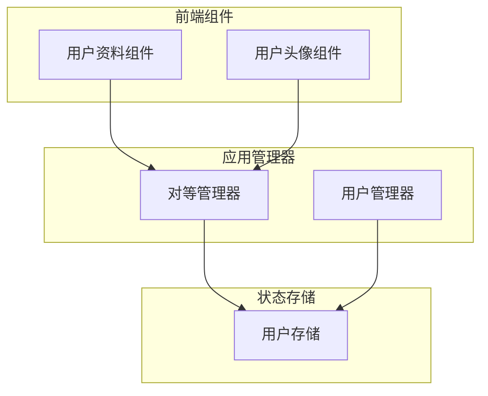
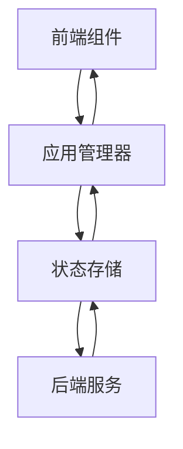
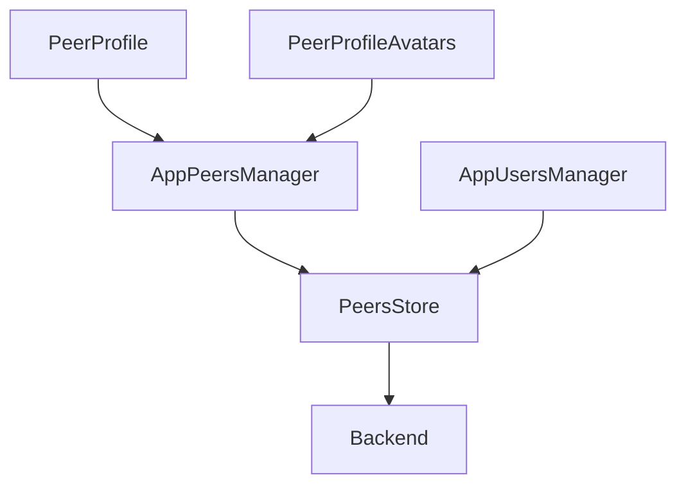

# 用户管理

<cite>
**本文档引用的文件**
- [peerProfile.tsx](file://src/components/peerProfile.tsx)
- [peerProfileAvatars.ts](file://src/components/peerProfileAvatars.ts)
- [getPeerActiveUsernames.ts](file://src/lib/appManagers/utils/peers/getPeerActiveUsernames.ts)
- [getPeerPhoto.ts](file://src/lib/appManagers/utils/peers/getPeerPhoto.ts)
- [peers.ts](file://src/stores/peers.ts)
- [appUsersManager.ts](file://src/lib/appManagers/appUsersManager.ts)
- [appPeersManager.ts](file://src/lib/appManagers/appPeersManager.ts)
</cite>

## 目录
1. [简介](#简介)
2. [项目结构](#项目结构)
3. [核心组件](#核心组件)
4. [架构概述](#架构概述)
5. [详细组件分析](#详细组件分析)
6. [依赖分析](#依赖分析)
7. [性能考虑](#性能考虑)
8. [故障排除指南](#故障排除指南)
9. [结论](#结论)

## 简介
本文档全面记录了用户管理API的核心功能，包括用户信息获取、用户资料更新、用户状态查询等核心接口。详细描述了用户数据模型，包括用户ID、昵称、头像、联系方式等属性及其数据类型。说明了用户信息缓存机制和数据同步策略。解释了用户搜索和发现功能的实现方式，包括搜索算法和过滤条件。提供了用户头像管理和用户名解析的API使用指南。包含了用户在线状态和最后上线时间的获取方法。通过实际代码示例展示了如何调用这些API并处理响应数据。

## 项目结构
本项目采用模块化结构，主要分为以下几个部分：
- `src/components`：包含用户界面组件，如用户资料、头像管理等
- `src/lib/appManagers`：包含应用管理器，负责用户数据的获取和管理
- `src/stores`：包含状态存储，用于管理用户数据的状态
- `src/helpers`：包含辅助函数，用于处理用户相关的逻辑



**图表来源**
- [peerProfile.tsx](file://src/components/peerProfile.tsx)
- [peerProfileAvatars.ts](file://src/components/peerProfileAvatars.ts)
- [appUsersManager.ts](file://src/lib/appManagers/appUsersManager.ts)
- [appPeersManager.ts](file://src/lib/appManagers/appPeersManager.ts)
- [peers.ts](file://src/stores/peers.ts)

**章节来源**
- [peerProfile.tsx](file://src/components/peerProfile.tsx)
- [peerProfileAvatars.ts](file://src/components/peerProfileAvatars.ts)

## 核心组件
本节分析用户管理的核心组件，包括用户资料组件和用户头像组件。

**章节来源**
- [peerProfile.tsx](file://src/components/peerProfile.tsx)
- [peerProfileAvatars.ts](file://src/components/peerProfileAvatars.ts)

## 架构概述
系统架构采用分层设计，前端组件通过应用管理器与状态存储进行交互，实现用户数据的获取和管理。



**图表来源**
- [appUsersManager.ts](file://src/lib/appManagers/appUsersManager.ts)
- [appPeersManager.ts](file://src/lib/appManagers/appPeersManager.ts)
- [peers.ts](file://src/stores/peers.ts)

## 详细组件分析
本节详细分析用户管理的各个关键组件。

### 用户资料组件分析
用户资料组件负责展示和管理用户的基本信息，包括昵称、头像、联系方式等。

```mermaid
classDiagram
class PeerProfile {
+peerId : PeerId
+threadId : number
+scrollable : Scrollable
+setCollapsedOn : HTMLElement
+isDialog : boolean
+onPinnedGiftsChange : (gifts : MyStarGift[]) => void
+peer : ReturnType<typeof usePeer>
+fullPeer : ReturnType<ReturnType<typeof useFullPeer>>
+canBeDetailed : () => boolean
+isSavedDialog : boolean
+isTopic : boolean
+isBotforum : boolean
+needSimpleAvatar : boolean
+getDetailsForUse : () => {peerId : PeerId, threadId? : number}
+verifyContext : (peerId : PeerId, threadId? : number) => boolean
}
class PeerProfileContextValue {
+peerId : PeerId
+threadId : number
+scrollable : Scrollable
+setCollapsedOn : HTMLElement
+isDialog : boolean
+onPinnedGiftsChange : (gifts : MyStarGift[]) => void
+peer : ReturnType<typeof usePeer>
+fullPeer : ReturnType<ReturnType<typeof useFullPeer>>
+canBeDetailed : () => boolean
+isSavedDialog : boolean
+isTopic : boolean
+isBotforum : boolean
+needSimpleAvatar : boolean
+getDetailsForUse : () => {peerId : PeerId, threadId? : number}
+verifyContext : (peerId : PeerId, threadId? : number) => boolean
}
PeerProfile --> PeerProfileContextValue : "使用"
```

**图表来源**
- [peerProfile.tsx](file://src/components/peerProfile.tsx)

**章节来源**
- [peerProfile.tsx](file://src/components/peerProfile.tsx)

### 用户头像组件分析
用户头像组件负责展示和管理用户的头像，支持多头像切换和缩放。

```mermaid
classDiagram
class PeerProfileAvatars {
-BASE_CLASS : string
-SCALE : number
-TRANSLATE_TEMPLATE : string
+container : HTMLElement
+avatars : HTMLElement
+gradient : HTMLElement
+gradientTop : HTMLElement
+info : HTMLElement
+arrowPrevious : HTMLElement
+arrowNext : HTMLElement
+tabs : HTMLDivElement
+listLoader : ListLoader<Photo.photo['id'] | Message.messageService, Photo.photo['id'] | Message.messageService>
+peerId : PeerId
+intersectionObserver : IntersectionObserver
+loadCallbacks : Map<Element, () => void>
+listenerSetter : ListenerSetter
+swipeHandler : SwipeHandler
+middlewareHelper : MiddlewareHelper
+hasBackgroundColor : boolean
+emojiPatternCanvas : HTMLCanvasElement
+unfold : (e? : MouseEvent) => void
+fakeAvatar : ReturnType<typeof avatarNew>
+hasNoPhoto : boolean
+scrollable : Scrollable
+managers : AppManagers
+setCollapsedOn : HTMLElement
+constructor(scrollable : Scrollable, managers : AppManagers, setCollapsedOn : HTMLElement)
+goWithoutTransition(distance : number)
+setPeer(peerId : PeerId)
+_applyAppearance()
+applyAppearance()
+addTab()
+processItem(photoId : Photo.photo['id'] | Message.messageService)
+loadNearestToTarget(target : Element)
+setCollapsed(collapsed : boolean)
+isCollapsed()
+updateHeaderFilled()
+cleanup()
}
class ListLoader {
+loadCount : number
+loadMore : (anchor, older, loadCount) => Promise<{count : number, items : any[]}>
+processItem : (item) => Promise<any>
+onJump : (item, older) => void
+current : any
+previous : any[]
+next : any[]
+index : number
+count : number
+load(older : boolean)
+go(distance : number)
}
PeerProfileAvatars --> ListLoader : "使用"
```

**图表来源**
- [peerProfileAvatars.ts](file://src/components/peerProfileAvatars.ts)

**章节来源**
- [peerProfileAvatars.ts](file://src/components/peerProfileAvatars.ts)

## 依赖分析
本节分析用户管理组件之间的依赖关系。



**图表来源**
- [peerProfile.tsx](file://src/components/peerProfile.tsx)
- [peerProfileAvatars.ts](file://src/components/peerProfileAvatars.ts)
- [appUsersManager.ts](file://src/lib/appManagers/appUsersManager.ts)
- [appPeersManager.ts](file://src/lib/appManagers/appPeersManager.ts)
- [peers.ts](file://src/stores/peers.ts)

**章节来源**
- [peerProfile.tsx](file://src/components/peerProfile.tsx)
- [peerProfileAvatars.ts](file://src/components/peerProfileAvatars.ts)
- [appUsersManager.ts](file://src/lib/appManagers/appUsersManager.ts)
- [appPeersManager.ts](file://src/lib/appManagers/appPeersManager.ts)
- [peers.ts](file://src/stores/peers.ts)

## 性能考虑
在用户管理中，性能优化主要集中在以下几个方面：
- 缓存用户数据，减少重复请求
- 使用虚拟滚动技术，提高列表渲染性能
- 优化图片加载，减少网络传输

## 故障排除指南
本节提供用户管理相关的故障排除指南。

**章节来源**
- [peerProfile.tsx](file://src/components/peerProfile.tsx)
- [peerProfileAvatars.ts](file://src/components/peerProfileAvatars.ts)
- [appUsersManager.ts](file://src/lib/appManagers/appUsersManager.ts)
- [appPeersManager.ts](file://src/lib/appManagers/appPeersManager.ts)
- [peers.ts](file://src/stores/peers.ts)

## 结论
本文档详细记录了用户管理API的核心功能和实现方式，为开发者提供了全面的参考。通过分层架构和模块化设计，系统实现了高效、可维护的用户管理功能。