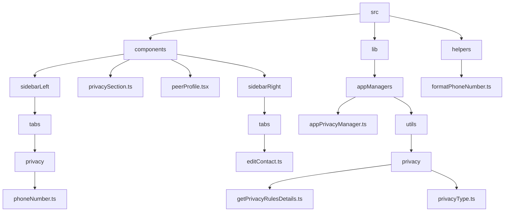
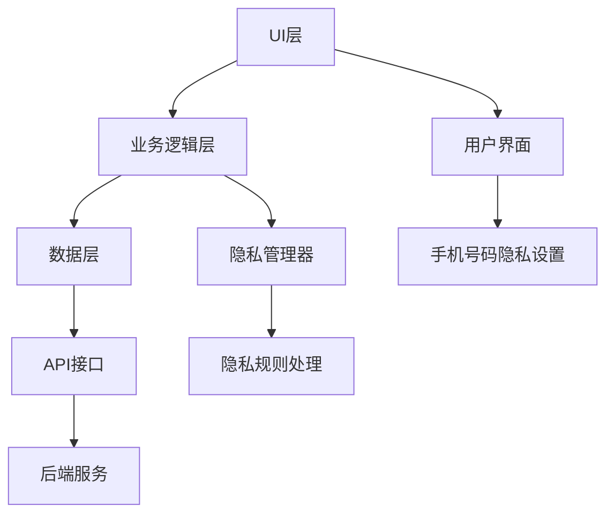
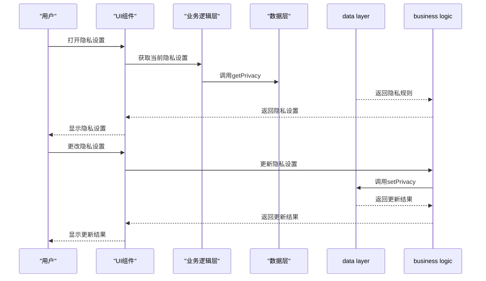
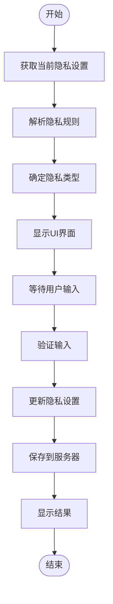
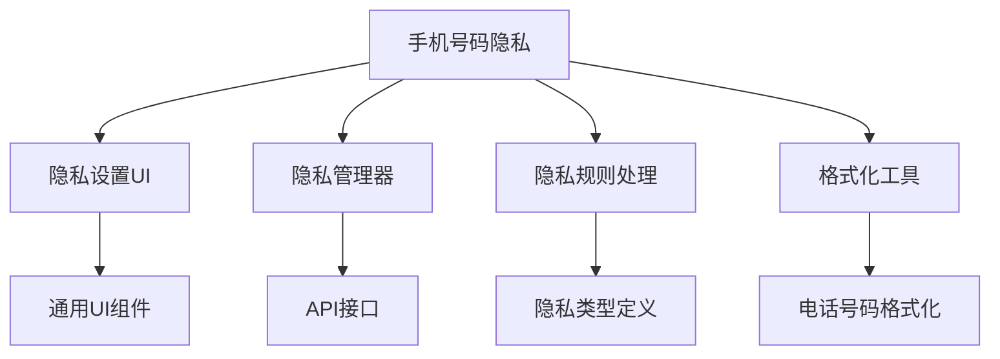

# 手机号码隐私

<cite>
**本文档引用的文件**
- [phoneNumber.ts](file://src/components/sidebarLeft/tabs/privacy/phoneNumber.ts)
- [privacySection.ts](file://src/components/privacySection.ts)
- [appPrivacyManager.ts](file://src/lib/appManagers/appPrivacyManager.ts)
- [getPrivacyRulesDetails.ts](file://src/lib/appManagers/utils/privacy/getPrivacyRulesDetails.ts)
- [privacyType.ts](file://src/lib/appManagers/utils/privacy/privacyType.ts)
- [peerProfile.tsx](file://src/components/peerProfile.tsx)
- [editContact.ts](file://src/components/sidebarRight/tabs/editContact.ts)
- [formatUserPhone.ts](file://src/components/wrappers/formatUserPhone.ts)
- [formatPhoneNumber.ts](file://src/helpers/formatPhoneNumber.ts)
</cite>

## 目录
1. [简介](#简介)
2. [项目结构](#项目结构)
3. [核心组件](#核心组件)
4. [架构概述](#架构概述)
5. [详细组件分析](#详细组件分析)
6. [依赖分析](#依赖分析)
7. [性能考虑](#性能考虑)
8. [故障排除指南](#故障排除指南)
9. [结论](#结论)

## 简介
本文档全面记录了手机号码隐私控制功能的实现细节。该功能允许用户管理其手机号码的可见性设置，包括谁可以查看用户手机号码的权限控制机制。文档详细描述了不同隐私选项（如所有人、联系人、无人）的技术实现和状态管理，解释了手机号码隐私设置与其他用户资料隐私设置的关联性，并提供了实际代码示例展示如何查询当前手机号码隐私状态、更新隐私设置以及处理相关的安全验证。

## 项目结构
项目结构中与手机号码隐私控制相关的文件主要分布在以下几个目录中：
- `src/components/sidebarLeft/tabs/privacy/`：包含隐私设置相关的UI组件
- `src/components/`：包含通用UI组件
- `src/lib/appManagers/`：包含应用管理器和业务逻辑
- `src/helpers/`：包含辅助函数



**Diagram sources**
- [phoneNumber.ts](file://src/components/sidebarLeft/tabs/privacy/phoneNumber.ts)
- [privacySection.ts](file://src/components/privacySection.ts)
- [appPrivacyManager.ts](file://src/lib/appManagers/appPrivacyManager.ts)
- [getPrivacyRulesDetails.ts](file://src/lib/appManagers/utils/privacy/getPrivacyRulesDetails.ts)
- [privacyType.ts](file://src/lib/appManagers/utils/privacy/privacyType.ts)
- [peerProfile.tsx](file://src/components/peerProfile.tsx)
- [editContact.ts](file://src/components/sidebarRight/tabs/editContact.ts)
- [formatPhoneNumber.ts](file://src/helpers/formatPhoneNumber.ts)

**Section sources**
- [phoneNumber.ts](file://src/components/sidebarLeft/tabs/privacy/phoneNumber.ts)
- [privacySection.ts](file://src/components/privacySection.ts)
- [appPrivacyManager.ts](file://src/lib/appManagers/appPrivacyManager.ts)

## 核心组件
手机号码隐私控制功能的核心组件包括隐私设置UI组件、隐私管理器和隐私规则处理工具。这些组件共同实现了手机号码可见性设置的功能。

**Section sources**
- [phoneNumber.ts](file://src/components/sidebarLeft/tabs/privacy/phoneNumber.ts)
- [privacySection.ts](file://src/components/privacySection.ts)
- [appPrivacyManager.ts](file://src/lib/appManagers/appPrivacyManager.ts)

## 架构概述
手机号码隐私控制功能的架构主要包括三个层次：UI层、业务逻辑层和数据层。UI层负责展示隐私设置界面，业务逻辑层处理隐私规则的获取和更新，数据层与后端API进行通信。



**Diagram sources**
- [phoneNumber.ts](file://src/components/sidebarLeft/tabs/privacy/phoneNumber.ts)
- [appPrivacyManager.ts](file://src/lib/appManagers/appPrivacyManager.ts)
- [getPrivacyRulesDetails.ts](file://src/lib/appManagers/utils/privacy/getPrivacyRulesDetails.ts)

## 详细组件分析
### 手机号码隐私设置分析
手机号码隐私设置组件实现了用户界面和交互逻辑，允许用户选择不同的隐私选项来控制手机号码的可见性。

#### 对象导向组件
```mermaid
classDiagram
class AppPrivacyPhoneNumberTab {
+init() : Promise~void~
}
class PrivacySection {
+radioRows : Map~PrivacyType, Row~
+radioSection : SettingSection
+exceptionsSection : SettingSection
+peerIds : {disallow? : PeerId[], allow? : PeerId[]}
+type : PrivacyType
+onRadioChange(value : string | PrivacySection['type']) : void
+setRadio(type : PrivacySection['type']) : void
}
class AppPrivacyManager {
+setPrivacy(inputKey : InputPrivacyKey['_'], rules : InputPrivacyRule[]) : Promise~PrivacyRule[]~
+getPrivacy(inputKey : InputPrivacyKey['_']) : Promise~PrivacyRule[]~
}
AppPrivacyPhoneNumberTab --> PrivacySection : "使用"
PrivacySection --> AppPrivacyManager : "依赖"
```

**Diagram sources**
- [phoneNumber.ts](file://src/components/sidebarLeft/tabs/privacy/phoneNumber.ts)
- [privacySection.ts](file://src/components/privacySection.ts)
- [appPrivacyManager.ts](file://src/lib/appManagers/appPrivacyManager.ts)

#### API/服务组件


**Diagram sources**
- [phoneNumber.ts](file://src/components/sidebarLeft/tabs/privacy/phoneNumber.ts)
- [appPrivacyManager.ts](file://src/lib/appManagers/appPrivacyManager.ts)

#### 复杂逻辑组件


**Diagram sources**
- [getPrivacyRulesDetails.ts](file://src/lib/appManagers/utils/privacy/getPrivacyRulesDetails.ts)
- [privacySection.ts](file://src/components/privacySection.ts)

**Section sources**
- [phoneNumber.ts](file://src/components/sidebarLeft/tabs/privacy/phoneNumber.ts)
- [privacySection.ts](file://src/components/privacySection.ts)
- [appPrivacyManager.ts](file://src/lib/appManagers/appPrivacyManager.ts)
- [getPrivacyRulesDetails.ts](file://src/lib/appManagers/utils/privacy/getPrivacyRulesDetails.ts)

### 概念概述
手机号码隐私控制功能允许用户通过简单的界面操作来管理其手机号码的可见性。用户可以选择将手机号码对所有人可见、仅对联系人可见或对无人可见。此外，还可以设置例外规则，允许特定用户或群组查看手机号码。

## 依赖分析
手机号码隐私控制功能依赖于多个组件和模块，包括UI组件、业务逻辑组件和辅助工具。



**Diagram sources**
- [phoneNumber.ts](file://src/components/sidebarLeft/tabs/privacy/phoneNumber.ts)
- [privacySection.ts](file://src/components/privacySection.ts)
- [appPrivacyManager.ts](file://src/lib/appManagers/appPrivacyManager.ts)
- [getPrivacyRulesDetails.ts](file://src/lib/appManagers/utils/privacy/getPrivacyRulesDetails.ts)
- [privacyType.ts](file://src/lib/appManagers/utils/privacy/privacyType.ts)
- [formatPhoneNumber.ts](file://src/helpers/formatPhoneNumber.ts)

**Section sources**
- [phoneNumber.ts](file://src/components/sidebarLeft/tabs/privacy/phoneNumber.ts)
- [privacySection.ts](file://src/components/privacySection.ts)
- [appPrivacyManager.ts](file://src/lib/appManagers/appPrivacyManager.ts)
- [getPrivacyRulesDetails.ts](file://src/lib/appManagers/utils/privacy/getPrivacyRulesDetails.ts)
- [privacyType.ts](file://src/lib/appManagers/utils/privacy/privacyType.ts)
- [formatPhoneNumber.ts](file://src/helpers/formatPhoneNumber.ts)

## 性能考虑
手机号码隐私控制功能在设计时考虑了性能优化，包括：
1. 缓存隐私设置以减少API调用
2. 异步加载隐私规则以避免阻塞UI
3. 使用高效的字符串处理算法来格式化电话号码

## 故障排除指南
在使用手机号码隐私控制功能时，可能会遇到以下问题：

**Section sources**
- [appPrivacyManager.ts](file://src/lib/appManagers/appPrivacyManager.ts)
- [privacySection.ts](file://src/components/privacySection.ts)

## 结论
手机号码隐私控制功能通过清晰的架构设计和模块化实现，为用户提供了一个简单易用的界面来管理其手机号码的可见性。该功能不仅满足了用户对隐私保护的需求，还通过高效的性能优化和可靠的错误处理机制确保了良好的用户体验。