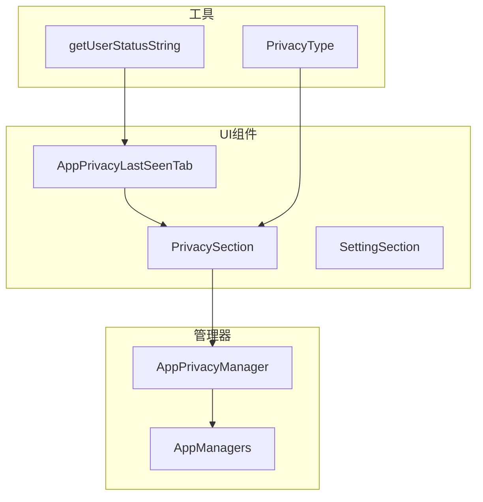
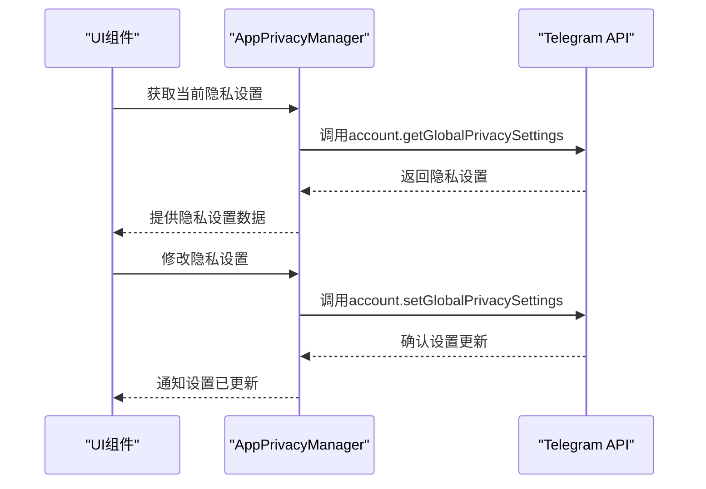
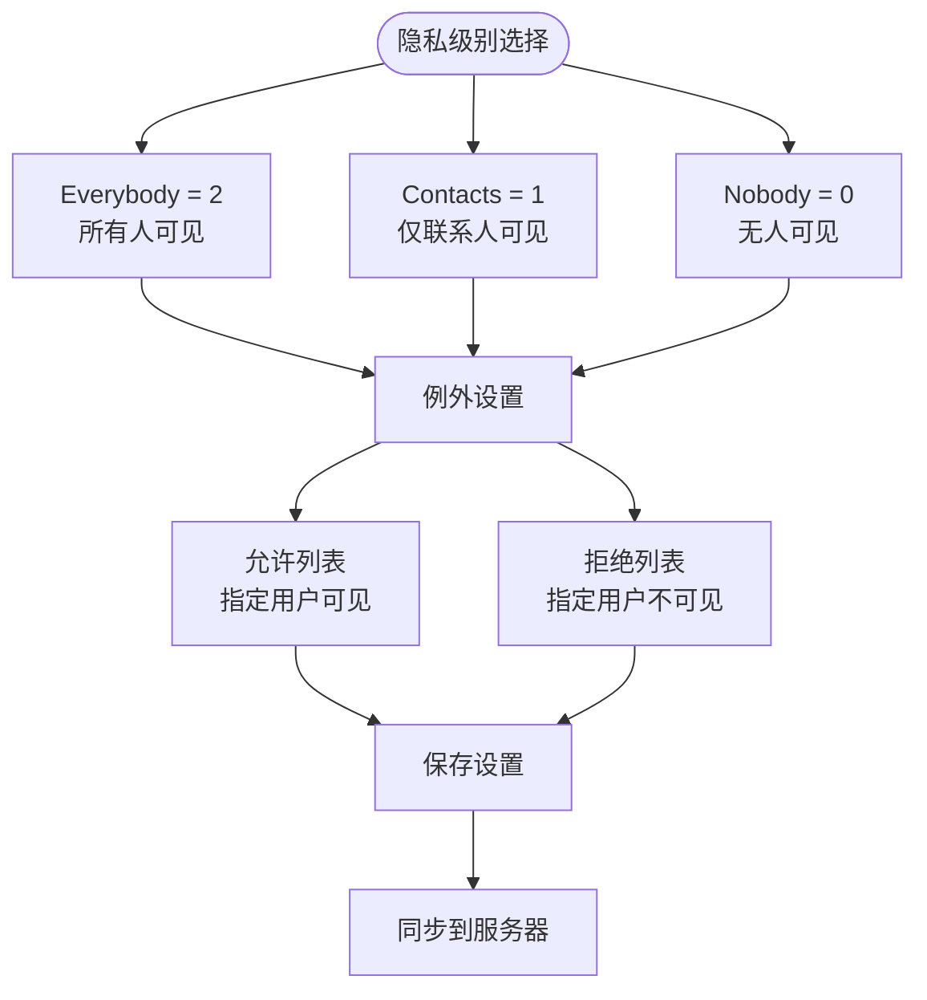
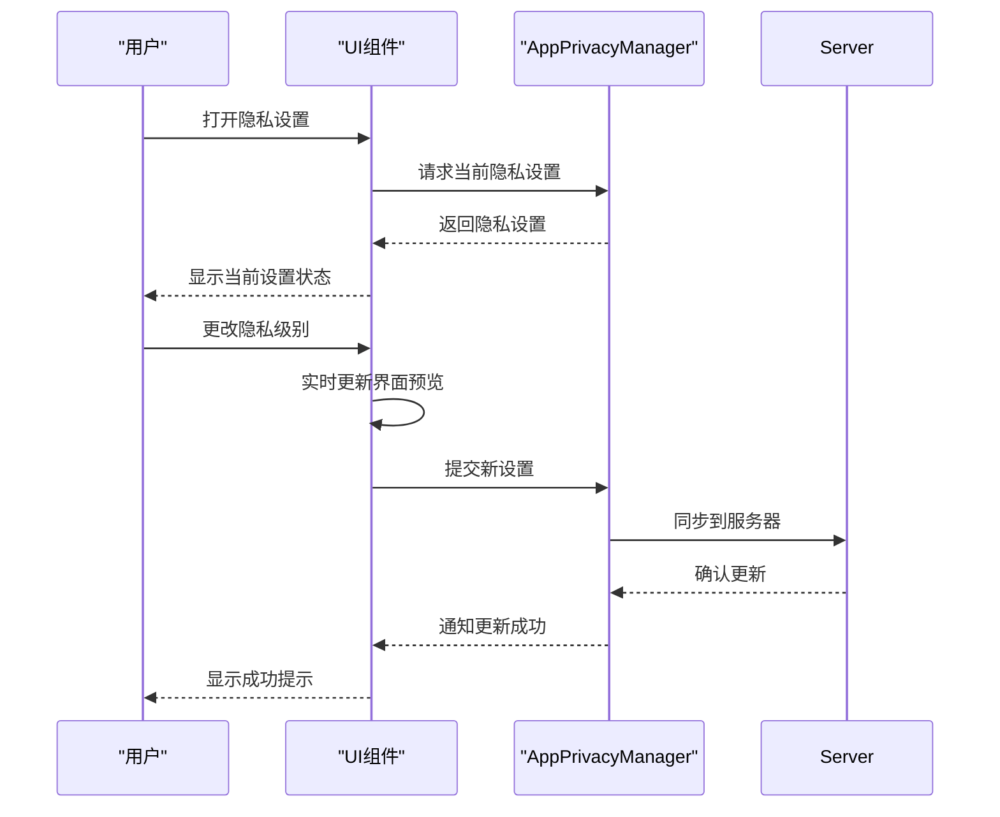
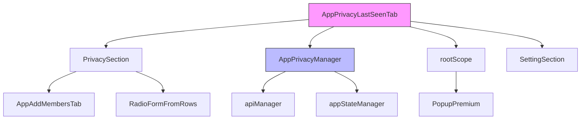

# 最后上线时间隐私

<cite>
**本文档引用的文件**
- [lastSeen.ts](file://src/components/sidebarLeft/tabs/privacy/lastSeen.ts)
- [privacySection.ts](file://src/components/privacySection.ts)
- [appPrivacyManager.ts](file://src/lib/appManagers/appPrivacyManager.ts)
- [privacyType.ts](file://src/lib/appManagers/utils/privacy/privacyType.ts)
- [getUserStatusString.ts](file://src/components/wrappers/getUserStatusString.ts)
- [lang.ts](file://src/lang.ts)
- [privacyAndSecurity.ts](file://src/components/sidebarLeft/tabs/privacyAndSecurity.ts)
</cite>

## 目录
1. [简介](#简介)
2. [项目结构](#项目结构)
3. [核心组件](#核心组件)
4. [架构概述](#架构概述)
5. [详细组件分析](#详细组件分析)
6. [依赖分析](#依赖分析)
7. [性能考虑](#性能考虑)
8. [故障排除指南](#故障排除指南)
9. [结论](#结论)

## 简介
本文档详细说明了Telegram Web客户端中"最后上线时间隐私"功能的实现机制。该功能允许用户控制其最后上线时间的可见性，包括公开、好友、私密等不同隐私级别，并提供了相关的UI组件和交互模式。

## 项目结构
最后上线时间隐私功能的实现分布在多个组件和管理器中，主要涉及隐私设置界面、隐私规则管理以及状态显示逻辑。



**图表来源**
- [lastSeen.ts](file://src/components/sidebarLeft/tabs/privacy/lastSeen.ts)
- [privacySection.ts](file://src/components/privacySection.ts)
- [appPrivacyManager.ts](file://src/lib/appManagers/appPrivacyManager.ts)

**章节来源**
- [lastSeen.ts](file://src/components/sidebarLeft/tabs/privacy/lastSeen.ts)
- [privacySection.ts](file://src/components/privacySection.ts)

## 核心组件
最后上线时间隐私功能的核心组件包括隐私设置标签页、隐私规则管理器和隐私类型枚举。这些组件共同实现了隐私设置的展示、修改和应用。

**章节来源**
- [lastSeen.ts](file://src/components/sidebarLeft/tabs/privacy/lastSeen.ts)
- [privacyType.ts](file://src/lib/appManagers/utils/privacy/privacyType.ts)

## 架构概述
最后上线时间隐私功能的架构包括UI层、业务逻辑层和数据层。UI层负责展示隐私设置界面，业务逻辑层处理隐私规则的验证和应用，数据层与服务器同步隐私设置。



**图表来源**
- [appPrivacyManager.ts](file://src/lib/appManagers/appPrivacyManager.ts)
- [lastSeen.ts](file://src/components/sidebarLeft/tabs/privacy/lastSeen.ts)

## 详细组件分析
### AppPrivacyLastSeenTab 分析
AppPrivacyLastSeenTab是最后上线时间隐私设置的主界面组件，负责展示和处理用户的隐私设置选择。

#### 类图
```mermaid
classDiagram
class AppPrivacyLastSeenTab {
+container : HTMLElement
+scrollable : Scrollable
+managers : AppManagers
+listenerSetter : ListenerSetter
+init(globalPrivacy : GlobalPrivacySettings)
+canHideReadTime() : boolean
}
class PrivacySection {
+radioSection : SettingSection
+exceptionsSection : SettingSection
+radioRows : Map<PrivacyType, Row>
+peerIds : {disallow? : PeerId[], allow? : PeerId[]}
+type : PrivacyType
+onTabDestroy() : Promise<void>
+setRadio(type : PrivacyType)
}
class SettingSection {
+container : HTMLElement
+content : HTMLElement
+caption : HTMLElement
}
AppPrivacyLastSeenTab --> PrivacySection : "包含"
AppPrivacyLastSeenTab --> SettingSection : "包含"
```

**图表来源**
- [lastSeen.ts](file://src/components/sidebarLeft/tabs/privacy/lastSeen.ts)
- [privacySection.ts](file://src/components/privacySection.ts)

**章节来源**
- [lastSeen.ts](file://src/components/sidebarLeft/tabs/privacy/lastSeen.ts)

### 隐私级别与权限判断逻辑
最后上线时间隐私设置提供了三种基本的隐私级别：公开、好友和私密。每种级别都有特定的含义和权限判断逻辑。

#### 隐私级别定义


**图表来源**
- [privacyType.ts](file://src/lib/appManagers/utils/privacy/privacyType.ts)
- [privacySection.ts](file://src/components/privacySection.ts)

**章节来源**
- [privacyType.ts](file://src/lib/appManagers/utils/privacy/privacyType.ts)

### UI组件设计与交互模式
最后上线时间隐私设置的UI组件设计遵循一致的交互模式，提供清晰的视觉反馈和直观的操作体验。

#### 交互流程


**图表来源**
- [lastSeen.ts](file://src/components/sidebarLeft/tabs/privacy/lastSeen.ts)
- [appPrivacyManager.ts](file://src/lib/appManagers/appPrivacyManager.ts)

**章节来源**
- [lastSeen.ts](file://src/components/sidebarLeft/tabs/privacy/lastSeen.ts)

## 依赖分析
最后上线时间隐私功能依赖于多个核心组件和管理器，形成了一个完整的功能体系。



**图表来源**
- [lastSeen.ts](file://src/components/sidebarLeft/tabs/privacy/lastSeen.ts)
- [privacySection.ts](file://src/components/privacySection.ts)
- [appPrivacyManager.ts](file://src/lib/appManagers/appPrivacyManager.ts)

**章节来源**
- [lastSeen.ts](file://src/components/sidebarLeft/tabs/privacy/lastSeen.ts)
- [privacySection.ts](file://src/components/privacySection.ts)
- [appPrivacyManager.ts](file://src/lib/appManagers/appPrivacyManager.ts)

## 性能考虑
最后上线时间隐私功能在性能方面进行了优化，确保设置的快速响应和高效同步。

- **本地缓存**: 使用appStateManager.getSomethingCached对内容设置进行缓存，减少不必要的API调用
- **批量更新**: 在设置更新时，通过Promise.all批量处理相关操作，提高效率
- **事件驱动**: 使用事件监听器(rootScope.addEventListener)来响应隐私设置的更新，避免轮询
- **懒加载**: 隐私设置界面在需要时才创建和初始化，减少初始加载时间

## 故障排除指南
### 常见问题及解决方案
1. **隐私设置无法保存**
   - 检查网络连接是否正常
   - 确认用户已登录账户
   - 查看浏览器控制台是否有错误信息

2. **设置更改后未生效**
   - 确认服务器同步是否成功
   - 检查是否有其他设备同时修改了相同设置
   - 尝试刷新页面重新加载设置

3. **界面显示异常**
   - 清除浏览器缓存
   - 检查是否有CSS加载失败
   - 确认JavaScript是否正常执行

**章节来源**
- [appPrivacyManager.ts](file://src/lib/appManagers/appPrivacyManager.ts)
- [lastSeen.ts](file://src/components/sidebarLeft/tabs/privacy/lastSeen.ts)

## 结论
最后上线时间隐私功能通过清晰的架构设计和高效的实现方式，为用户提供了灵活的隐私控制选项。该功能不仅考虑了基本的隐私级别设置，还支持例外列表和高级选项，满足了不同用户的需求。通过与服务器的同步机制，确保了设置在多设备间的一致性。