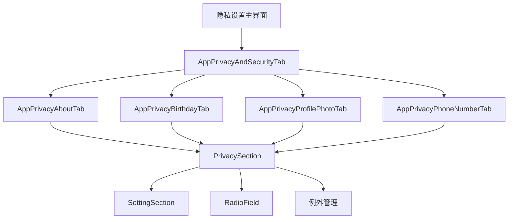
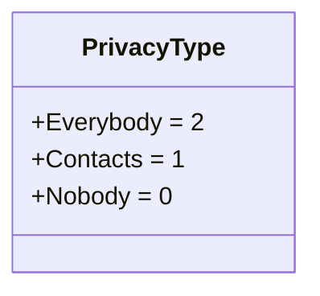
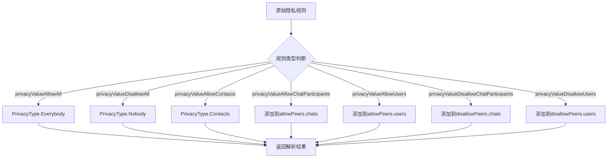
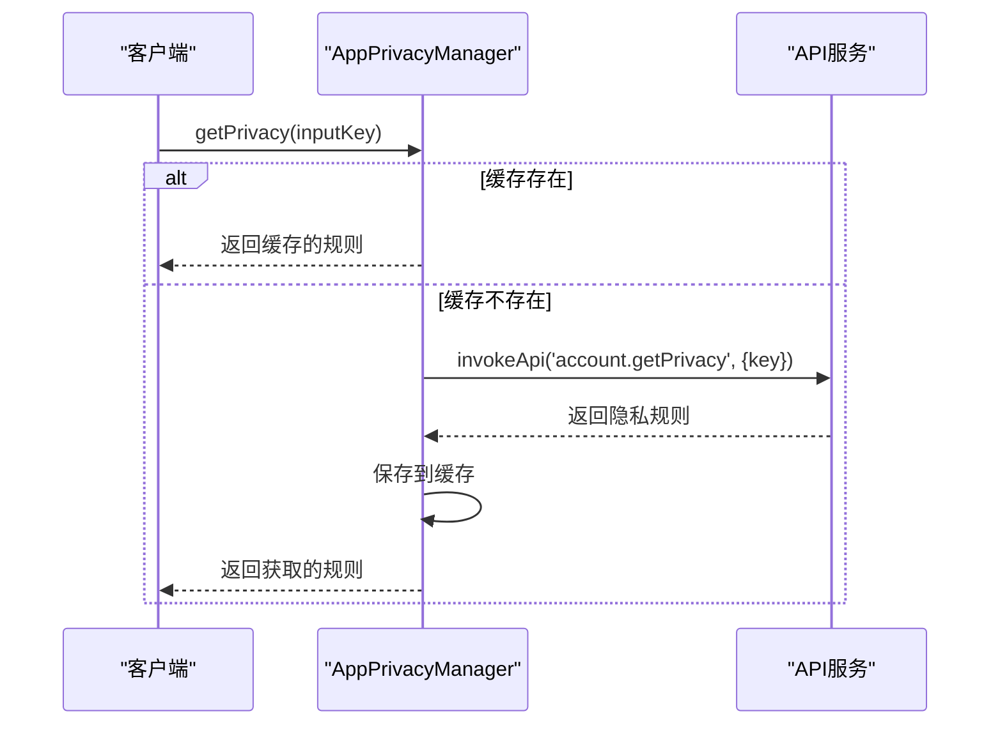
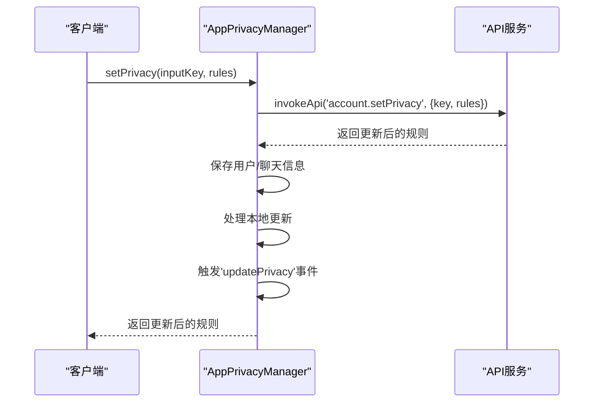
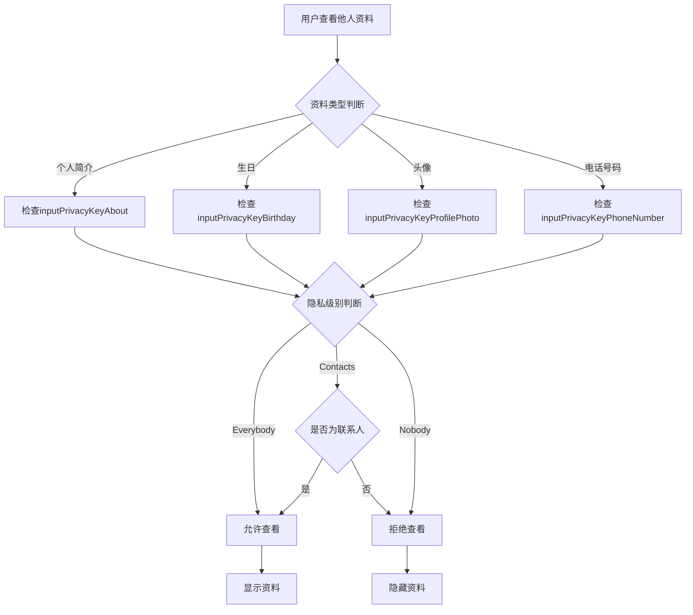
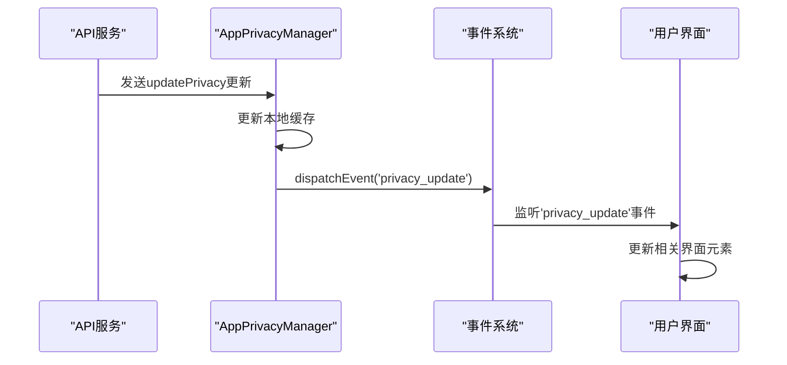
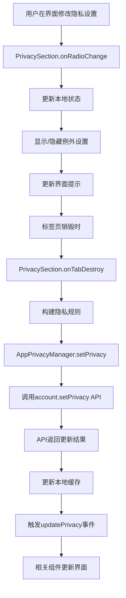

# 用户资料隐私

<cite>
**本文档引用的文件**  
- [privacySection.ts](file://src/components/privacySection.ts)
- [appPrivacyManager.ts](file://src/lib/appManagers/appPrivacyManager.ts)
- [about.ts](file://src/components/sidebarLeft/tabs/privacy/about.ts)
- [birthday.ts](file://src/components/sidebarLeft/tabs/privacy/birthday.ts)
- [profilePhoto.ts](file://src/components/sidebarLeft/tabs/privacy/profilePhoto.ts)
- [phoneNumber.ts](file://src/components/sidebarLeft/tabs/privacy/phoneNumber.ts)
- [getPrivacyRulesDetails.ts](file://src/lib/appManagers/utils/privacy/getPrivacyRulesDetails.ts)
- [privacyType.ts](file://src/lib/appManagers/utils/privacy/privacyType.ts)
- [peerProfile.tsx](file://src/components/peerProfile.tsx)
- [editProfile.ts](file://src/components/sidebarLeft/tabs/editProfile.ts)
- [birthday.tsx](file://src/components/popups/birthday.tsx)
</cite>

## 目录
1. [简介](#简介)
2. [资料隐私设置类型](#资料隐私设置类型)
3. [隐私设置统一管理界面](#隐私设置统一管理界面)
4. [隐私设置技术实现机制](#隐私设置技术实现机制)
5. [批量获取与修改隐私设置](#批量获取与修改隐私设置)
6. [权限验证流程](#权限验证流程)
7. [界面更新与状态同步](#界面更新与状态同步)
8. [核心组件分析](#核心组件分析)

## 简介
本文档详细记录了Telegram Web客户端中用户资料隐私控制系统的实现。系统性地描述了用户资料各项内容（包括头像、个人简介、生日等）的隐私设置功能，涵盖可用的隐私选项、技术实现机制、统一管理界面设计以及状态同步逻辑。文档还解释了在用户搜索和资料查看等场景中的权限验证流程。

## 资料隐私设置类型
系统为不同类型的用户资料提供了专门的隐私设置选项，每种设置类型都有其特定的隐私级别和例外规则。

### 个人简介隐私设置
个人简介（Bio）隐私设置允许用户控制谁可以查看其个人简介内容。该设置位于隐私设置中的"UserBio"部分，对应的输入键为`inputPrivacyKeyAbout`。

```mermaid
classDiagram
class PrivacySection {
+radioRows : Map<PrivacyType, Row>
+radioSection : SettingSection
+exceptionsSection : SettingSection
+peerIds : {disallow? : PeerId[], allow? : PeerId[]}
+type : PrivacyType
+constructor(options : PrivacySectionOptions)
+isLocked() : boolean
+onTabDestroy() : Promise<void>
+replaceCaption(caption : PrivacySectionStr) : void
+onRadioChange(value : string | PrivacyType) : void
+setRadio(type : PrivacyType) : void
+splitPeersByType(peerIds : PeerId[]) : {users : UserId[], chats : ChatId[]}
+generateStr(peers : {users : UserId[], chats : ChatId[]}) : Node[]
}
```

**Diagram sources**  
- [privacySection.ts](file://src/components/privacySection.ts#L31-L349)

**Section sources**  
- [about.ts](file://src/components/sidebarLeft/tabs/privacy/about.ts#L12-L29)

### 生日隐私设置
生日隐私设置允许用户控制谁可以查看其生日信息。该设置对应的输入键为`inputPrivacyKeyBirthday`，用户可以选择向所有人、仅联系人或无人显示生日。

**Section sources**  
- [birthday.ts](file://src/components/sidebarLeft/tabs/privacy/birthday.ts#L11-L27)
- [birthday.tsx](file://src/components/popups/birthday.tsx#L30-L38)

### 头像隐私设置
头像隐私设置控制谁可以查看用户的头像照片。该设置对应的输入键为`inputPrivacyKeyProfilePhoto`，用户可以选择向所有人、仅联系人或无人显示头像。

**Section sources**  
- [profilePhoto.ts](file://src/components/sidebarLeft/tabs/privacy/profilePhoto.ts#L12-L29)

### 电话号码隐私设置
电话号码隐私设置提供更复杂的隐私控制，包含两个相关的隐私设置：`inputPrivacyKeyPhoneNumber`（谁可以看到我的电话号码）和`inputPrivacyKeyAddedByPhone`（谁可以通过电话号码找到我）。

**Section sources**  
- [phoneNumber.ts](file://src/components/sidebarLeft/tabs/privacy/phoneNumber.ts#L13-L58)

## 隐私设置统一管理界面
系统通过统一的隐私设置管理界面为用户提供一致的隐私控制体验。该界面采用模块化设计，每个隐私设置类型都有对应的标签页。

### 界面结构
隐私设置界面由多个组件协同工作：
- `PrivacySection`：隐私设置的基本单元，包含单选按钮组和例外列表
- `SettingSection`：设置部分的容器，包含标题和内容区域
- `Row`：列表项，用于显示单个设置选项
- `RadioField`：单选按钮控件



**Diagram sources**  
- [privacyAndSecurity.ts](file://src/components/sidebarLeft/tabs/privacyAndSecurity.ts#L637-L652)
- [about.ts](file://src/components/sidebarLeft/tabs/privacy/about.ts#L12-L29)
- [birthday.ts](file://src/components/sidebarLeft/tabs/privacy/birthday.ts#L11-L27)
- [profilePhoto.ts](file://src/components/sidebarLeft/tabs/privacy/profilePhoto.ts#L12-L29)
- [phoneNumber.ts](file://src/components/sidebarLeft/tabs/privacy/phoneNumber.ts#L13-L58)

**Section sources**  
- [privacyAndSecurity.ts](file://src/components/sidebarLeft/tabs/privacyAndSecurity.ts#L637-L652)

## 隐私设置技术实现机制
隐私设置的实现基于一套完整的客户端-服务器架构，确保设置的持久化和实时同步。

### 隐私类型定义
系统定义了三种基本的隐私级别，通过枚举类型`PrivacyType`表示：



**Diagram sources**  
- [privacyType.ts](file://src/lib/appManagers/utils/privacy/privacyType.ts#L1-L7)

**Section sources**  
- [privacyType.ts](file://src/lib/appManagers/utils/privacy/privacyType.ts#L1-L7)

### 隐私规则处理
`getPrivacyRulesDetails`函数负责解析从服务器获取的隐私规则，将其转换为客户端可用的格式：



**Diagram sources**  
- [getPrivacyRulesDetails.ts](file://src/lib/appManagers/utils/privacy/getPrivacyRulesDetails.ts#L10-L45)

**Section sources**  
- [getPrivacyRulesDetails.ts](file://src/lib/appManagers/utils/privacy/getPrivacyRulesDetails.ts#L10-L45)

## 批量获取与修改隐私设置
系统提供了批量获取和修改隐私设置的API，支持高效的批量操作。

### 获取隐私设置
通过`AppPrivacyManager.getPrivacy`方法可以获取指定隐私键的设置：



**Diagram sources**  
- [appPrivacyManager.ts](file://src/lib/appManagers/appPrivacyManager.ts#L62-L80)

**Section sources**  
- [appPrivacyManager.ts](file://src/lib/appManagers/appPrivacyManager.ts#L62-L80)

### 修改隐私设置
通过`AppPrivacyManager.setPrivacy`方法可以修改指定隐私键的设置：



**Diagram sources**  
- [appPrivacyManager.ts](file://src/lib/appManagers/appPrivacyManager.ts#L33-L59)

**Section sources**  
- [appPrivacyManager.ts](file://src/lib/appManagers/appPrivacyManager.ts#L33-L59)

## 权限验证流程
在用户搜索和资料查看等场景中，系统会进行权限验证以确保符合隐私设置。

### 资料查看权限验证
当用户查看他人资料时，系统会根据隐私设置进行验证：



**Section sources**  
- [peerProfile.tsx](file://src/components/peerProfile.tsx#L166-L170)

## 界面更新与状态同步
系统通过事件机制确保隐私设置的界面更新和状态同步。

### 状态同步机制
当隐私设置发生变化时，系统会通过事件机制通知相关组件更新界面：



**Section sources**  
- [appPrivacyManager.ts](file://src/lib/appManagers/appPrivacyManager.ts#L20-L24)
- [peerProfile.tsx](file://src/components/peerProfile.tsx#L166-L170)

## 核心组件分析
本节深入分析隐私控制系统的核心组件及其交互关系。

### PrivacySection组件
`PrivacySection`是隐私设置的核心UI组件，负责渲染单个隐私设置项的界面并处理用户交互。

```mermaid
classDiagram
class AppPrivacyManager {
-privacy : Partial<{[key in PrivacyKey['_']] : PrivacyRule[] | Promise<PrivacyRule[]>}>
+setPrivacy(inputKey : InputPrivacyKey['_'], rules : InputPrivacyRule[]) : Promise<PrivacyRule[]>
+getPrivacy(inputKey : InputPrivacyKey['_']) : Promise<PrivacyRule[]>
+getGlobalPrivacySettings() : Promise<GlobalPrivacySettings>
+setGlobalPrivacySettings(settings : GlobalPrivacySettings) : Promise<any>
+getContentSettings(overwrite? : boolean) : Promise<AccountContentSettings>
+setContentSettings(settings : AccountSetContentSettings) : Promise<void>
+notifyAgeVerified() : Promise<void>
}
```

**Diagram sources**  
- [appPrivacyManager.ts](file://src/lib/appManagers/appPrivacyManager.ts#L13-L117)

**Section sources**  
- [appPrivacyManager.ts](file://src/lib/appManagers/appPrivacyManager.ts#L13-L117)

### 隐私设置流程
完整的隐私设置修改流程包括前端界面交互和后端数据同步：



**Section sources**  
- [privacySection.ts](file://src/components/privacySection.ts#L309-L322)
- [privacySection.ts](file://src/components/privacySection.ts#L239-L296)
- [appPrivacyManager.ts](file://src/lib/appManagers/appPrivacyManager.ts#L33-L59)