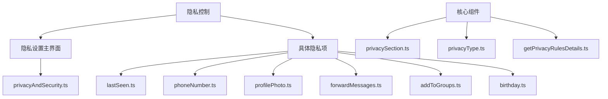
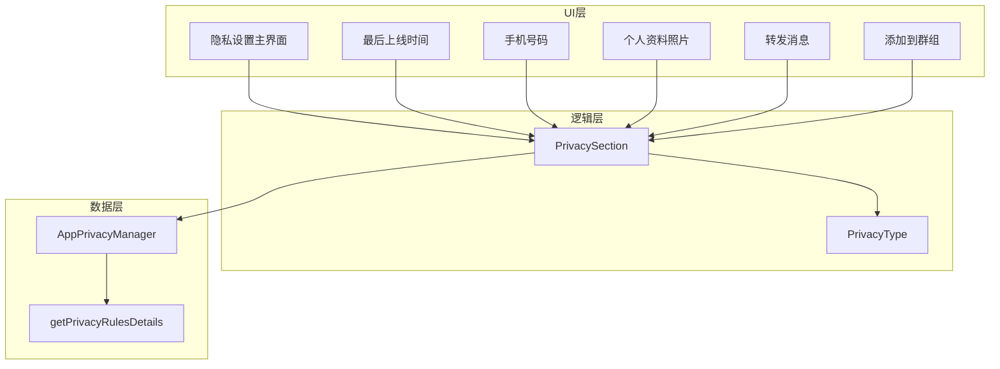
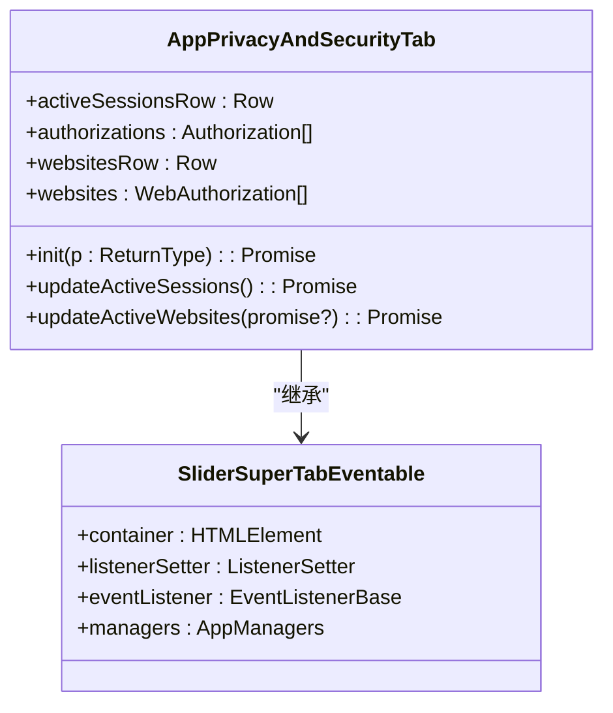
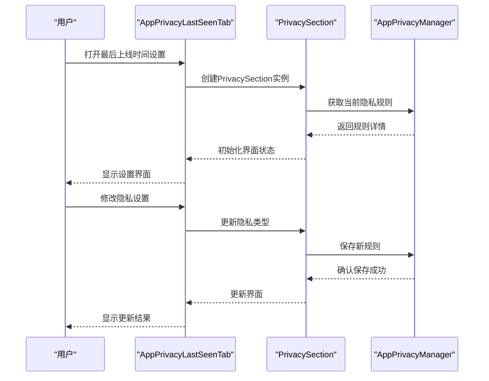
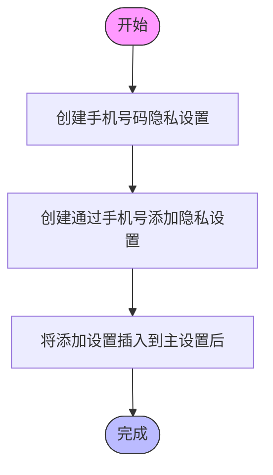
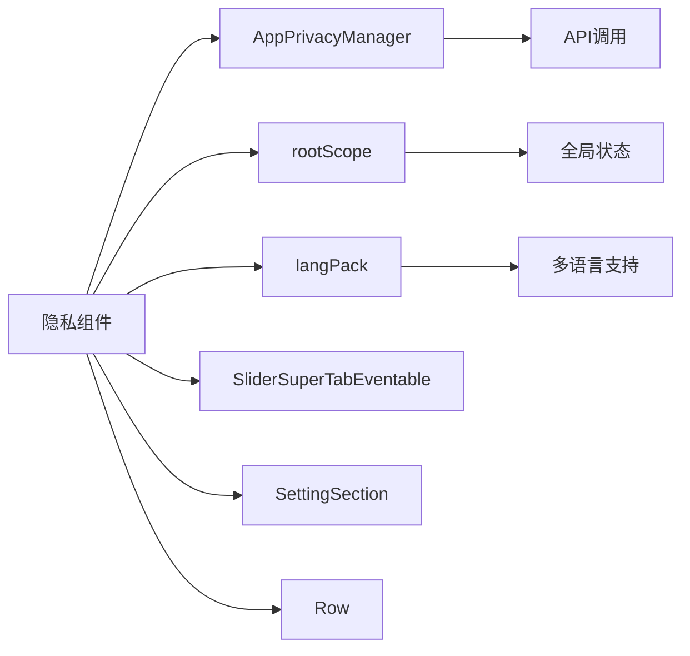

# 隐私控制

<cite>
**本文档引用的文件**  
- [privacyAndSecurity.ts](file://src/components/sidebarLeft/tabs/privacyAndSecurity.ts)
- [lastSeen.ts](file://src/components/sidebarLeft/tabs/privacy/lastSeen.ts)
- [phoneNumber.ts](file://src/components/sidebarLeft/tabs/privacy/phoneNumber.ts)
- [profilePhoto.ts](file://src/components/sidebarLeft/tabs/privacy/profilePhoto.ts)
- [forwardMessages.ts](file://src/components/sidebarLeft/tabs/privacy/forwardMessages.ts)
- [addToGroups.ts](file://src/components/sidebarLeft/tabs/privacy/addToGroups.ts)
- [privacySection.ts](file://src/components/privacySection.ts)
- [privacyType.ts](file://src/lib/appManagers/utils/privacy/privacyType.ts)
- [getPrivacyRulesDetails.ts](file://src/lib/appManagers/utils/privacy/getPrivacyRulesDetails.ts)
</cite>

## 目录
1. [简介](#简介)
2. [项目结构](#项目结构)
3. [核心组件](#核心组件)
4. [架构概述](#架构概述)
5. [详细组件分析](#详细组件分析)
6. [依赖分析](#依赖分析)
7. [性能考虑](#性能考虑)
8. [故障排除指南](#故障排除指南)
9. [结论](#结论)

## 简介
本文档全面记录了Telegram Web客户端中用户隐私设置的读取和修改接口。重点涵盖最后上线时间、手机号码、用户资料等可见性控制功能。文档详细描述了隐私规则的数据模型和存储结构，解释了不同隐私级别（公开、好友、私密等）的实现机制和权限判断逻辑。同时说明了隐私设置变更的通知机制和同步策略，并提供了隐私设置API的安全使用指南，包括权限验证和错误处理。

## 项目结构
隐私控制功能主要分布在`src/components/sidebarLeft/tabs/privacy`目录下，每个隐私设置项都有独立的组件文件。核心逻辑由`privacySection.ts`统一管理，通过`privacyType.ts`定义隐私级别枚举。



**图示来源**  
- [privacyAndSecurity.ts](file://src/components/sidebarLeft/tabs/privacyAndSecurity.ts)
- [lastSeen.ts](file://src/components/sidebarLeft/tabs/privacy/lastSeen.ts)
- [privacySection.ts](file://src/components/privacySection.ts)
- [privacyType.ts](file://src/lib/appManagers/utils/privacy/privacyType.ts)

**本节来源**  
- [src/components/sidebarLeft/tabs/privacyAndSecurity.ts](file://src/components/sidebarLeft/tabs/privacyAndSecurity.ts)
- [src/components/privacySection.ts](file://src/components/privacySection.ts)

## 核心组件
隐私控制系统的核心是`PrivacySection`类，它封装了所有隐私设置项的通用逻辑。该组件处理隐私级别的选择、例外列表管理以及设置保存。每个具体的隐私设置项（如最后上线时间、手机号码等）都继承自`SliderSuperTabEventable`并使用`PrivacySection`来构建用户界面。

**本节来源**  
- [privacySection.ts](file://src/components/privacySection.ts)
- [lastSeen.ts](file://src/components/sidebarLeft/tabs/privacy/lastSeen.ts)
- [phoneNumber.ts](file://src/components/sidebarLeft/tabs/privacy/phoneNumber.ts)

## 架构概述
隐私控制系统的架构采用分层设计，上层为UI组件，中层为逻辑控制器，底层为数据管理器。UI组件负责展示和收集用户输入，逻辑控制器处理业务规则，数据管理器与后端API交互。



**图示来源**  
- [privacySection.ts](file://src/components/privacySection.ts)
- [privacyType.ts](file://src/lib/appManagers/utils/privacy/privacyType.ts)
- [getPrivacyRulesDetails.ts](file://src/lib/appManagers/utils/privacy/getPrivacyRulesDetails.ts)

## 详细组件分析

### 隐私设置主界面分析
`AppPrivacyAndSecurityTab`是隐私设置的主界面组件，它整合了所有隐私相关的设置项。该组件通过`init`方法初始化各个隐私设置行，并根据用户的Premium状态动态显示或隐藏某些功能。



**图示来源**  
- [privacyAndSecurity.ts](file://src/components/sidebarLeft/tabs/privacyAndSecurity.ts)

**本节来源**  
- [privacyAndSecurity.ts](file://src/components/sidebarLeft/tabs/privacyAndSecurity.ts)

### 最后上线时间隐私分析
`AppPrivacyLastSeenTab`组件专门处理最后上线时间的隐私设置。除了基本的隐私级别选择外，还提供了"隐藏已读时间"的额外选项，该选项的可用性取决于用户选择的隐私级别。



**图示来源**  
- [lastSeen.ts](file://src/components/sidebarLeft/tabs/privacy/lastSeen.ts)
- [privacySection.ts](file://src/components/privacySection.ts)

**本节来源**  
- [lastSeen.ts](file://src/components/sidebarLeft/tabs/privacy/lastSeen.ts)

### 手机号码隐私分析
`AppPrivacyPhoneNumberTab`组件处理手机号码的隐私设置。与其他隐私项不同，它提供了两个相关的隐私设置：手机号码可见性和通过手机号码添加好友的权限。



**图示来源**  
- [phoneNumber.ts](file://src/components/sidebarLeft/tabs/privacy/phoneNumber.ts)

**本节来源**  
- [phoneNumber.ts](file://src/components/sidebarLeft/tabs/privacy/phoneNumber.ts)

### 隐私级别类型分析
`PrivacyType`枚举定义了系统中使用的三种基本隐私级别：公开（Everybody）、好友（Contacts）和私密（Nobody）。这些类型被所有隐私设置项共享使用。

```mermaid
classDiagram
class PrivacyType {
+Everybody = 2
+Contacts = 1
+Nobody = 0
}
note right of PrivacyType
隐私级别枚举
用于所有隐私设置项
end note
```

**图示来源**  
- [privacyType.ts](file://src/lib/appManagers/utils/privacy/privacyType.ts)

**本节来源**  
- [privacyType.ts](file://src/lib/appManagers/utils/privacy/privacyType.ts)

## 依赖分析
隐私控制系统依赖于多个核心组件和管理器。主要依赖关系包括：



**图示来源**  
- [privacySection.ts](file://src/components/privacySection.ts)
- [privacyAndSecurity.ts](file://src/components/sidebarLeft/tabs/privacyAndSecurity.ts)

**本节来源**  
- [privacySection.ts](file://src/components/privacySection.ts)
- [privacyAndSecurity.ts](file://src/components/sidebarLeft/tabs/privacyAndSecurity.ts)

## 性能考虑
隐私控制系统在性能方面做了以下优化：
- 使用Promise.all()批量处理异步操作
- 通过listenerSetter管理事件监听器，避免内存泄漏
- 在组件销毁时及时清理异步操作
- 缓存隐私规则详情，减少重复计算

## 故障排除指南
常见问题及解决方案：

1. **隐私设置无法保存**
   - 检查网络连接状态
   - 确认用户已登录
   - 查看浏览器控制台是否有错误信息

2. **隐私级别显示不正确**
   - 刷新页面重新加载设置
   - 检查是否与其他设置存在冲突

3. **Premium功能无法使用**
   - 确认用户已订阅Premium服务
   - 检查账户状态是否正常

**本节来源**  
- [privacySection.ts](file://src/components/privacySection.ts)
- [privacyAndSecurity.ts](file://src/components/sidebarLeft/tabs/privacyAndSecurity.ts)

## 结论
Telegram Web客户端的隐私控制系统设计合理，采用模块化架构，将通用逻辑与具体实现分离。通过`PrivacySection`组件统一管理所有隐私设置项，确保了一致的用户体验。系统支持多种隐私级别和例外列表，满足了用户对隐私保护的多样化需求。整体代码结构清晰，易于维护和扩展。