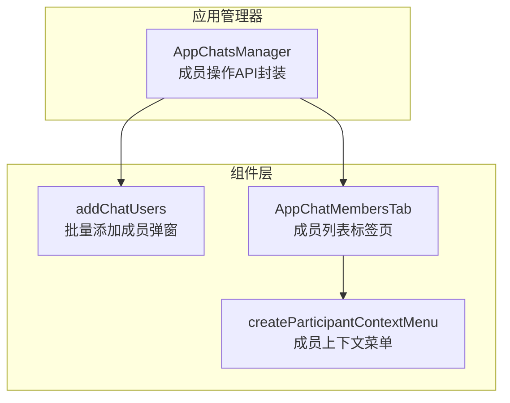
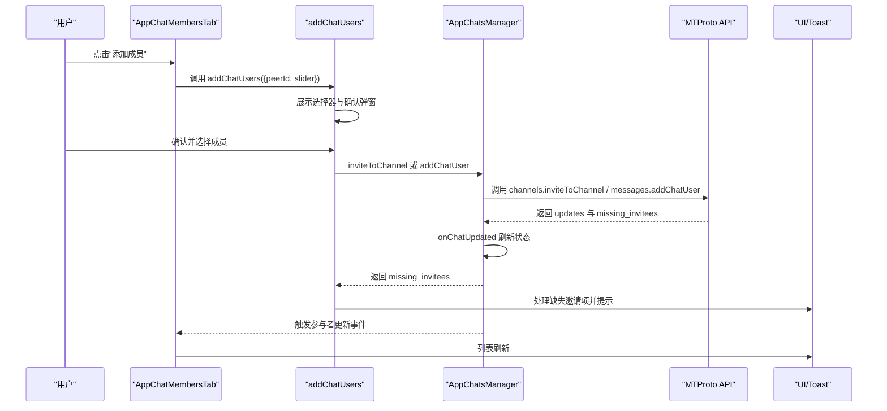
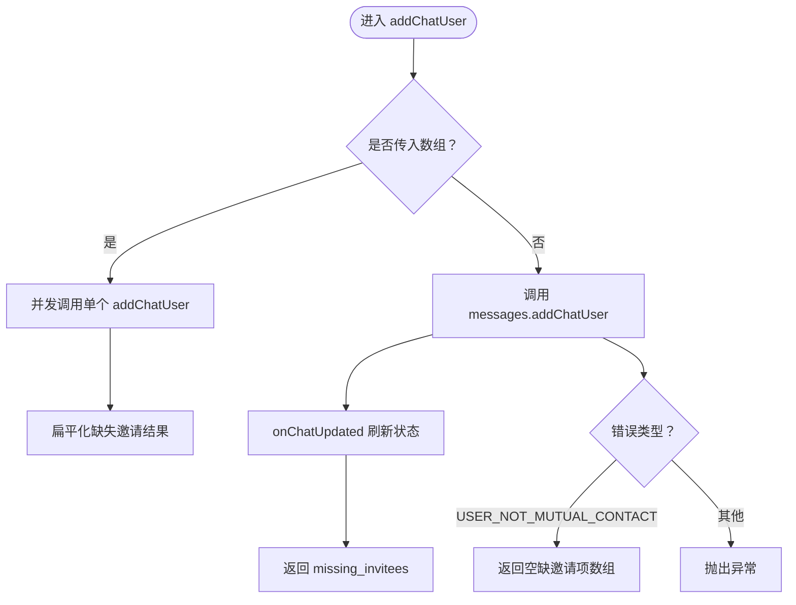
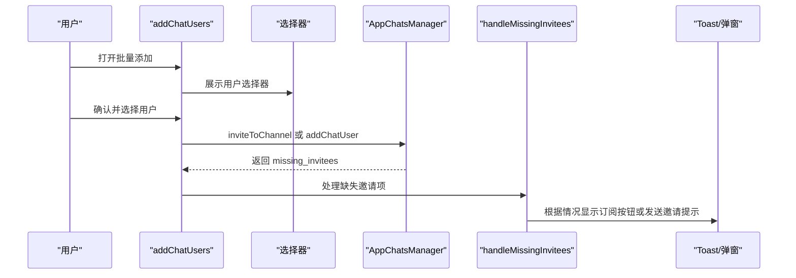
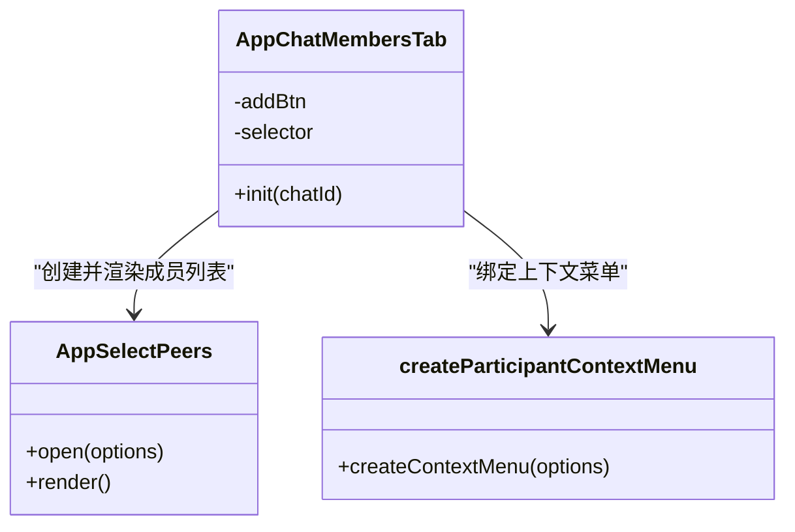
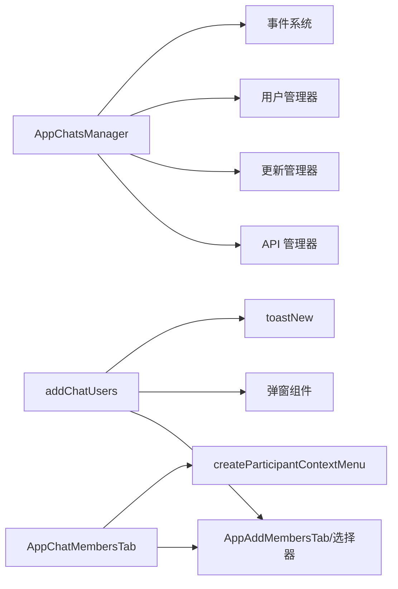

# 成员操作

<cite>
**本文引用的文件**
- [appChatsManager.ts](file://src/lib/appManagers/appChatsManager.ts)
- [addChatUsers.ts](file://src/components/addChatUsers.ts)
- [chatMembers.ts](file://src/components/sidebarRight/tabs/chatMembers.ts)
- [createParticipantContextMenu.ts](file://src/helpers/dom/createParticipantContextMenu.ts)
</cite>

## 目录
1. [简介](#简介)
2. [项目结构](#项目结构)
3. [核心组件](#核心组件)
4. [架构总览](#架构总览)
5. [详细组件分析](#详细组件分析)
6. [依赖关系分析](#依赖关系分析)
7. [性能考量](#性能考量)
8. [故障排查指南](#故障排查指南)
9. [结论](#结论)

## 简介
本文件聚焦于“成员操作”能力，围绕以下目标展开：
- 深入解析 appChatsManager 中 addChatUser、kickFromChat（对应“移除成员”的高层封装）等方法的实现与调用流程
- 解释通过 addChatUsers 组件实现的“批量添加成员”界面逻辑
- 说明 chatMembers 标签页中的成员列表展示机制与上下文菜单交互
- 提供通过 API 添加单个/多个成员以及移除成员的实际调用路径与错误处理、用户反馈方式

## 项目结构
与成员操作直接相关的模块分布如下：
- 应用管理器：负责与后端 API 交互、状态更新与事件分发
- 组件层：负责用户界面交互与提示反馈
- 帮助器：负责上下文菜单等通用交互逻辑

图表来源
- [appChatsManager.ts](file://src/lib/appManagers/appChatsManager.ts#L439-L537)
- [addChatUsers.ts](file://src/components/addChatUsers.ts#L142-L238)
- [chatMembers.ts](file://src/components/sidebarRight/tabs/chatMembers.ts#L40-L121)
- [createParticipantContextMenu.ts](file://src/helpers/dom/createParticipantContextMenu.ts#L19-L139)

章节来源
- [appChatsManager.ts](file://src/lib/appManagers/appChatsManager.ts#L439-L537)
- [addChatUsers.ts](file://src/components/addChatUsers.ts#L142-L238)
- [chatMembers.ts](file://src/components/sidebarRight/tabs/chatMembers.ts#L40-L121)
- [createParticipantContextMenu.ts](file://src/helpers/dom/createParticipantContextMenu.ts#L19-L139)

## 核心组件
- AppChatsManager：封装消息与频道 API，提供 addChatUser、inviteToChannel、kickFromChat、leaveChat 等成员操作方法，并在成功时触发 onChatUpdated 以刷新本地状态与 UI。
- addChatUsers：用于选择用户并发起批量邀请，支持转发消息选项、隐私限制提示与缺失邀请结果处理。
- AppChatMembersTab：成员列表标签页，提供“添加成员”入口、成员列表渲染、隐藏成员开关与上下文菜单。
- createParticipantContextMenu：为成员列表项生成上下文菜单，包含“设为管理员”“踢出群组/频道”“解除封禁”等操作。

章节来源
- [appChatsManager.ts](file://src/lib/appManagers/appChatsManager.ts#L439-L537)
- [addChatUsers.ts](file://src/components/addChatUsers.ts#L142-L238)
- [chatMembers.ts](file://src/components/sidebarRight/tabs/chatMembers.ts#L40-L121)
- [createParticipantContextMenu.ts](file://src/helpers/dom/createParticipantContextMenu.ts#L19-L139)

## 架构总览
成员操作的整体调用链路如下：
- 用户在 chatMembers 标签页点击“添加成员”，触发 addChatUsers 弹窗
- 用户在弹窗中选择成员并确认，根据是否为频道/广播号决定调用 inviteToChannel 或 addChatUser
- 成功后返回 missing_invitees，addChatUsers 处理缺失邀请项（如需订阅 Premium 才能私聊）
- AppChatsManager 在 API 成功后调用 onChatUpdated，触发本地状态更新与 UI 刷新
- 成员列表标签页通过 AppSelectPeers 渲染成员，上下文菜单提供权限变更与踢人等操作

图表来源
- [chatMembers.ts](file://src/components/sidebarRight/tabs/chatMembers.ts#L40-L121)
- [addChatUsers.ts](file://src/components/addChatUsers.ts#L142-L238)
- [appChatsManager.ts](file://src/lib/appManagers/appChatsManager.ts#L439-L537)

## 详细组件分析

### AppChatsManager 成员操作方法
- addChatUser
  - 支持单个与批量调用；批量时并发执行并合并缺失邀请结果
  - 对 USER_NOT_MUTUAL_CONTACT 错误进行特殊处理，返回空缺邀请项数组，避免抛错中断
  - 成功后调用 onChatUpdated，确保本地状态与 UI 同步
- inviteToChannel
  - 针对频道/广播号的批量邀请，生成若干 updateChannelParticipant 本地更新，随后调用 onChatUpdatedForce
- kickFromChat
  - 非频道场景下委托 deleteChatUser；频道场景下调用 ban 权限变更
- deleteChatUser
  - 移除群组成员，成功后触发 onChatUpdated
- leaveChat / leave
  - 离开群组或频道，内部统一走 deleteChatUser 或 leaveChannel

图表来源
- [appChatsManager.ts](file://src/lib/appManagers/appChatsManager.ts#L511-L537)

章节来源
- [appChatsManager.ts](file://src/lib/appManagers/appChatsManager.ts#L439-L537)

### addChatUsers 批量添加成员界面逻辑
- 选择器与确认弹窗
  - 使用 AppAddMembersTab 打开用户选择器，支持多选
  - 根据是否为频道/广播号动态生成标题、描述文案与复选框（转发消息）
- 错误处理与缺失邀请处理
  - 对 USER_PRIVACY_RESTRICTED 进行 toast 提示
  - 将 missing_invitees 交由 handleMissingInvitees 处理，区分 Premium 需求与可使用 Premium 邀请的情况
- 用户反馈
  - 当全部成员需要 Premium 才能私聊时，引导用户前往订阅 Premium
  - 发送邀请链接时通过 toast 提示已发送数量

图表来源
- [addChatUsers.ts](file://src/components/addChatUsers.ts#L142-L238)

章节来源
- [addChatUsers.ts](file://src/components/addChatUsers.ts#L142-L238)

### chatMembers 标签页中的成员列表展示机制
- 初始化
  - 获取聊天信息、判断是否为广播号、加载频道完整信息
  - 创建“添加成员”按钮，点击后调用 addChatUsers
- 成员列表
  - 使用 AppSelectPeers 渲染成员列表，支持搜索与过滤
  - 可根据配置与权限显示“隐藏成员”开关
- 上下文菜单
  - 通过 createParticipantContextMenu 为每个成员项生成菜单，包含“设为管理员”“踢出群组/频道”“解除封禁”等操作
  - 菜单按钮根据当前成员状态与权限动态启用/禁用

图表来源
- [chatMembers.ts](file://src/components/sidebarRight/tabs/chatMembers.ts#L40-L121)
- [createParticipantContextMenu.ts](file://src/helpers/dom/createParticipantContextMenu.ts#L19-L139)

章节来源
- [chatMembers.ts](file://src/components/sidebarRight/tabs/chatMembers.ts#L40-L121)
- [createParticipantContextMenu.ts](file://src/helpers/dom/createParticipantContextMenu.ts#L19-L139)

### 成员上下文菜单与权限控制
- 菜单按钮包括：发送消息、添加到频道/群组、设为管理员、编辑管理员权限、踢出群组/频道、删除（解除封禁）
- 按钮启用条件基于：
  - 当前聊天类型（广播号/普通群组/频道）
  - 当前用户对目标成员的权限（是否可变更权限、是否可踢人）
  - 目标成员当前状态（是否被封禁、是否为管理员、是否为创建者等）

章节来源
- [createParticipantContextMenu.ts](file://src/helpers/dom/createParticipantContextMenu.ts#L19-L139)

## 依赖关系分析
- AppChatsManager 依赖：
  - API 管理器：invokeApi / invokeApiSingleProcess
  - 更新管理器：processUpdateMessage / processLocalUpdate
  - 用户管理器：getUserInput / getSelf
  - 存储与事件：dispatchEvent('chat_participant'/'invalidate_participants'/...)
- addChatUsers 依赖：
  - AppAddMembersTab 选择器
  - PopupPeer / PopupPickUser 弹窗组件
  - toastNew 提示
- chatMembers 依赖：
  - AppSelectPeers 成员选择器
  - createParticipantContextMenu 成员上下文菜单
  - AppProfileManager 获取频道完整信息

图表来源
- [appChatsManager.ts](file://src/lib/appManagers/appChatsManager.ts#L439-L537)
- [addChatUsers.ts](file://src/components/addChatUsers.ts#L142-L238)
- [chatMembers.ts](file://src/components/sidebarRight/tabs/chatMembers.ts#L40-L121)

章节来源
- [appChatsManager.ts](file://src/lib/appManagers/appChatsManager.ts#L439-L537)
- [addChatUsers.ts](file://src/components/addChatUsers.ts#L142-L238)
- [chatMembers.ts](file://src/components/sidebarRight/tabs/chatMembers.ts#L40-L121)

## 性能考量
- 并发邀请：addChatUser 对数组参数采用并发调用，减少总等待时间
- 本地更新：inviteToChannel 会先生成若干 updateChannelParticipant 本地更新，再统一刷新，提升交互流畅度
- 列表懒加载：成员列表通过 AppSelectPeers 渲染，结合中间件与延迟加载策略，避免一次性渲染大量节点
- 缺失邀请处理：仅在必要时弹窗引导用户订阅 Premium，减少无效交互

## 故障排查指南
- 添加成员失败
  - USER_PRIVACY_RESTRICTED：弹出提示，建议检查对方隐私设置
  - USER_NOT_MUTUAL_CONTACT：视为“缺失邀请项”，返回空缺邀请数组，不中断流程
- 踢人失败
  - 检查当前用户权限是否具备 change_permissions
  - 确认目标成员不是创建者或自身，且状态允许踢出
- 列表不刷新
  - 确认 onChatUpdated 是否被调用（频道场景可能触发 invalidate_participants 事件）
  - 检查 AppSelectPeers 的中间件是否仍在有效期内

章节来源
- [addChatUsers.ts](file://src/components/addChatUsers.ts#L209-L217)
- [appChatsManager.ts](file://src/lib/appManagers/appChatsManager.ts#L511-L537)
- [createParticipantContextMenu.ts](file://src/helpers/dom/createParticipantContextMenu.ts#L19-L139)

## 结论
- 成员操作在 AppChatsManager 中以统一 API 封装，兼顾频道与群组差异
- addChatUsers 提供直观的批量添加体验，并妥善处理隐私与 Premium 相关限制
- chatMembers 标签页与上下文菜单共同构成完整的成员管理界面，权限与状态控制清晰
- 错误处理与用户反馈贯穿全流程，保证用户体验与可恢复性