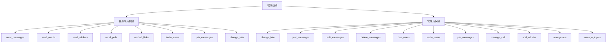
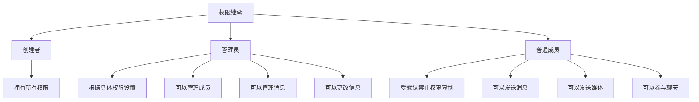
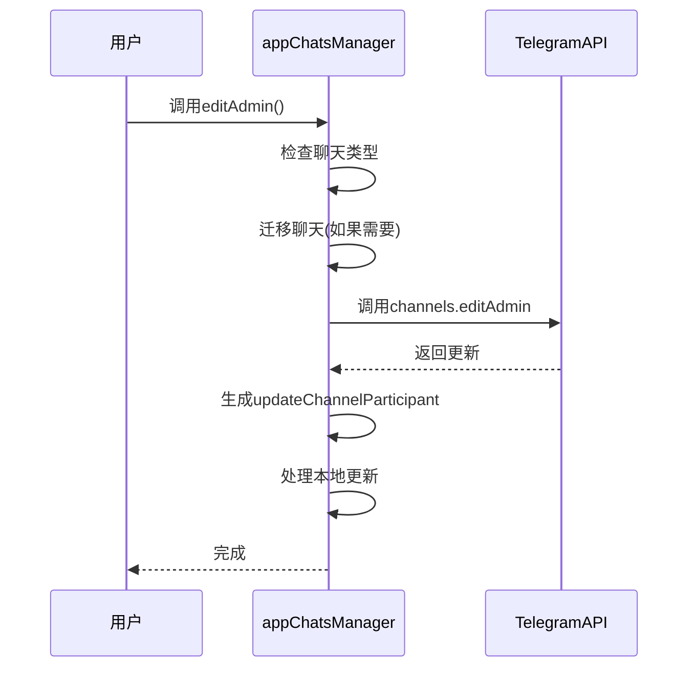
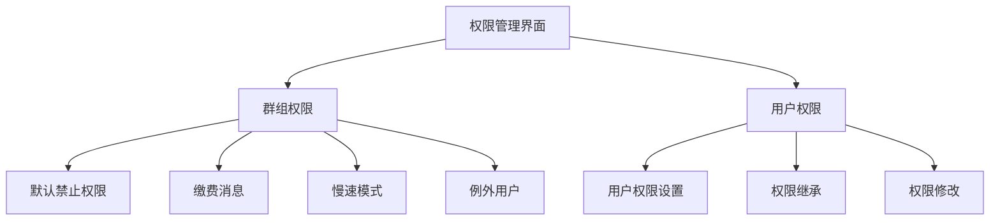
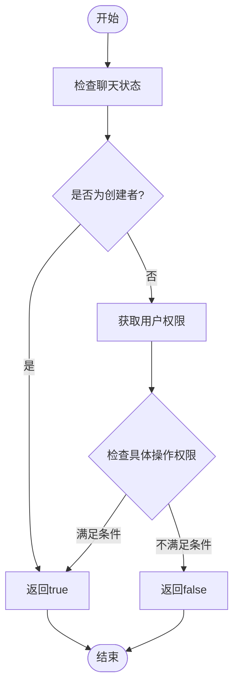
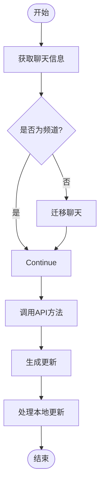

# 成员权限

<cite>
**本文档引用的文件**   
- [appChatsManager.ts](file://src/lib/appManagers/appChatsManager.ts)
- [hasRights.ts](file://src/lib/appManagers/utils/chats/hasRights.ts)
- [groupPermissions/index.ts](file://src/components/sidebarRight/tabs/groupPermissions/index.ts)
- [userPermissions.ts](file://src/components/sidebarRight/tabs/userPermissions.ts)
- [layer.d.ts](file://src/layer.d.ts)
</cite>

## 目录
1. [简介](#简介)
2. [权限级别定义](#权限级别定义)
3. [权限继承机制](#权限继承机制)
4. [管理员任命与权限修改流程](#管理员任命与权限修改流程)
5. [界面实现](#界面实现)
6. [权限检查与设置示例](#权限检查与设置示例)

## 简介
本文档详细记录了Telegram Web客户端中成员权限管理的实现机制。重点分析了管理员权限和普通成员权限的实现方式，深入探讨了`appChatsManager`中与权限管理相关的方法，以及`utils/chats`中权限判断工具函数的实现。文档还解释了权限级别的定义和权限继承机制，描述了管理员任命、权限修改的流程和界面实现，并提供了实际使用示例。

**Section sources**
- [appChatsManager.ts](file://src/lib/appManagers/appChatsManager.ts#L1-L1103)
- [hasRights.ts](file://src/lib/appManagers/utils/chats/hasRights.ts#L1-L166)

## 权限级别定义
在Telegram Web客户端中，权限级别通过`ChatRights`类型定义，涵盖了聊天中的各种操作权限。这些权限分为普通成员权限和管理员权限两大类。

### 普通成员权限
普通成员权限主要包括发送消息、媒体、表情等基本操作权限：
- `send_messages`：发送消息
- `send_media`：发送媒体
- `send_stickers`：发送表情
- `send_polls`：发送投票
- `embed_links`：嵌入链接
- `invite_users`：邀请用户
- `pin_messages`：置顶消息
- `change_info`：更改信息

### 管理员权限
管理员权限包括管理聊天、管理成员、管理消息等高级操作权限：
- `change_info`：更改聊天信息
- `post_messages`：发布消息（频道）
- `edit_messages`：编辑消息
- `delete_messages`：删除消息
- `ban_users`：封禁用户
- `invite_users`：邀请用户
- `pin_messages`：置顶消息
- `manage_call`：管理语音通话
- `add_admins`：添加管理员
- `anonymous`：匿名发布
- `manage_topics`：管理话题（论坛）

**Diagram sources **
- [layer.d.ts](file://src/layer.d.ts#L669-L753)
- [appChatsManager.ts](file://src/lib/appManagers/appChatsManager.ts#L29-L32)

## 权限继承机制
权限继承机制通过`hasRights`函数实现，该函数根据用户在聊天中的角色和权限设置来判断其是否具有执行特定操作的权限。

### 权限判断逻辑
`hasRights`函数的权限判断逻辑如下：
1. 首先检查聊天状态，如聊天是否被禁用
2. 判断是否为创建者，创建者通常拥有所有权限
3. 检查用户是否被禁止访问聊天
4. 根据用户权限类型（管理员或被禁止用户）进行具体权限判断

### 权限继承规则

**Diagram sources **
- [hasRights.ts](file://src/lib/appManagers/utils/chats/hasRights.ts#L18-L165)
- [appChatsManager.ts](file://src/lib/appManagers/appChatsManager.ts#L263-L265)

## 管理员任命与权限修改流程
管理员任命和权限修改是成员权限管理的核心功能，通过`appChatsManager`中的方法实现。

### 管理员任命流程
管理员任命通过`editAdmin`方法实现，流程如下：
1. 检查当前聊天是否为频道，如果是普通群组则先迁移
2. 调用`channels.editAdmin` API方法
3. 生成并处理`updateChannelParticipant`更新
4. 更新本地聊天信息

### 权限修改流程
权限修改通过`editBanned`方法实现，流程如下：
1. 检查当前聊天是否为频道，如果不是则迁移
2. 调用`channels.editBanned` API方法
3. 生成并处理`updateChannelParticipant`更新
4. 更新本地聊天信息

**Diagram sources **
- [appChatsManager.ts](file://src/lib/appManagers/appChatsManager.ts#L594-L634)
- [appChatsManager.ts](file://src/lib/appManagers/appChatsManager.ts#L714-L749)

## 界面实现
权限管理的界面实现主要在`groupPermissions`和`userPermissions`组件中完成。

### 群组权限界面
群组权限界面通过`AppGroupPermissionsTab`类实现，包含以下主要功能：
- 默认禁止权限设置
- 缴费消息设置
- 慢速模式设置
- 例外用户管理

### 用户权限界面
用户权限界面通过`AppUserPermissionsTab`类实现，用于管理特定用户的权限：
- 显示用户当前权限
- 允许修改用户权限
- 支持权限继承机制

**Diagram sources **
- [groupPermissions/index.ts](file://src/components/sidebarRight/tabs/groupPermissions/index.ts#L302-L717)
- [userPermissions.ts](file://src/components/sidebarRight/tabs/userPermissions.ts#L1-L200)

## 权限检查与设置示例
以下是一些实际使用示例，展示如何检查用户权限或修改成员权限设置。

### 检查用户权限

### 修改成员权限

**Diagram sources **
- [hasRights.ts](file://src/lib/appManagers/utils/chats/hasRights.ts#L18-L165)
- [appChatsManager.ts](file://src/lib/appManagers/appChatsManager.ts#L594-L634)