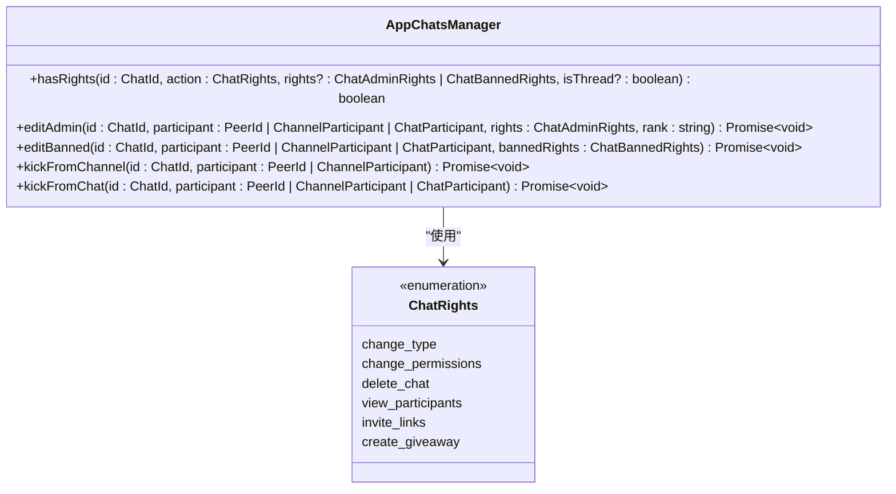
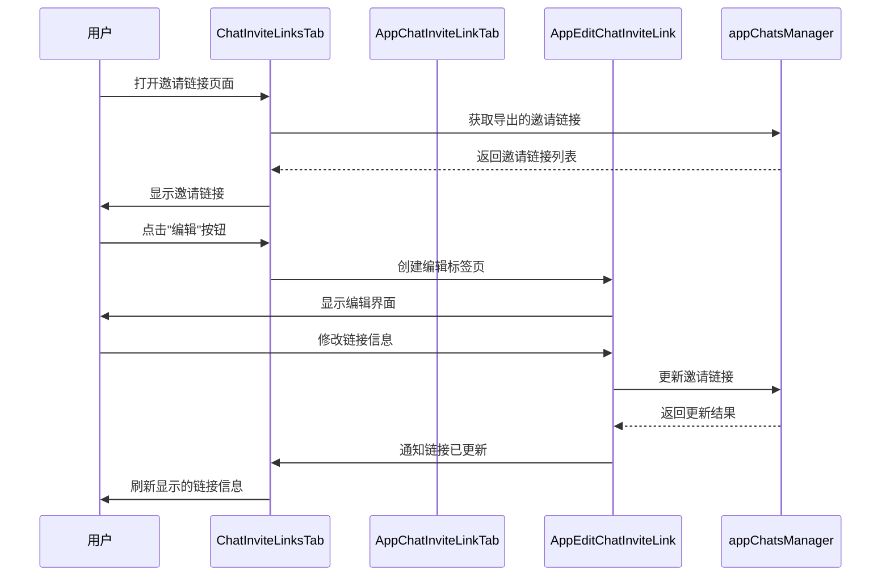
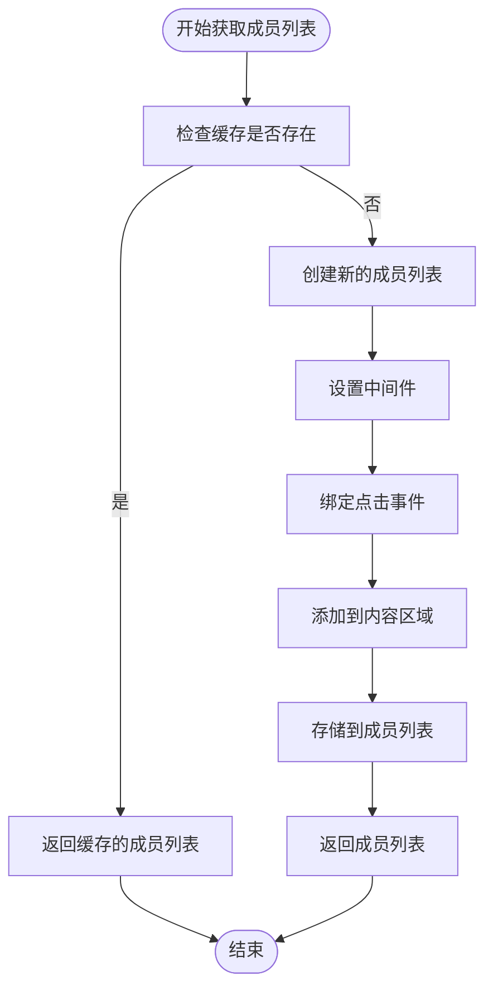
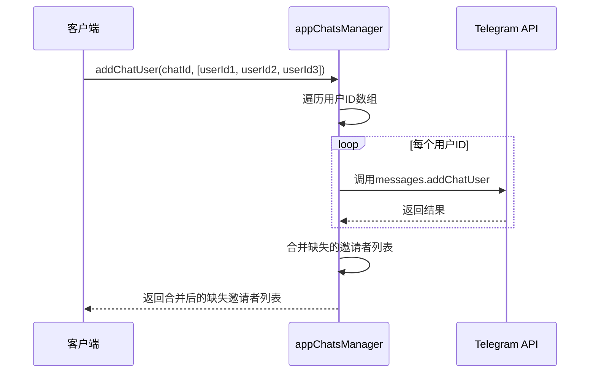
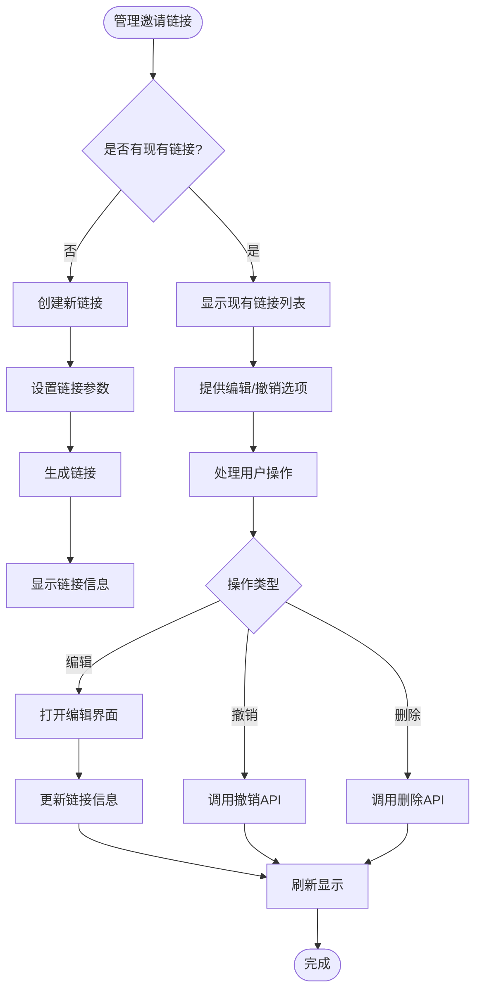

# 成员管理

<cite>
**本文档引用的文件**  
- [appChatsManager.ts](file://src/lib/appManagers/appChatsManager.ts)
- [addChatUsers.ts](file://src/components/addChatUsers.ts)
- [chatInviteLinks.ts](file://src/components/sidebarRight/tabs/chatInviteLinks.ts)
- [appSearchSuper.ts](file://src/components/appSearchSuper.ts)
</cite>

## 目录
1. [简介](#简介)
2. [核心组件](#核心组件)
3. [成员权限模型](#成员权限模型)
4. [邀请链接管理](#邀请链接管理)
5. [成员列表获取与缓存](#成员列表获取与缓存)
6. [API使用示例](#api使用示例)
7. [结论](#结论)

## 简介
本文档详细记录了Telegram Web客户端中成员管理功能的实现细节，涵盖添加成员、移除成员、邀请链接管理等核心API的实现机制。重点分析了`appChatsManager`中与成员管理相关的方法，如`addChatMember`、`kickChatMember`等，并深入探讨了成员权限模型、邀请链接的生成与使用机制，以及成员列表的获取和缓存策略。

## 核心组件

`appChatsManager`是成员管理功能的核心管理器，负责处理所有与聊天相关的操作，包括成员的添加、移除和权限管理。该类通过调用Telegram MTProto API实现与服务器的通信，并通过事件系统通知UI层更新状态。

`addChatUsers`组件提供了用户界面层的成员添加功能，允许用户通过弹窗选择并添加成员到聊天中。该组件与`appChatsManager`协同工作，处理用户交互和错误反馈。

**Section sources**
- [appChatsManager.ts](file://src/lib/appManagers/appChatsManager.ts#L57-L1102)
- [addChatUsers.ts](file://src/components/addChatUsers.ts#L1-L238)

## 成员权限模型

成员权限模型基于Telegram的权限系统实现，区分了管理员和普通成员的不同权限。在`appChatsManager`中，权限检查通过`hasRights`方法实现，该方法根据聊天类型和用户角色判断用户是否具有执行特定操作的权限。

**Diagram sources**
- [appChatsManager.ts](file://src/lib/appManagers/appChatsManager.ts#L263-L778)

管理员权限通过`editAdmin`方法设置，可以授予用户管理聊天的特定权限，如更改聊天信息、删除消息、添加成员等。普通成员的权限则通过`editBanned`方法管理，可以限制其发送消息、查看成员列表等操作。

当用户被踢出聊天时，系统会调用`kickFromChannel`或`kickFromChat`方法，根据聊天类型执行相应的移除操作。这些操作会触发更新事件，通知客户端更新UI状态。

**Section sources**
- [appChatsManager.ts](file://src/lib/appManagers/appChatsManager.ts#L594-L778)

## 邀请链接管理

邀请链接管理功能允许创建、编辑和撤销邀请链接，为用户提供便捷的成员邀请方式。`chatInviteLinks`组件实现了邀请链接的UI管理，包括链接的显示、复制、分享和编辑功能。

**Diagram sources**
- [chatInviteLinks.ts](file://src/components/sidebarRight/tabs/chatInviteLinks.ts#L1-L666)

邀请链接的状态通过`isActiveInvite`函数判断，考虑了链接是否被撤销、是否过期以及使用次数限制等因素。用户界面会根据链接状态显示不同的操作按钮，如"复制链接"、"分享链接"或"重新激活"。

**Section sources**
- [chatInviteLinks.ts](file://src/components/sidebarRight/tabs/chatInviteLinks.ts#L38-L103)

## 成员列表获取与缓存

成员列表的获取和缓存策略通过`appSearchSuper`组件实现，该组件负责管理搜索和成员列表的显示。成员列表使用`SortedUserList`进行排序和管理，并通过中间件机制确保数据的一致性。

**Diagram sources**
- [appSearchSuper.ts](file://src/components/appSearchSuper.ts#L431-L433)

系统通过`membersList`、`membersParticipantMap`和`membersMiddlewareHelper`三个属性管理成员列表的状态。当需要显示成员列表时，系统会检查是否存在缓存，如果不存在则创建新的列表实例并进行初始化。

**Section sources**
- [appSearchSuper.ts](file://src/components/appSearchSuper.ts#L431-L433)

## API使用示例

### 批量添加成员
通过`addChatUser`方法可以批量添加成员到聊天中。该方法接受用户ID数组作为参数，并返回一个Promise，解析为缺失的邀请者列表。

**Diagram sources**
- [appChatsManager.ts](file://src/lib/appManagers/appChatsManager.ts#L512-L538)

### 管理邀请链接
管理邀请链接涉及创建、编辑和撤销操作。通过`chatInviteLinks`组件提供的界面，用户可以轻松管理聊天的邀请链接。

**Diagram sources**
- [chatInviteLinks.ts](file://src/components/sidebarRight/tabs/chatInviteLinks.ts#L105-L200)

## 结论
Telegram Web客户端的成员管理功能通过`appChatsManager`、`addChatUsers`和`chatInviteLinks`等组件协同工作，实现了完整的成员管理解决方案。系统采用了清晰的权限模型，支持灵活的邀请链接管理，并通过有效的缓存策略优化了成员列表的获取性能。这些设计确保了成员管理功能的高效性和用户体验的流畅性。