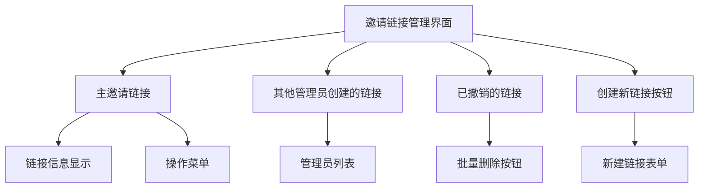
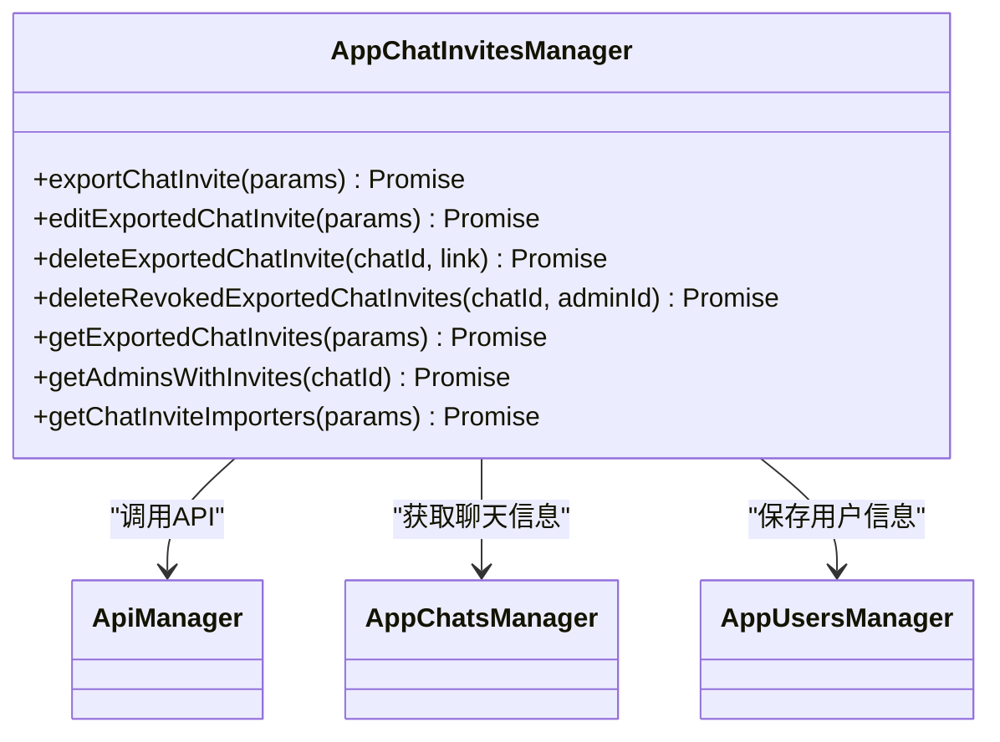
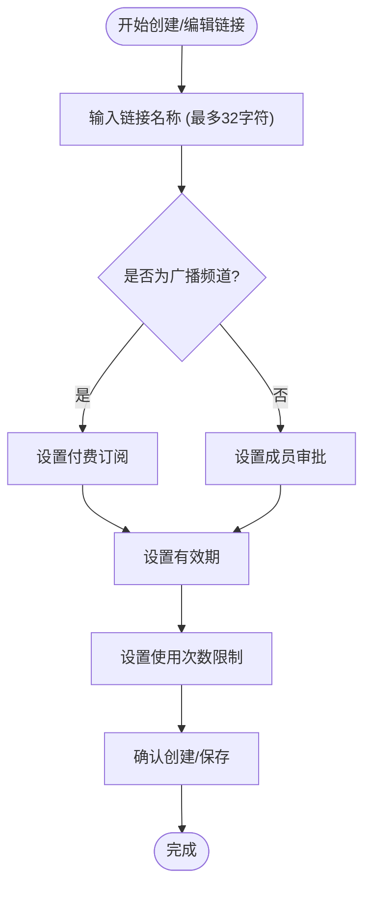
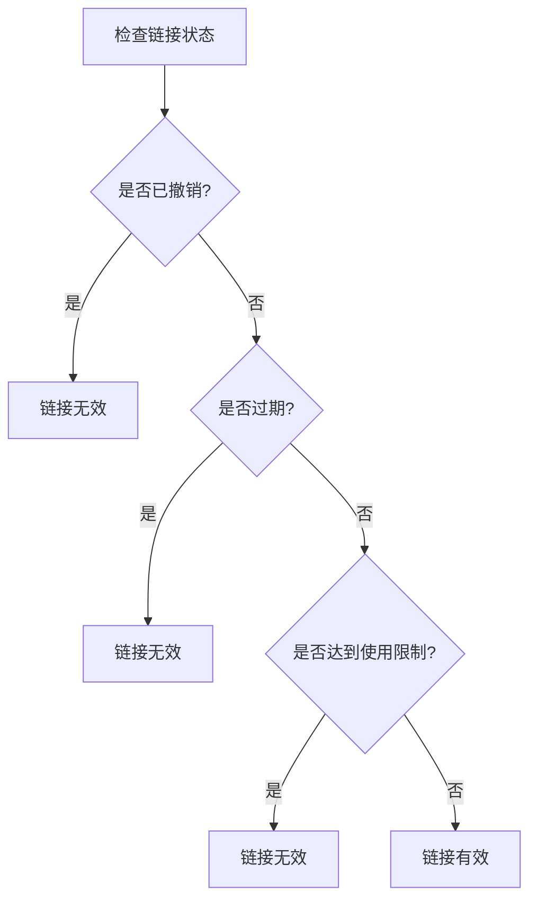
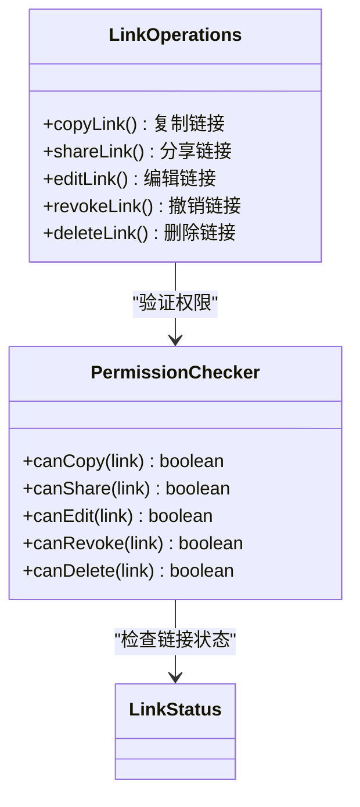
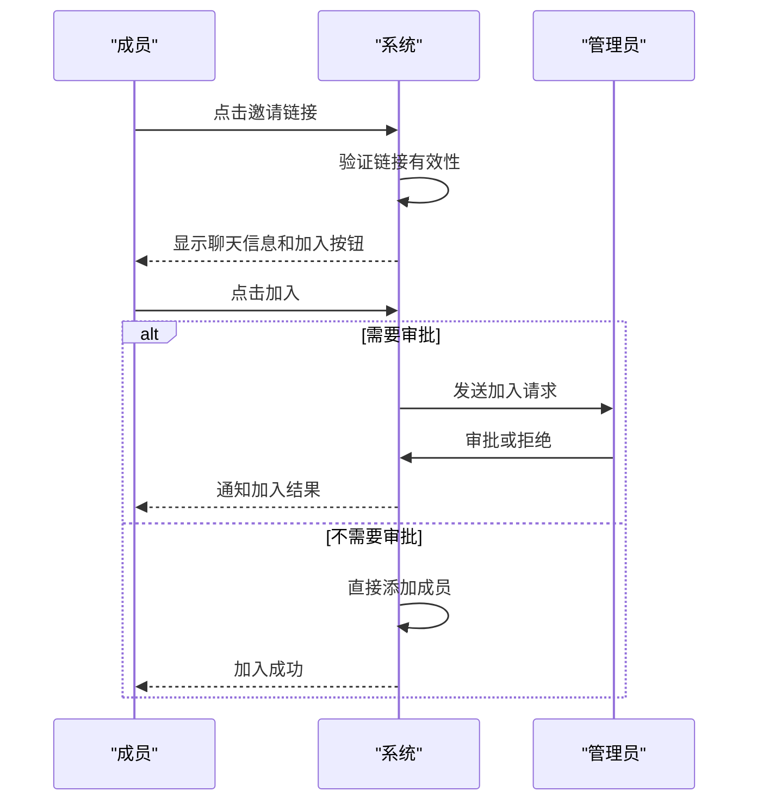
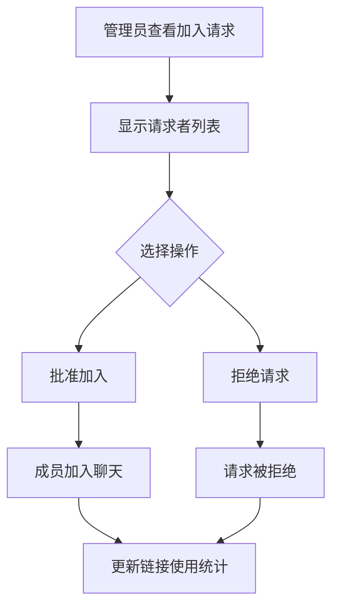
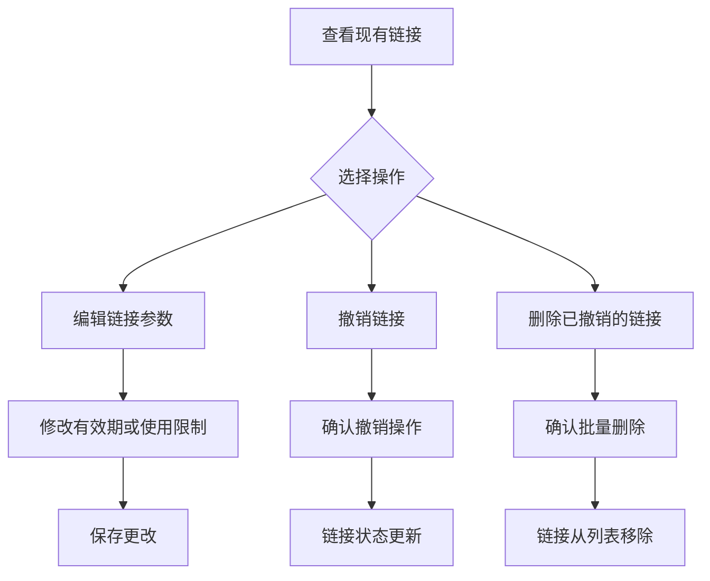

# 邀请链接

<cite>
**本文档引用的文件**   
- [chatInviteLinks.ts](file://src/components/sidebarRight/tabs/chatInviteLinks.ts)
- [appChatInvitesManager.ts](file://src/lib/appManagers/appChatInvitesManager.ts)
- [editChatInviteLink.ts](file://src/components/sidebarRight/tabs/editChatInviteLink.ts)
- [chatInviteLink.ts](file://src/components/sidebarRight/tabs/chatInviteLink.ts)
- [sharedFolder.ts](file://src/components/sidebarLeft/tabs/sharedFolder.ts)
- [lang.ts](file://src/lang.ts)
- [layer.d.ts](file://src/layer.d.ts)
</cite>

## 目录
1. [简介](#简介)
2. [邀请链接管理界面](#邀请链接管理界面)
3. [核心功能实现](#核心功能实现)
4. [邀请链接安全机制](#邀请链接安全机制)
5. [成员加入流程](#成员加入流程)
6. [使用示例](#使用示例)

## 简介

邀请链接功能允许群组或频道管理员创建可分享的链接，让新成员通过链接加入聊天。该功能提供了完整的链接生命周期管理，包括创建、编辑、撤销和删除。管理员可以为邀请链接设置有效期、使用次数限制、审批机制和付费订阅等高级选项。本文档详细分析了邀请链接功能的实现机制和用户界面逻辑。

## 邀请链接管理界面

邀请链接管理界面提供了对所有邀请链接的集中管理功能。界面主要分为四个部分：主邀请链接、其他管理员创建的链接、已撤销的链接和创建新链接的按钮。



**界面来源**
- [chatInviteLinks.ts](file://src/components/sidebarRight/tabs/chatInviteLinks.ts#L105-L411)

## 核心功能实现

### 邀请链接管理器

`appChatInvitesManager` 是邀请链接功能的核心管理器，负责与 Telegram API 交互，处理所有邀请链接相关的操作。该管理器提供了创建、编辑、删除和查询邀请链接的方法。



**代码来源**
- [appChatInvitesManager.ts](file://src/lib/appManagers/appChatInvitesManager.ts#L56-L167)

### 邀请链接创建与编辑

邀请链接的创建和编辑功能通过 `editChatInviteLink.ts` 组件实现。该组件提供了直观的表单界面，允许管理员设置链接的各种属性。



**界面来源**
- [editChatInviteLink.ts](file://src/components/sidebarRight/tabs/editChatInviteLink.ts#L42-L376)

## 邀请链接安全机制

### 链接状态验证

系统通过 `isActiveInvite` 函数验证邀请链接的有效性，确保链接在以下条件下才可使用：
- 链接未被撤销
- 未超过有效期
- 未达到使用次数限制



**代码来源**
- [chatInviteLinks.ts](file://src/components/sidebarRight/tabs/chatInviteLinks.ts#L38-L51)

### 链接操作权限

系统根据链接状态动态控制可用的操作选项：
- 有效链接：可复制、分享、编辑和撤销
- 已撤销链接：可删除
- 过期或达到限制的链接：可重新激活



**代码来源**
- [chatInviteLinks.ts](file://src/components/sidebarRight/tabs/chatInviteLinks.ts#L168-L262)

## 成员加入流程

### 链接使用流程

当成员通过邀请链接加入聊天时，系统会执行以下流程：



**代码来源**
- [chatInviteLink.ts](file://src/components/sidebarRight/tabs/chatInviteLink.ts#L87-L325)

### 加入请求管理

对于需要审批的邀请链接，系统提供了加入请求管理功能：



**代码来源**
- [chatInviteLink.ts](file://src/components/sidebarRight/tabs/chatInviteLink.ts#L180-L282)

## 使用示例

### 创建带参数的邀请链接

创建一个有效期为7天、最多100人使用的邀请链接：

```mermaid
flowchart TD
A[打开邀请链接管理] --> B[点击"创建新链接"]
B --> C[输入链接名称]
C --> D[设置有效期为7天]
D --> E[设置使用限制为100人]
E --> F[保存链接]
F --> G[获取生成的链接]
G --> H[分享链接]
```

**代码实现**
- [editChatInviteLink.ts](file://src/components/sidebarRight/tabs/editChatInviteLink.ts#L56-L84)

### 管理现有链接

管理已创建的邀请链接，包括编辑、撤销和删除操作：



**代码实现**
- [chatInviteLinks.ts](file://src/components/sidebarRight/tabs/chatInviteLinks.ts#L184-L259)