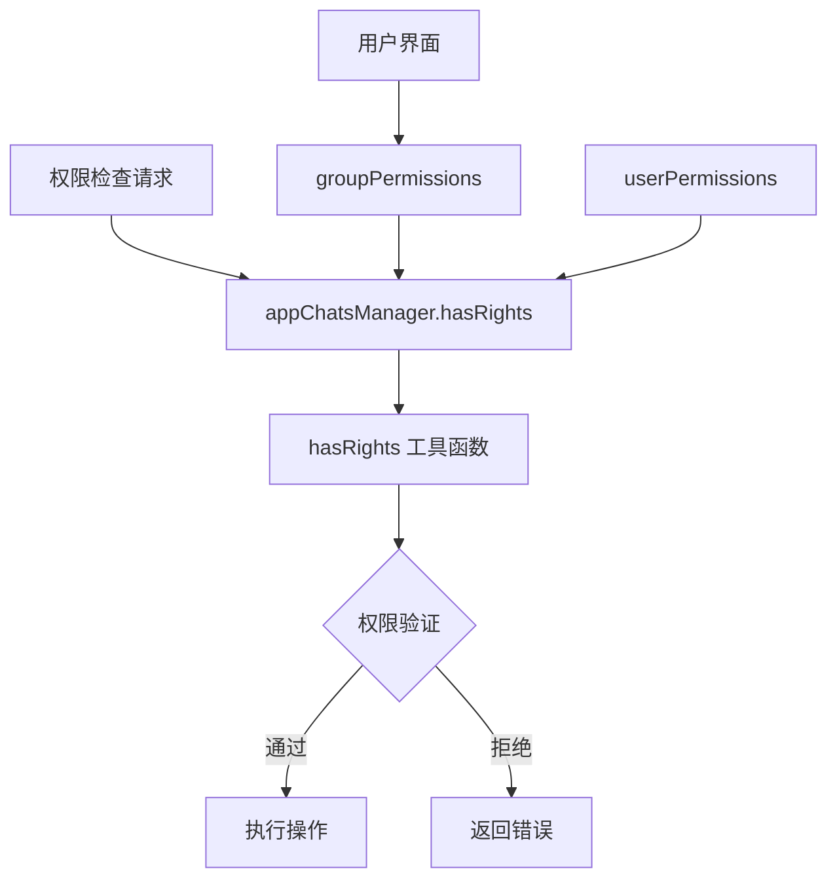
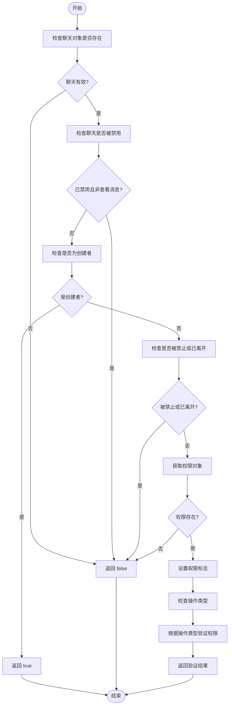
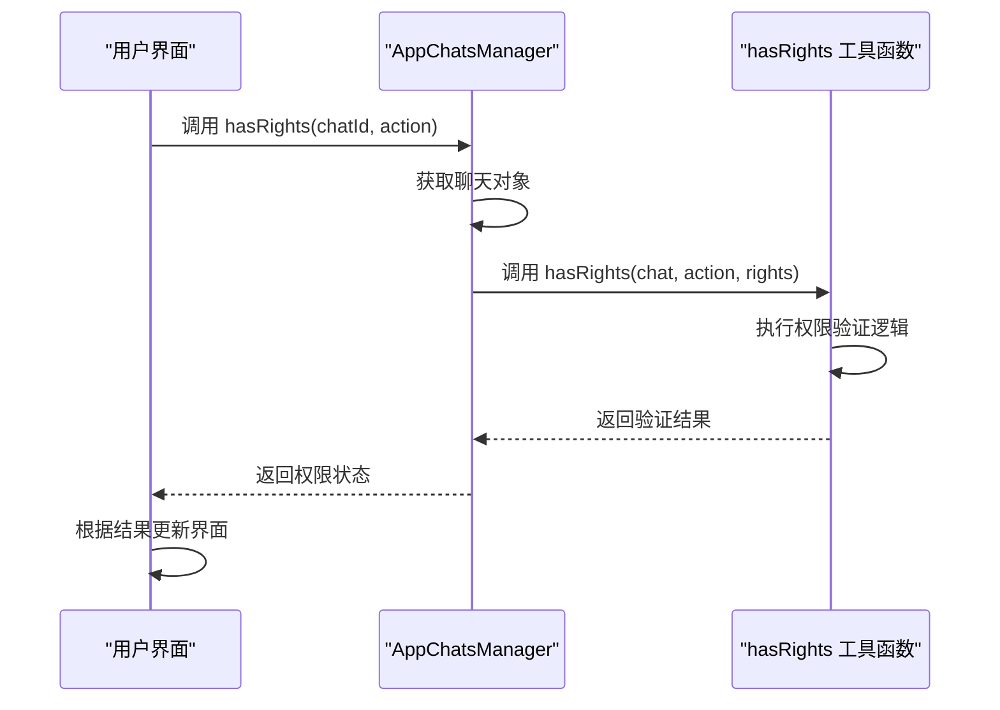
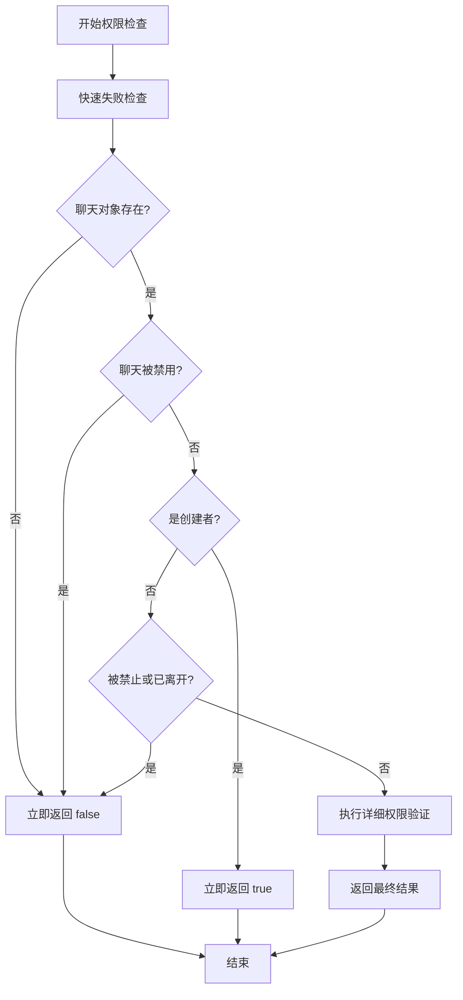
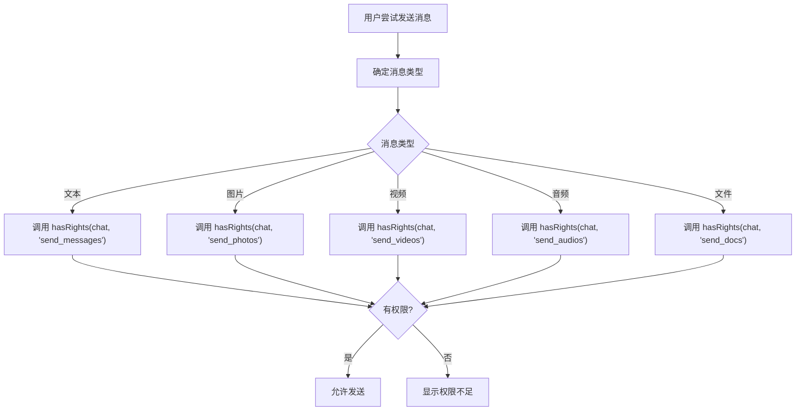
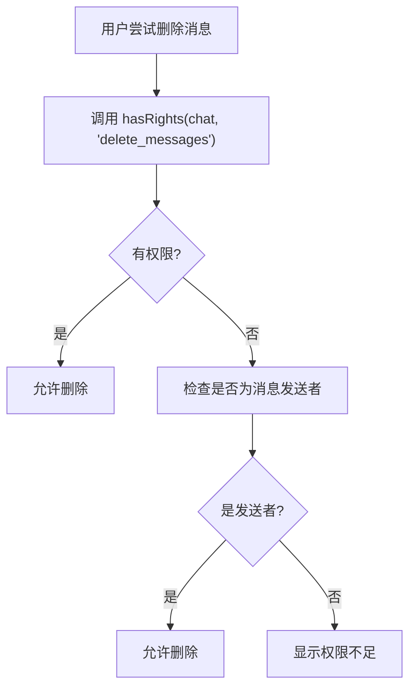
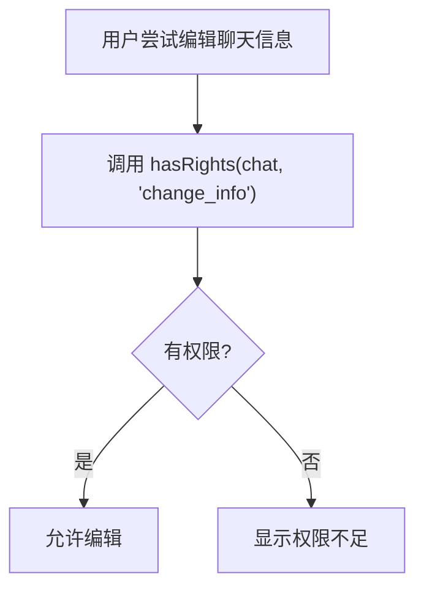

# 权限检查机制

<cite>
**本文档引用的文件**  
- [hasRights.ts](file://src/lib/appManagers/utils/chats/hasRights.ts)
- [appChatsManager.ts](file://src/lib/appManagers/appChatsManager.ts)
- [canEditAdmin.ts](file://src/lib/appManagers/utils/chats/canEditAdmin.ts)
- [groupPermissions/index.ts](file://src/components/sidebarRight/tabs/groupPermissions/index.ts)
- [userPermissions.ts](file://src/components/sidebarRight/tabs/userPermissions.ts)
- [layer.d.ts](file://src/layer.d.ts)
- [types.d.ts](file://src/types.d.ts)
</cite>

## 目录
1. [简介](#简介)
2. [权限检查核心组件](#权限检查核心组件)
3. [hasRights工具函数实现原理](#hasrights工具函数实现原理)
4. [权限检查调用流程](#权限检查调用流程)
5. [性能优化策略](#性能优化策略)
6. [不同场景下的权限检查API调用](#不同场景下的权限检查api调用)
7. [错误处理与日志记录最佳实践](#错误处理与日志记录最佳实践)
8. [常见权限检查问题及解决方案](#常见权限检查问题及解决方案)
9. [结论](#结论)

## 简介

权限检查机制是本系统安全架构的核心组成部分，负责验证用户在聊天环境中的操作权限。该机制基于用户角色（普通成员、管理员、所有者）和预设权限设置进行精细化控制，确保只有具备相应权限的用户才能执行特定操作。权限检查系统通过`hasRights`工具函数实现，该函数被广泛应用于消息发送、删除、编辑等关键操作的前置验证。

**Section sources**
- [hasRights.ts](file://src/lib/appManagers/utils/chats/hasRights.ts#L1-L165)
- [appChatsManager.ts](file://src/lib/appManagers/appChatsManager.ts#L263-L265)

## 权限检查核心组件

权限检查系统由多个核心组件构成，包括权限验证工具、聊天管理器和用户权限界面。`hasRights`函数作为核心验证工具，被`appChatsManager`中的`hasRights`方法封装调用。用户权限管理界面则通过`groupPermissions`和`userPermissions`组件实现权限的可视化配置和管理。

**Diagram sources**
- [appChatsManager.ts](file://src/lib/appManagers/appChatsManager.ts#L263-L265)
- [hasRights.ts](file://src/lib/appManagers/utils/chats/hasRights.ts#L18-L165)

**Section sources**
- [hasRights.ts](file://src/lib/appManagers/utils/chats/hasRights.ts#L1-L165)
- [appChatsManager.ts](file://src/lib/appManagers/appChatsManager.ts#L263-L265)
- [groupPermissions/index.ts](file://src/components/sidebarRight/tabs/groupPermissions/index.ts#L80-L95)
- [userPermissions.ts](file://src/components/sidebarRight/tabs/userPermissions.ts#L27-L60)

## hasRights工具函数实现原理

`hasRights`工具函数是权限检查机制的核心实现，它通过分析聊天对象的权限标志来确定用户是否具备执行特定操作的权限。函数接收聊天对象、操作类型、权限对象和线程状态作为参数，返回布尔值表示权限验证结果。

函数首先进行基础验证，检查聊天对象是否存在以及是否被禁用。对于聊天创建者，除特定操作外，默认拥有所有权限。函数通过`rights`参数区分管理员权限和禁止权限，利用`isAdmin`标志判断权限类型。

权限验证采用switch-case结构处理不同操作类型，每种操作都有特定的验证逻辑。例如，消息发送类操作需要检查用户是否被禁止发送特定类型的内容；删除消息和管理通话等操作需要管理员权限；固定消息操作在频道中需要发布消息权限。

**Diagram sources**
- [hasRights.ts](file://src/lib/appManagers/utils/chats/hasRights.ts#L18-L165)

**Section sources**
- [hasRights.ts](file://src/lib/appManagers/utils/chats/hasRights.ts#L18-L165)

## 权限检查调用流程

权限检查的调用流程始于用户界面操作，通过聊天管理器间接调用`hasRights`工具函数。`appChatsManager`类提供了`hasRights`方法作为公共接口，该方法接收聊天ID、操作类型、权限对象和线程状态作为参数，内部调用`hasRights`工具函数完成实际的权限验证。

调用流程如下：用户在界面触发操作 → 界面组件调用`appChatsManager.hasRights` → 获取聊天对象 → 传递参数给`hasRights`工具函数 → 执行权限验证逻辑 → 返回结果 → 界面根据结果决定是否允许操作。

在用户权限管理界面中，`groupPermissions`组件在初始化时会调用`hasRights`函数来确定用户对各项权限的控制能力，从而动态生成权限配置界面。

**Diagram sources**
- [appChatsManager.ts](file://src/lib/appManagers/appChatsManager.ts#L263-L265)
- [hasRights.ts](file://src/lib/appManagers/utils/chats/hasRights.ts#L18-L165)

**Section sources**
- [appChatsManager.ts](file://src/lib/appManagers/appChatsManager.ts#L263-L265)
- [hasRights.ts](file://src/lib/appManagers/utils/chats/hasRights.ts#L18-L165)

## 性能优化策略

权限检查机制采用了多种性能优化策略，确保在高并发场景下仍能快速响应。主要优化策略包括快速失败模式和逻辑优化。

快速失败模式体现在权限验证的早期阶段，函数会优先检查最可能导致权限拒绝的条件，如聊天对象不存在、聊天被禁用、用户被禁止或已离开等。这种设计避免了不必要的后续计算，提高了验证效率。

逻辑优化方面，函数通过`isCheckingRightsForSelf`标志优化了创建者的权限检查，避免了冗余的权限对象获取和比较。对于批量权限检查场景，系统可以利用Promise.all并行执行多个权限检查，充分利用现代浏览器的异步处理能力。

此外，权限检查结果可以被缓存，特别是在用户频繁访问同一聊天界面的场景下，避免重复计算相同的权限验证。

**Diagram sources**
- [hasRights.ts](file://src/lib/appManagers/utils/chats/hasRights.ts#L24-L40)

**Section sources**
- [hasRights.ts](file://src/lib/appManagers/utils/chats/hasRights.ts#L24-L40)

## 不同场景下的权限检查API调用

权限检查API在不同场景下有不同的调用方式和参数组合。以下是几个典型场景的调用示例：

### 发送消息场景
在发送消息时，需要检查用户是否具备发送消息的权限。这包括普通消息、媒体、表情包等多种类型。

**Diagram sources**
- [hasRights.ts](file://src/lib/appManagers/utils/chats/hasRights.ts#L64-L78)

### 删除消息场景
删除消息需要特定的管理权限，普通成员通常只能删除自己的消息，而管理员可以删除任何消息。

**Diagram sources**
- [hasRights.ts](file://src/lib/appManagers/utils/chats/hasRights.ts#L97-L99)

### 编辑聊天信息场景
编辑聊天信息（如名称、描述、照片等）需要相应的管理权限。

**Diagram sources**
- [hasRights.ts](file://src/lib/appManagers/utils/chats/hasRights.ts#L124-L127)

**Section sources**
- [hasRights.ts](file://src/lib/appManagers/utils/chats/hasRights.ts#L64-L157)

## 错误处理与日志记录最佳实践

权限检查系统的错误处理遵循清晰的失败模式，确保用户能够理解权限被拒绝的原因。当权限检查失败时，系统应提供具体的错误信息，而不是简单的"权限不足"提示。

日志记录方面，建议在关键权限检查点添加日志输出，特别是在生产环境中。日志应包含操作类型、用户ID、聊天ID和检查结果等信息，便于后续审计和问题排查。

对于频繁的权限检查操作，应避免过度日志记录以防止性能下降。可以采用条件日志记录策略，仅在调试模式或特定条件下记录详细日志。

**Section sources**
- [hasRights.ts](file://src/lib/appManagers/utils/chats/hasRights.ts#L24-L165)

## 常见权限检查问题及解决方案

### 问题1：创建者权限检查失败
**现象**：聊天创建者无法执行特定操作。
**原因**：代码中对创建者权限的检查可能存在例外情况。
**解决方案**：检查`hasRights`函数中创建者权限的例外处理，确保只在必要时排除特定操作。

### 问题2：频道消息发送权限异常
**现象**：频道中用户无法发送消息，即使具备相应权限。
**原因**：频道需要同时具备`post_messages`权限才能发送消息。
**解决方案**：在权限检查时，确保同时验证`send_messages`和`post_messages`权限。

### 问题3：权限缓存不一致
**现象**：用户权限更新后，界面显示的权限状态未及时刷新。
**原因**：权限检查结果被缓存，但未在权限更新时清除缓存。
**解决方案**：在权限更新操作完成后，清除相关聊天的权限缓存。

### 问题4：线程权限处理错误
**现象**：在话题线程中权限检查结果与主聊天不一致。
**解决方案**：检查`isThread`参数的处理逻辑，确保线程场景下的权限检查正确。

**Section sources**
- [hasRights.ts](file://src/lib/appManagers/utils/chats/hasRights.ts#L18-L165)

## 结论

权限检查机制通过`hasRights`工具函数实现了精细化的权限控制，确保了系统的安全性和稳定性。该机制基于用户角色和权限设置，通过快速失败模式和逻辑优化实现了高效的权限验证。在不同场景下，权限检查API能够灵活适应各种操作需求，为用户提供安全可靠的交互体验。

未来可以考虑引入权限缓存机制，进一步提升高并发场景下的性能表现。同时，完善错误处理和日志记录，有助于提高系统的可维护性和可调试性。