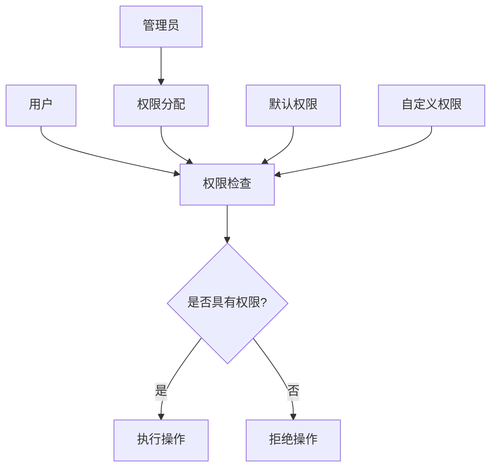
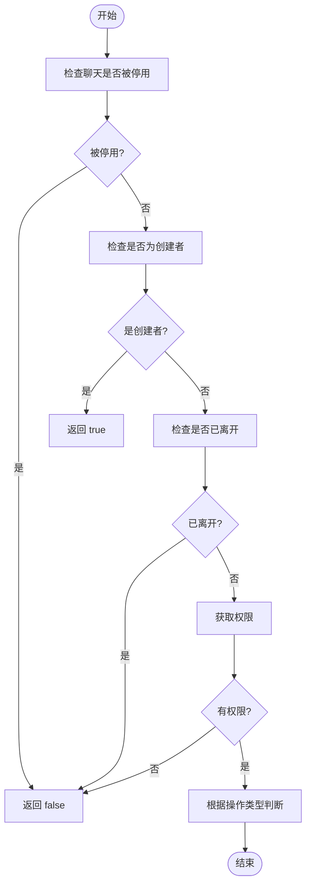
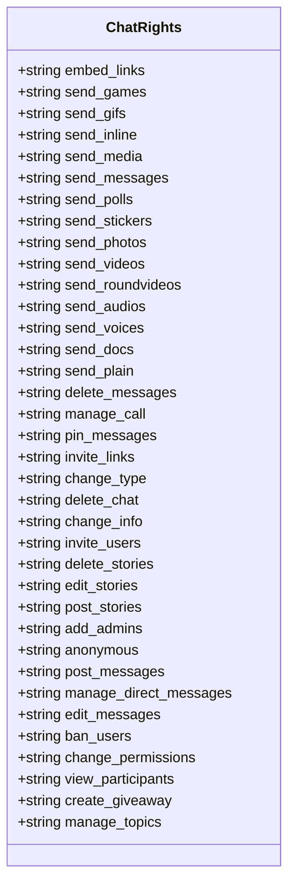
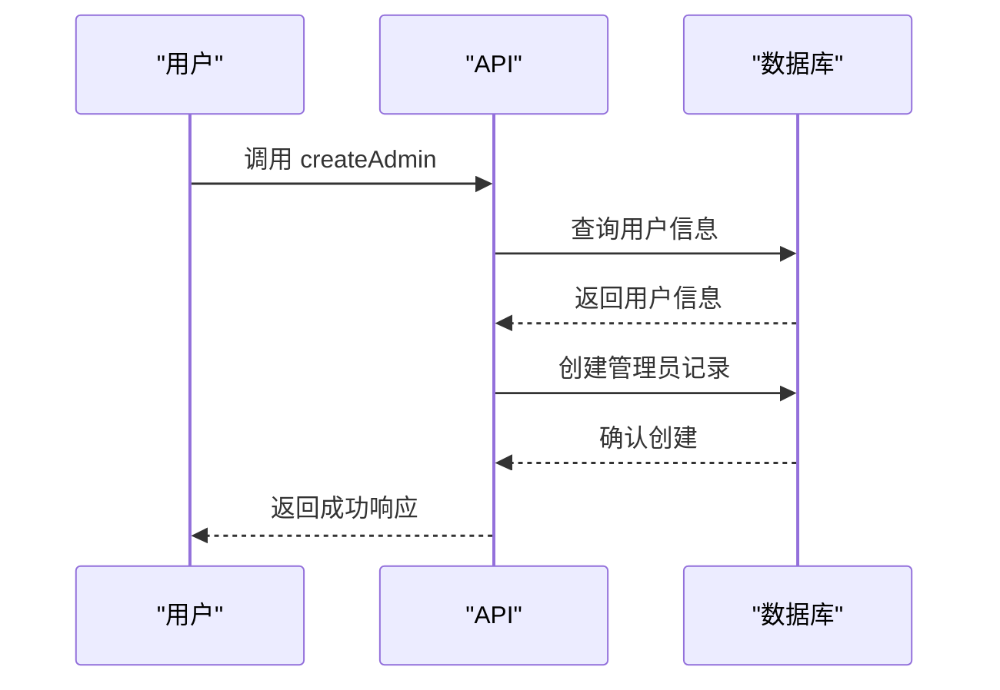
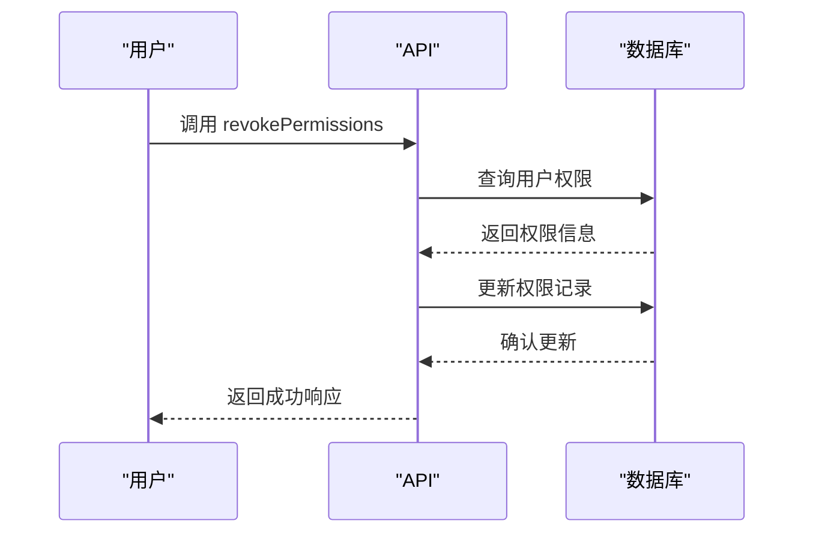

# 权限系统

<cite>
**本文档中引用的文件**  
- [hasRights.ts](file://src/lib/appManagers/utils/chats/hasRights.ts)
- [appChatsManager.ts](file://src/lib/appManagers/appChatsManager.ts)
- [appSelectPeers.ts](file://src/components/appSelectPeers.ts)
- [chat.ts](file://src/components/chat/chat.ts)
- [input.ts](file://src/components/chat/input.ts)
- [emoticonsDropdown/index.ts](file://src/components/emoticonsDropdown/index.ts)
- [forward.ts](file://src/components/popups/forward.ts)
- [newMedia.ts](file://src/components/popups/newMedia.ts)
</cite>

## 目录
1. [介绍](#介绍)
2. [权限模型架构](#权限模型架构)
3. [权限检查机制](#权限检查机制)
4. [权限级别配置](#权限级别配置)
5. [管理员任命与权限分配](#管理员任命与权限分配)
6. [权限撤销流程](#权限撤销流程)
7. [权限策略最佳实践](#权限策略最佳实践)
8. [结论](#结论)

## 介绍
本文档详细阐述了聊天应用中的权限系统设计与实现。该系统支持默认权限、管理员权限和自定义权限三种模式，确保聊天环境的安全性和可控性。通过深入分析权限检查机制、权限级别配置方法以及管理员操作流程，为开发者和管理员提供全面的指导。

## 权限模型架构

权限系统基于角色和权限的分离设计，支持多种权限级别和灵活的权限组合。系统通过`hasRights`工具函数进行权限检查，确保用户在执行特定操作时具备相应的权限。

**Diagram sources**
- [hasRights.ts](file://src/lib/appManagers/utils/chats/hasRights.ts)
- [appChatsManager.ts](file://src/lib/appManagers/appChatsManager.ts)

**Section sources**
- [appChatsManager.ts](file://src/lib/appManagers/appChatsManager.ts#L30-L32)
- [hasRights.ts](file://src/lib/appManagers/utils/chats/hasRights.ts#L18-L23)

## 权限检查机制

`hasRights`函数是权限检查的核心，它根据用户的权限标志和请求的操作来判断是否允许执行该操作。函数首先检查聊天是否被停用，然后检查用户是否为创建者，最后根据权限标志进行具体权限的判断。

**Diagram sources**
- [hasRights.ts](file://src/lib/appManagers/utils/chats/hasRights.ts#L26-L164)

**Section sources**
- [hasRights.ts](file://src/lib/appManagers/utils/chats/hasRights.ts#L18-L164)

## 权限级别配置

系统支持多种权限级别，包括发送消息、添加成员、删除消息等。每种权限级别都有对应的权限标志，通过这些标志可以精确控制用户的行为。

### 发送消息权限
发送消息权限包括多种子权限，如发送文本、发送媒体、发送表情等。这些权限可以通过`send_messages`、`send_media`等标志进行控制。

### 添加成员权限
添加成员权限通过`invite_users`标志控制，只有具有该权限的用户才能邀请新成员加入聊天。

### 删除消息权限
删除消息权限通过`delete_messages`标志控制，允许用户删除自己或其他用户的消息。

**Diagram sources**
- [appChatsManager.ts](file://src/lib/appManagers/appChatsManager.ts#L30-L32)

**Section sources**
- [appChatsManager.ts](file://src/lib/appManagers/appChatsManager.ts#L30-L32)
- [input.ts](file://src/components/chat/input.ts#L150-L152)

## 管理员任命与权限分配

管理员任命和权限分配通过API调用完成。系统提供了多种API接口，用于创建管理员、分配权限和修改权限。

### 管理员任命流程
1. 调用`createAdmin` API创建管理员
2. 指定管理员的权限范围
3. 确认任命并保存到数据库

### 权限分配流程
1. 调用`assignPermissions` API分配权限
2. 指定目标用户和权限级别
3. 确认分配并更新用户权限

**Diagram sources**
- [appChatsManager.ts](file://src/lib/appManagers/appChatsManager.ts)
- [appSelectPeers.ts](file://src/components/appSelectPeers.ts)

**Section sources**
- [appChatsManager.ts](file://src/lib/appManagers/appChatsManager.ts)
- [appSelectPeers.ts](file://src/components/appSelectPeers.ts)

## 权限撤销流程

权限撤销是权限管理的重要组成部分，确保在必要时可以及时收回用户的权限。

### 权限撤销流程
1. 调用`revokePermissions` API撤销权限
2. 指定目标用户和要撤销的权限
3. 确认撤销并更新用户权限

**Diagram sources**
- [appChatsManager.ts](file://src/lib/appManagers/appChatsManager.ts)
- [appSelectPeers.ts](file://src/components/appSelectPeers.ts)

**Section sources**
- [appChatsManager.ts](file://src/lib/appManagers/appChatsManager.ts)
- [appSelectPeers.ts](file://src/components/appSelectPeers.ts)

## 权限策略最佳实践

为了确保聊天环境的安全性和可控性，建议遵循以下权限策略最佳实践：

### 设置合理的权限组合
- **基本原则**：最小权限原则，只授予完成任务所需的最低权限
- **推荐组合**：
  - 普通成员：`send_messages`, `view_participants`
  - 高级成员：`send_media`, `send_polls`, `pin_messages`
  - 管理员：`invite_users`, `ban_users`, `change_info`, `delete_messages`

### 定期审查权限
- 定期审查和更新用户权限
- 及时撤销不再需要的权限
- 记录权限变更历史

### 使用默认权限模板
- 创建默认权限模板，简化权限分配过程
- 根据不同角色预设权限组合
- 允许自定义权限模板

## 结论
本文档详细介绍了聊天应用中的权限系统设计与实现。通过深入分析权限模型架构、权限检查机制、权限级别配置方法以及管理员操作流程，为开发者和管理员提供了全面的指导。遵循本文档中的最佳实践，可以有效提升聊天环境的安全性和可控性。