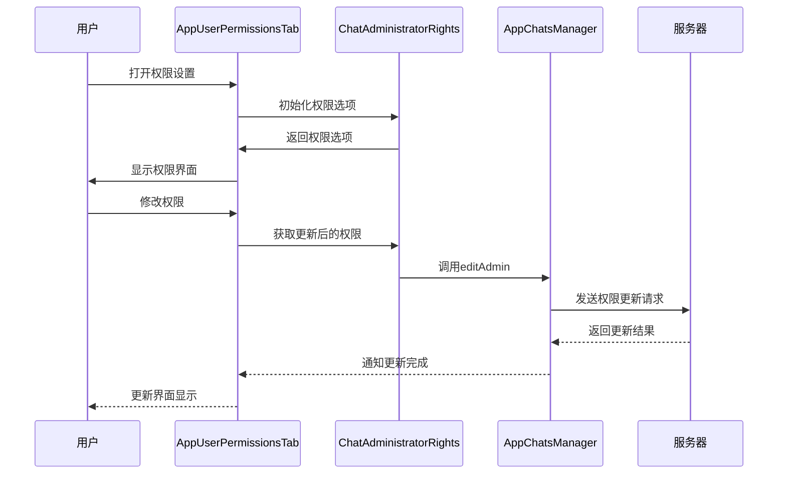
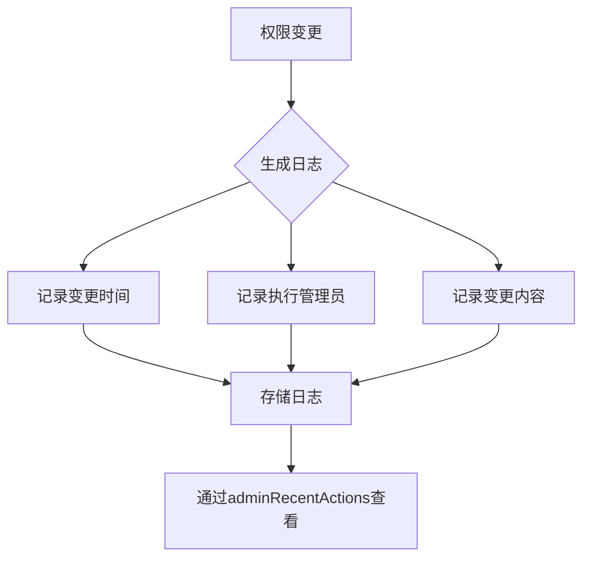

# 管理员管理

<cite>
**本文档引用的文件**  
- [userPermissions.ts](file://src/components/sidebarRight/tabs/userPermissions.ts)
- [groupPermissions/index.ts](file://src/components/sidebarRight/tabs/groupPermissions/index.ts)
- [adminRecentActions/index.tsx](file://src/components/sidebarRight/tabs/adminRecentActions/index.tsx)
- [adminRecentActions/utils.ts](file://src/components/sidebarRight/tabs/adminRecentActions/utils.ts)
- [adminLogsResolver/index.tsx](file://src/components/chat/bubbleParts/adminLogsResolver/index.tsx)
- [appChatsManager.ts](file://src/lib/appManagers/appChatsManager.ts)
- [canEditAdmin.ts](file://src/lib/appManagers/utils/chats/canEditAdmin.ts)
</cite>

## 目录
1. [简介](#简介)
2. [管理员任命流程](#管理员任命流程)
3. [权限分配与撤销](#权限分配与撤销)
4. [管理员权限配置界面](#管理员权限配置界面)
5. [API调用管理管理员角色](#api调用管理管理员角色)
6. [最佳实践](#最佳实践)
7. [通知机制与历史记录](#通知机制与历史记录)

## 简介
本文档详细说明了管理员管理功能的完整流程和技术实现。涵盖了管理员的任命、权限分配与撤销、权限配置界面的交互逻辑、通过API调用创建和管理管理员角色的方法，以及权限变更的通知机制和历史记录功能。

## 管理员任命流程
管理员的任命通过`AppUserPermissionsTab`类实现。当用户选择一个参与者并决定将其设为管理员时，系统会调用`AppUserPermissionsTab.openTab`方法打开权限设置界面。此过程涉及检查当前用户是否有权编辑管理员权限，并根据聊天类型（频道或群组）和参与者类型（创建者、管理员或普通成员）来确定可设置的权限。

**Section sources**
- [userPermissions.ts](file://src/components/sidebarRight/tabs/userPermissions.ts#L27-L45)

## 权限分配与撤销
权限的分配与撤销主要通过`ChatAdministratorRights`和`ChatPermissions`类来实现。`ChatAdministratorRights`用于管理管理员权限，而`ChatPermissions`用于管理用户限制。权限的更改通过`editAdmin`和`editBanned`方法提交到服务器。

```mermaid
classDiagram
class AppUserPermissionsTab {
+participant : ChannelParticipant | ChatParticipant
+chatId : ChatId
+userId : UserId
+isAdmin : boolean
+static openTab(slider : SidebarSlider, chatId : ChatId, participant : ChatParticipant | ChannelParticipant, isAdmin? : boolean)
+init() : Promise<void>
}
class ChatAdministratorRights {
+options : {chatId : ChatId, listenerSetter : ListenerSetter, appendTo : HTMLElement, participant? : ChannelParticipant.channelParticipantAdmin | ChannelParticipant.channelParticipantCreator, chat : Chat, canEdit? : boolean}
+construct() : void
+takeOut() : ChatAdminRights
}
class ChatPermissions {
+options : {chatId : ChatId, listenerSetter : ListenerSetter, appendTo : HTMLElement, participant? : ChannelParticipant.channelParticipantBanned, forChat? : boolean, onSomethingChanged? : () => void}
+managers : AppManagers
+construct() : Promise<void>
+takeOut() : ChatBannedRights
}
class AppChatsManager {
+editAdmin(id : ChatId, participant : PeerId | ChannelParticipant | ChatParticipant, rights : ChatAdminRights, rank : string) : Promise<void>
+editBanned(id : ChatId, participant : PeerId | ChannelParticipant | ChatParticipant, bannedRights : ChatBannedRights) : Promise<void>
}
AppUserPermissionsTab --> ChatAdministratorRights : "使用"
AppUserPermissionsTab --> ChatPermissions : "使用"
ChatAdministratorRights --> AppChatsManager : "调用"
ChatPermissions --> AppChatsManager : "调用"
```

**Diagram sources**
- [userPermissions.ts](file://src/components/sidebarRight/tabs/userPermissions.ts#L27-L281)
- [groupPermissions/index.ts](file://src/components/sidebarRight/tabs/groupPermissions/index.ts#L54-L300)
- [appChatsManager.ts](file://src/lib/appManagers/appChatsManager.ts#L594-L750)

## 管理员权限配置界面
`userPermissions`组件提供了管理员权限配置的用户界面。该界面允许管理员查看和修改其他管理员的权限，包括设置自定义权限组合。界面通过`SettingSection`和`CheckboxFields`组件构建，支持动态更新权限状态。

**Section sources**
- [userPermissions.ts](file://src/components/sidebarRight/tabs/userPermissions.ts#L47-L277)

## API调用管理管理员角色
通过`appChatsManager`的`editAdmin`方法可以创建和管理管理员角色。该方法接受聊天ID、参与者、权限和等级作为参数，并向服务器发送请求以更新管理员权限。权限的变更会触发相应的更新事件，确保客户端状态与服务器同步。



**Diagram sources**
- [userPermissions.ts](file://src/components/sidebarRight/tabs/userPermissions.ts#L127-L137)
- [appChatsManager.ts](file://src/lib/appManagers/appChatsManager.ts#L594-L633)

## 最佳实践
- **权限最小化原则**：仅授予完成任务所需的最低权限。
- **权限审计**：定期审查管理员权限，确保权限分配合理。
- **权限变更记录**：记录所有权限变更，便于追踪和审计。

## 通知机制与历史记录
权限变更会生成日志条目，记录在`adminLogsResolver`中。这些日志条目可以通过`adminRecentActions`标签页查看，提供详细的变更历史。日志条目包括变更的时间、执行变更的管理员、变更的具体内容等信息。



**Diagram sources**
- [adminLogsResolver/index.tsx](file://src/components/chat/bubbleParts/adminLogsResolver/index.tsx#L358-L396)
- [adminRecentActions/index.tsx](file://src/components/sidebarRight/tabs/adminRecentActions/index.tsx#L66-L74)