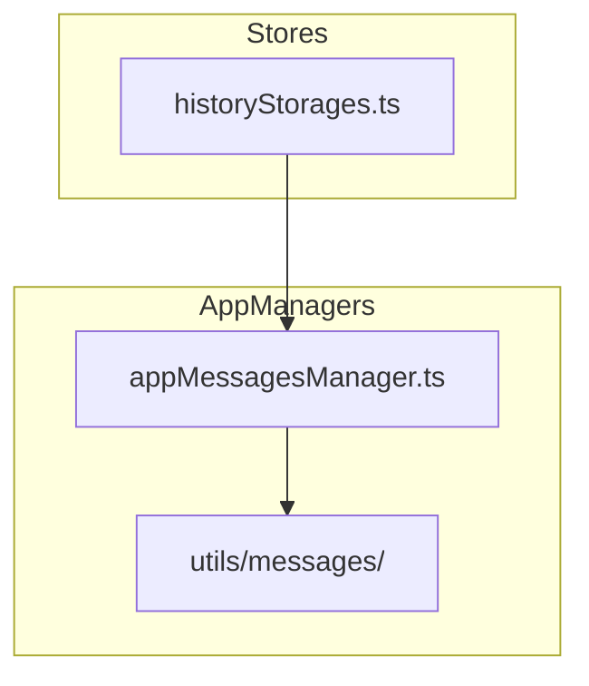
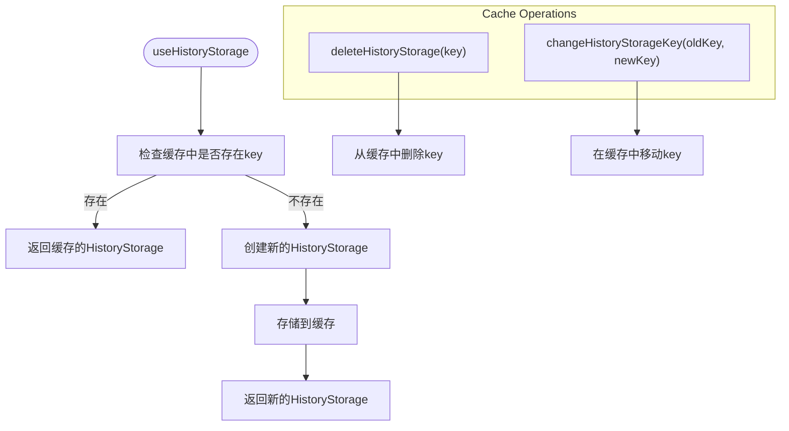
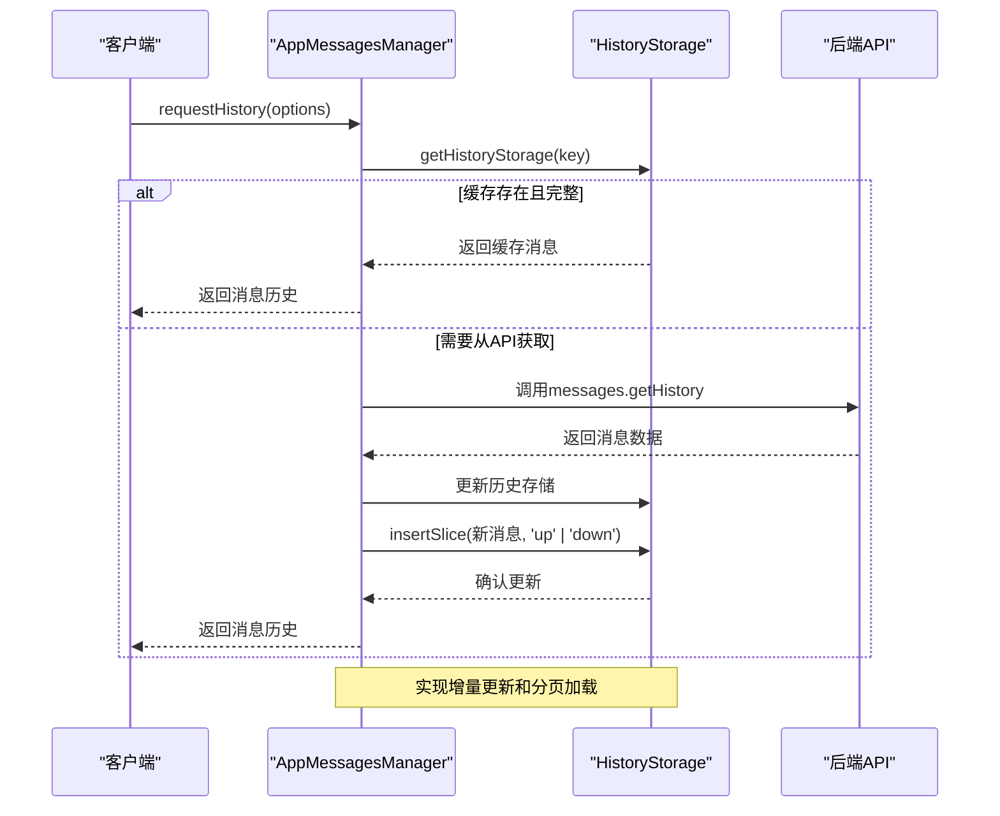
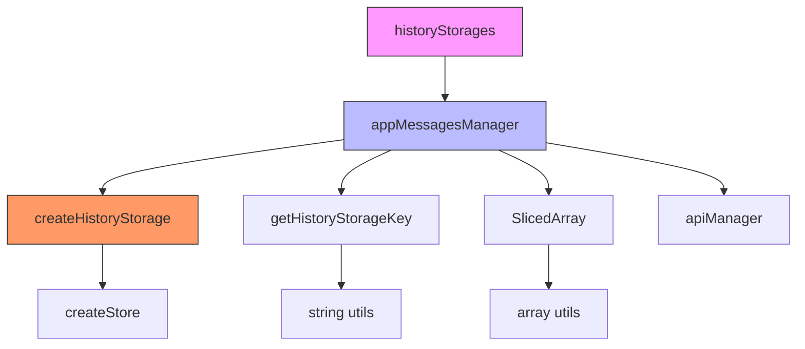

# 消息历史管理

<cite>
**本文档引用的文件**
- [historyStorages.ts](file://src/stores/historyStorages.ts)
- [appMessagesManager.ts](file://src/lib/appManagers/appMessagesManager.ts)
- [createHistoryStorage.ts](file://src/lib/appManagers/utils/messages/createHistoryStorage.ts)
- [getHistoryStorageKey.ts](file://src/lib/appManagers/utils/messages/getHistoryStorageKey.ts)
</cite>

## 目录
1. [简介](#简介)
2. [项目结构](#项目结构)
3. [核心组件](#核心组件)
4. [架构概述](#架构概述)
5. [详细组件分析](#详细组件分析)
6. [依赖分析](#依赖分析)
7. [性能考虑](#性能考虑)
8. [故障排除指南](#故障排除指南)
9. [结论](#结论)

## 简介
本文档全面记录了消息历史管理功能的实现细节，重点分析了消息存储、检索、分页加载等核心机制。深入探讨了`historyStorages`的状态管理结构，包括会话ID、消息列表、加载状态等关键属性。详细解释了`appMessagesManager`中消息获取API的工作原理，特别是分页加载和增量更新的实现策略。同时说明了消息缓存机制和内存管理策略，以及如何平衡性能和内存使用。最后提供了实际示例展示如何查询特定时间段的消息或实现消息搜索功能。

## 项目结构
消息历史管理功能主要分布在`src/lib/appManagers`和`src/stores`目录下。核心文件包括`appMessagesManager.ts`负责消息的获取、发送和管理，`historyStorages.ts`负责管理消息历史的存储状态，以及`utils/messages`目录下的各种工具函数。



**Diagram sources**
- [historyStorages.ts](file://src/stores/historyStorages.ts)
- [appMessagesManager.ts](file://src/lib/appManagers/appMessagesManager.ts)

**Section sources**
- [historyStorages.ts](file://src/stores/historyStorages.ts)
- [appMessagesManager.ts](file://src/lib/appManagers/appMessagesManager.ts)

## 核心组件
消息历史管理的核心组件包括`historyStorages`状态管理器、`appMessagesManager`消息管理器以及相关的工具函数。这些组件共同协作，实现了高效的消息存储、检索和分页加载功能。

**Section sources**
- [historyStorages.ts](file://src/stores/historyStorages.ts)
- [appMessagesManager.ts](file://src/lib/appManagers/appMessagesManager.ts)

## 架构概述
消息历史管理系统的架构基于状态存储和消息管理的分离设计。`historyStorages`负责维护各个会话的历史状态，而`appMessagesManager`负责与后端API交互，获取和管理消息数据。

```mermaid
classDiagram
class HistoryStorage {
+_maxId : number
+count : number | null
+history : SlicedArray<number>
+searchHistory : SlicedArray<string>
+maxId : number
+readPromise : Promise<void>
+readMaxId : number
+key : HistoryStorageKey
+type : 'history' | 'replies' | 'search'
+wasFetched : boolean
}
class AppMessagesManager {
+historiesStorage : {[peerId : PeerId] : HistoryStorage}
+threadsStorage : {[peerId : PeerId] : {[threadId : string] : HistoryStorage}}
+searchesStorage : {[peerId : PeerId] : {[threadId : string] : {[inputFilter : string] : HistoryStorage}}}
+messagesStorageByPeerId : {[peerId : string] : MessagesStorage}
+getHistoryMessagesStorage(peerId : PeerId) : MessagesStorage
+getThreadMessagesStorage(peerId : PeerId, threadId : number) : MessagesStorage
+getSearchMessagesStorage(peerId : PeerId, threadId : number, inputFilter : MyInputMessagesFilter) : MessagesStorage
+requestHistory(options : RequestHistoryOptions) : Promise<HistoryResult>
+getHistoryStorage(key : HistoryStorageKey) : HistoryStorage
}
class SlicedArray {
+insertSlice : (slice : number[], direction : 'up' | 'down') => void
+getEnds : () => {up : boolean, down : boolean}
+slice : (start : number, end : number) => number[]
}
AppMessagesManager --> HistoryStorage : "管理"
AppMessagesManager --> SlicedArray : "使用"
HistoryStorage --> SlicedArray : "包含"
```

**Diagram sources**
- [appMessagesManager.ts](file://src/lib/appManagers/appMessagesManager.ts#L398-L800)
- [historyStorages.ts](file://src/stores/historyStorages.ts#L1-L29)
- [createHistoryStorage.ts](file://src/lib/appManagers/utils/messages/createHistoryStorage.ts)

## 详细组件分析

### historyStorages状态管理
`historyStorages`是消息历史管理的核心状态存储组件，使用SolidJS的`createStore`来管理各个会话的历史状态。它通过一个缓存对象来存储不同会话的历史存储实例，避免重复创建。



**Diagram sources**
- [historyStorages.ts](file://src/stores/historyStorages.ts#L6-L28)

**Section sources**
- [historyStorages.ts](file://src/stores/historyStorages.ts#L1-L29)

### appMessagesManager消息获取API
`appMessagesManager`中的消息获取API实现了分页加载和增量更新的策略。通过`requestHistory`方法，系统能够根据不同的参数获取消息历史，并智能地处理缓存和增量更新。



**Diagram sources**
- [appMessagesManager.ts](file://src/lib/appManagers/appMessagesManager.ts#L398-L800)
- [createHistoryStorage.ts](file://src/lib/appManagers/utils/messages/createHistoryStorage.ts)

**Section sources**
- [appMessagesManager.ts](file://src/lib/appManagers/appMessagesManager.ts#L279-L307)

### 消息缓存与内存管理
系统通过`SlicedArray`数据结构实现高效的消息缓存和内存管理。`SlicedArray`支持双向插入和分页加载，能够有效平衡性能和内存使用。

```mermaid
classDiagram
class SlicedArray {
-slices : number[][]
-length : number
+insertSlice(slice : number[], direction : 'up' | 'down') : void
+getEnds() : {up : boolean, down : boolean}
+slice(start : number, end : number) : number[]
+indexOf(id : number) : number
+lastIndexOf(id : number) : number
}
class HistoryStorage {
-history : SlicedArray<number>
-searchHistory : SlicedArray<string>
}
class AppMessagesManager {
-historiesStorage : {[peerId : PeerId] : HistoryStorage}
-threadsStorage : {[peerId : PeerId] : {[threadId : string] : HistoryStorage}}
-searchesStorage : {[peerId : PeerId] : {[threadId : string] : {[inputFilter : string] : HistoryStorage}}}
}
HistoryStorage --> SlicedArray : "使用"
AppMessagesManager --> HistoryStorage : "管理"
```

**Diagram sources**
- [appMessagesManager.ts](file://src/lib/appManagers/appMessagesManager.ts#L137-L165)
- [createHistoryStorage.ts](file://src/lib/appManagers/utils/messages/createHistoryStorage.ts)

**Section sources**
- [appMessagesManager.ts](file://src/lib/appManagers/appMessagesManager.ts#L137-L165)

## 依赖分析
消息历史管理功能依赖于多个核心组件和工具函数，形成了一个完整的依赖链。



**Diagram sources**
- [historyStorages.ts](file://src/stores/historyStorages.ts)
- [appMessagesManager.ts](file://src/lib/appManagers/appMessagesManager.ts)
- [createHistoryStorage.ts](file://src/lib/appManagers/utils/messages/createHistoryStorage.ts)
- [getHistoryStorageKey.ts](file://src/lib/appManagers/utils/messages/getHistoryStorageKey.ts)

**Section sources**
- [appMessagesManager.ts](file://src/lib/appManagers/appMessagesManager.ts#L1-L100)
- [historyStorages.ts](file://src/stores/historyStorages.ts#L1-L29)

## 性能考虑
消息历史管理系统在设计时充分考虑了性能优化，主要体现在以下几个方面：

1. **缓存策略**：通过`historyStorages`缓存机制，避免重复创建和获取相同会话的历史存储。
2. **增量更新**：使用`SlicedArray`的`insertSlice`方法实现消息的增量更新，避免全量重新加载。
3. **分页加载**：支持双向分页加载，根据用户滚动方向智能加载更多消息。
4. **内存管理**：通过合理的数据结构设计，有效控制内存使用，避免内存泄漏。

**Section sources**
- [appMessagesManager.ts](file://src/lib/appManagers/appMessagesManager.ts#L137-L165)
- [createHistoryStorage.ts](file://src/lib/appManagers/utils/messages/createHistoryStorage.ts)

## 故障排除指南
在使用消息历史管理功能时，可能会遇到以下常见问题及解决方案：

1. **消息加载缓慢**：检查网络连接，确认API调用是否正常，查看是否有大量并发请求。
2. **消息显示不完整**：确认`SlicedArray`的分页参数设置是否合理，检查`limit`和`addOffset`参数。
3. **缓存失效**：检查`historyStorage`的`key`生成逻辑，确保会话标识的唯一性。
4. **内存占用过高**：监控`historiesStorage`的大小，必要时实现缓存清理策略。

**Section sources**
- [appMessagesManager.ts](file://src/lib/appManagers/appMessagesManager.ts#L279-L307)
- [historyStorages.ts](file://src/stores/historyStorages.ts#L19-L25)

## 结论
消息历史管理功能通过`historyStorages`和`appMessagesManager`的协同工作，实现了高效的消息存储、检索和分页加载。系统采用缓存、增量更新和分页加载等策略，在保证性能的同时有效管理内存使用。通过合理的架构设计和组件分离，系统具有良好的可维护性和扩展性，能够满足复杂的即时通讯需求。