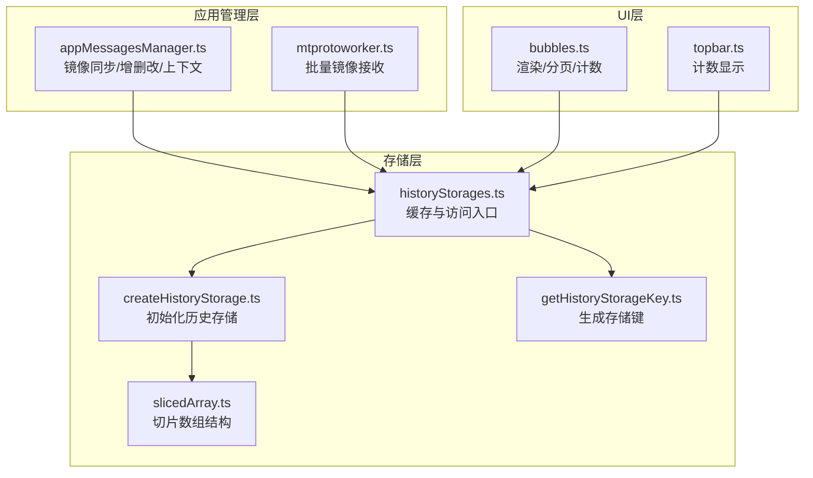
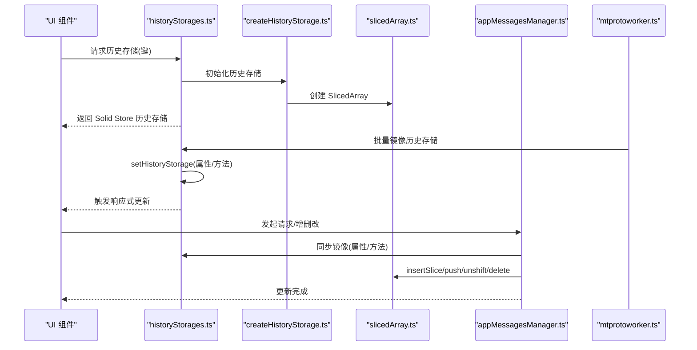
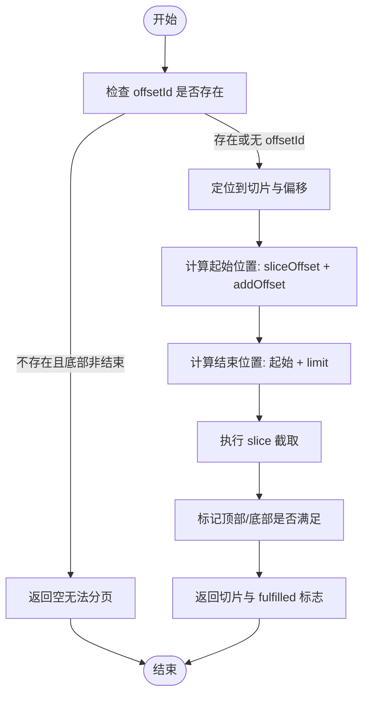
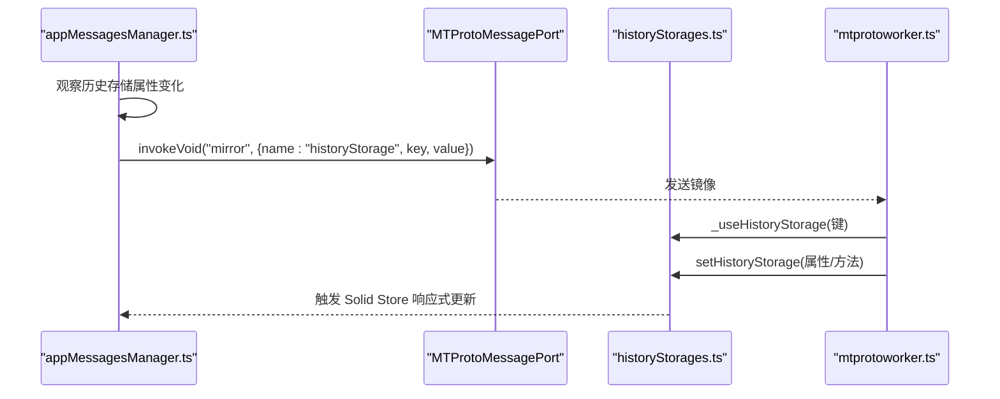
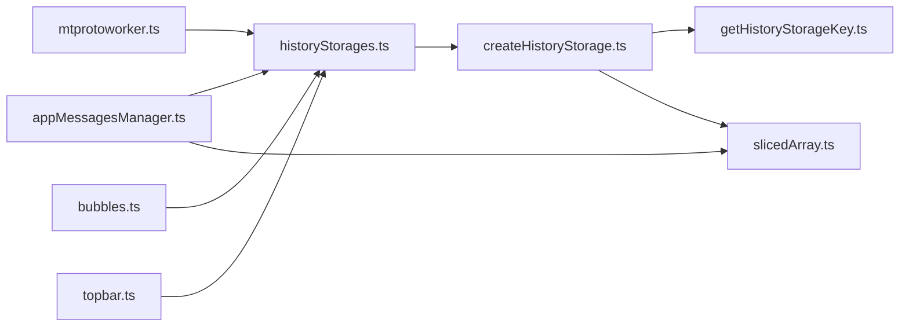

# 消息存储机制

<cite>
**本文引用的文件**
- [historyStorages.ts](file://src/stores/historyStorages.ts)
- [createHistoryStorage.ts](file://src/lib/appManagers/utils/messages/createHistoryStorage.ts)
- [getHistoryStorageKey.ts](file://src/lib/appManagers/utils/messages/getHistoryStorageKey.ts)
- [slicedArray.ts](file://src/helpers/slicedArray.ts)
- [appMessagesManager.ts](file://src/lib/appManagers/appMessagesManager.ts)
- [mtprotoworker.ts](file://src/lib/mtproto/mtprotoworker.ts)
- [bubbles.ts](file://src/components/chat/bubbles.ts)
- [topbar.ts](file://src/components/chat/topbar.ts)
</cite>

## 目录
1. [引言](#引言)
2. [项目结构](#项目结构)
3. [核心组件](#核心组件)
4. [架构总览](#架构总览)
5. [详细组件分析](#详细组件分析)
6. [依赖关系分析](#依赖关系分析)
7. [性能考量](#性能考量)
8. [故障排查指南](#故障排查指南)
9. [结论](#结论)
10. [附录](#附录)

## 引言
本文件系统性梳理 Telegram Web 客户端中“消息历史存储”（historyStorages）的设计与实现，重点覆盖以下方面：
- 会话ID映射与存储键生成规则
- 历史消息列表结构与搜索历史结构
- 加载状态管理与增量更新策略
- createHistoryStorage 工具函数如何初始化与管理不同会话的历史记录
- 存储生命周期：创建、更新、清理
- 支持增量更新与分页加载的机制
- 消息的添加、删除、修改操作在存储中的体现
- 实际代码示例路径，展示读写操作与状态变更处理

## 项目结构
围绕消息历史存储的相关模块分布如下：
- 存储层入口与缓存：src/stores/historyStorages.ts
- 存储初始化与搜索切片适配：src/lib/appManagers/utils/messages/createHistoryStorage.ts
- 存储键生成：src/lib/appManagers/utils/messages/getHistoryStorageKey.ts
- 列表切片数据结构：src/helpers/slicedArray.ts
- 应用消息管理器（镜像同步、增删改、上下文维护）：src/lib/appManagers/appMessagesManager.ts
- 网络层镜像接收与批量更新：src/lib/mtproto/mtprotoworker.ts
- UI 使用示例（渲染、计数、分页）：src/components/chat/bubbles.ts、src/components/chat/topbar.ts

图表来源
- [historyStorages.ts](file://src/stores/historyStorages.ts#L1-L29)
- [createHistoryStorage.ts](file://src/lib/appManagers/utils/messages/createHistoryStorage.ts#L1-L50)
- [getHistoryStorageKey.ts](file://src/lib/appManagers/utils/messages/getHistoryStorageKey.ts#L1-L33)
- [slicedArray.ts](file://src/helpers/slicedArray.ts#L1-L120)
- [appMessagesManager.ts](file://src/lib/appManagers/appMessagesManager.ts#L6201-L6238)
- [mtprotoworker.ts](file://src/lib/mtproto/mtprotoworker.ts#L232-L266)
- [bubbles.ts](file://src/components/chat/bubbles.ts#L8568-L9956)
- [topbar.ts](file://src/components/chat/topbar.ts#L1470-L1519)

章节来源
- [historyStorages.ts](file://src/stores/historyStorages.ts#L1-L29)
- [createHistoryStorage.ts](file://src/lib/appManagers/utils/messages/createHistoryStorage.ts#L1-L50)
- [getHistoryStorageKey.ts](file://src/lib/appManagers/utils/messages/getHistoryStorageKey.ts#L1-L33)
- [slicedArray.ts](file://src/helpers/slicedArray.ts#L1-L120)
- [appMessagesManager.ts](file://src/lib/appManagers/appMessagesManager.ts#L6201-L6238)
- [mtprotoworker.ts](file://src/lib/mtproto/mtprotoworker.ts#L232-L266)
- [bubbles.ts](file://src/components/chat/bubbles.ts#L8568-L9956)
- [topbar.ts](file://src/components/chat/topbar.ts#L1470-L1519)

## 核心组件
- 历史存储键类型与结构
  - 键类型：HistoryStorageKey，包含 type、peerId、filter、threadId、monoforumThreadId 等维度
  - 结构体：HistoryStorage，包含历史列表 history、搜索历史 searchHistory、计数 count、最大ID maxId、类型 type、键 key、是否已拉取 wasFetched、过滤器与回调等
- 切片数组 SlicedArray
  - 提供多切片有序存储、插入合并、偏移查找、分页切片、删除等能力
  - 支持序列化/反序列化，便于网络镜像传输
- 历史存储工厂 createHistoryStorage
  - 初始化 history 为 SlicedArray<number>
  - 可选初始化 searchHistory 为 SlicedArray<`${PeerId}_${number}`>
  - 提供 maxId 计算逻辑
- 存储键生成 getHistoryStorageKey
  - 根据 type、peerId、threadId、monoforumThreadId 与过滤条件生成稳定键
- 存储访问与缓存 historyStorages
  - 通过 Solid Store 缓存每个 HistoryStorageKey 对应的状态
  - 提供删除与重命名键的能力

章节来源
- [appMessagesManager.ts](file://src/lib/appManagers/appMessagesManager.ts#L137-L165)
- [slicedArray.ts](file://src/helpers/slicedArray.ts#L1-L120)
- [createHistoryStorage.ts](file://src/lib/appManagers/utils/messages/createHistoryStorage.ts#L1-L50)
- [getHistoryStorageKey.ts](file://src/lib/appManagers/utils/messages/getHistoryStorageKey.ts#L1-L33)
- [historyStorages.ts](file://src/stores/historyStorages.ts#L1-L29)

## 架构总览
历史存储在系统中的交互流程如下：
- UI 层通过 getHistoryStorageKey 生成键，调用 historyStorages 获取对应存储
- SlicedArray 作为底层数据结构承载历史列表与搜索历史
- 应用消息管理器负责镜像同步、增删改、上下文维护
- 网络层通过 mtprotoworker 接收批量镜像，触发 Solid Store 的更新
- UI 在渲染时根据 isEnd 与 count 等状态决定分页加载与计数显示

图表来源
- [historyStorages.ts](file://src/stores/historyStorages.ts#L1-L29)
- [createHistoryStorage.ts](file://src/lib/appManagers/utils/messages/createHistoryStorage.ts#L1-L50)
- [slicedArray.ts](file://src/helpers/slicedArray.ts#L344-L393)
- [appMessagesManager.ts](file://src/lib/appManagers/appMessagesManager.ts#L6201-L6238)
- [mtprotoworker.ts](file://src/lib/mtproto/mtprotoworker.ts#L232-L266)

## 详细组件分析

### 历史存储键与会话映射
- 键生成规则
  - type：history/replies/search
  - peerId：会话标识
  - filter：搜索过滤键（含输入过滤器、标签、查询、话题类型等）
  - threadId：主题线程
  - monoforumThreadId：单论坛线程
- 会话ID映射
  - 历史存储键与 peerId 直接关联，用于区分不同会话的历史
  - 搜索存储键还包含 filter 以隔离不同搜索条件下的结果集

章节来源
- [getHistoryStorageKey.ts](file://src/lib/appManagers/utils/messages/getHistoryStorageKey.ts#L1-L33)
- [appMessagesManager.ts](file://src/lib/appManagers/appMessagesManager.ts#L137-L165)

### 历史存储结构与生命周期
- 结构组成
  - history：SlicedArray<number>，按消息ID有序存储
  - searchHistory：可选，SlicedArray<`${PeerId}_${number}`>，用于搜索结果
  - count：当前计数或 null（未确定）
  - maxId：最大消息ID，优先使用内部缓存，否则从首切片推导
  - type/key：类型与键
  - wasFetched：是否已拉取
  - 过滤器与回调：filterMessages/filterMessage/onMidInsertion 等
- 生命周期
  - 创建：首次访问某键时由 createHistoryStorage 初始化
  - 更新：通过镜像同步（属性/方法）与 SlicedArray 的 push/unshift/insertSlice/delete 等操作
  - 清理：删除键或重命名键时从缓存移除

章节来源
- [createHistoryStorage.ts](file://src/lib/appManagers/utils/messages/createHistoryStorage.ts#L1-L50)
- [historyStorages.ts](file://src/stores/historyStorages.ts#L1-L29)

### 分页加载与增量更新
- 分页加载
  - SlicedArray.sliceMe(offsetId, addOffset, limit) 提供基于偏移ID的分页切片
  - isEnd 标记顶/底边界，结合 fulfilled 标识判断是否满足上/下边界
- 增量更新
  - insertSlice 合并相邻切片，自动去重与扁平化
  - push/unshift 在首尾追加切片并设置边界
  - delete 删除指定消息ID

图表来源
- [slicedArray.ts](file://src/helpers/slicedArray.ts#L344-L393)

章节来源
- [slicedArray.ts](file://src/helpers/slicedArray.ts#L344-L393)

### 镜像同步与状态变更
- 属性观察与镜像
  - appMessagesManager 对历史存储关键属性进行观察，通过 MTProtoMessagePort 发送镜像
  - 仅镜像 passHistoryStorageProperties 中的属性（如 _maxId、count、readMaxId、key、wasFetched 等）
- 网络层批量镜像
  - mtprotoworker 接收 historyStorage 镜像，批量更新对应键的历史存储
  - 支持 searchHistorySerialized 与 historySerialized 的反序列化注入

图表来源
- [appMessagesManager.ts](file://src/lib/appManagers/appMessagesManager.ts#L6201-L6238)
- [mtprotoworker.ts](file://src/lib/mtproto/mtprotoworker.ts#L232-L266)
- [historyStorages.ts](file://src/stores/historyStorages.ts#L1-L29)

章节来源
- [appMessagesManager.ts](file://src/lib/appManagers/appMessagesManager.ts#L6201-L6238)
- [mtprotoworker.ts](file://src/lib/mtproto/mtprotoworker.ts#L232-L266)
- [historyStorages.ts](file://src/stores/historyStorages.ts#L1-L29)

### 消息的添加、删除与修改
- 添加
  - 新消息插入历史存储：通过 SlicedArray 的 push/unshift 或 insertSlice 合并
  - 搜索存储：根据过滤器动态维护 searchHistory
- 删除
  - 删除消息：SlicedArray.delete
  - 上下文清理：appMessagesManager.updateMessageContextForDeletion
- 修改
  - 修改消息：通过消息存储（非历史存储）更新，历史存储不直接保存完整消息对象，仅保存ID或ID+peer组合

章节来源
- [slicedArray.ts](file://src/helpers/slicedArray.ts#L421-L434)
- [appMessagesManager.ts](file://src/lib/appManagers/appMessagesManager.ts#L3527-L3804)

### UI 使用示例与状态展示
- 渲染与分页
  - bubbles.ts 在渲染时依据 isEnd 与 count 决定是否继续加载
  - 使用 SlicedArray.sliceMe 计算分页范围
- 计数显示
  - topbar.ts 基于 historyStorage.count 与 wasFetched 动态显示消息数量

章节来源
- [bubbles.ts](file://src/components/chat/bubbles.ts#L8568-L9956)
- [topbar.ts](file://src/components/chat/topbar.ts#L1470-L1519)

## 依赖关系分析
- 组件耦合
  - historyStorages.ts 依赖 createHistoryStorage.ts 与 slicedArray.ts
  - createHistoryStorage.ts 依赖 getHistoryStorageKey.ts 生成键
  - appMessagesManager.ts 依赖 historyStorages.ts 与 slicedArray.ts 进行镜像与操作
  - mtprotoworker.ts 依赖 historyStorages.ts 进行批量镜像更新
  - UI 组件（bubbles.ts、topbar.ts）依赖 historyStorages.ts 提供的数据
- 外部依赖
  - Solid Store 用于响应式状态管理
  - MTProtoMessagePort 用于跨线程镜像同步

图表来源
- [historyStorages.ts](file://src/stores/historyStorages.ts#L1-L29)
- [createHistoryStorage.ts](file://src/lib/appManagers/utils/messages/createHistoryStorage.ts#L1-L50)
- [getHistoryStorageKey.ts](file://src/lib/appManagers/utils/messages/getHistoryStorageKey.ts#L1-L33)
- [slicedArray.ts](file://src/helpers/slicedArray.ts#L1-L120)
- [appMessagesManager.ts](file://src/lib/appManagers/appMessagesManager.ts#L6201-L6238)
- [mtprotoworker.ts](file://src/lib/mtproto/mtprotoworker.ts#L232-L266)
- [bubbles.ts](file://src/components/chat/bubbles.ts#L8568-L9956)
- [topbar.ts](file://src/components/chat/topbar.ts#L1470-L1519)

## 性能考量
- 切片扁平化
  - insertSlice 合并相邻切片，减少切片数量，提升查找与分页效率
- 偏移查找
  - findOffsetInSlice/findSliceOffset 采用顺序扫描，复杂度 O(n)，但切片内有序，通常 n 较小
- 序列化/反序列化
  - SlicedArray.toJSON/fromJSON 支持网络传输，注意大列表的序列化开销
- 响应式更新
  - 仅镜像关键属性，避免不必要的状态广播
- UI 分页
  - 依据 isEnd 与 fulfilled 标志决定是否继续加载，减少无效请求

[本节为通用指导，无需列出具体文件来源]

## 故障排查指南
- 分页无数据
  - 检查 offsetId 是否有效；若底部非结束且无 offsetId，可能无法分页
  - 查看 isEnd 标志与 fulfilled 标志，确认边界条件
- 计数不准确
  - 确认 wasFetched 状态与 count 设置时机
  - 检查镜像是否正确到达（网络层批量镜像）
- 搜索结果异常
  - 检查 filter 与 searchHistory 的键生成是否一致
  - 确认 insertSlice 的合并逻辑是否正确

章节来源
- [slicedArray.ts](file://src/helpers/slicedArray.ts#L344-L393)
- [mtprotoworker.ts](file://src/lib/mtproto/mtprotoworker.ts#L232-L266)
- [topbar.ts](file://src/components/chat/topbar.ts#L1470-L1519)

## 结论
该消息历史存储机制通过“键生成—存储初始化—切片数组—镜像同步—UI渲染”的闭环设计，实现了：
- 明确的会话ID映射与多维过滤键
- 高效的分页与增量更新能力
- 响应式的状态管理与网络镜像同步
- 清晰的生命周期管理（创建、更新、清理）

建议在扩展新功能时遵循现有键生成规则与镜像同步模式，确保一致性与可维护性。

[本节为总结性内容，无需列出具体文件来源]

## 附录
- 关键实现路径示例（不含代码内容，仅路径）
  - 历史存储初始化与搜索切片适配：[createHistoryStorage.ts](file://src/lib/appManagers/utils/messages/createHistoryStorage.ts#L1-L50)
  - 存储键生成：[getHistoryStorageKey.ts](file://src/lib/appManagers/utils/messages/getHistoryStorageKey.ts#L1-L33)
  - 切片数组分页与插入：[slicedArray.ts](file://src/helpers/slicedArray.ts#L344-L393)
  - 历史存储缓存与访问：[historyStorages.ts](file://src/stores/historyStorages.ts#L1-L29)
  - 镜像同步与批量更新：[appMessagesManager.ts](file://src/lib/appManagers/appMessagesManager.ts#L6201-L6238)、[mtprotoworker.ts](file://src/lib/mtproto/mtprotoworker.ts#L232-L266)
  - UI 使用示例：[bubbles.ts](file://src/components/chat/bubbles.ts#L8568-L9956)、[topbar.ts](file://src/components/chat/topbar.ts#L1470-L1519)