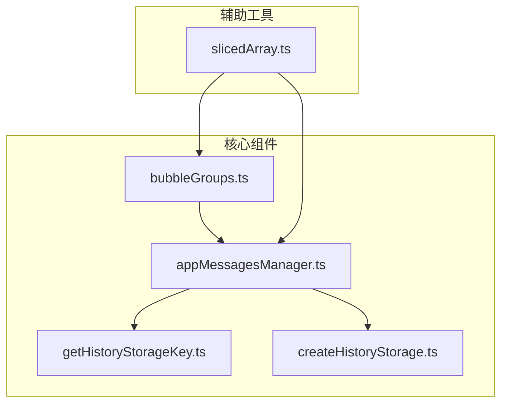
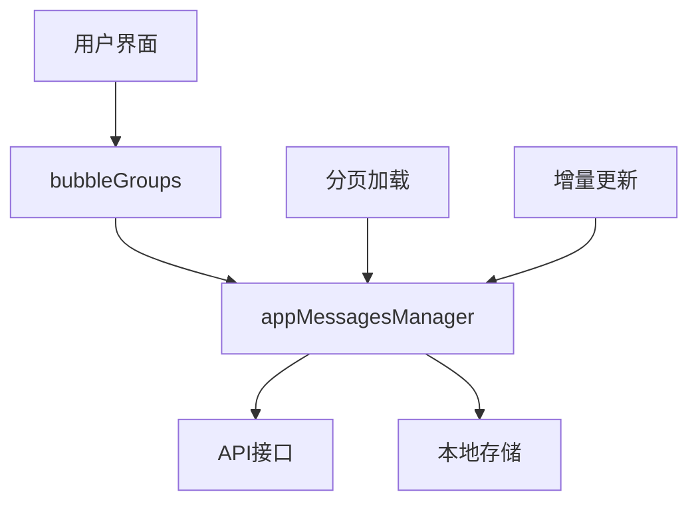
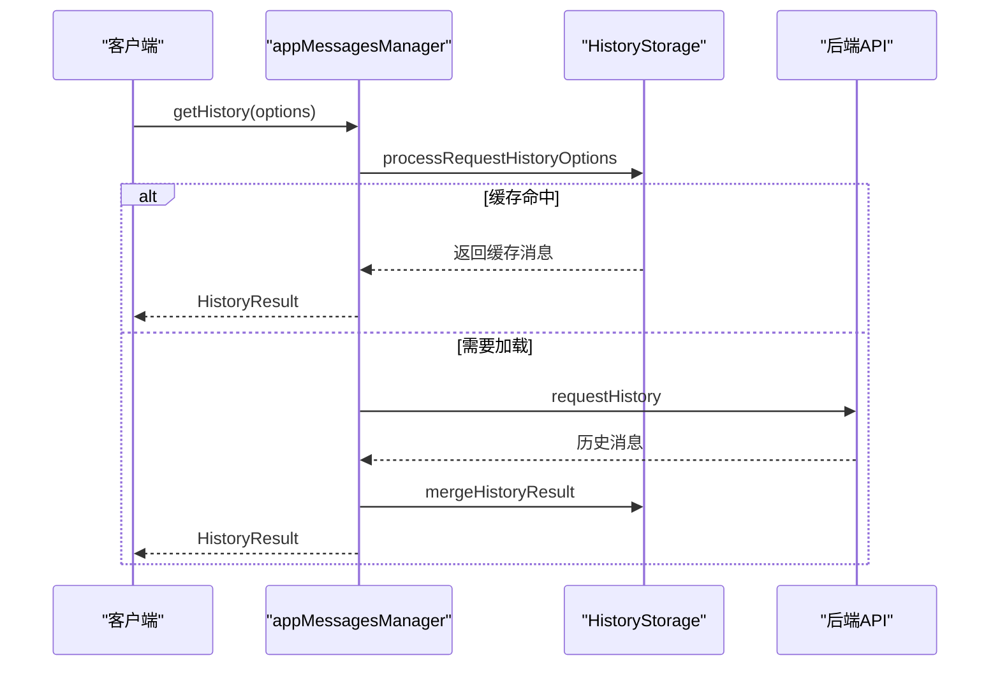
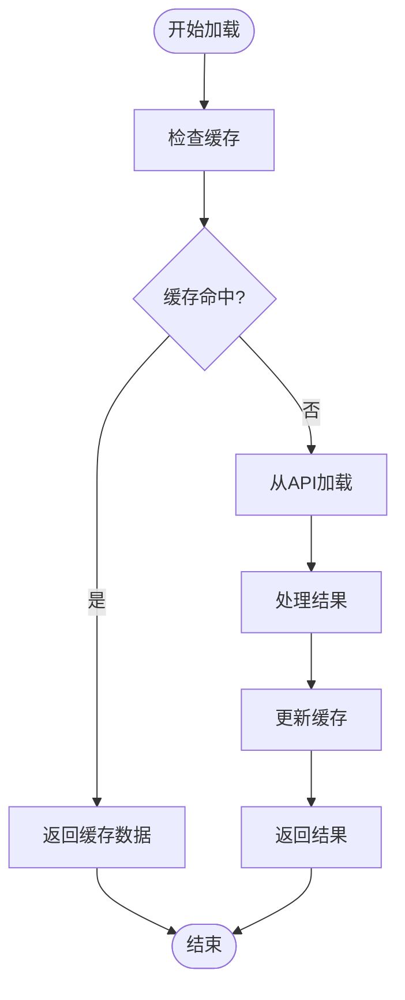
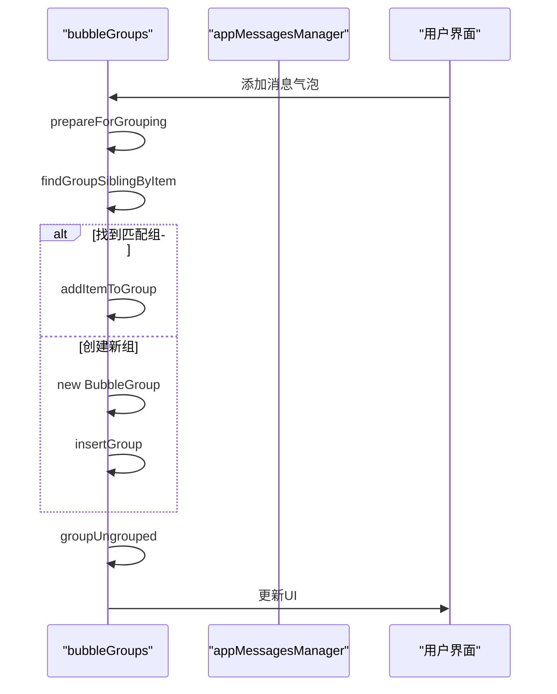
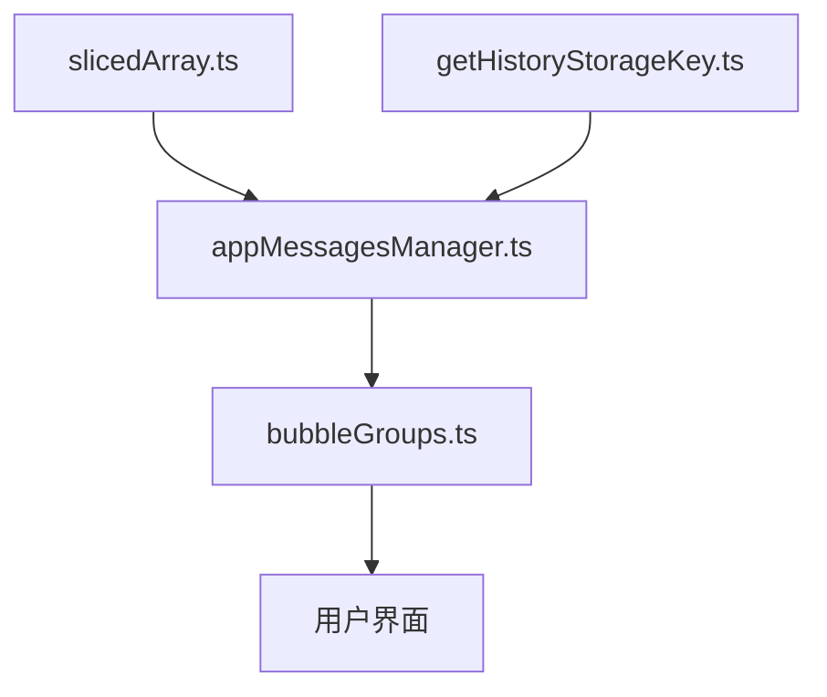

# 消息检索与分页

<cite>
**本文档引用的文件**  
- [appMessagesManager.ts](file://src\lib\appManagers\appMessagesManager.ts)
- [bubbleGroups.ts](file://src\components\chat\bubbleGroups.ts)
- [getHistoryStorageKey.ts](file://src\lib\appManagers\utils\messages\getHistoryStorageKey.ts)
- [createHistoryStorage.ts](file://src\lib\appManagers\utils\messages\createHistoryStorage.ts)
- [slicedArray.ts](file://src\helpers\slicedArray.ts)
</cite>

## 目录
1. [引言](#引言)
2. [项目结构](#项目结构)
3. [核心组件](#核心组件)
4. [架构概述](#架构概述)
5. [详细组件分析](#详细组件分析)
6. [依赖分析](#依赖分析)
7. [性能考虑](#性能考虑)
8. [故障排除指南](#故障排除指南)
9. [结论](#结论)
10. [附录](#附录) (如有必要)

## 引言
本文档旨在全面记录消息检索与分页功能的实现细节。重点分析appMessagesManager中消息获取API的实现，详细说明分页加载策略和增量更新机制。文档将解释getHistoryStorageKey如何生成唯一的存储键用于消息检索，分析bubbleGroups组件如何与消息管理器协作实现消息的分组显示和滚动加载，并描述API调用的参数配置、响应处理和错误恢复机制。

## 项目结构
项目结构显示了消息检索与分页功能的核心文件位于`src/lib/appManagers/`和`src/components/chat/`目录下。主要组件包括appMessagesManager.ts用于消息管理，bubbleGroups.ts用于消息气泡分组，以及相关的工具函数文件。



**Diagram sources**
- [appMessagesManager.ts](file://src\lib\appManagers\appMessagesManager.ts)
- [bubbleGroups.ts](file://src\components\chat\bubbleGroups.ts)
- [getHistoryStorageKey.ts](file://src\lib\appManagers\utils\messages\getHistoryStorageKey.ts)
- [createHistoryStorage.ts](file://src\lib\appManagers\utils\messages\createHistoryStorage.ts)
- [slicedArray.ts](file://src\helpers\slicedArray.ts)

**Section sources**
- [appMessagesManager.ts](file://src\lib\appManagers\appMessagesManager.ts)
- [bubbleGroups.ts](file://src\components\chat\bubbleGroups.ts)

## 核心组件
核心组件包括appMessagesManager中的消息检索API和bubbleGroups中的消息分组显示。appMessagesManager负责管理消息的获取、存储和分页，而bubbleGroups负责将消息按逻辑分组并渲染到UI中。

**Section sources**
- [appMessagesManager.ts](file://src\lib\appManagers\appMessagesManager.ts#L398-L8704)
- [bubbleGroups.ts](file://src\components\chat\bubbleGroups.ts#L64-L781)

## 架构概述
系统架构采用分层设计，消息管理器负责与后端API通信并管理本地消息存储，而UI组件负责消息的分组和显示。分页机制通过HistoryStorage和SlicedArray实现，确保高效的消息加载和内存管理。



**Diagram sources**
- [appMessagesManager.ts](file://src\lib\appManagers\appMessagesManager.ts)
- [bubbleGroups.ts](file://src\components\chat\bubbleGroups.ts)

## 详细组件分析

### appMessagesManager分析
appMessagesManager是消息管理的核心组件，负责消息的获取、存储和分页。它通过getHistory方法实现分页加载，利用HistoryStorage和SlicedArray进行高效的消息管理。

#### 消息检索API


**Diagram sources**
- [appMessagesManager.ts](file://src\lib\appManagers\appMessagesManager.ts#L8338-L8888)

#### 分页加载策略
分页加载策略基于offset_id和add_offset参数实现，遵循Telegram API的分页规则。系统通过SlicedArray管理消息切片，确保高效的数据访问和内存使用。



**Diagram sources**
- [appMessagesManager.ts](file://src\lib\appManagers\appMessagesManager.ts#L8350-L8390)
- [slicedArray.ts](file://src\helpers\slicedArray.ts#L345-L393)

### getHistoryStorageKey分析
getHistoryStorageKey函数负责生成唯一的存储键，用于标识不同的消息历史存储。该键由类型、对等体ID、过滤器和线程ID等参数组合而成。

#### 存储键生成机制
```mermaid
classDiagram
class getHistoryStorageKey {
+type : string
+peerId : PeerId
+threadId : number
+monoforumThreadId : PeerId
+filter : string
+getHistoryStorageKey(options) : HistoryStorageKey
+getSearchStorageFilterKey(options) : SearchStorageFilterKey
}
getHistoryStorageKey --> HistoryStorage : "生成"
HistoryStorage : key : HistoryStorageKey
```

**Diagram sources**
- [getHistoryStorageKey.ts](file://src\lib\appManagers\utils\messages\getHistoryStorageKey.ts#L5-L32)

### bubbleGroups分析
bubbleGroups组件负责将消息按发送者、时间戳等条件分组，并渲染到UI中。它与appMessagesManager紧密协作，实现消息的分组显示和滚动加载。

#### 消息分组机制


**Diagram sources**
- [bubbleGroups.ts](file://src\components\chat\bubbleGroups.ts#L749-L781)

## 依赖分析
系统组件之间存在明确的依赖关系。appMessagesManager依赖于slicedArray进行消息存储管理，bubbleGroups依赖于appMessagesManager获取消息数据，而getHistoryStorageKey为两者提供统一的存储键生成机制。



**Diagram sources**
- [appMessagesManager.ts](file://src\lib\appManagers\appMessagesManager.ts)
- [bubbleGroups.ts](file://src\components\chat\bubbleGroups.ts)
- [getHistoryStorageKey.ts](file://src\lib\appManagers\utils\messages\getHistoryStorageKey.ts)
- [slicedArray.ts](file://src\helpers\slicedArray.ts)

**Section sources**
- [appMessagesManager.ts](file://src\lib\appManagers\appMessagesManager.ts)
- [bubbleGroups.ts](file://src\components\chat\bubbleGroups.ts)
- [getHistoryStorageKey.ts](file://src\lib\appManagers\utils\messages\getHistoryStorageKey.ts)
- [slicedArray.ts](file://src\helpers\slicedArray.ts)

## 性能考虑
系统在设计时充分考虑了性能因素。通过SlicedArray的分片存储机制，避免了大规模数组操作的性能问题。分页加载策略减少了不必要的网络请求，而增量更新机制确保了UI的高效刷新。

## 故障排除指南
常见问题包括消息加载失败、分页不正确和UI更新延迟。解决方案包括检查网络连接、验证存储键生成逻辑和调试分页参数。

**Section sources**
- [appMessagesManager.ts](file://src\lib\appManagers\appMessagesManager.ts#L9051-L9075)
- [bubbleGroups.ts](file://src\components\chat\bubbleGroups.ts#L382-L395)

## 结论
消息检索与分页功能通过appMessagesManager和bubbleGroups组件的协同工作，实现了高效的消息管理和显示。系统采用分层架构和分片存储机制，确保了良好的性能和可维护性。