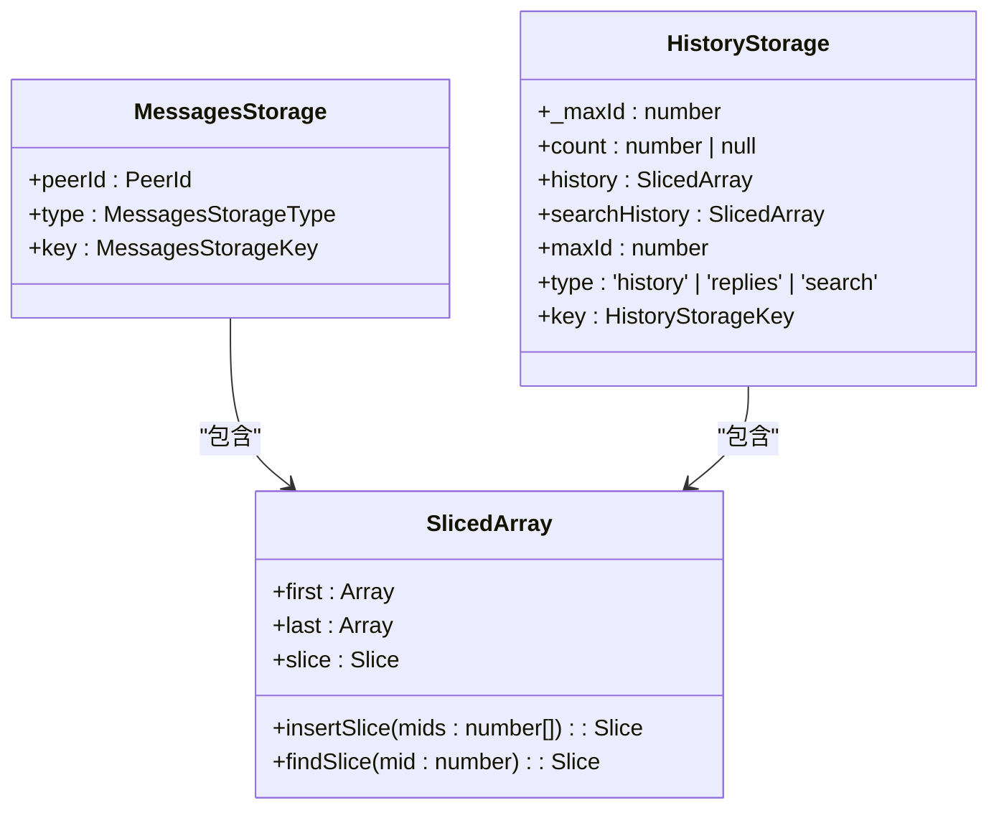
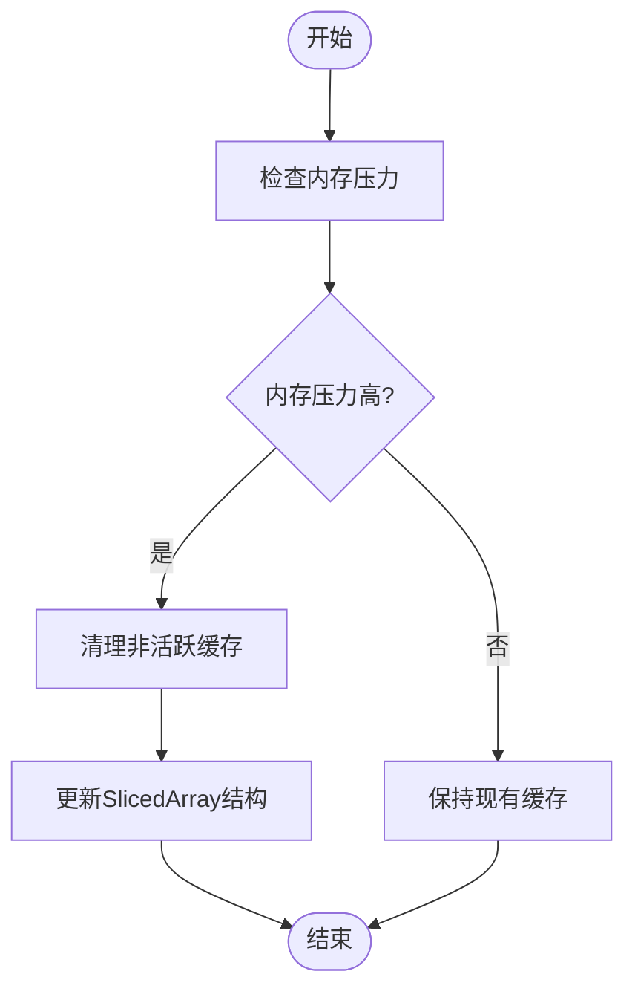
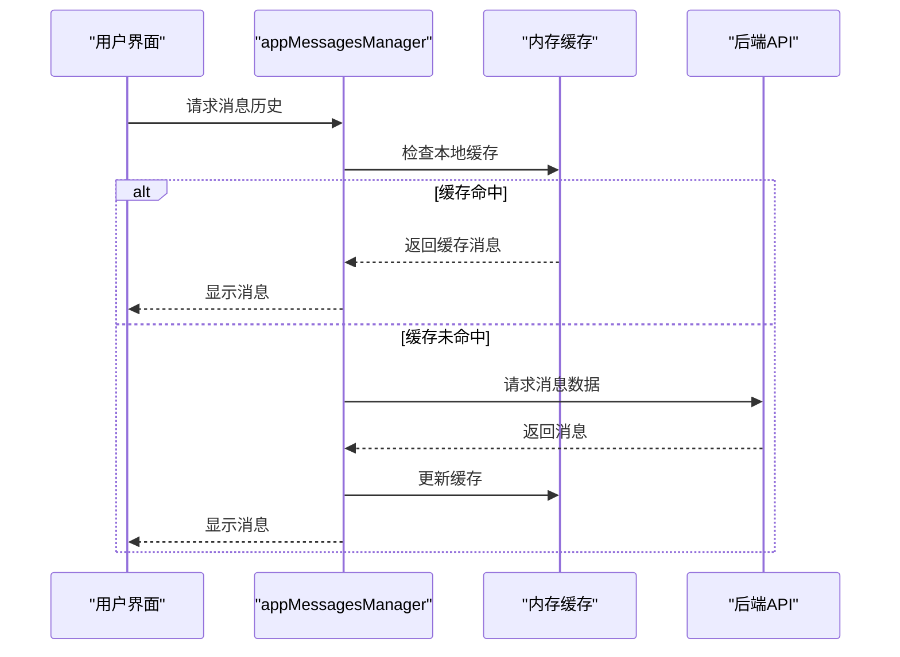
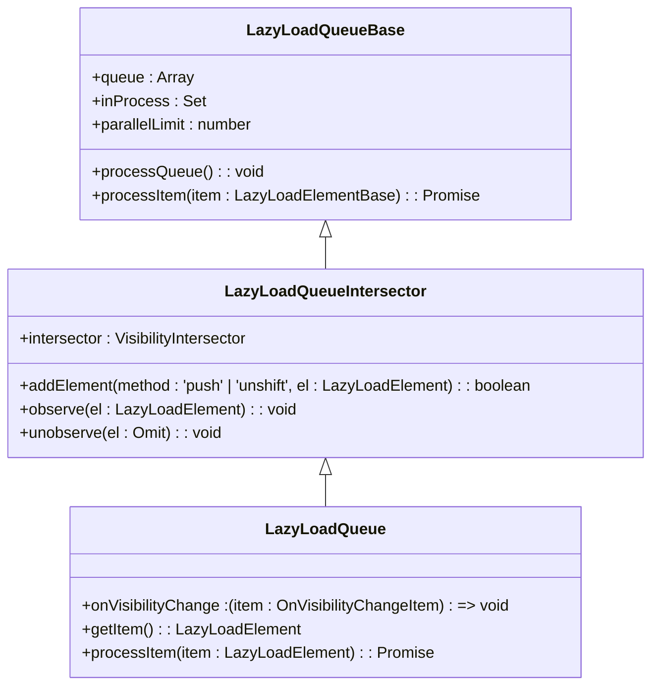
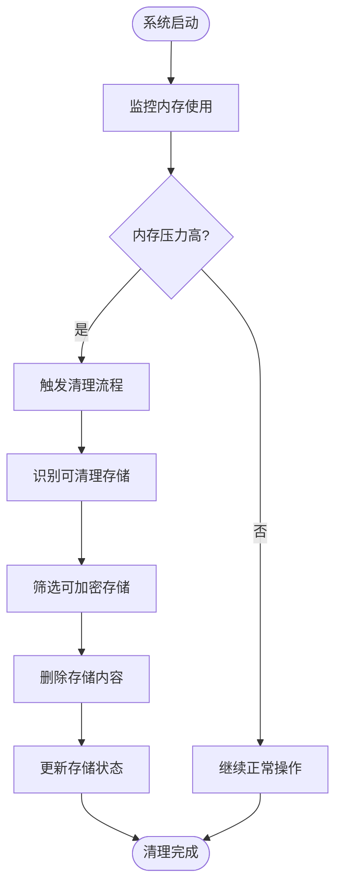

# 消息缓存与内存管理

<cite>
**本文档引用的文件**   
- [appMessagesManager.ts](file://src/lib/appManagers/appMessagesManager.ts)
- [lazyLoadQueue.ts](file://src/components/lazyLoadQueue.ts)
- [lazyLoadQueueBase.ts](file://src/components/lazyLoadQueueBase.ts)
- [lazyLoadQueueIntersector.ts](file://src/components/lazyLoadQueueIntersector.ts)
- [cacheStorage.ts](file://src/lib/files/cacheStorage.ts)
- [storage.ts](file://src/lib/storage.ts)
- [createHistoryStorage.ts](file://src/lib/appManagers/utils/messages/createHistoryStorage.ts)
- [historyStorages.ts](file://src/stores/historyStorages.ts)
</cite>

## 目录
1. [简介](#简介)
2. [消息缓存策略设计](#消息缓存策略设计)
3. [appMessagesManager内存管理机制](#appmessagesmanager内存管理机制)
4. [lazyLoadQueue优化机制](#lazyloadqueue优化机制)
5. [内存压力下的系统行为](#内存压力下的系统行为)
6. [缓存命中率监控与优化](#缓存命中率监控与优化)
7. [结论](#结论)

## 简介

本文档深入分析消息缓存与内存管理系统的实现机制，重点关注appMessagesManager如何平衡消息缓存的性能优势与内存占用的权衡，以及lazyLoadQueue如何优化消息加载过程。系统通过精心设计的缓存策略、内存回收机制和懒加载技术，确保在提供流畅用户体验的同时，有效控制内存使用。

**Section sources**
- [appMessagesManager.ts](file://src/lib/appManagers/appMessagesManager.ts#L1-L100)

## 消息缓存策略设计

### 缓存容量控制

消息缓存系统通过分层存储结构实现容量控制。核心组件appMessagesManager使用Map数据结构作为内存缓存，为不同类型的对话（如普通聊天、主题、已保存对话）创建独立的MessagesStorage实例。每个MessagesStorage实例通过peerId和类型标识，确保缓存隔离。

**Diagram sources**
- [appMessagesManager.ts](file://src/lib/appManagers/appMessagesManager.ts#L200-L203)
- [createHistoryStorage.ts](file://src/lib/appManagers/utils/messages/createHistoryStorage.ts#L1-L50)

### 过期策略与内存回收

系统采用基于访问频率和内存压力的综合过期策略。当内存压力增大时，系统会自动清理非活跃的缓存数据。HistoryStorage中的SlicedArray结构通过维护first和last两个数组，实现对消息历史的高效管理，只保留最近访问的消息片段。

**Diagram sources**
- [appMessagesManager.ts](file://src/lib/appManagers/appMessagesManager.ts#L3685-L3804)
- [storage.ts](file://src/lib/storage.ts#L202-L248)

## appMessagesManager内存管理机制

### 缓存结构与数据流

appMessagesManager是消息缓存系统的核心，负责管理所有消息的生命周期。它通过多个存储容器管理不同类型的消息：

- `messagesStorageByPeerId`: 按对等体ID存储普通聊天消息
- `scheduledMessagesStorage`: 存储定时发送的消息
- `historiesStorage`: 管理消息历史记录
- `searchesStorage`: 处理搜索结果缓存

**Diagram sources**
- [appMessagesManager.ts](file://src/lib/appManagers/appMessagesManager.ts#L399-L418)
- [appMessagesManager.ts](file://src/lib/appManagers/appMessagesManager.ts#L8338-L8453)

### 性能与内存权衡

appMessagesManager通过多种机制平衡性能与内存使用：

1. **延迟加载**: 只在需要时加载消息内容
2. **缓存分层**: 区分热数据和冷数据
3. **智能预取**: 预测用户可能访问的消息并提前加载

系统通过`getHistory`方法的`fetchIfWasNotFetched`参数控制是否在缓存未命中时自动从服务器获取数据，从而避免不必要的网络请求。

**Section sources**
- [appMessagesManager.ts](file://src/lib/appManagers/appMessagesManager.ts#L8338-L8799)

## lazyLoadQueue优化机制

### 懒加载队列设计

lazyLoadQueue系统通过VisibilityIntersector和LazyLoadQueueIntersector组件实现智能懒加载。当元素进入视口时，系统才开始加载其内容，显著减少初始内存占用。

**Diagram sources**
- [lazyLoadQueueBase.ts](file://src/components/lazyLoadQueueBase.ts#L1-L145)
- [lazyLoadQueueIntersector.ts](file://src/components/lazyLoadQueueIntersector.ts#L1-L101)
- [lazyLoadQueue.ts](file://src/components/lazyLoadQueue.ts#L1-L76)

### 优化消息加载过程

lazyLoadQueue通过以下方式优化消息加载：

1. **可见性检测**: 使用Intersection Observer API检测元素是否在视口中
2. **并行限制**: 通过parallelLimit参数控制同时加载的元素数量
3. **优先级管理**: 根据元素可见性调整加载优先级

系统通过`onVisibilityChange`回调函数处理元素可见性变化，将可见元素移动到队列前端优先处理。

**Section sources**
- [lazyLoadQueue.ts](file://src/components/lazyLoadQueue.ts#L1-L76)
- [lazyLoadQueueIntersector.ts](file://src/components/lazyLoadQueueIntersector.ts#L1-L101)

## 内存压力下的系统行为

### 缓存清理策略

当系统检测到内存压力时，会启动缓存清理流程。CacheStorageController组件提供多种清理方法：

- `deleteAll()`: 删除整个数据库
- `clearEncryptableStorages()`: 清理可加密存储
- `temporarilyToggle()`: 临时禁用存储

**Diagram sources**
- [cacheStorage.ts](file://src/lib/files/cacheStorage.ts#L1-L305)
- [storage.ts](file://src/lib/storage.ts#L370-L416)

### 性能优化措施

系统实施多项性能优化措施：

1. **存储切换**: 通过`toggleStorage`方法动态启用/禁用存储
2. **批量操作**: 使用`batchUpdatesDebounced`进行批量更新
3. **延迟执行**: 通过`debounce`和`throttle`控制函数调用频率

这些措施确保系统在高负载下仍能保持响应性。

**Section sources**
- [cacheStorage.ts](file://src/lib/files/cacheStorage.ts#L264-L322)
- [appMessagesManager.ts](file://src/lib/appManagers/appMessagesManager.ts#L694-L705)

## 缓存命中率监控与优化

### 监控机制

系统通过多种方式监控缓存性能：

1. **命中率统计**: 跟踪缓存命中与未命中的比例
2. **访问频率分析**: 记录不同消息的访问频率
3. **内存使用监控**: 实时监控内存占用情况

### 优化最佳实践

基于监控数据，系统实施以下优化策略：

1. **热点数据预加载**: 对高频访问的消息进行预加载
2. **冷数据淘汰**: 定期清理长时间未访问的缓存数据
3. **动态容量调整**: 根据系统资源动态调整缓存大小

这些策略确保缓存系统始终处于最优状态，提供最佳的性能与内存使用平衡。

**Section sources**
- [appMessagesManager.ts](file://src/lib/appManagers/appMessagesManager.ts#L694-L705)
- [cacheStorage.ts](file://src/lib/files/cacheStorage.ts#L264-L322)

## 结论

消息缓存与内存管理系统通过精心设计的架构和多种优化技术，成功实现了性能与资源使用的平衡。appMessagesManager作为核心组件，通过分层存储和智能缓存策略有效管理消息数据。lazyLoadQueue系统则通过可见性检测和优先级管理，优化了消息加载过程，减少了不必要的内存消耗。在内存压力下，系统能够自动清理缓存，确保应用稳定运行。通过持续监控和优化，系统能够适应不同的使用场景，为用户提供流畅的聊天体验。