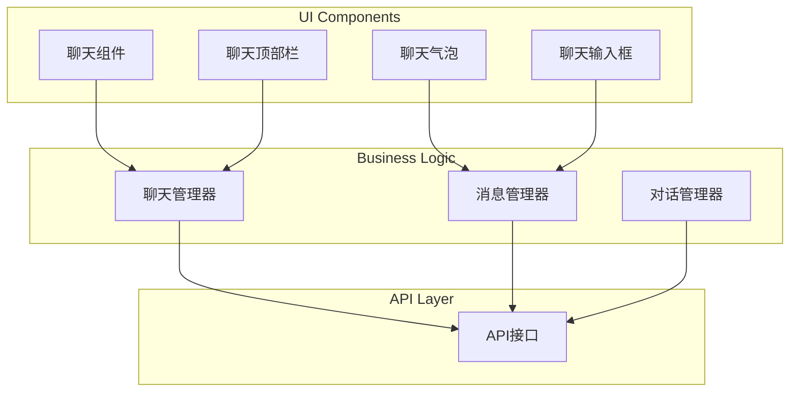
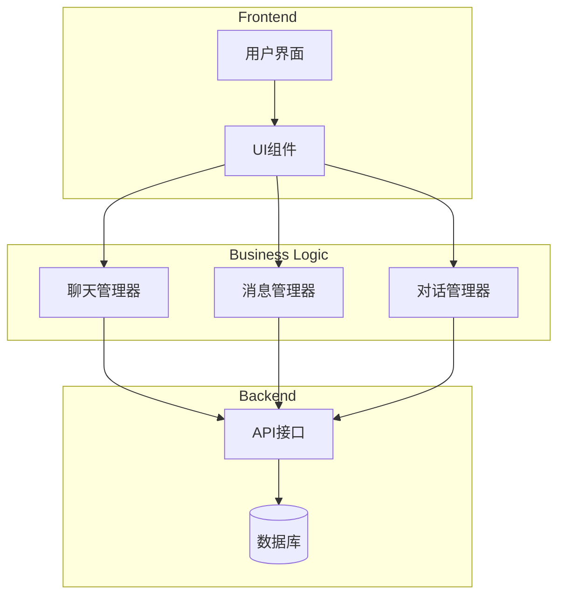
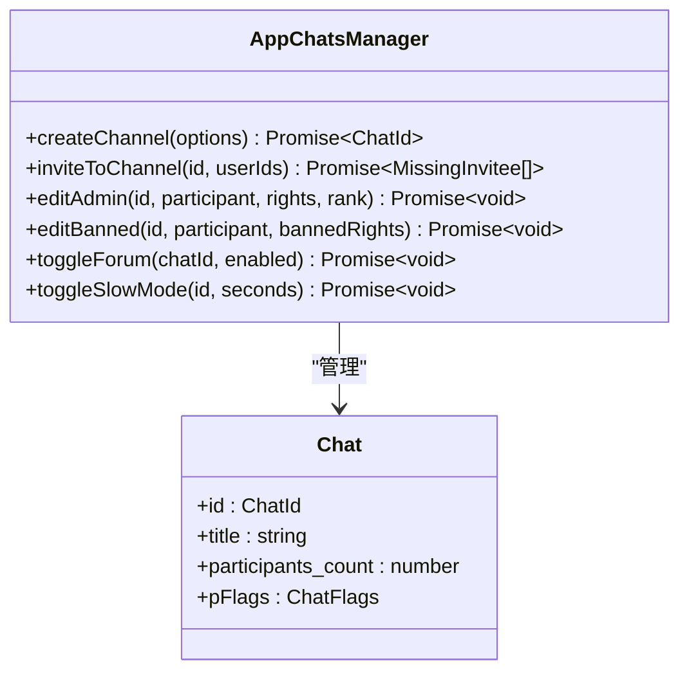
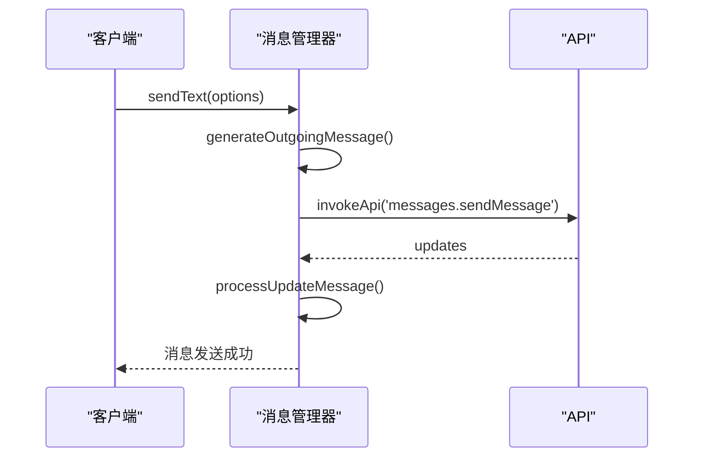
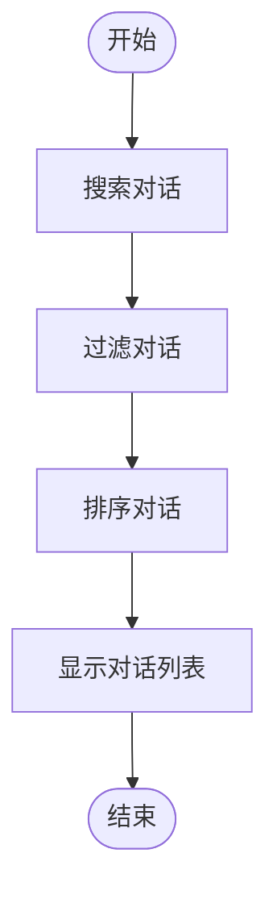
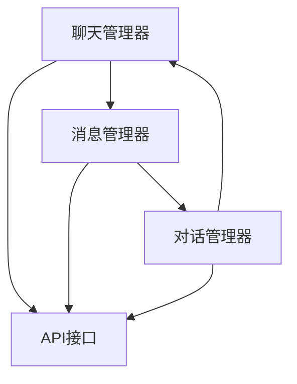

# 聊天API

<cite>
**本文档引用的文件**   
- [appChatsManager.ts](file://src/lib/appManagers/appChatsManager.ts)
- [appMessagesManager.ts](file://src/lib/appManagers/appMessagesManager.ts)
- [appDialogsManager.ts](file://src/lib/appManagers/appDialogsManager.ts)
- [chat.ts](file://src/components/chat/chat.ts)
- [actions.ts](file://src/components/chat/actions.ts)
</cite>

## 目录
1. [简介](#简介)
2. [项目结构](#项目结构)
3. [核心组件](#核心组件)
4. [架构概述](#架构概述)
5. [详细组件分析](#详细组件分析)
6. [依赖分析](#依赖分析)
7. [性能考虑](#性能考虑)
8. [故障排除指南](#故障排除指南)
9. [结论](#结论)

## 简介
本文档旨在全面记录聊天API的功能，重点介绍群组创建、成员管理、权限设置等聊天管理功能。文档详细说明了聊天会话状态和消息历史的管理机制，描述了聊天主题、话题和论坛功能的实现方式，并提供了聊天搜索、过滤和归档的API使用指南。此外，文档还解释了聊天通知设置和消息提醒的配置选项，以及聊天安全策略和内容审核的实现细节。

## 项目结构
项目结构清晰地组织了聊天功能相关的组件和管理器。核心聊天功能主要分布在`src/components/chat`和`src/lib/appManagers`目录中。`src/components/chat`包含聊天界面的UI组件，如气泡、顶部栏和输入框。`src/lib/appManagers`则包含聊天、消息和对话的管理器，负责处理业务逻辑和与后端API的交互。

**Diagram sources**
- [chat.ts](file://src/components/chat/chat.ts)
- [appChatsManager.ts](file://src/lib/appManagers/appChatsManager.ts)
- [appMessagesManager.ts](file://src/lib/appManagers/appMessagesManager.ts)

**Section sources**
- [appChatsManager.ts](file://src/lib/appManagers/appChatsManager.ts)
- [appMessagesManager.ts](file://src/lib/appManagers/appMessagesManager.ts)
- [appDialogsManager.ts](file://src/lib/appManagers/appDialogsManager.ts)

## 核心组件
核心组件包括聊天管理器、消息管理器和对话管理器。聊天管理器负责处理群组创建、成员管理和权限设置。消息管理器管理聊天会话状态和消息历史。对话管理器处理聊天搜索、过滤和归档功能。

**Section sources**
- [appChatsManager.ts](file://src/lib/appManagers/appChatsManager.ts)
- [appMessagesManager.ts](file://src/lib/appManagers/appMessagesManager.ts)
- [appDialogsManager.ts](file://src/lib/appManagers/appDialogsManager.ts)

## 架构概述
系统架构采用分层设计，前端UI组件与后端API通过业务逻辑层进行交互。聊天管理器、消息管理器和对话管理器共同协作，提供完整的聊天功能。

**Diagram sources**
- [appChatsManager.ts](file://src/lib/appManagers/appChatsManager.ts)
- [appMessagesManager.ts](file://src/lib/appManagers/appMessagesManager.ts)
- [appDialogsManager.ts](file://src/lib/appManagers/appDialogsManager.ts)

## 详细组件分析

### 聊天管理器分析
聊天管理器负责处理群组创建、成员管理和权限设置。它提供了创建频道、邀请用户、编辑管理员权限和设置聊天权限等功能。

#### 聊天管理器类图

**Diagram sources**
- [appChatsManager.ts](file://src/lib/appManagers/appChatsManager.ts)

### 消息管理器分析
消息管理器负责管理聊天会话状态和消息历史。它提供了发送消息、编辑消息、删除消息和管理消息历史等功能。

#### 消息管理器序列图

**Diagram sources**
- [appMessagesManager.ts](file://src/lib/appManagers/appMessagesManager.ts)

### 对话管理器分析
对话管理器负责处理聊天搜索、过滤和归档功能。它提供了搜索对话、过滤对话和管理对话列表等功能。

#### 对话管理器流程图

**Diagram sources**
- [appDialogsManager.ts](file://src/lib/appManagers/appDialogsManager.ts)

**Section sources**
- [appChatsManager.ts](file://src/lib/appManagers/appChatsManager.ts)
- [appMessagesManager.ts](file://src/lib/appManagers/appMessagesManager.ts)
- [appDialogsManager.ts](file://src/lib/appManagers/appDialogsManager.ts)

## 依赖分析
组件之间的依赖关系清晰，聊天管理器、消息管理器和对话管理器相互协作，共同提供完整的聊天功能。

**Diagram sources**
- [appChatsManager.ts](file://src/lib/appManagers/appChatsManager.ts)
- [appMessagesManager.ts](file://src/lib/appManagers/appMessagesManager.ts)
- [appDialogsManager.ts](file://src/lib/appManagers/appDialogsManager.ts)

## 性能考虑
在性能方面，系统采用了懒加载队列和缓存机制来优化资源加载和数据处理。聊天管理器和消息管理器都实现了缓存功能，以减少对后端API的频繁调用。

## 故障排除指南
常见问题包括消息发送失败、聊天加载缓慢和权限设置不生效。建议检查网络连接、API调用日志和权限配置。

**Section sources**
- [appChatsManager.ts](file://src/lib/appManagers/appChatsManager.ts)
- [appMessagesManager.ts](file://src/lib/appManagers/appMessagesManager.ts)
- [appDialogsManager.ts](file://src/lib/appManagers/appDialogsManager.ts)

## 结论
本文档全面记录了聊天API的功能和实现细节，为开发者提供了详细的参考。通过理解聊天管理器、消息管理器和对话管理器的工作原理，开发者可以更好地利用API构建功能丰富的聊天应用。