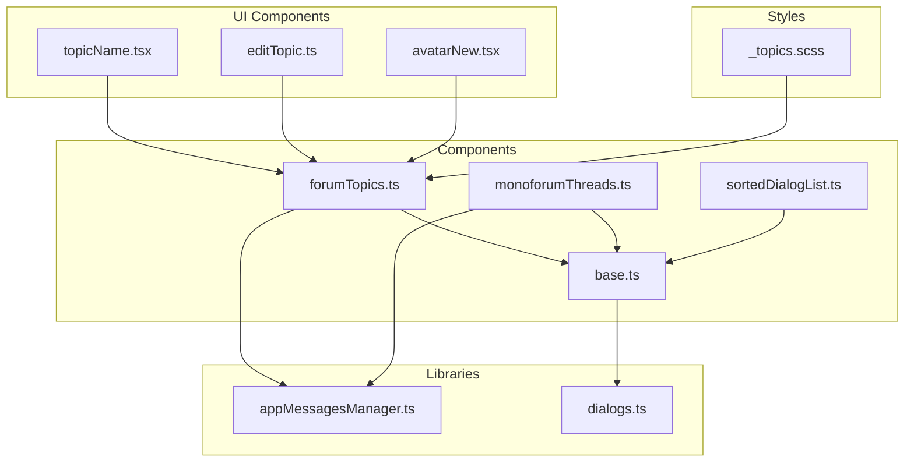
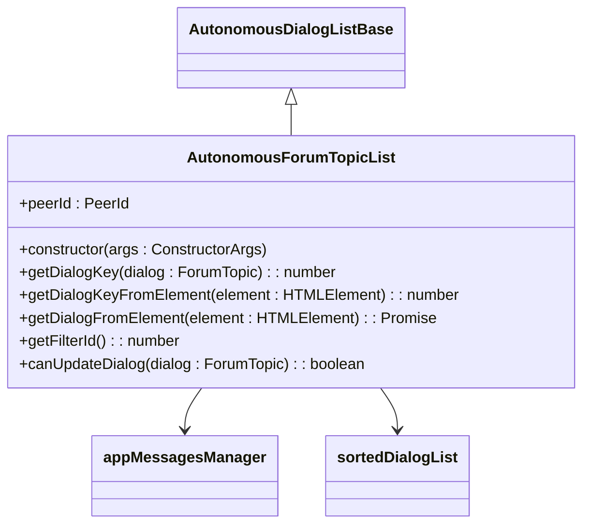
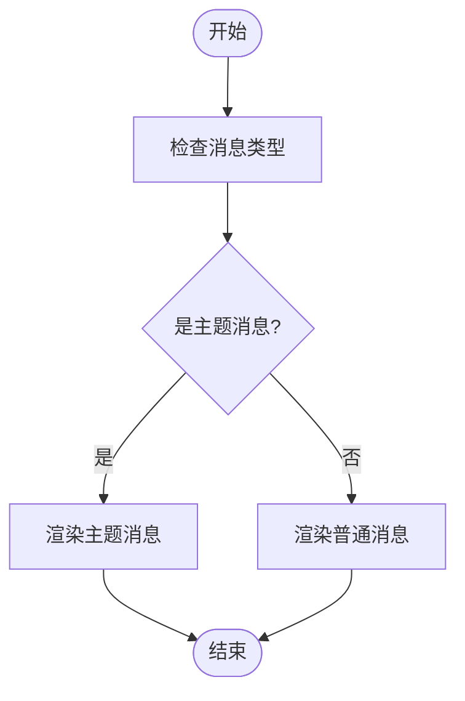
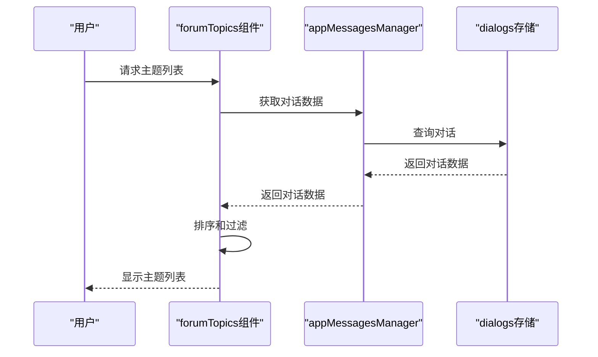
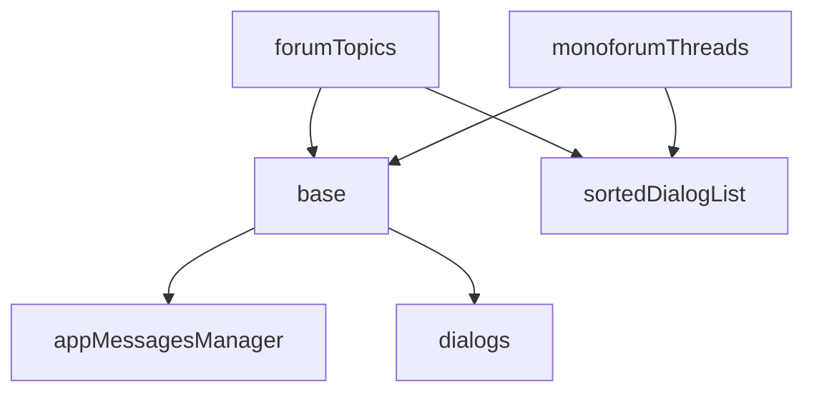

# 主题显示逻辑

<cite>
**本文档引用的文件**
- [forumTopics.ts](file://src/components/autonomousDialogList/forumTopics.ts)
- [monoforumThreads.ts](file://src/components/autonomousDialogList/monoforumThreads.ts)
- [base.ts](file://src/components/autonomousDialogList/base.ts)
- [sortedDialogList.ts](file://src/components/sortedDialogList.ts)
- [appMessagesManager.ts](file://src/lib/appManagers/appMessagesManager.ts)
- [dialogs.ts](file://src/lib/storages/dialogs.ts)
- [topicName.tsx](file://src/components/sidebarRight/tabs/adminRecentActions/topicName.tsx)
- [editTopic.ts](file://src/components/sidebarRight/tabs/editTopic.ts)
- [_topics.scss](file://src/scss/partials/_topics.scss)
- [avatarNew.tsx](file://src/components/avatarNew.tsx)
</cite>

## 目录
1. [简介](#简介)
2. [项目结构](#项目结构)
3. [核心组件](#核心组件)
4. [架构概述](#架构概述)
5. [详细组件分析](#详细组件分析)
6. [依赖分析](#依赖分析)
7. [性能考虑](#性能考虑)
8. [故障排除指南](#故障排除指南)
9. [结论](#结论)

## 简介
本文档深入探讨了论坛主题（forumTopics）和单一论坛线程（monoforumThreads）组件如何渲染主题列表和话题内容。文档详细说明了主题消息与普通消息在用户界面（UI）上的区别处理，包括布局、样式和交互差异。此外，文档还描述了主题列表的排序算法和过滤逻辑，并提供了实际使用示例，展示主题在不同场景下的显示效果和性能优化策略。

## 项目结构
项目结构清晰地组织了各个组件和模块，确保了代码的可维护性和可扩展性。`src/components/autonomousDialogList` 目录下包含了 `forumTopics.ts` 和 `monoforumThreads.ts` 文件，这些文件是实现主题列表渲染的核心组件。`src/lib/appManagers` 目录下的 `appMessagesManager.ts` 文件提供了管理消息和对话的逻辑，而 `src/lib/storages` 目录下的 `dialogs.ts` 文件则负责存储和管理对话数据。



**图表来源**
- [forumTopics.ts](file://src/components/autonomousDialogList/forumTopics.ts)
- [monoforumThreads.ts](file://src/components/autonomousDialogList/monoforumThreads.ts)
- [base.ts](file://src/components/autonomousDialogList/base.ts)
- [sortedDialogList.ts](file://src/components/sortedDialogList.ts)
- [appMessagesManager.ts](file://src/lib/appManagers/appMessagesManager.ts)
- [dialogs.ts](file://src/lib/storages/dialogs.ts)
- [topicName.tsx](file://src/components/sidebarRight/tabs/adminRecentActions/topicName.tsx)
- [editTopic.ts](file://src/components/sidebarRight/tabs/editTopic.ts)
- [_topics.scss](file://src/scss/partials/_topics.scss)
- [avatarNew.tsx](file://src/components/avatarNew.tsx)

**章节来源**
- [forumTopics.ts](file://src/components/autonomousDialogList/forumTopics.ts)
- [monoforumThreads.ts](file://src/components/autonomousDialogList/monoforumThreads.ts)
- [base.ts](file://src/components/autonomousDialogList/base.ts)
- [sortedDialogList.ts](file://src/components/sortedDialogList.ts)
- [appMessagesManager.ts](file://src/lib/appManagers/appMessagesManager.ts)
- [dialogs.ts](file://src/lib/storages/dialogs.ts)
- [topicName.tsx](file://src/components/sidebarRight/tabs/adminRecentActions/topicName.tsx)
- [editTopic.ts](file://src/components/sidebarRight/tabs/editTopic.ts)
- [_topics.scss](file://src/scss/partials/_topics.scss)
- [avatarNew.tsx](file://src/components/avatarNew.tsx)

## 核心组件
`forumTopics.ts` 和 `monoforumThreads.ts` 是实现主题列表渲染的核心组件。`forumTopics.ts` 组件负责处理论坛主题的列表渲染，而 `monoforumThreads.ts` 组件则负责处理单一论坛线程的列表渲染。这两个组件都继承自 `base.ts` 中定义的 `AutonomousDialogListBase` 类，该类提供了基本的对话列表管理功能。

**章节来源**
- [forumTopics.ts](file://src/components/autonomousDialogList/forumTopics.ts)
- [monoforumThreads.ts](file://src/components/autonomousDialogList/monoforumThreads.ts)
- [base.ts](file://src/components/autonomousDialogList/base.ts)

## 架构概述
系统架构采用了分层设计，确保了各组件之间的解耦和高内聚。`forumTopics.ts` 和 `monoforumThreads.ts` 组件通过 `base.ts` 中的 `AutonomousDialogListBase` 类与 `appMessagesManager.ts` 和 `dialogs.ts` 进行交互，实现了主题列表的动态加载和更新。`sortedDialogList.ts` 组件负责管理对话列表的排序和显示，确保了用户界面的流畅性和响应性。

```mermaid
classDiagram
class AutonomousDialogListBase {
+peerId : PeerId
+placeholderOptions : Object
+listenerSetter : ListenerSetter
+sortedList : SortedDialogList
+scrollable : Scrollable
+getDialogKey(dialog : ForumTopic) : number
+getDialogKeyFromElement(element : HTMLElement) : number
+getDialogFromElement(element : HTMLElement) : Promise<ForumTopic>
+getFilterId() : number
+canUpdateDialog(dialog : ForumTopic) : boolean
}
class AutonomousForumTopicList {
+peerId : PeerId
+constructor(args : ConstructorArgs)
+getDialogKey(dialog : ForumTopic) : number
+getDialogKeyFromElement(element : HTMLElement) : number
+getDialogFromElement(element : HTMLElement) : Promise<ForumTopic>
+getFilterId() : number
+canUpdateDialog(dialog : ForumTopic) : boolean
}
class AutonomousMonoforumThreadList {
+peerId : PeerId
+onEmpty : () => void
+constructor(args : ConstructorArgs)
+getDialogKey(dialog : MonoforumDialog) : number
+getDialogKeyFromElement(element : HTMLElement) : number
+getDialogFromElement(element : HTMLElement) : Promise<MonoforumDialog>
+getFilterId() : number
+dialogsFetcher(offsetIndex : number, limit : number) : Promise<{dialogs : MonoforumDialog[], count : number, isEnd : boolean}>
}
AutonomousDialogListBase <|-- AutonomousForumTopicList
AutonomousDialogListBase <|-- AutonomousMonoforumThreadList
AutonomousForumTopicList --> appMessagesManager
AutonomousMonoforumThreadList --> appMessagesManager
AutonomousDialogListBase --> dialogs
AutonomousForumTopicList --> sortedDialogList
AutonomousMonoforumThreadList --> sortedDialogList
```

**图表来源**
- [forumTopics.ts](file://src/components/autonomousDialogList/forumTopics.ts)
- [monoforumThreads.ts](file://src/components/autonomousDialogList/monoforumThreads.ts)
- [base.ts](file://src/components/autonomousDialogList/base.ts)
- [sortedDialogList.ts](file://src/components/sortedDialogList.ts)
- [appMessagesManager.ts](file://src/lib/appManagers/appMessagesManager.ts)
- [dialogs.ts](file://src/lib/storages/dialogs.ts)

## 详细组件分析

### forumTopics 组件分析
`forumTopics.ts` 组件继承自 `AutonomousDialogListBase` 类，实现了论坛主题列表的渲染。该组件通过 `peerId` 参数指定要渲染的主题所属的论坛，通过 `placeholderOptions` 配置占位符的样式。组件监听了多个事件，如 `peer_typings`、`dialogs_multiupdate`、`dialog_unread` 等，以确保主题列表的实时更新。

#### 类图


**图表来源**
- [forumTopics.ts](file://src/components/autonomousDialogList/forumTopics.ts)
- [base.ts](file://src/components/autonomousDialogList/base.ts)
- [appMessagesManager.ts](file://src/lib/appManagers/appMessagesManager.ts)
- [sortedDialogList.ts](file://src/components/sortedDialogList.ts)

### monoforumThreads 组件分析
`monoforumThreads.ts` 组件同样继承自 `AutonomousDialogListBase` 类，但专门用于处理单一论坛线程的列表渲染。该组件通过 `peerId` 参数指定要渲染的线程所属的论坛，通过 `onEmpty` 回调函数处理列表为空的情况。组件监听了 `monoforum_dialogs_update`、`monoforum_draft_update` 和 `monoforum_dialogs_drop` 事件，以确保线程列表的实时更新。

#### 类图
```mermaid
classDiagram
class AutonomousMonoforumThreadList {
+peerId : PeerId
+onEmpty : () => void
+constructor(args : ConstructorArgs)
+getDialogKey(dialog : MonoforumDialog) : number
+getDialogKeyFromElement(element : HTMLElement) : number
+getDialogFromElement(element : HTMLElement) : Promise<MonoforumDialog>
+getFilterId() : number
+dialogsFetcher(offsetIndex : number, limit : number) : Promise<{dialogs : MonoforumDialog[], count : number, isEnd : boolean}>
}
AutonomousDialogListBase <|-- AutonomousMonoforumThreadList
AutonomousMonoforumThreadList --> appMessagesManager
AutonomousMonoforumThreadList --> sortedDialogList
```

**图表来源**
- [monoforumThreads.ts](file://src/components/autonomousDialogList/monoforumThreads.ts)
- [base.ts](file://src/components/autonomousDialogList/base.ts)
- [appMessagesManager.ts](file://src/lib/appManagers/appMessagesManager.ts)
- [sortedDialogList.ts](file://src/components/sortedDialogList.ts)

### 主题消息与普通消息的UI差异
主题消息与普通消息在UI上的主要差异体现在布局、样式和交互上。主题消息通常包含更多的元数据，如作者、发布时间、回复数等，这些信息在UI上以不同的方式呈现。例如，主题消息的标题通常会显示在消息内容的上方，而普通消息则直接显示内容。此外，主题消息的样式也更加丰富，可能包含图标、颜色等视觉元素，以增强用户的阅读体验。

#### 流程图


**图表来源**
- [topicName.tsx](file://src/components/sidebarRight/tabs/adminRecentActions/topicName.tsx)
- [editTopic.ts](file://src/components/sidebarRight/tabs/editTopic.ts)
- [avatarNew.tsx](file://src/components/avatarNew.tsx)

### 主题列表的排序算法和过滤逻辑
主题列表的排序算法基于 `getDialogIndex` 函数，该函数根据对话的创建时间、置顶状态等属性计算出一个索引值，用于排序。过滤逻辑则通过 `testDialogForFilter` 方法实现，该方法检查对话是否符合当前过滤条件。例如，如果用户选择了“未读”过滤器，则只有未读的对话才会被显示。

#### 序列图


**图表来源**
- [forumTopics.ts](file://src/components/autonomousDialogList/forumTopics.ts)
- [appMessagesManager.ts](file://src/lib/appManagers/appMessagesManager.ts)
- [dialogs.ts](file://src/lib/storages/dialogs.ts)

**章节来源**
- [forumTopics.ts](file://src/components/autonomousDialogList/forumTopics.ts)
- [monoforumThreads.ts](file://src/components/autonomousDialogList/monoforumThreads.ts)
- [base.ts](file://src/components/autonomousDialogList/base.ts)
- [sortedDialogList.ts](file://src/components/sortedDialogList.ts)
- [appMessagesManager.ts](file://src/lib/appManagers/appMessagesManager.ts)
- [dialogs.ts](file://src/lib/storages/dialogs.ts)
- [topicName.tsx](file://src/components/sidebarRight/tabs/adminRecentActions/topicName.tsx)
- [editTopic.ts](file://src/components/sidebarRight/tabs/editTopic.ts)
- [_topics.scss](file://src/scss/partials/_topics.scss)
- [avatarNew.tsx](file://src/components/avatarNew.tsx)

## 依赖分析
`forumTopics.ts` 和 `monoforumThreads.ts` 组件依赖于 `base.ts` 中的 `AutonomousDialogListBase` 类，该类提供了基本的对话列表管理功能。此外，这两个组件还依赖于 `appMessagesManager.ts` 和 `dialogs.ts`，用于获取和管理对话数据。`sortedDialogList.ts` 组件负责管理对话列表的排序和显示，确保了用户界面的流畅性和响应性。



**图表来源**
- [forumTopics.ts](file://src/components/autonomousDialogList/forumTopics.ts)
- [monoforumThreads.ts](file://src/components/autonomousDialogList/monoforumThreads.ts)
- [base.ts](file://src/components/autonomousDialogList/base.ts)
- [sortedDialogList.ts](file://src/components/sortedDialogList.ts)
- [appMessagesManager.ts](file://src/lib/appManagers/appMessagesManager.ts)
- [dialogs.ts](file://src/lib/storages/dialogs.ts)

**章节来源**
- [forumTopics.ts](file://src/components/autonomousDialogList/forumTopics.ts)
- [monoforumThreads.ts](file://src/components/autonomousDialogList/monoforumThreads.ts)
- [base.ts](file://src/components/autonomousDialogList/base.ts)
- [sortedDialogList.ts](file://src/components/sortedDialogList.ts)
- [appMessagesManager.ts](file://src/lib/appManagers/appMessagesManager.ts)
- [dialogs.ts](file://src/lib/storages/dialogs.ts)

## 性能考虑
为了提高性能，`forumTopics.ts` 和 `monoforumThreads.ts` 组件采用了虚拟列表技术，只渲染当前可见的对话项，减少了DOM操作的开销。此外，组件还使用了缓存机制，避免重复请求相同的数据。排序和过滤操作也在客户端进行，减少了服务器的负担。

## 故障排除指南
如果主题列表无法正确显示，可以检查以下几点：
1. 确认 `peerId` 参数是否正确。
2. 检查 `appMessagesManager` 和 `dialogs` 存储是否正常工作。
3. 确认 `sortedDialogList` 是否正确配置了排序和过滤逻辑。
4. 检查网络请求是否成功，确保数据能够正确加载。

**章节来源**
- [forumTopics.ts](file://src/components/autonomousDialogList/forumTopics.ts)
- [monoforumThreads.ts](file://src/components/autonomousDialogList/monoforumThreads.ts)
- [base.ts](file://src/components/autonomousDialogList/base.ts)
- [sortedDialogList.ts](file://src/components/sortedDialogList.ts)
- [appMessagesManager.ts](file://src/lib/appManagers/appMessagesManager.ts)
- [dialogs.ts](file://src/lib/storages/dialogs.ts)

## 结论
本文档详细介绍了 `forumTopics` 和 `monoforumThreads` 组件如何渲染主题列表和话题内容，以及主题消息与普通消息在UI上的区别处理。通过深入分析组件的架构、依赖关系和性能优化策略，本文档为开发者提供了全面的技术指导，帮助他们更好地理解和使用这些组件。