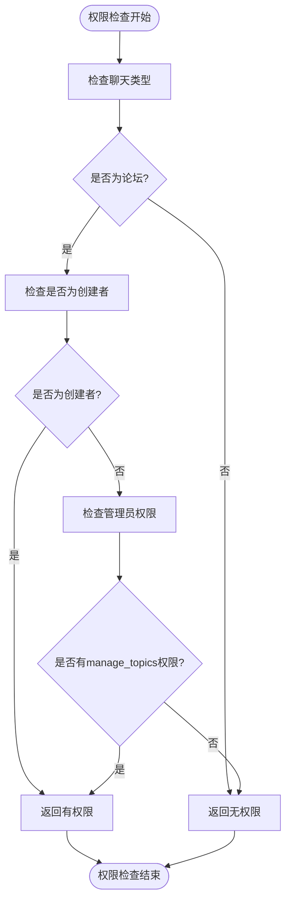
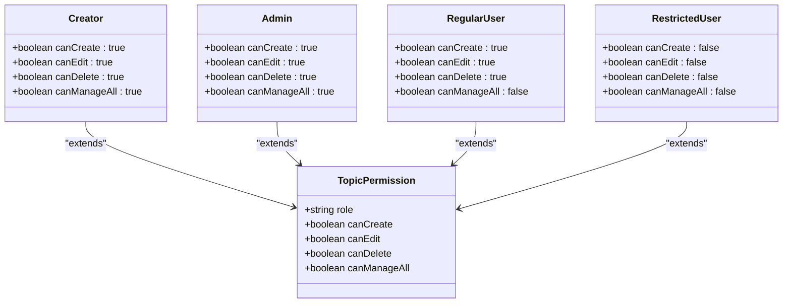
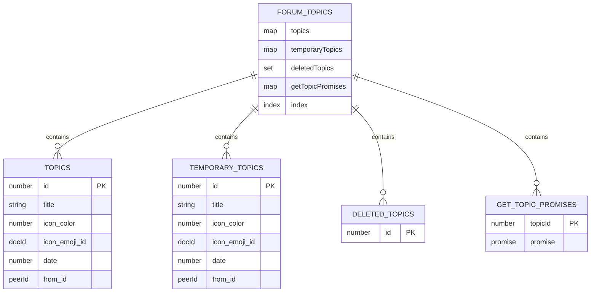
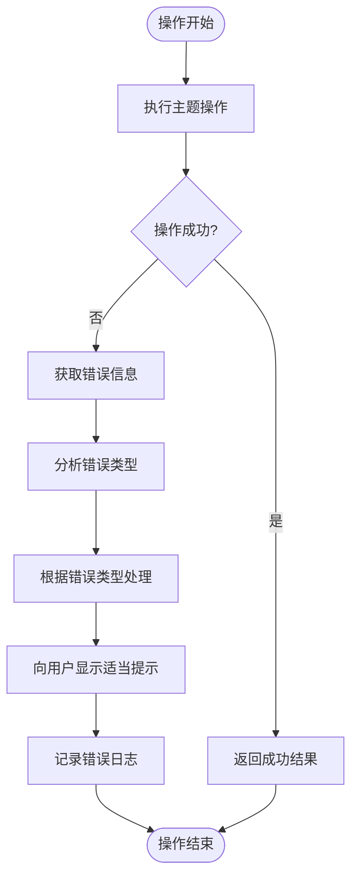

# 主题管理

<cite>
**本文档引用的文件**  
- [appChatsManager.ts](file://src/lib/appManagers/appChatsManager.ts)
- [appMessagesManager.ts](file://src/lib/appManagers/appMessagesManager.ts)
- [dialogs.ts](file://src/lib/storages/dialogs.ts)
- [editTopic.ts](file://src/components/sidebarRight/tabs/editTopic.ts)
- [mtproto_config.ts](file://src/lib/mtproto/mtproto_config.ts)
- [hasRights.ts](file://src/lib/appManagers/utils/chats/hasRights.ts)
- [messageActionTextNewUnsafe.ts](file://src/components/wrappers/messageActionTextNewUnsafe.ts)
</cite>

## 目录
1. [简介](#简介)
2. [核心方法实现](#核心方法实现)
3. [主题权限控制逻辑](#主题权限控制逻辑)
4. [主题元数据存储结构](#主题元数据存储结构)
5. [API使用示例](#api使用示例)
6. [错误处理](#错误处理)

## 简介
本文档详细介绍了聊天主题管理功能的实现机制，包括主题的创建、编辑和删除等核心方法。文档深入分析了主题权限控制逻辑，说明了谁可以创建、编辑和删除主题。同时，文档描述了主题元数据的存储结构，如标题、图标、创建时间等信息。通过实际代码示例，展示了如何通过API创建和管理聊天主题，以及如何处理相关错误情况。

## 核心方法实现

### createTopic 方法
`createForumTopic` 方法用于创建新的聊天主题。该方法接受包含对等方ID、标题、图标颜色和表情符号ID的选项对象。方法首先检查频道ID，然后获取频道完整信息以确定默认发送者。接着调用API创建主题，并处理更新消息。创建成功后，生成临时主题并添加到历史存储中。

**Section sources**
- [appMessagesManager.ts](file://src/lib/appManagers/appMessagesManager.ts#L6433-L6458)
- [editTopic.ts](file://src/components/sidebarRight/tabs/editTopic.ts#L104-L108)

### editTopic 方法
`editForumTopic` 方法用于编辑现有聊天主题。该方法允许修改主题的标题、图标表情符号、关闭状态和隐藏状态。方法通过调用 `messages.editForumTopic` API实现，传递对等方ID、主题ID和要修改的属性。编辑操作会触发更新消息处理，确保界面同步。

**Section sources**
- [appMessagesManager.ts](file://src/lib/appManagers/appMessagesManager.ts#L6412-L6431)
- [editTopic.ts](file://src/components/sidebarRight/tabs/editTopic.ts#L92-L97)

### deleteTopic 方法
主题删除功能通过将主题设置为隐藏状态来实现。`editForumTopic` 方法被调用并设置 `hidden` 参数为 `true`。系统还提供了关闭主题的功能，通过设置 `closed` 参数实现。删除操作会从缓存中移除主题，并触发相应的事件通知。

**Section sources**
- [appMessagesManager.ts](file://src/lib/appManagers/appMessagesManager.ts#L6412-L6431)
- [dialogs.ts](file://src/lib/storages/dialogs.ts#L1818-L1823)

## 主题权限控制逻辑

### 权限检查机制
主题管理权限通过 `hasRights` 函数进行检查。该函数根据聊天类型、用户角色和权限标志来确定用户是否有权执行特定操作。对于主题管理，关键权限标志是 `manage_topics`。



**Diagram sources**
- [hasRights.ts](file://src/lib/appManagers/utils/chats/hasRights.ts#L154-L157)
- [dialogs.ts](file://src/lib/storages/dialogs.ts#L1898-L1905)

### 权限层级
主题管理权限遵循以下层级规则：
- **创建者**：拥有所有权限，可以管理所有主题
- **管理员**：如果具有 `manage_topics` 权限，可以管理所有主题
- **普通用户**：只能管理自己创建的主题
- **受限用户**：无法创建或管理主题



**Diagram sources**
- [appChatsManager.ts](file://src/lib/appManagers/appChatsManager.ts#L263-L265)
- [hasRights.ts](file://src/lib/appManagers/utils/chats/hasRights.ts#L154-L157)

**Section sources**
- [appChatsManager.ts](file://src/lib/appManagers/appChatsManager.ts#L263-L265)
- [hasRights.ts](file://src/lib/appManagers/utils/chats/hasRights.ts#L154-L157)

## 主题元数据存储结构

### 主题数据模型
主题元数据存储在 `ForumTopic` 结构中，包含以下主要字段：

| 字段名 | 类型 | 描述 | 是否必填 |
|--------|------|------|----------|
| id | number | 主题ID | 是 |
| peerId | PeerId | 对等方ID | 是 |
| date | number | 创建时间戳 | 是 |
| from_id | PeerId | 创建者ID | 是 |
| title | string | 主题标题 | 是 |
| icon_color | number | 图标颜色 | 是 |
| icon_emoji_id | DocId | 图标表情符号ID | 否 |
| top_message | number | 顶部消息ID | 是 |
| read_inbox_max_id | number | 已读收件箱最大ID | 是 |
| read_outbox_max_id | number | 已读发件箱最大ID | 是 |
| unread_count | number | 未读消息计数 | 是 |
| pFlags | object | 标志位集合 | 是 |

**Section sources**
- [dialogs.ts](file://src/lib/storages/dialogs.ts#L1849-L1856)
- [mtproto_config.ts](file://src/lib/mtproto/mtproto_config.ts#L25)

### 存储管理
主题存储通过 `DialogsStorage` 类管理，使用内存缓存和持久化存储相结合的方式。系统维护了多个映射来高效访问主题数据：



**Diagram sources**
- [dialogs.ts](file://src/lib/storages/dialogs.ts#L1716-L1721)
- [appMessagesManager.ts](file://src/lib/appManagers/appMessagesManager.ts#L6504-L6506)

**Section sources**
- [dialogs.ts](file://src/lib/storages/dialogs.ts#L1712-L1726)

## API使用示例

### 创建主题
```javascript
// 创建新主题
const topicId = await appMessagesManager.createForumTopic({
  peerId: chatPeerId,
  title: '新主题',
  iconColor: TOPIC_COLORS[0],
  iconEmojiId: '5390854796011906616'
});
```

### 编辑主题
```javascript
// 编辑现有主题
await appMessagesManager.editForumTopic({
  peerId: chatPeerId,
  topicId: 12345,
  title: '更新后的主题名称',
  iconEmojiId: '5390854796011906617'
});
```

### 关闭主题
```javascript
// 关闭主题
await appMessagesManager.editForumTopic({
  peerId: chatPeerId,
  topicId: 12345,
  closed: true
});
```

### 隐藏主题
```javascript
// 隐藏主题
await appMessagesManager.editForumTopic({
  peerId: chatPeerId,
  topicId: 12345,
  hidden: true
});
```

**Section sources**
- [appMessagesManager.ts](file://src/lib/appManagers/appMessagesManager.ts#L6412-L6431)
- [editTopic.ts](file://src/components/sidebarRight/tabs/editTopic.ts#L92-L108)

## 错误处理

### 常见错误类型
系统在主题管理过程中可能遇到以下常见错误：

| 错误类型 | 原因 | 处理建议 |
|---------|------|---------|
| CHANNEL_FORUM_MISSING | 频道不是论坛类型 | 检查聊天类型，确保是论坛 |
| USER_NOT_MUTUAL_CONTACT | 用户不是互相关注 | 提示用户需要先建立联系 |
| CHAT_ADMIN_REQUIRED | 需要管理员权限 | 提示用户需要管理员权限 |
| FORUM_TOPIC_TITLE_EMPTY | 主题标题为空 | 验证标题不为空 |
| FORUM_TOPIC_TITLE_TOO_LONG | 标题过长 | 限制标题长度不超过70字符 |

### 错误处理流程


**Diagram sources**
- [appMessagesManager.ts](file://src/lib/appManagers/appMessagesManager.ts#L6459-L6545)
- [editTopic.ts](file://src/components/sidebarRight/tabs/editTopic.ts#L98-L102)

**Section sources**
- [appMessagesManager.ts](file://src/lib/appManagers/appMessagesManager.ts#L6459-L6545)
- [editTopic.ts](file://src/components/sidebarRight/tabs/editTopic.ts#L98-L102)