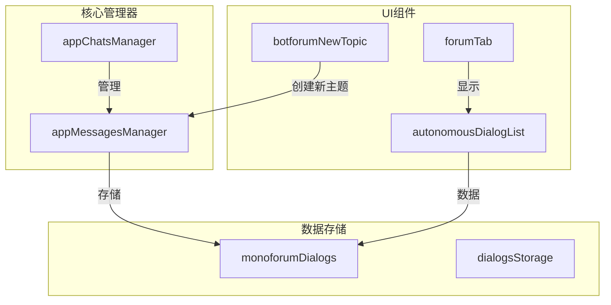
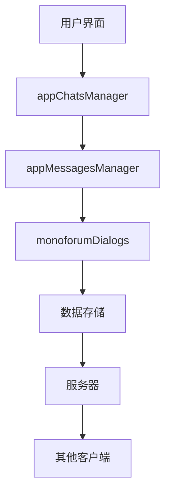
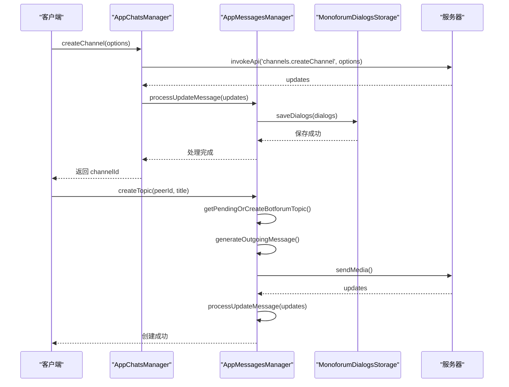
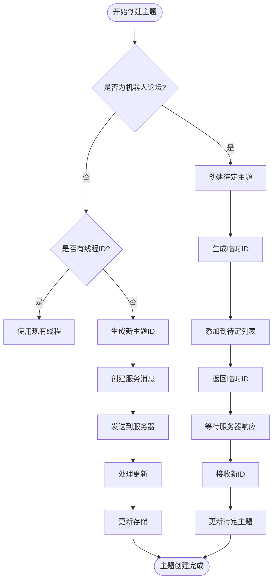
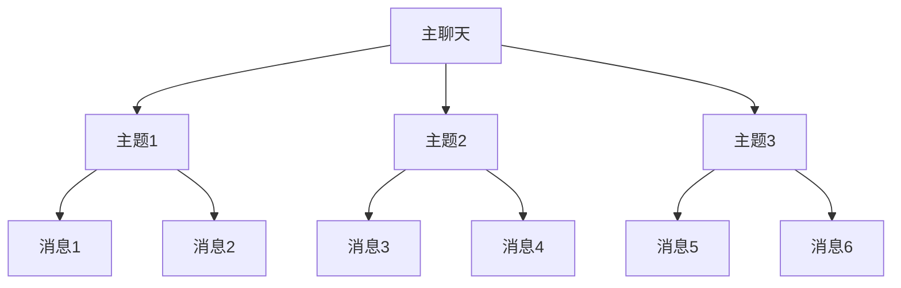
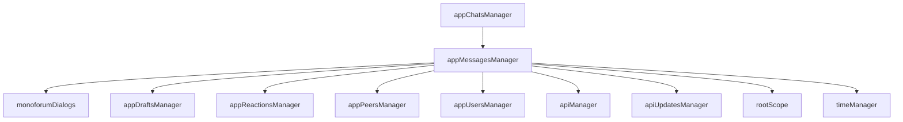

# 聊天主题与论坛

<cite>
**本文档引用的文件**   
- [appChatsManager.ts](file://src/lib/appManagers/appChatsManager.ts)
- [appMessagesManager.ts](file://src/lib/appManagers/appMessagesManager.ts)
- [forumTopics.ts](file://src/components/autonomousDialogList/forumTopics.ts)
- [forumTab.ts](file://src/components/forumTab/forumTab.ts)
- [monoforumDialogs.ts](file://src/lib/storages/monoforumDialogs.ts)
- [botforumNewTopic.tsx](file://src/components/chat/bubbleParts/botforumNewTopic.tsx)
</cite>

## 目录
1. [简介](#简介)
2. [项目结构](#项目结构)
3. [核心组件](#核心组件)
4. [架构概述](#架构概述)
5. [详细组件分析](#详细组件分析)
6. [依赖分析](#依赖分析)
7. [性能考虑](#性能考虑)
8. [故障排除指南](#故障排除指南)
9. [结论](#结论)

## 简介
本文档深入探讨了聊天主题与论坛功能的实现机制。重点分析了主题创建、话题管理、论坛结构等API的实现方式，详细描述了appChatsManager中与主题管理相关的方法，包括createTopic、editTopic等。同时解释了主题消息的存储结构和显示逻辑，以及如何与普通消息区分开来。此外，还说明了论坛模式的特殊功能，如主题列表、话题排序等，并提供了实际使用示例，展示如何通过API创建和管理聊天主题。

## 项目结构
项目结构清晰地组织了聊天主题与论坛相关的组件和管理器。主要功能分布在`src/lib/appManagers`目录下的管理器类中，而UI组件则位于`src/components`目录下。这种分层设计使得业务逻辑与界面展示分离，便于维护和扩展。



**图表来源**
- [appChatsManager.ts](file://src/lib/appManagers/appChatsManager.ts)
- [appMessagesManager.ts](file://src/lib/appManagers/appMessagesManager.ts)
- [forumTab.ts](file://src/components/forumTab/forumTab.ts)
- [forumTopics.ts](file://src/components/autonomousDialogList/forumTopics.ts)
- [monoforumDialogs.ts](file://src/lib/storages/monoforumDialogs.ts)
- [botforumNewTopic.tsx](file://src/components/chat/bubbleParts/botforumNewTopic.tsx)

**章节来源**
- [appChatsManager.ts](file://src/lib/appManagers/appChatsManager.ts)
- [appMessagesManager.ts](file://src/lib/appManagers/appMessagesManager.ts)

## 核心组件

聊天主题与论坛功能的核心组件主要包括`appChatsManager`、`appMessagesManager`和`monoforumDialogs`。这些组件协同工作，实现了主题的创建、编辑、删除和管理功能。`appChatsManager`负责处理与聊天相关的所有操作，`appMessagesManager`管理消息的发送和接收，而`monoforumDialogs`则专门用于存储和管理单论坛对话。

**章节来源**
- [appChatsManager.ts](file://src/lib/appManagers/appChatsManager.ts#L57-L805)
- [appMessagesManager.ts](file://src/lib/appManagers/appMessagesManager.ts#L1-L2000)
- [monoforumDialogs.ts](file://src/lib/storages/monoforumDialogs.ts#L1-L505)

## 架构概述

系统架构采用分层设计，将业务逻辑、数据存储和用户界面分离。`appChatsManager`作为核心管理器，处理所有与聊天相关的操作，包括创建、编辑和删除主题。`appMessagesManager`负责消息的发送和接收，确保消息的正确传递。`monoforumDialogs`则专门用于存储和管理单论坛对话，提供高效的数据访问。



**图表来源**
- [appChatsManager.ts](file://src/lib/appManagers/appChatsManager.ts)
- [appMessagesManager.ts](file://src/lib/appManagers/appMessagesManager.ts)
- [monoforumDialogs.ts](file://src/lib/storages/monoforumDialogs.ts)

## 详细组件分析

### 主题管理组件分析

#### 对象导向组件
```mermaid
classDiagram
class AppChatsManager {
+createChannel(options) Promise~ChatId~
+editAdmin(id, participant, rights, rank) Promise~void~
+editPhoto(id, inputFile) Promise~void~
+editTitle(id, title) Promise~void~
+editAbout(id, about) Promise~void~
+hasRights(id, action, rights, isThread) boolean
+isForum(id) boolean
+isMegagroup(id) boolean
+isChannel(id) boolean
}
class AppMessagesManager {
+generateOutgoingMessage(peerId, options) Message
+beforeMessageSending(message, options) PendingMessageDetails
+getPendingOrCreateBotforumTopic(args) PendingTopic
+createTopic(peerId, title) Promise~number~
+editTopic(peerId, topicId, title, iconColor) Promise~void~
+deleteTopic(peerId, topicId) Promise~void~
}
class MonoforumDialogsStorage {
+getDialogs(args) Promise~{dialogs, count, isEnd}~
+getDialogByParent(parentPeerId, peerId) MonoforumDialog
+saveDialogs(args) void
+updateDialogIndex(dialog, resort) void
+dropDeletedDialogs(parentPeerId, ids) void
}
AppChatsManager --> AppMessagesManager : "依赖"
AppMessagesManager --> MonoforumDialogsStorage : "使用"
```

**图表来源**
- [appChatsManager.ts](file://src/lib/appManagers/appChatsManager.ts#L57-L805)
- [appMessagesManager.ts](file://src/lib/appManagers/appMessagesManager.ts#L1-L2500)
- [monoforumDialogs.ts](file://src/lib/storages/monoforumDialogs.ts#L1-L505)

#### API/服务组件


**图表来源**
- [appChatsManager.ts](file://src/lib/appManagers/appChatsManager.ts#L431-L438)
- [appMessagesManager.ts](file://src/lib/appManagers/appMessagesManager.ts#L6480-L6540)
- [monoforumDialogs.ts](file://src/lib/storages/monoforumDialogs.ts#L311-L325)

#### 复杂逻辑组件


**图表来源**
- [appMessagesManager.ts](file://src/lib/appManagers/appMessagesManager.ts#L6480-L6540)
- [monoforumDialogs.ts](file://src/lib/storages/monoforumDialogs.ts#L311-L325)

**章节来源**
- [appChatsManager.ts](file://src/lib/appManagers/appChatsManager.ts#L431-L438)
- [appMessagesManager.ts](file://src/lib/appManagers/appMessagesManager.ts#L6480-L6540)
- [monoforumDialogs.ts](file://src/lib/storages/monoforumDialogs.ts#L311-L325)

### 概念概述
聊天主题与论坛功能允许用户在特定聊天中创建和管理多个独立的话题。每个主题都有自己的消息流，可以独立于主聊天进行讨论。这种设计特别适用于大型社区或团队，可以有效地组织和管理不同主题的讨论。



## 依赖分析

系统中的各个组件之间存在明确的依赖关系。`appChatsManager`依赖于`appMessagesManager`来处理消息相关的操作，而`appMessagesManager`又依赖于`monoforumDialogs`来存储和管理单论坛对话。这种依赖关系确保了各组件之间的松耦合，提高了系统的可维护性和可扩展性。



**图表来源**
- [appChatsManager.ts](file://src/lib/appManagers/appChatsManager.ts)
- [appMessagesManager.ts](file://src/lib/appManagers/appMessagesManager.ts)
- [monoforumDialogs.ts](file://src/lib/storages/monoforumDialogs.ts)

**章节来源**
- [appChatsManager.ts](file://src/lib/appManagers/appChatsManager.ts#L57-L805)
- [appMessagesManager.ts](file://src/lib/appManagers/appMessagesManager.ts#L1-L2500)
- [monoforumDialogs.ts](file://src/lib/storages/monoforumDialogs.ts#L1-L505)

## 性能考虑

在实现聊天主题与论坛功能时，性能是一个重要的考虑因素。为了提高性能，系统采用了多种优化策略。例如，使用`SlicedArray`来高效地管理历史消息，避免一次性加载大量数据。此外，通过`BatchQueue`批量处理对话更新，减少了网络请求的次数，提高了响应速度。

## 故障排除指南

在使用聊天主题与论坛功能时，可能会遇到一些常见问题。以下是一些故障排除建议：

1. **主题创建失败**：检查网络连接是否正常，确保服务器端没有返回错误。
2. **消息显示异常**：确认消息的`threadId`是否正确设置，确保消息被正确地归类到相应的主题中。
3. **性能问题**：如果发现加载速度慢，可以尝试减少一次性加载的消息数量，或者优化数据存储结构。

**章节来源**
- [appChatsManager.ts](file://src/lib/appManagers/appChatsManager.ts#L431-L438)
- [appMessagesManager.ts](file://src/lib/appManagers/appMessagesManager.ts#L6480-L6540)
- [monoforumDialogs.ts](file://src/lib/storages/monoforumDialogs.ts#L311-L325)

## 结论

本文档详细介绍了聊天主题与论坛功能的实现机制，涵盖了从核心组件到具体实现的各个方面。通过深入分析`appChatsManager`、`appMessagesManager`和`monoforumDialogs`等关键组件，我们展示了如何高效地创建和管理聊天主题。希望本文档能为开发者提供有价值的参考，帮助他们更好地理解和使用这些功能。