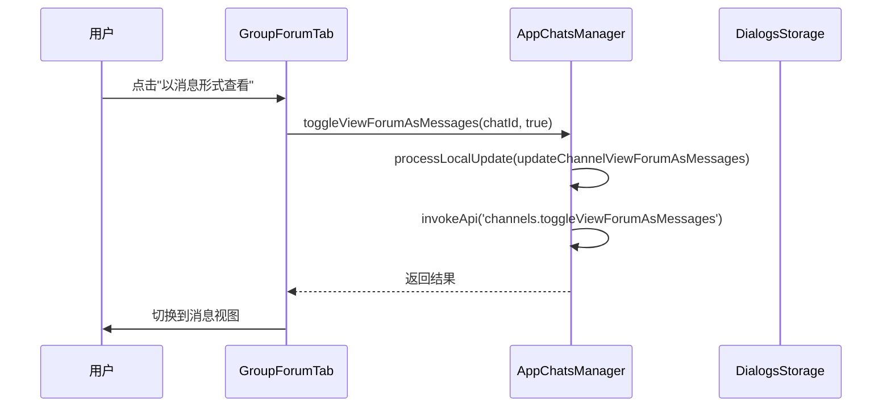
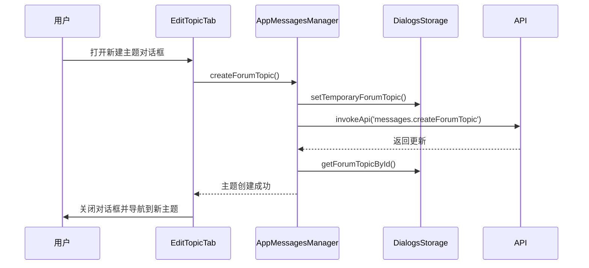
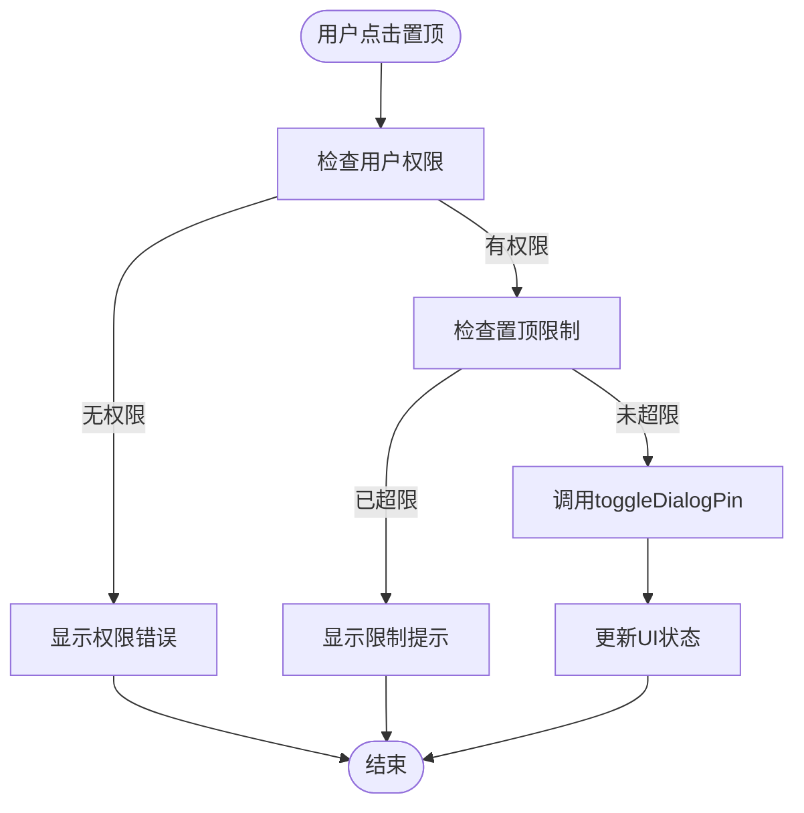
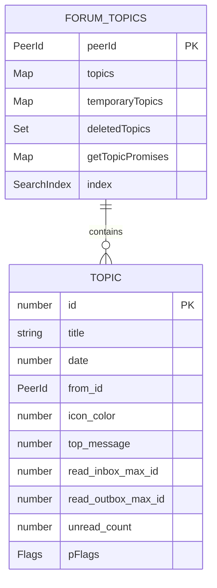
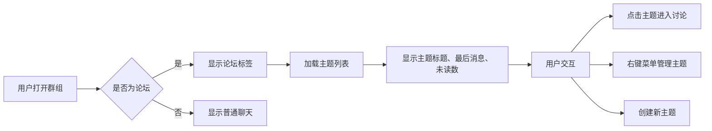

# 论坛结构

<cite>
**本文档引用的文件**  
- [forumTab.ts](file://src/components/forumTab/forumTab.ts)
- [botforumTab.ts](file://src/components/forumTab/botforumTab.ts)
- [groupForumTab.ts](file://src/components/forumTab/groupForumTab.ts)
- [monoforumTab.ts](file://src/components/forumTab/monoforumTab.ts)
- [dialogs.ts](file://src/lib/storages/dialogs.ts)
- [appMessagesManager.ts](file://src/lib/appManagers/appMessagesManager.ts)
- [appChatsManager.ts](file://src/lib/appManagers/appChatsManager.ts)
- [editTopic.ts](file://src/components/sidebarRight/tabs/editTopic.ts)
- [statistics.tsx](file://src/components/sidebarRight/tabs/statistics.tsx)
- [topicName.tsx](file://src/components/sidebarRight/tabs/adminRecentActions/topicName.tsx)
</cite>

## 目录
1. [简介](#简介)
2. [论坛模式转换机制](#论坛模式转换机制)
3. [论坛层级结构设计](#论坛层级结构设计)
4. [主题管理功能](#主题管理功能)
5. [置顶与热门话题实现](#置顶与热门话题实现)
6. [论坛元数据存储与同步](#论坛元数据存储与同步)
7. [使用示例与用户体验](#使用示例与用户体验)
8. [结论](#结论)

## 简介

论坛结构功能允许将聊天转换为论坛模式，提供更结构化的讨论环境。该功能支持多种论坛类型，包括群组论坛、机器人论坛和单论坛模式。论坛通过主题（Topic）组织内容，每个主题可以独立讨论，支持置顶、关闭、隐藏等管理操作。本文档详细解释了论坛的实现机制、层级结构设计以及相关功能的实现方式。

**Section sources**
- [forumTab.ts](file://src/components/forumTab/forumTab.ts#L1-L154)

## 论坛模式转换机制

聊天可以转换为论坛模式，这一过程通过`toggleViewForumAsMessages`方法实现。当用户选择以消息形式查看论坛时，系统会更新对话标志，改变显示模式。该功能允许用户在传统的消息流视图和结构化的论坛视图之间切换。



**Diagram sources**
- [groupForumTab.ts](file://src/components/forumTab/groupForumTab.ts#L161-L168)
- [appChatsManager.ts](file://src/lib/appManagers/appChatsManager.ts#L912-L920)
- [dialogs.ts](file://src/lib/storages/dialogs.ts#L2144-L2154)

**Section sources**
- [groupForumTab.ts](file://src/components/forumTab/groupForumTab.ts#L161-L168)
- [appChatsManager.ts](file://src/lib/appManagers/appChatsManager.ts#L912-L920)
- [dialogs.ts](file://src/lib/storages/dialogs.ts#L2144-L2154)

## 论坛层级结构设计

论坛采用分层结构设计，支持多种论坛类型，每种类型对应不同的实现类。主要的论坛类型包括：

- **BotforumTab**: 机器人论坛，用于机器人相关的讨论
- **GroupForumTab**: 群组论坛，用于群组内的主题讨论
- **MonoforumTab**: 单论坛，用于特定场景的论坛模式

这些论坛类型都继承自基类`ForumTab`，实现了统一的接口和行为。论坛结构通过`AutonomousDialogList`系列组件管理对话列表，使用`SortedDialogList`进行排序和渲染。

```mermaid
classDiagram
class ForumTab {
+peerId : PeerId
+xd : AutonomousDialogListBase
+toggle(value : boolean)
+init(options : {peerId, managers})
}
class BotforumTab {
+dialogsCountI18nEl : HTMLElement
+syncInit()
+asyncInit()
}
class GroupForumTab {
+syncInit()
+asyncInit()
+viewAsMessages()
}
class MonoforumTab {
+dialogsCountI18nEl : HTMLElement
+syncInit()
+asyncInit()
+updateDialogsCount()
}
ForumTab <|-- BotforumTab
ForumTab <|-- GroupForumTab
ForumTab <|-- MonoforumTab
class AutonomousDialogListBase {
+scrollable : Scrollable
+sortedList : SortedDialogList
+requestItemForIdx(idx : number)
}
AutonomousDialogListBase <|-- AutonomousBotforumTopicList
AutonomousDialogListBase <|-- AutonomousForumTopicList
AutonomousDialogListBase <|-- AutonomousMonoforumThreadList
class SortedDialogList {
+itemSize : number
+addPinned(filterId : PeerId)
+bindScrollable()
}
```

**Diagram sources**
- [forumTab.ts](file://src/components/forumTab/forumTab.ts#L20-L154)
- [botforumTab.ts](file://src/components/forumTab/botforumTab.ts#L16-L136)
- [groupForumTab.ts](file://src/components/forumTab/groupForumTab.ts#L19-L169)
- [monoforumTab.ts](file://src/components/forumTab/monoforumTab.ts#L14-L113)

**Section sources**
- [forumTab.ts](file://src/components/forumTab/forumTab.ts#L20-L154)
- [botforumTab.ts](file://src/components/forumTab/botforumTab.ts#L16-L136)
- [groupForumTab.ts](file://src/components/forumTab/groupForumTab.ts#L19-L169)
- [monoforumTab.ts](file://src/components/forumTab/monoforumTab.ts#L14-L113)

## 主题管理功能

论坛主题管理功能允许用户创建、编辑、关闭和隐藏主题。这些操作通过`appMessagesManager`提供的API实现。主题的创建和编辑在`editTopic.ts`中处理，提供了完整的用户界面和验证逻辑。



主题管理还包括权限检查，确保只有有权限的用户才能执行特定操作。`canManageTopic`方法用于检查用户是否有管理特定主题的权限。

**Diagram sources**
- [editTopic.ts](file://src/components/sidebarRight/tabs/editTopic.ts#L38-L143)
- [appMessagesManager.ts](file://src/lib/appManagers/appMessagesManager.ts#L6486-L6559)
- [dialogs.ts](file://src/lib/storages/dialogs.ts#L1898-L1900)

**Section sources**
- [editTopic.ts](file://src/components/sidebarRight/tabs/editTopic.ts#L38-L143)
- [appMessagesManager.ts](file://src/lib/appManagers/appMessagesManager.ts#L6486-L6559)
- [dialogs.ts](file://src/lib/storages/dialogs.ts#L1898-L1900)

## 置顶与热门话题实现

置顶话题功能允许管理员将重要话题固定在论坛顶部，确保其始终可见。该功能通过`toggleDialogPin`方法实现，支持对主题进行置顶和取消置顶操作。系统会检查用户的置顶限制，防止超过最大置顶数量。



热门话题的实现基于互动统计，包括查看次数、回复数和反应数。这些数据在`statistics.tsx`中处理，用于计算和显示热门话题。

**Diagram sources**
- [dialogsContextMenu.ts](file://src/components/dialogsContextMenu.ts#L322-L343)
- [appMessagesManager.ts](file://src/lib/appManagers/appMessagesManager.ts#L5001-L5039)
- [statistics.tsx](file://src/components/sidebarRight/tabs/statistics.tsx#L621-L655)

**Section sources**
- [dialogsContextMenu.ts](file://src/components/dialogsContextMenu.ts#L322-L343)
- [appMessagesManager.ts](file://src/lib/appManagers/appMessagesManager.ts#L5001-L5039)
- [statistics.tsx](file://src/components/sidebarRight/tabs/statistics.tsx#L621-L655)

## 论坛元数据存储与同步

论坛元数据包括参与人数、主题数量等统计信息，这些数据通过`dialogsStorage`进行存储和管理。系统使用缓存机制提高性能，`forumTopics`映射存储每个论坛的主题缓存。



元数据同步通过API更新机制实现。当收到`updatePinnedForumTopics`或`updateChannelViewForumAsMessages`等更新时，系统会相应地更新本地状态。

**Diagram sources**
- [dialogs.ts](file://src/lib/storages/dialogs.ts#L1712-L1829)
- [dialogs.ts](file://src/lib/storages/dialogs.ts#L2113-L2142)

**Section sources**
- [dialogs.ts](file://src/lib/storages/dialogs.ts#L1712-L1829)
- [dialogs.ts](file://src/lib/storages/dialogs.ts#L2113-L2142)

## 使用示例与用户体验

论坛模式提供了丰富的用户体验，包括主题创建、管理、浏览和互动。用户可以通过侧边栏访问论坛，查看所有主题列表。每个主题显示最后一条消息、未读计数和参与者信息。

管理操作通过上下文菜单提供，用户可以右键点击主题进行管理。创建新主题时，系统会显示一个对话框，允许用户设置主题标题、图标和颜色。



**Diagram sources**
- [forumTab.ts](file://src/components/forumTab/forumTab.ts#L66-L119)
- [groupForumTab.ts](file://src/components/forumTab/groupForumTab.ts#L45-L87)
- [topicName.tsx](file://src/components/sidebarRight/tabs/adminRecentActions/topicName.tsx#L8-L31)

**Section sources**
- [forumTab.ts](file://src/components/forumTab/forumTab.ts#L66-L119)
- [groupForumTab.ts](file://src/components/forumTab/groupForumTab.ts#L45-L87)
- [topicName.tsx](file://src/components/sidebarRight/tabs/adminRecentActions/topicName.tsx#L8-L31)

## 结论

论坛结构功能通过精心设计的层级架构和丰富的管理功能，为用户提供了一个强大的讨论平台。系统支持多种论坛类型，实现了灵活的主题管理和元数据同步机制。通过直观的用户界面和流畅的交互体验，用户可以轻松地组织和参与结构化的讨论。未来可以进一步优化性能，增加更多主题分类和过滤选项，提升用户体验。