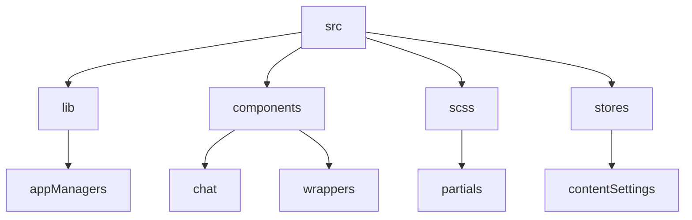
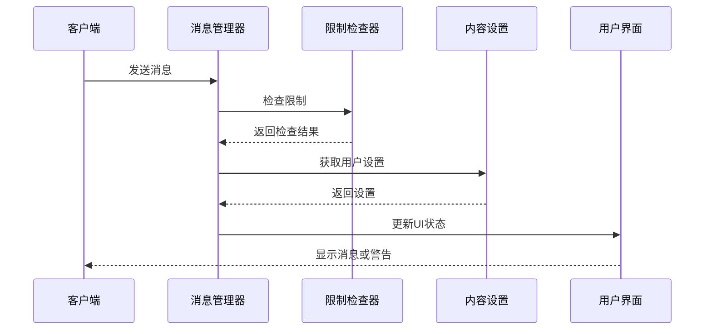
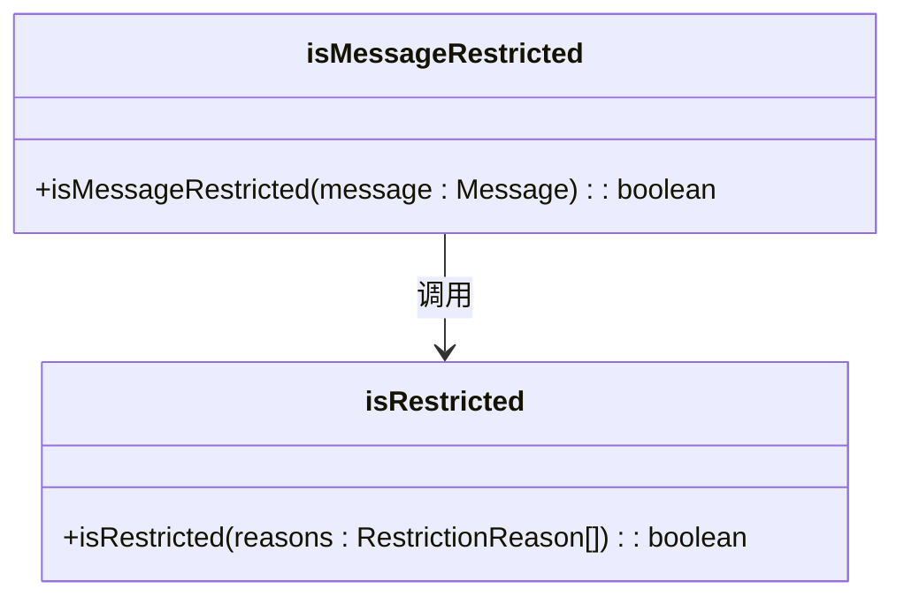
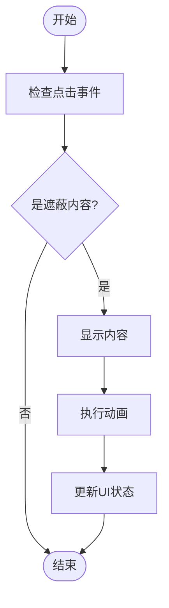
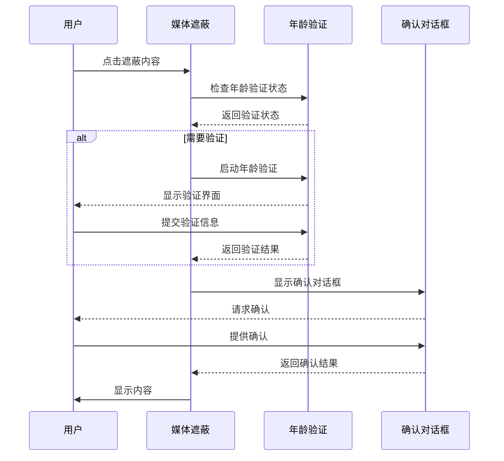
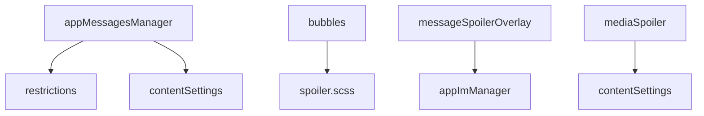

# 内容审核机制

<cite>
**本文档引用的文件**  
- [isMessageRestricted.ts](file://src/lib/appManagers/utils/messages/isMessageRestricted.ts)
- [restrictions.ts](file://src/helpers/restrictions.ts)
- [appMessagesManager.ts](file://src/lib/appManagers/appMessagesManager.ts)
- [contentSettings.ts](file://src/stores/contentSettings.ts)
- [spoiler.scss](file://src/scss/partials/_spoiler.scss)
- [messageSpoilerOverlay/index.tsx](file://src/components/messageSpoilerOverlay/index.tsx)
- [bubbles.ts](file://src/components/chat/bubbles.ts)
- [mediaSpoiler.ts](file://src/components/wrappers/mediaSpoiler.ts)
- [appImManager.ts](file://src/lib/appManagers/appImManager.ts)
</cite>

## 目录
1. [简介](#简介)
2. [项目结构](#项目结构)
3. [核心组件](#核心组件)
4. [架构概述](#架构概述)
5. [详细组件分析](#详细组件分析)
6. [依赖分析](#依赖分析)
7. [性能考虑](#性能考虑)
8. [故障排除指南](#故障排除指南)
9. [结论](#结论)

## 简介
本文档详细分析了消息内容审核机制的实现，重点关注敏感词过滤、违规内容检测和媒体内容审查等功能。系统通过规则引擎和正则表达式识别不当内容，并对被标记的消息执行自动删除或警告发送者等处理操作。同时，文档还解释了UI反馈机制，如警告提示和内容遮蔽，以及如何配置自定义审核规则和扩展审核功能以支持新的内容类型。

## 项目结构
项目结构清晰地组织了各个功能模块，其中核心内容审核逻辑位于`src/lib/appManagers`目录下，UI相关组件则分布在`src/components`目录中。样式文件位于`src/scss`目录，配置和状态管理文件位于`src/stores`目录。

**Diagram sources**
- [appMessagesManager.ts](file://src/lib/appManagers/appMessagesManager.ts)
- [bubbles.ts](file://src/components/chat/bubbles.ts)
- [spoiler.scss](file://src/scss/partials/_spoiler.scss)
- [contentSettings.ts](file://src/stores/contentSettings.ts)

**Section sources**
- [appMessagesManager.ts](file://src/lib/appManagers/appMessagesManager.ts)
- [bubbles.ts](file://src/components/chat/bubbles.ts)
- [spoiler.scss](file://src/scss/partials/_spoiler.scss)
- [contentSettings.ts](file://src/stores/contentSettings.ts)

## 核心组件
核心组件包括消息管理器（appMessagesManager）、限制规则处理器（restrictions）和内容设置管理器（contentSettings）。这些组件协同工作，确保消息内容符合平台的安全和合规要求。

**Section sources**
- [appMessagesManager.ts](file://src/lib/appManagers/appMessagesManager.ts)
- [restrictions.ts](file://src/helpers/restrictions.ts)
- [contentSettings.ts](file://src/stores/contentSettings.ts)

## 架构概述
系统采用分层架构，消息管理器负责接收和处理消息，限制规则处理器根据预定义规则判断消息是否违规，内容设置管理器则管理用户的审核偏好设置。UI组件负责展示审核结果和提供用户交互。

**Diagram sources**
- [appMessagesManager.ts](file://src/lib/appManagers/appMessagesManager.ts)
- [restrictions.ts](file://src/helpers/restrictions.ts)
- [contentSettings.ts](file://src/stores/contentSettings.ts)

## 详细组件分析

### 消息限制检查分析
消息限制检查通过`isMessageRestricted`函数实现，该函数调用`isRestricted`方法来判断消息是否包含受限原因。

**Diagram sources**
- [isMessageRestricted.ts](file://src/lib/appManagers/utils/messages/isMessageRestricted.ts)
- [restrictions.ts](file://src/helpers/restrictions.ts)

### UI反馈机制分析
UI反馈机制通过CSS类和JavaScript事件处理程序实现，当用户点击被遮蔽的内容时，触发相应的动画和逻辑处理。

**Diagram sources**
- [spoiler.scss](file://src/scss/partials/_spoiler.scss)
- [messageSpoilerOverlay/index.tsx](file://src/components/messageSpoilerOverlay/index.tsx)
- [bubbles.ts](file://src/components/chat/bubbles.ts)

### 敏感内容处理分析
敏感内容处理涉及年龄验证和用户确认，确保只有经过验证的用户才能查看敏感内容。

**Diagram sources**
- [mediaSpoiler.ts](file://src/components/wrappers/mediaSpoiler.ts)
- [appImManager.ts](file://src/lib/appManagers/appImManager.ts)

**Section sources**
- [mediaSpoiler.ts](file://src/components/wrappers/mediaSpoiler.ts)
- [appImManager.ts](file://src/lib/appManagers/appImManager.ts)

## 依赖分析
系统依赖于多个内部模块和外部库，确保各组件之间的松耦合和高内聚。

**Diagram sources**
- [appMessagesManager.ts](file://src/lib/appManagers/appMessagesManager.ts)
- [restrictions.ts](file://src/helpers/restrictions.ts)
- [contentSettings.ts](file://src/stores/contentSettings.ts)
- [bubbles.ts](file://src/components/chat/bubbles.ts)
- [messageSpoilerOverlay/index.tsx](file://src/components/messageSpoilerOverlay/index.tsx)
- [appImManager.ts](file://src/lib/appManagers/appImManager.ts)
- [mediaSpoiler.ts](file://src/components/wrappers/mediaSpoiler.ts)

**Section sources**
- [appMessagesManager.ts](file://src/lib/appManagers/appMessagesManager.ts)
- [restrictions.ts](file://src/helpers/restrictions.ts)
- [contentSettings.ts](file://src/stores/contentSettings.ts)
- [bubbles.ts](file://src/components/chat/bubbles.ts)
- [messageSpoilerOverlay/index.tsx](file://src/components/messageSpoilerOverlay/index.tsx)
- [appImManager.ts](file://src/lib/appManagers/appImManager.ts)
- [mediaSpoiler.ts](file://src/components/wrappers/mediaSpoiler.ts)

## 性能考虑
系统在处理大量消息时需考虑性能优化，避免因频繁的DOM操作导致页面卡顿。使用虚拟列表和懒加载技术可以有效提升性能。

## 故障排除指南
常见问题包括遮蔽内容无法正常显示、年龄验证失败等。检查相关组件的依赖关系和配置设置，确保所有必要的资源已正确加载。

**Section sources**
- [mediaSpoiler.ts](file://src/components/wrappers/mediaSpoiler.ts)
- [appImManager.ts](file://src/lib/appManagers/appImManager.ts)

## 结论
本文档全面分析了内容审核机制的实现细节，涵盖了从消息检查到UI反馈的各个环节。通过合理的架构设计和组件协作，系统能够高效地处理各种内容审核需求，保障平台的安全性和用户体验。