# 反垃圾信息防护

<cite>
**本文档引用的文件**  
- [appMessagesManager.ts](file://src/lib/appManagers/appMessagesManager.ts)
- [appChatsManager.ts](file://src/lib/appManagers/appChatsManager.ts)
- [isMessageRestricted.ts](file://src/lib/appManagers/utils/messages/isMessageRestricted.ts)
- [restrictions.ts](file://src/helpers/restrictions.ts)
- [bubbles.ts](file://src/components/chat/bubbles.ts)
- [chatBubble.scss](file://src/scss/partials/_chatBubble.scss)
- [deleteMegagroupMessages.tsx](file://src/components/popups/deleteMegagroupMessages.tsx)
- [groupPermissions/index.ts](file://src/components/sidebarRight/tabs/groupPermissions/index.ts)
- [limitsFeature.ts](file://src/components/premium/limitsFeature.ts)
- [paidMessagesInterceptor.ts](file://src/components/chat/paidMessagesInterceptor.ts)
</cite>

## 目录
1. [引言](#引言)
2. [反垃圾信息检测机制](#反垃圾信息检测机制)
3. [限制措施执行](#限制措施执行)
4. [视觉提示与用户交互](#视觉提示与用户交互)
5. [配置与策略调整](#配置与策略调整)
6. [应对新型垃圾信息攻击](#应对新型垃圾信息攻击)
7. [结论](#结论)

## 引言
本系统通过多层次的机制来检测和阻止垃圾信息，包括频率限制、行为模式识别、黑名单机制等。核心组件`appMessagesManager`负责识别垃圾信息，`appChatsManager`执行相应的限制措施，而`bubbles`组件则提供对疑似垃圾信息的视觉提示和用户交互设计。本文档详细说明这些组件的工作原理和配置方法。

**Section sources**
- [appMessagesManager.ts](file://src/lib/appManagers/appMessagesManager.ts#L1-L100)
- [appChatsManager.ts](file://src/lib/appManagers/appChatsManager.ts#L1-L100)

## 反垃圾信息检测机制

### 频率限制
系统通过`appMessagesManager`中的`canSendToPeer`方法检查用户是否具有发送消息的权限。该方法会验证用户是否被限制，以及是否满足频道的发送权限。

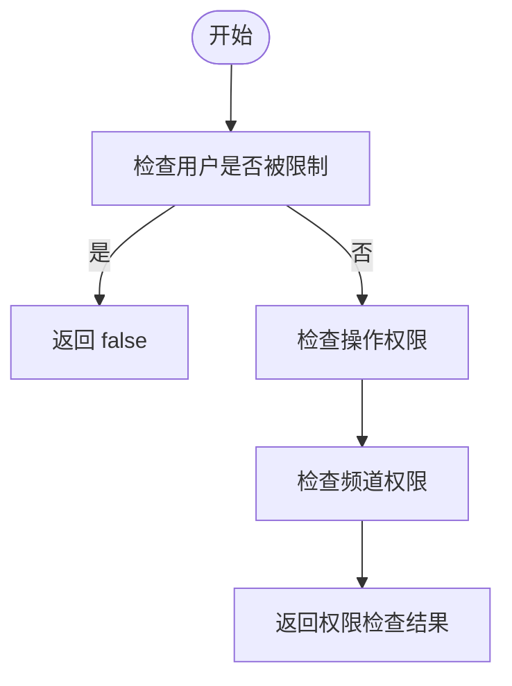

**Diagram sources**
- [appMessagesManager.ts](file://src/lib/appManagers/appMessagesManager.ts#L7846-L7870)

### 行为模式识别
系统通过`isMessageRestricted`函数检测消息是否被限制。该函数检查消息的`restriction_reason`字段，如果存在且被标记为受限，则认为该消息是垃圾信息。

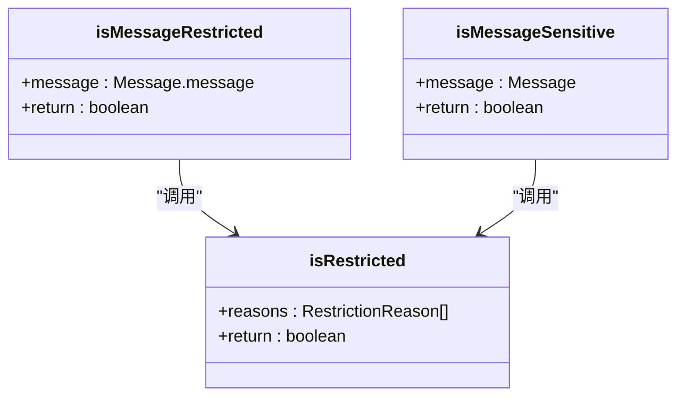

**Diagram sources**
- [isMessageRestricted.ts](file://src/lib/appManagers/utils/messages/isMessageRestricted.ts#L4-L10)
- [restrictions.ts](file://src/helpers/restrictions.ts#L21-L23)

### 黑名单机制
系统使用`reportSpamMessages`方法将用户报告为垃圾信息发送者。该方法会调用API将指定用户加入黑名单。

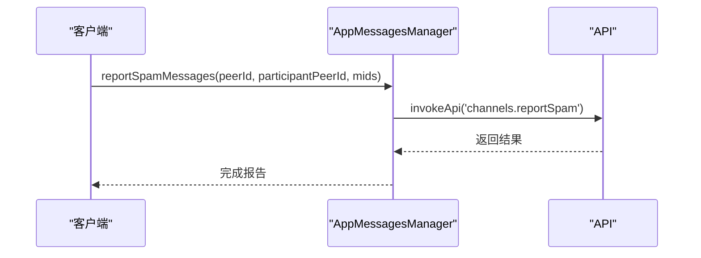

**Diagram sources**
- [appMessagesManager.ts](file://src/lib/appManagers/appMessagesManager.ts#L4890-L4896)

**Section sources**
- [appMessagesManager.ts](file://src/lib/appManagers/appMessagesManager.ts#L4890-L4896)
- [isMessageRestricted.ts](file://src/lib/appManagers/utils/messages/isMessageRestricted.ts#L1-L10)

## 限制措施执行

### 暂时禁言
`appChatsManager`的`editBanned`方法用于修改用户的禁言权限。通过设置`banned_rights`参数，可以实现暂时禁言或永久禁言。

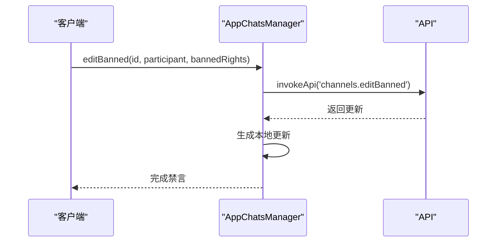

**Diagram sources**
- [appChatsManager.ts](file://src/lib/appManagers/appChatsManager.ts#L713-L749)

### 移除成员
`kickFromChannel`方法用于将用户从频道中移除。该方法实际上是调用`editBanned`方法，设置`view_messages`权限为`true`来实现移除。

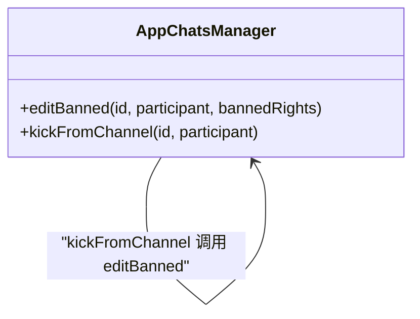

**Diagram sources**
- [appChatsManager.ts](file://src/lib/appManagers/appChatsManager.ts#L759-L767)

### 慢速模式
`toggleSlowMode`方法用于开启或关闭频道的慢速模式。该模式限制用户发送消息的频率，有效防止垃圾信息刷屏。

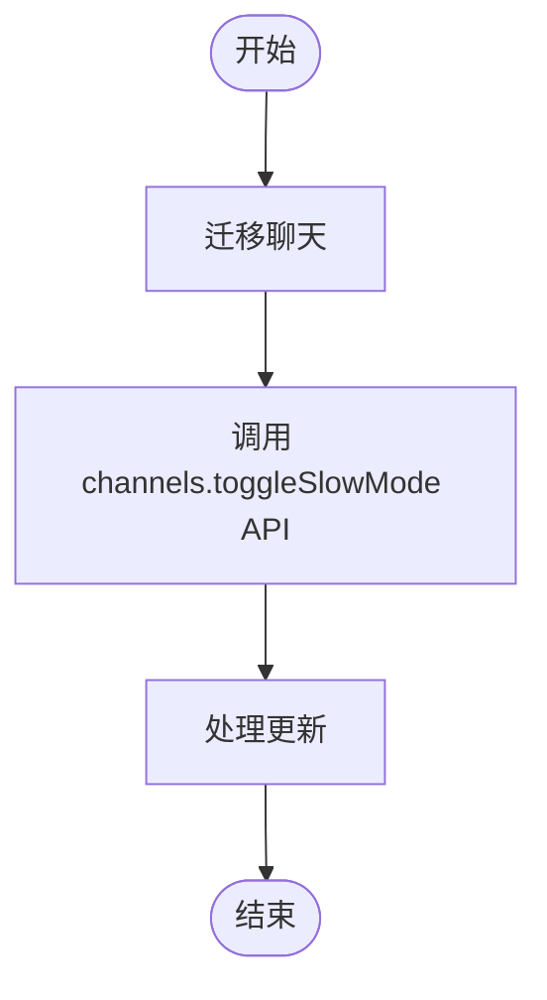

**Diagram sources**
- [appChatsManager.ts](file://src/lib/appManagers/appChatsManager.ts#L964-L970)

**Section sources**
- [appChatsManager.ts](file://src/lib/appManagers/appChatsManager.ts#L713-L767)
- [groupPermissions/index.ts](file://src/components/sidebarRight/tabs/groupPermissions/index.ts#L80-L94)

## 视觉提示与用户交互

### 疑似垃圾信息提示
`bubbles`组件通过CSS类`is-highlighted`来标记疑似垃圾信息。当消息被标记为垃圾信息时，会应用特殊的背景色和动画效果。

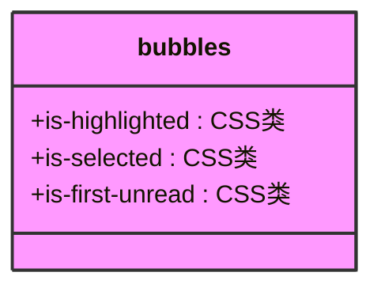

**Diagram sources**
- [chatBubble.scss](file://src/scss/partials/_chatBubble.scss#L171-L215)

### 用户交互设计
当用户尝试删除包含垃圾信息的消息时，系统会显示确认对话框，并提供多种操作选项，如删除、报告垃圾信息、禁言用户等。

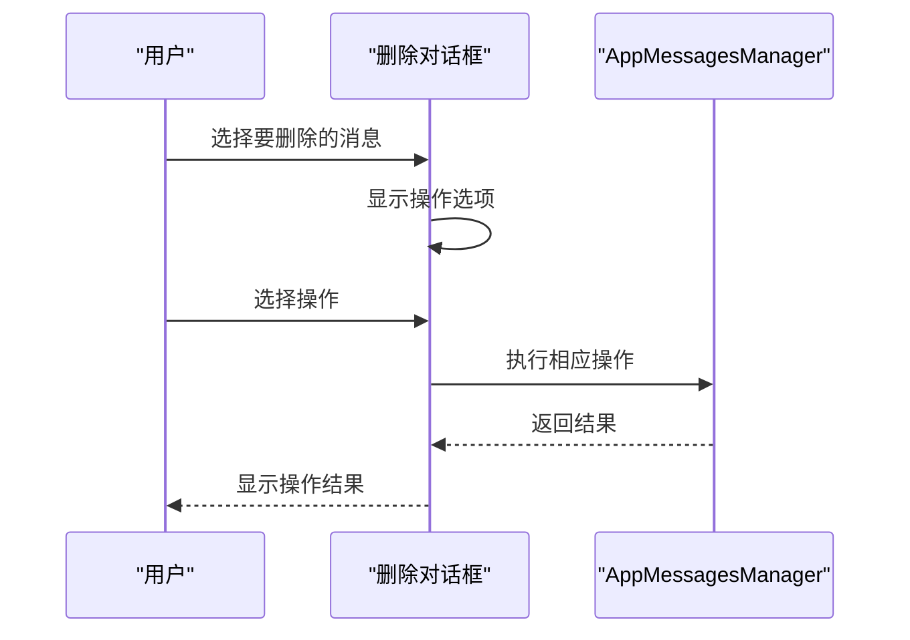

**Diagram sources**
- [deleteMegagroupMessages.tsx](file://src/components/popups/deleteMegagroupMessages.tsx#L74-L111)

**Section sources**
- [bubbles.ts](file://src/components/chat/bubbles.ts#L9431-L9475)
- [chatBubble.scss](file://src/scss/partials/_chatBubble.scss#L158-L216)

## 配置与策略调整

### 限制策略配置
系统通过`limitsFeature`组件管理各种限制策略。这些策略包括频道数量、文件上传大小、表情包收藏数量等。

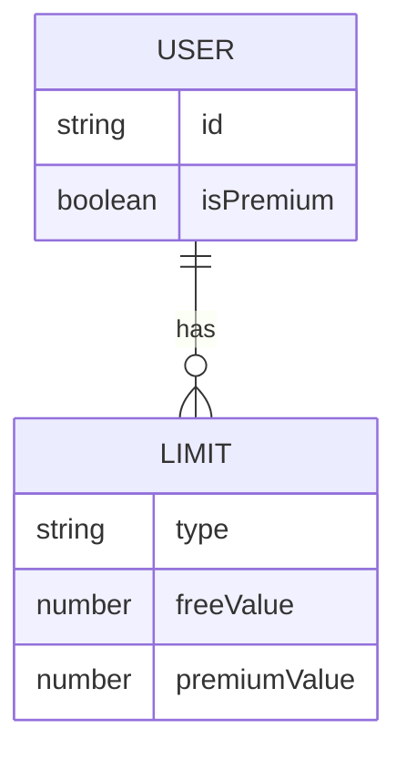

**Diagram sources**
- [limitsFeature.ts](file://src/components/premium/limitsFeature.ts#L1-L33)
- [api_methods.ts](file://src/lib/mtproto/api_methods.ts#L379-L398)

### 权限管理
`groupPermissions`组件提供了一个完整的权限管理系统，允许管理员设置不同用户的权限级别，包括发送消息、发送媒体、邀请用户等。

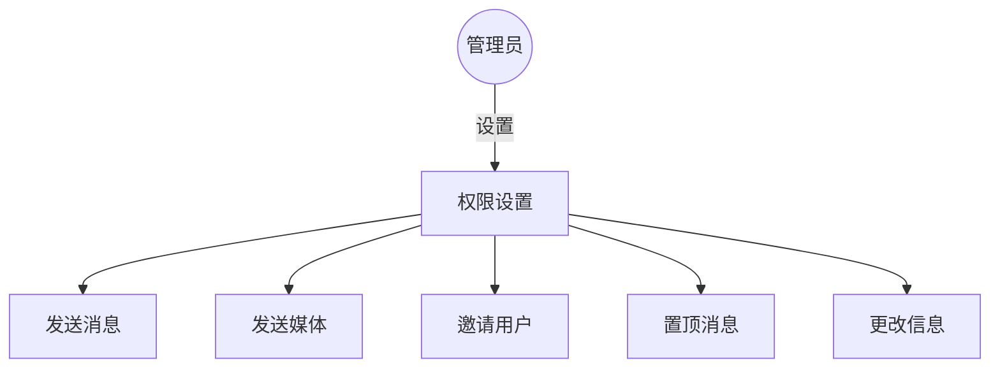

**Diagram sources**
- [groupPermissions/index.ts](file://src/components/sidebarRight/tabs/groupPermissions/index.ts#L80-L94)

**Section sources**
- [limitsFeature.ts](file://src/components/premium/limitsFeature.ts#L1-L33)
- [groupPermissions/index.ts](file://src/components/sidebarRight/tabs/groupPermissions/index.ts#L80-L94)

## 应对新型垃圾信息攻击

### 动态策略调整
系统支持动态调整反垃圾策略。当检测到新型垃圾信息攻击模式时，可以通过更新`restriction_reason`来添加新的限制规则。

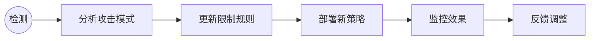

### 付费消息防护
对于付费消息，系统通过`paidMessagesInterceptor`组件进行额外的防护。该组件会检查用户的星币余额，并在发送前进行确认。

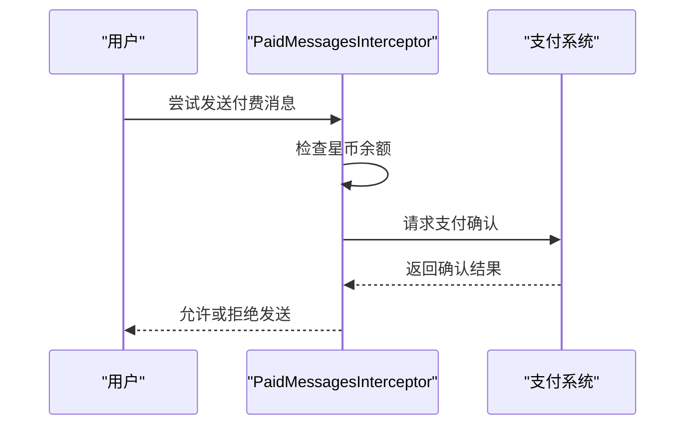

**Diagram sources**
- [paidMessagesInterceptor.ts](file://src/components/chat/paidMessagesInterceptor.ts#L133-L154)

**Section sources**
- [paidMessagesInterceptor.ts](file://src/components/chat/paidMessagesInterceptor.ts#L118-L155)

## 结论
本系统通过综合运用频率限制、行为模式识别、黑名单机制等多种技术手段，构建了一个多层次的反垃圾信息防护体系。`appMessagesManager`负责核心的垃圾信息检测，`appChatsManager`执行具体的限制措施，而`bubbles`组件则提供了直观的视觉提示和用户交互。通过灵活的配置选项和动态的策略调整机制，系统能够有效应对各种已知和新型的垃圾信息攻击。