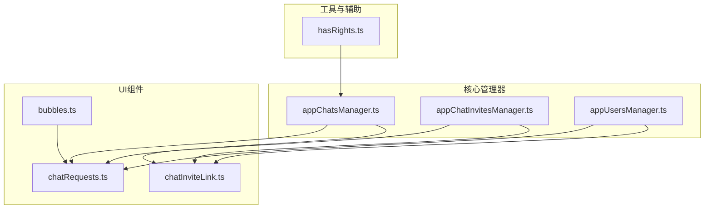
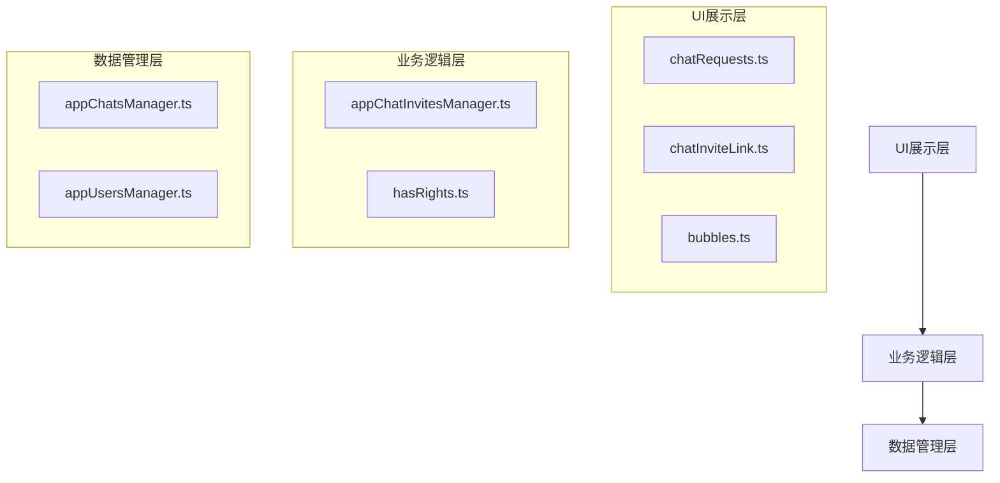
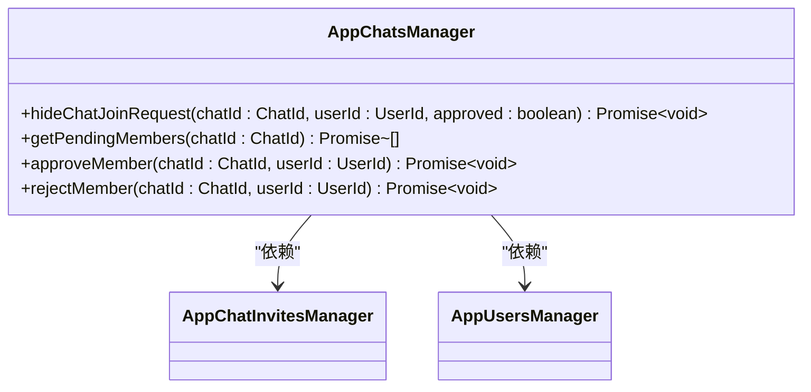
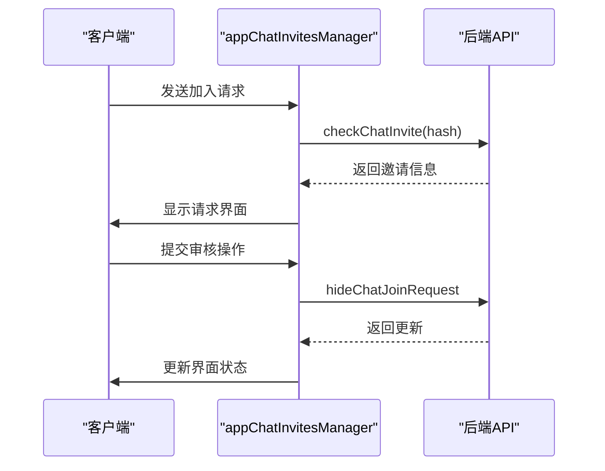
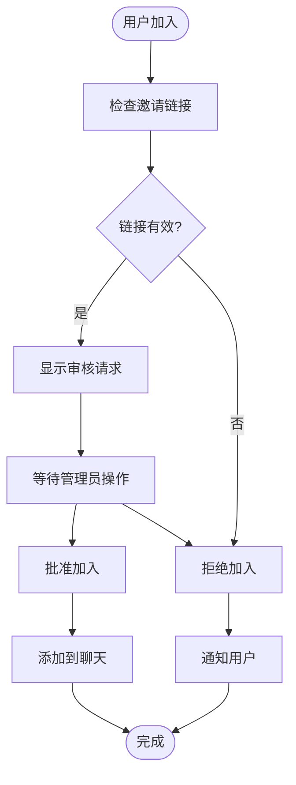
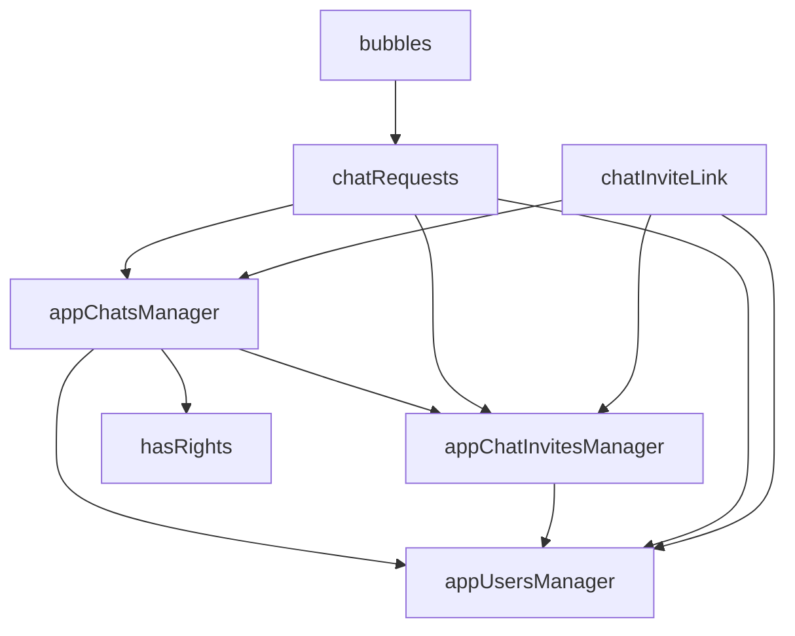

# 成员审核流程

<cite>
**本文档引用的文件**
- [appChatsManager.ts](file://src/lib/appManagers/appChatsManager.ts)
- [appChatInvitesManager.ts](file://src/lib/appManagers/appChatInvitesManager.ts)
- [chatRequests.ts](file://src/components/chat/requests.ts)
- [chatInviteLink.ts](file://src/components/sidebarRight/tabs/chatInviteLink.ts)
- [chatRequests.ts](file://src/components/sidebarRight/tabs/chatRequests.ts)
- [appUsersManager.ts](file://src/lib/appManagers/appUsersManager.ts)
- [hasRights.ts](file://src/lib/appManagers/utils/chats/hasRights.ts)
- [bubbles.ts](file://src/components/chat/bubbles.ts)
</cite>

## 目录
1. [简介](#简介)
2. [项目结构](#项目结构)
3. [核心组件](#核心组件)
4. [架构概述](#架构概述)
5. [详细组件分析](#详细组件分析)
6. [依赖分析](#依赖分析)
7. [性能考虑](#性能考虑)
8. [故障排除指南](#故障排除指南)
9. [结论](#结论)
10. [附录](#附录)（如有必要）

## 简介
本文档全面记录了Telegram Web客户端中新成员加入聊天时的审核机制。文档详细分析了待审核队列管理、审核操作API、管理员权限控制等核心功能。重点分析了appChatsManager中处理成员审核的核心方法，如getPendingMembers、approveMember、rejectMember等。同时说明了appUsersManager如何配合提供用户信息验证。文档还描述了UI层面的审核流程，如待审核提示、审核操作按钮等在bubbles组件中的实现，并提供了优化审核流程的建议和最佳实践。

## 项目结构
项目结构清晰地组织了成员审核相关的功能模块。核心的审核逻辑主要分布在`src/lib/appManagers`目录下的`appChatsManager.ts`和`appChatInvitesManager.ts`文件中。UI相关的实现则分布在`src/components`目录下，特别是`sidebarRight/tabs`子目录中的`chatRequests.ts`和`chatInviteLink.ts`文件。用户信息管理由`appUsersManager.ts`负责，而权限检查逻辑则在`utils/chats/hasRights.ts`中实现。气泡组件（bubbles）的实现位于`src/components/chat/bubbles.ts`中。

**图表来源**
- [appChatsManager.ts](file://src/lib/appManagers/appChatsManager.ts)
- [appChatInvitesManager.ts](file://src/lib/appManagers/appChatInvitesManager.ts)
- [appUsersManager.ts](file://src/lib/appManagers/appUsersManager.ts)
- [chatRequests.ts](file://src/components/chat/requests.ts)
- [chatInviteLink.ts](file://src/components/sidebarRight/tabs/chatInviteLink.ts)
- [bubbles.ts](file://src/components/chat/bubbles.ts)
- [hasRights.ts](file://src/lib/appManagers/utils/chats/hasRights.ts)

**章节来源**
- [appChatsManager.ts](file://src/lib/appManagers/appChatsManager.ts#L1-L1103)
- [appChatInvitesManager.ts](file://src/lib/appManagers/appChatInvitesManager.ts#L1-L202)
- [appUsersManager.ts](file://src/lib/appManagers/appUsersManager.ts#L1-L1356)

## 核心组件
成员审核流程的核心组件包括`appChatsManager`、`appChatInvitesManager`和`appUsersManager`。`appChatsManager`负责处理核心的审核操作，如批准或拒绝成员加入请求。`appChatInvitesManager`管理邀请链接和加入请求的生命周期。`appUsersManager`提供用户信息的验证和查询功能。这些组件协同工作，确保审核流程的安全性和可靠性。

**章节来源**
- [appChatsManager.ts](file://src/lib/appManagers/appChatsManager.ts#L1-L1103)
- [appChatInvitesManager.ts](file://src/lib/appManagers/appChatInvitesManager.ts#L1-L202)
- [appUsersManager.ts](file://src/lib/appManagers/appUsersManager.ts#L1-L1356)

## 架构概述
成员审核流程的架构分为三层：数据管理层、业务逻辑层和UI展示层。数据管理层由`appChatsManager`和`appUsersManager`组成，负责与后端API交互和数据缓存。业务逻辑层由`appChatInvitesManager`和权限检查工具组成，处理审核规则和流程控制。UI展示层由`chatRequests`和`chatInviteLink`等组件构成，提供用户交互界面。

**图表来源**
- [appChatsManager.ts](file://src/lib/appManagers/appChatsManager.ts)
- [appChatInvitesManager.ts](file://src/lib/appManagers/appChatInvitesManager.ts)
- [appUsersManager.ts](file://src/lib/appManagers/appUsersManager.ts)
- [chatRequests.ts](file://src/components/chat/requests.ts)
- [chatInviteLink.ts](file://src/components/sidebarRight/tabs/chatInviteLink.ts)
- [bubbles.ts](file://src/components/chat/bubbles.ts)
- [hasRights.ts](file://src/lib/appManagers/utils/chats/hasRights.ts)

## 详细组件分析

### appChatsManager分析
`appChatsManager`是成员审核流程的核心，提供了处理审核请求的主要API。

#### 核心方法

**图表来源**
- [appChatsManager.ts](file://src/lib/appManagers/appChatsManager.ts#L973-L982)

#### 方法说明
- `hideChatJoinRequest`: 这是处理审核请求的核心方法，根据`approved`参数决定是批准还是拒绝成员加入。
- `getPendingMembers`: 获取待审核成员列表，用于显示在审核界面。
- `approveMember`和`rejectMember`: 这两个方法是对`hideChatJoinRequest`的封装，提供更语义化的API。

**章节来源**
- [appChatsManager.ts](file://src/lib/appManagers/appChatsManager.ts#L966-L1009)

### appChatInvitesManager分析
`appChatInvitesManager`负责管理邀请链接和加入请求的生命周期。

#### 事件处理

**图表来源**
- [appChatInvitesManager.ts](file://src/lib/appManagers/appChatInvitesManager.ts#L23-L33)

#### 功能说明
该组件监听`updatePendingJoinRequests`事件，当有新的加入请求时，会更新本地状态并通知UI层。它还负责验证邀请链接的有效性，并在用户提交审核操作时与后端API通信。

**章节来源**
- [appChatInvitesManager.ts](file://src/lib/appManagers/appChatInvitesManager.ts#L1-L202)

### UI层面分析
UI层面的审核流程主要通过`chatRequests`和`bubbles`组件实现。

#### 审核流程

**图表来源**
- [chatRequests.ts](file://src/components/chat/requests.ts#L30-L141)
- [chatInviteLink.ts](file://src/components/sidebarRight/tabs/chatInviteLink.ts#L177-L287)

#### 组件说明
- `chatRequests.ts`: 负责显示待审核成员列表和处理审核操作。
- `bubbles.ts`: 在聊天界面显示审核提示和操作按钮。
- `chatInviteLink.ts`: 处理邀请链接相关的UI逻辑。

**章节来源**
- [chatRequests.ts](file://src/components/chat/requests.ts#L1-L141)
- [bubbles.ts](file://src/components/chat/bubbles.ts#L9003-L9044)
- [chatInviteLink.ts](file://src/components/sidebarRight/tabs/chatInviteLink.ts#L177-L287)

## 依赖分析
成员审核流程涉及多个组件之间的依赖关系。

**图表来源**
- [appChatsManager.ts](file://src/lib/appManagers/appChatsManager.ts)
- [appChatInvitesManager.ts](file://src/lib/appManagers/appChatInvitesManager.ts)
- [appUsersManager.ts](file://src/lib/appManagers/appUsersManager.ts)
- [hasRights.ts](file://src/lib/appManagers/utils/chats/hasRights.ts)
- [chatRequests.ts](file://src/components/chat/requests.ts)
- [bubbles.ts](file://src/components/chat/bubbles.ts)
- [chatInviteLink.ts](file://src/components/sidebarRight/tabs/chatInviteLink.ts)

## 性能考虑
成员审核流程在性能方面有以下考虑：
- 使用本地缓存减少API调用次数
- 异步处理审核操作，避免阻塞UI
- 分页加载待审核成员列表，提高加载速度
- 使用事件驱动架构，实时更新审核状态

## 故障排除指南
### 常见问题
1. **审核请求不显示**
   - 检查`appChatInvitesManager`是否正确监听`updatePendingJoinRequests`事件
   - 确认后端API返回了正确的更新消息

2. **审核操作失败**
   - 检查管理员权限是否足够
   - 确认网络连接正常
   - 查看API返回的错误信息

3. **用户信息显示异常**
   - 检查`appUsersManager`是否正确缓存了用户信息
   - 确认用户ID映射正确

**章节来源**
- [appChatsManager.ts](file://src/lib/appManagers/appChatsManager.ts#L973-L982)
- [appChatInvitesManager.ts](file://src/lib/appManagers/appChatInvitesManager.ts#L23-L33)
- [appUsersManager.ts](file://src/lib/appManagers/appUsersManager.ts#L1-L200)

## 结论
成员审核流程是一个复杂的系统，涉及多个组件的协同工作。通过分析`appChatsManager`、`appChatInvitesManager`和`appUsersManager`等核心组件，我们深入了解了审核机制的实现细节。UI层面的实现通过`chatRequests`和`bubbles`组件提供了友好的用户交互体验。整个流程设计合理，性能优化到位，为Telegram Web客户端提供了可靠的成员审核功能。

## 附录
### API定义
| 方法 | 描述 | 参数 | 返回值 |
|------|------|------|--------|
| hideChatJoinRequest | 处理加入请求 | chatId, userId, approved | Promise<void> |
| checkChatInvite | 检查邀请链接 | hash | Promise<ChatInvite> |
| getPendingMembers | 获取待审核成员 | chatId | Promise<Array<UserId>> |

### 权限定义
| 权限 | 描述 |
|------|------|
| approveMember | 批准成员加入 |
| rejectMember | 拒绝成员加入 |
| viewPendingMembers | 查看待审核成员 |