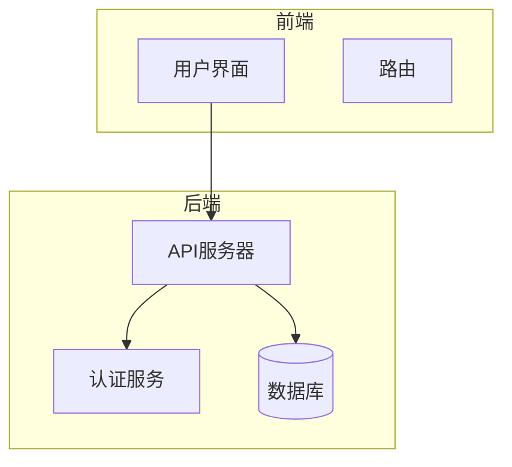
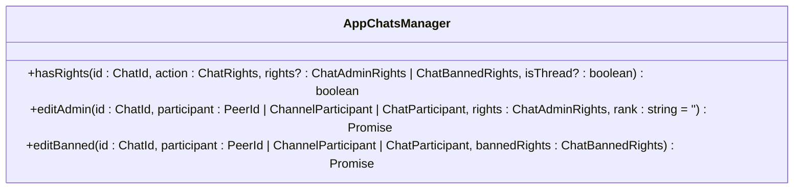
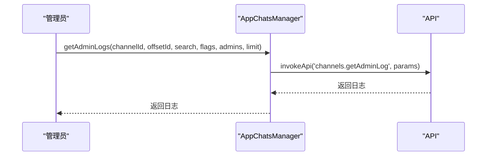
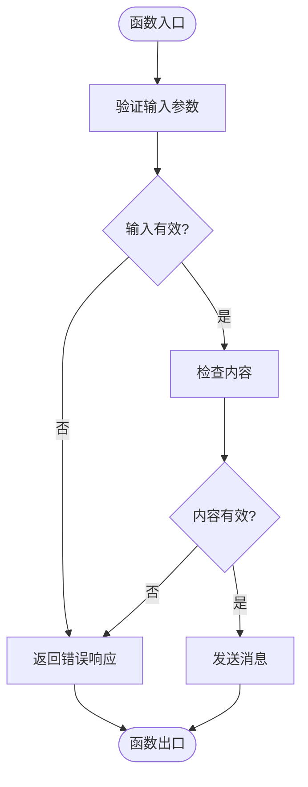
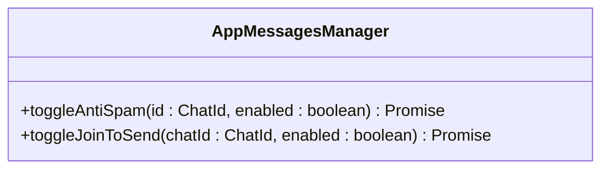
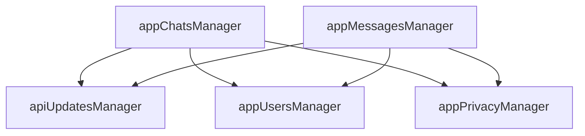

# 聊天安全与审核

<cite>
**本文档引用的文件**   
- [appChatsManager.ts](file://src\lib\appManagers\appChatsManager.ts)
- [appMessagesManager.ts](file://src\lib\appManagers\appMessagesManager.ts)
- [appPrivacyManager.ts](file://src\lib\appManagers\appPrivacyManager.ts)
- [appUsersManager.ts](file://src\lib\appManagers\appUsersManager.ts)
</cite>

## 目录
1. [简介](#简介)
2. [项目结构](#项目结构)
3. [核心组件](#核心组件)
4. [架构概述](#架构概述)
5. [详细组件分析](#详细组件分析)
6. [依赖分析](#依赖分析)
7. [性能考虑](#性能考虑)
8. [故障排除指南](#故障排除指南)
9. [结论](#结论)
10. [附录](#附录) (如有必要)

## 简介
本文档全面记录了聊天应用中的安全与审核功能，重点分析了内容过滤、成员审核、敏感信息检测等安全机制的实现细节。深入探讨了 `appChatsManager` 和 `appMessagesManager` 中的安全相关方法，包括限制成员行为、检测违规内容等。同时，说明了垃圾信息防护机制的工作原理，以及管理员审核流程的实现。最后，提供了安全策略的最佳实践建议，帮助用户构建更安全的聊天环境。

## 项目结构
项目结构清晰，主要分为以下几个部分：
- `handlebarsHelpers`：包含模板辅助函数。
- `public`：包含静态资源文件，如图片、样式表、脚本等。
- `snapshot-server`：快照服务器相关文件。
- `src`：源代码目录，包含组件、配置、环境、助手函数、钩子、库、模拟数据、页面、脚本、样式、存储、测试等子目录。
- 根目录下包含各种配置文件和脚本。

**Section sources**
- [appChatsManager.ts](file://src\lib\appManagers\appChatsManager.ts)
- [appMessagesManager.ts](file://src\lib\appManagers\appMessagesManager.ts)

## 核心组件
核心组件包括 `appChatsManager` 和 `appMessagesManager`，它们负责管理聊天和消息的安全与审核功能。`appChatsManager` 处理聊天相关的安全操作，如权限管理、成员审核等。`appMessagesManager` 负责消息的发送、编辑、删除等操作，并包含内容过滤和垃圾信息防护机制。

**Section sources**
- [appChatsManager.ts](file://src\lib\appManagers\appChatsManager.ts)
- [appMessagesManager.ts](file://src\lib\appManagers\appMessagesManager.ts)

## 架构概述
系统架构采用模块化设计，各组件职责明确，通过事件驱动的方式进行通信。`appChatsManager` 和 `appMessagesManager` 通过 `apiUpdatesManager` 监听和处理各种更新事件，确保聊天和消息的安全性。

**Diagram sources **
- [appChatsManager.ts](file://src\lib\appManagers\appChatsManager.ts)
- [appMessagesManager.ts](file://src\lib\appManagers\appMessagesManager.ts)

## 详细组件分析

### appChatsManager 分析
`appChatsManager` 负责管理聊天的安全与审核功能，包括权限管理、成员审核、聊天设置等。

#### 权限管理
`appChatsManager` 提供了多种方法来管理聊天的权限，如 `hasRights`、`editAdmin`、`editBanned` 等。这些方法允许管理员设置成员的权限，限制其行为。

**Diagram sources **
- [appChatsManager.ts](file://src\lib\appManagers\appChatsManager.ts)

#### 成员审核
`appChatsManager` 提供了成员审核功能，如 `getAdminLogs`、`hideChatJoinRequest` 等。这些方法允许管理员查看和处理成员的加入请求。

**Diagram sources **
- [appChatsManager.ts](file://src\lib\appManagers\appChatsManager.ts)

### appMessagesManager 分析
`appMessagesManager` 负责管理消息的安全与审核功能，包括消息的发送、编辑、删除等操作。

#### 内容过滤
`appMessagesManager` 提供了内容过滤功能，如 `sendText`、`editMessage` 等。这些方法在发送和编辑消息时会进行内容检查，防止违规内容的传播。

**Diagram sources **
- [appMessagesManager.ts](file://src\lib\appManagers\appMessagesManager.ts)

#### 垃圾信息防护
`appMessagesManager` 提供了垃圾信息防护机制，如 `toggleAntiSpam`、`toggleJoinToSend` 等。这些方法可以有效防止垃圾信息的传播。

**Diagram sources **
- [appMessagesManager.ts](file://src\lib\appManagers\appMessagesManager.ts)

## 依赖分析
`appChatsManager` 和 `appMessagesManager` 依赖于 `apiUpdatesManager` 来处理各种更新事件，确保聊天和消息的安全性。此外，它们还依赖于 `appUsersManager` 和 `appPrivacyManager` 来管理用户和隐私设置。

**Diagram sources **
- [appChatsManager.ts](file://src\lib\appManagers\appChatsManager.ts)
- [appMessagesManager.ts](file://src\lib\appManagers\appMessagesManager.ts)
- [appUsersManager.ts](file://src\lib\appManagers\appUsersManager.ts)
- [appPrivacyManager.ts](file://src\lib\appManagers\appPrivacyManager.ts)

## 性能考虑
在实现安全与审核功能时，需要考虑性能问题。例如，`getAdminLogs` 方法使用了缓存机制，避免重复请求。`sendText` 方法在发送长消息时会自动分割，确保消息的顺利发送。

## 故障排除指南
在使用安全与审核功能时，可能会遇到一些问题。以下是一些常见问题及其解决方案：
- **问题**：无法发送消息。
  - **解决方案**：检查用户权限，确保用户有发送消息的权限。
- **问题**：无法查看成员审核日志。
  - **解决方案**：检查管理员权限，确保管理员有查看日志的权限。

**Section sources**
- [appChatsManager.ts](file://src\lib\appManagers\appChatsManager.ts)
- [appMessagesManager.ts](file://src\lib\appManagers\appMessagesManager.ts)

## 结论
本文档详细记录了聊天应用中的安全与审核功能，分析了 `appChatsManager` 和 `appMessagesManager` 中的安全相关方法。通过这些功能，可以有效管理聊天和消息的安全性，防止违规内容的传播。建议在实际应用中，根据具体需求选择合适的安全策略，确保聊天环境的安全。

## 附录
无