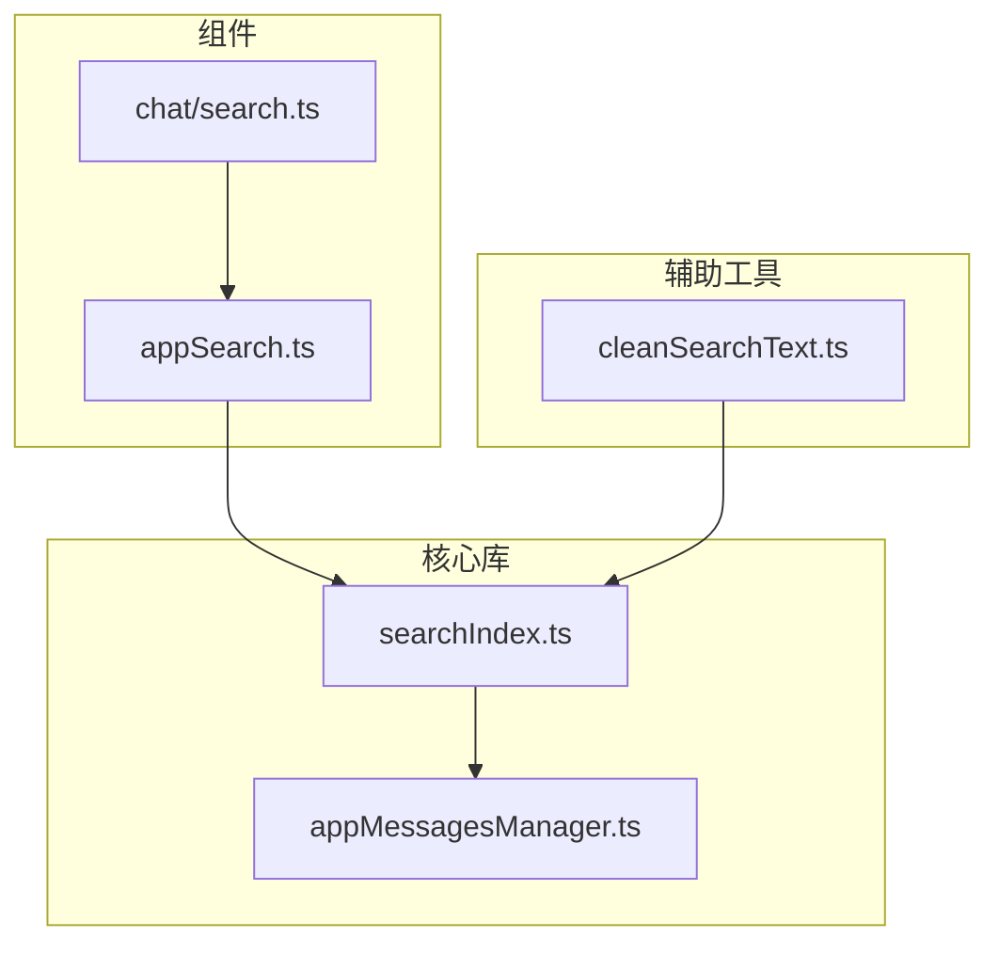
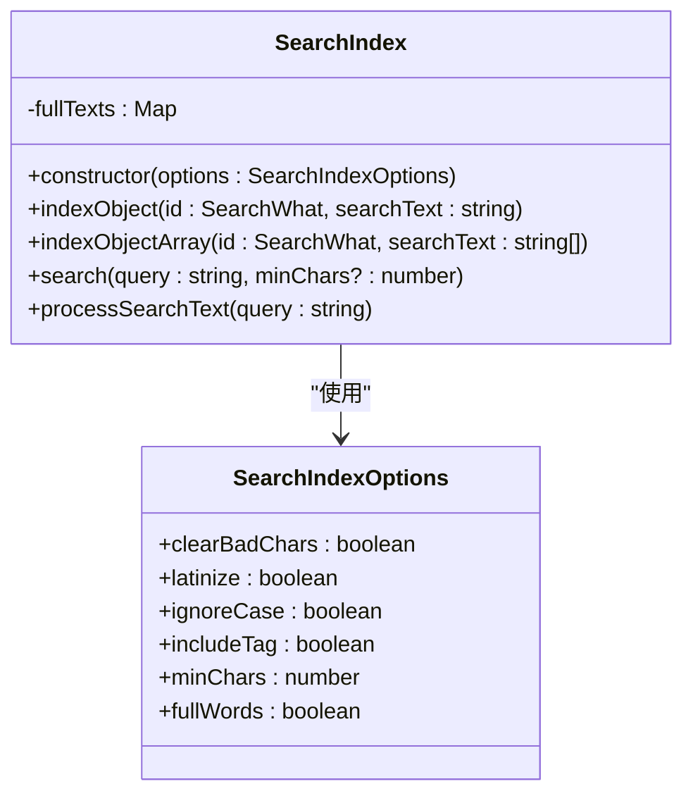
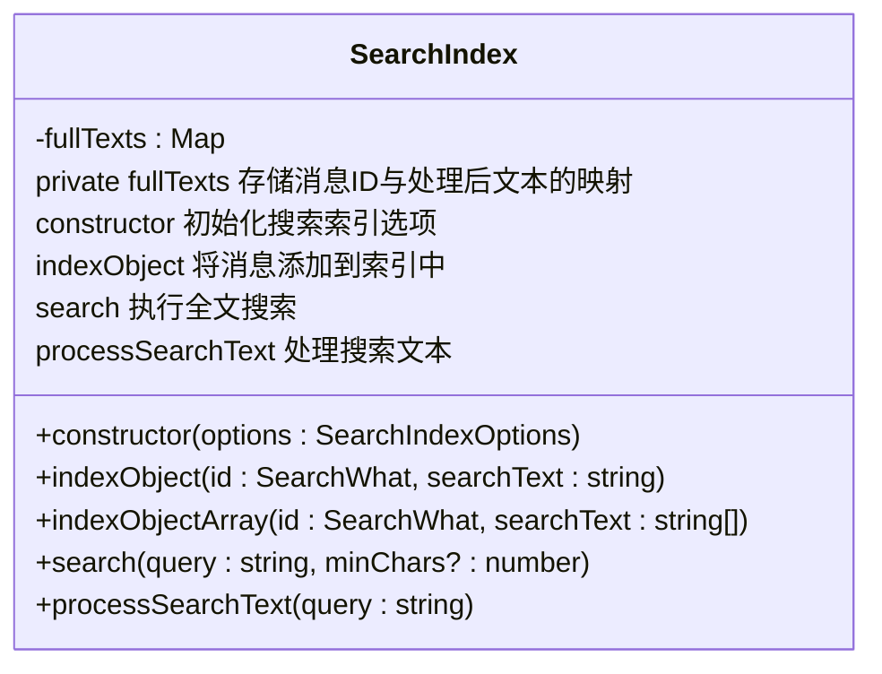
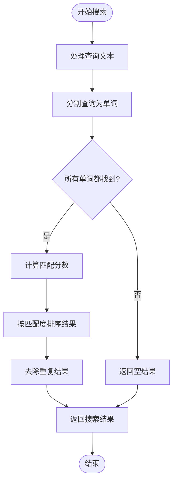
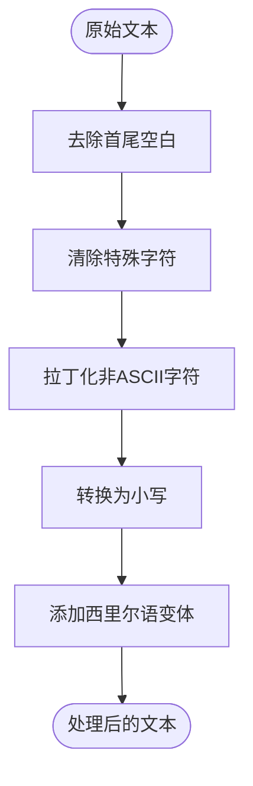
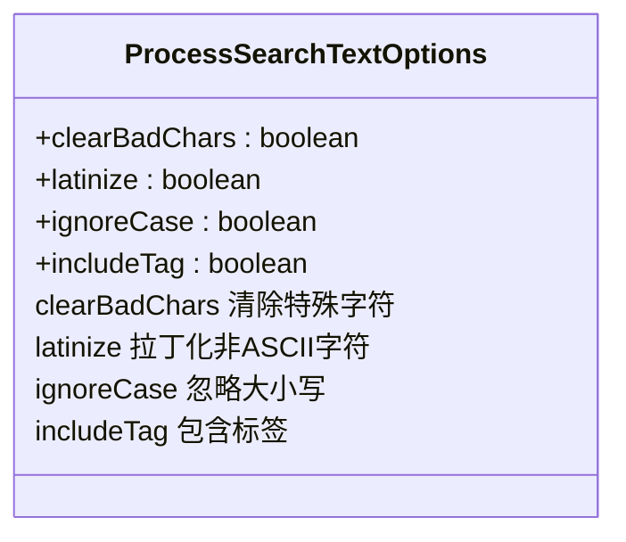

# 搜索索引构建

<cite>
**本文档引用的文件**
- [searchIndex.ts](file://src/lib/searchIndex.ts)
- [cleanSearchText.ts](file://src/helpers/cleanSearchText.ts)
- [appMessagesManager.ts](file://src/lib/appManagers/appMessagesManager.ts)
- [appSearch.ts](file://src/components/appSearch.ts)
- [chat/search.ts](file://src/components/chat/search.ts)
</cite>

## 目录
1. [介绍](#介绍)
2. [项目结构](#项目结构)
3. [核心组件](#核心组件)
4. [架构概述](#架构概述)
5. [详细组件分析](#详细组件分析)
6. [依赖分析](#依赖分析)
7. [性能考虑](#性能考虑)
8. [故障排除指南](#故障排除指南)
9. [结论](#结论)

## 介绍
本文档详细解释了搜索索引构建机制，重点介绍searchIndex模块如何为聊天消息建立全文搜索索引。文档涵盖了文本分词、关键词提取、倒排索引构建等过程，以及索引的增量更新策略。同时分析了索引数据结构的设计考量，包括内存占用优化和查询性能平衡，并讨论了大规模消息数据下的索引性能优化策略。

## 项目结构
项目结构中，搜索索引相关的核心文件主要位于`src/lib`和`src/components`目录下。`src/lib/searchIndex.ts`是搜索索引的核心实现文件，而`src/components/appSearch.ts`和`src/components/chat/search.ts`则负责搜索功能的用户界面和交互逻辑。



**图源**
- [searchIndex.ts](file://src/lib/searchIndex.ts)
- [appMessagesManager.ts](file://src/lib/appManagers/appMessagesManager.ts)
- [appSearch.ts](file://src/components/appSearch.ts)
- [chat/search.ts](file://src/components/chat/search.ts)
- [cleanSearchText.ts](file://src/helpers/cleanSearchText.ts)

**本节源**
- [searchIndex.ts](file://src/lib/searchIndex.ts)
- [appMessagesManager.ts](file://src/lib/appManagers/appMessagesManager.ts)
- [appSearch.ts](file://src/components/appSearch.ts)
- [chat/search.ts](file://src/components/chat/search.ts)

## 核心组件
搜索索引的核心组件是`SearchIndex`类，它负责管理聊天消息的全文搜索索引。该类提供了索引构建、搜索和文本处理等核心功能。

**本节源**
- [searchIndex.ts](file://src/lib/searchIndex.ts#L20-L128)

## 架构概述
搜索索引的架构基于倒排索引原理，通过`SearchIndex`类实现。该类使用Map数据结构存储消息ID与处理后的文本内容的映射关系，支持高效的全文搜索。



**图源**
- [searchIndex.ts](file://src/lib/searchIndex.ts#L20-L128)

## 详细组件分析

### SearchIndex类分析
`SearchIndex`类是搜索索引的核心实现，负责管理聊天消息的全文搜索索引。

#### 类结构分析


**图源**
- [searchIndex.ts](file://src/lib/searchIndex.ts#L20-L128)

#### 搜索流程分析


**图源**
- [searchIndex.ts](file://src/lib/searchIndex.ts#L108-L122)

**本节源**
- [searchIndex.ts](file://src/lib/searchIndex.ts#L20-L128)

### 文本处理分析
文本处理是搜索索引构建的关键环节，负责将原始消息文本转换为适合搜索的格式。

#### 文本处理流程


**图源**
- [cleanSearchText.ts](file://src/helpers/cleanSearchText.ts#L86-L94)

#### 文本处理选项


**图源**
- [cleanSearchText.ts](file://src/helpers/cleanSearchText.ts#L79-L84)

**本节源**
- [cleanSearchText.ts](file://src/helpers/cleanSearchText.ts#L71-L94)

## 依赖分析
搜索索引模块与其他组件有明确的依赖关系，这些关系确保了搜索功能的完整性和一致性。

```mermaid
graph TD
appMessagesManager[appMessagesManager] --> searchIndex[searchIndex]
appSearch[appSearch] --> searchIndex
chatSearch[chat/search] --> appSearch
searchIndex --> cleanSearchText[cleanSearchText]
searchIndex -.-> "提供搜索索引功能" --> appMessagesManager
searchIndex -.-> "提供搜索功能" --> appSearch
appSearch -.-> "提供搜索界面" --> chatSearch
cleanSearchText -.-> "提供文本处理功能" --> searchIndex
```

**图源**
- [searchIndex.ts](file://src/lib/searchIndex.ts)
- [appMessagesManager.ts](file://src/lib/appManagers/appMessagesManager.ts)
- [appSearch.ts](file://src/components/appSearch.ts)
- [chat/search.ts](file://src/components/chat/search.ts)
- [cleanSearchText.ts](file://src/helpers/cleanSearchText.ts)

**本节源**
- [searchIndex.ts](file://src/lib/searchIndex.ts)
- [appMessagesManager.ts](file://src/lib/appManagers/appMessagesManager.ts)
- [appSearch.ts](file://src/components/appSearch.ts)
- [chat/search.ts](file://src/components/chat/search.ts)

## 性能考虑
搜索索引的设计考虑了内存占用和查询性能的平衡，通过多种优化策略确保在大规模消息数据下的高效运行。

**本节源**
- [searchIndex.ts](file://src/lib/searchIndex.ts)
- [appMessagesManager.ts](file://src/lib/appManagers/appMessagesManager.ts)

## 故障排除指南
当搜索功能出现问题时，可以检查以下常见问题：

1. 确保消息已正确添加到索引中
2. 检查文本处理选项是否正确配置
3. 验证搜索查询是否符合预期格式
4. 确认索引数据结构是否完整

**本节源**
- [searchIndex.ts](file://src/lib/searchIndex.ts)
- [appSearch.ts](file://src/components/appSearch.ts)

## 结论
搜索索引构建机制通过`SearchIndex`类实现了高效的全文搜索功能。该机制结合了文本预处理、倒排索引和智能排序算法，为聊天消息提供了快速准确的搜索体验。通过合理的数据结构设计和性能优化，该系统能够在大规模消息数据下保持良好的响应速度。