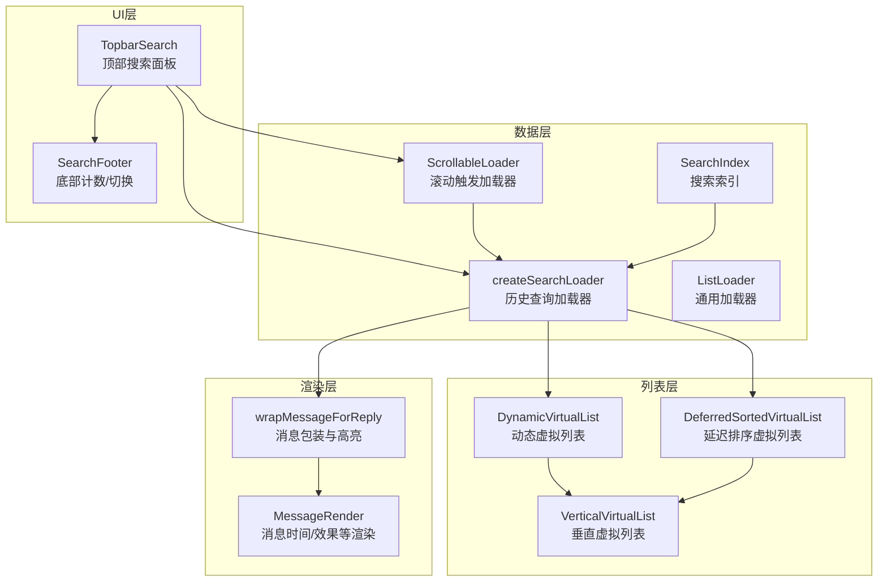
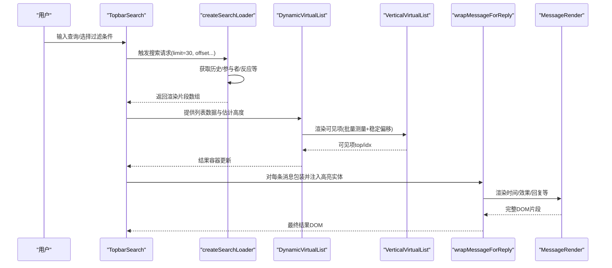
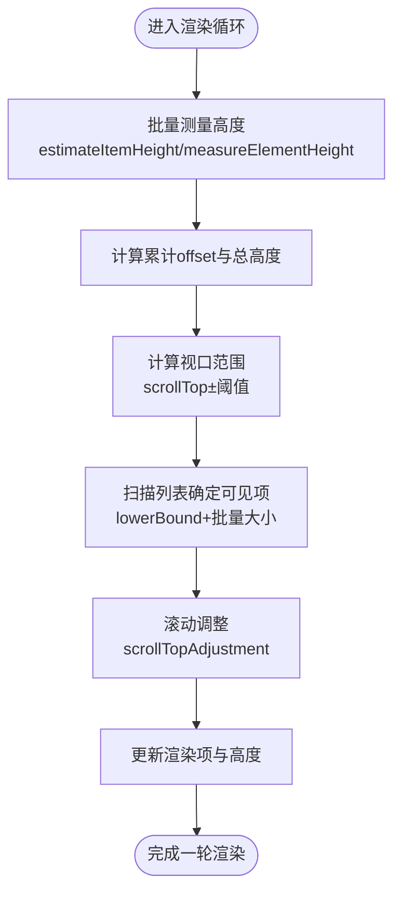
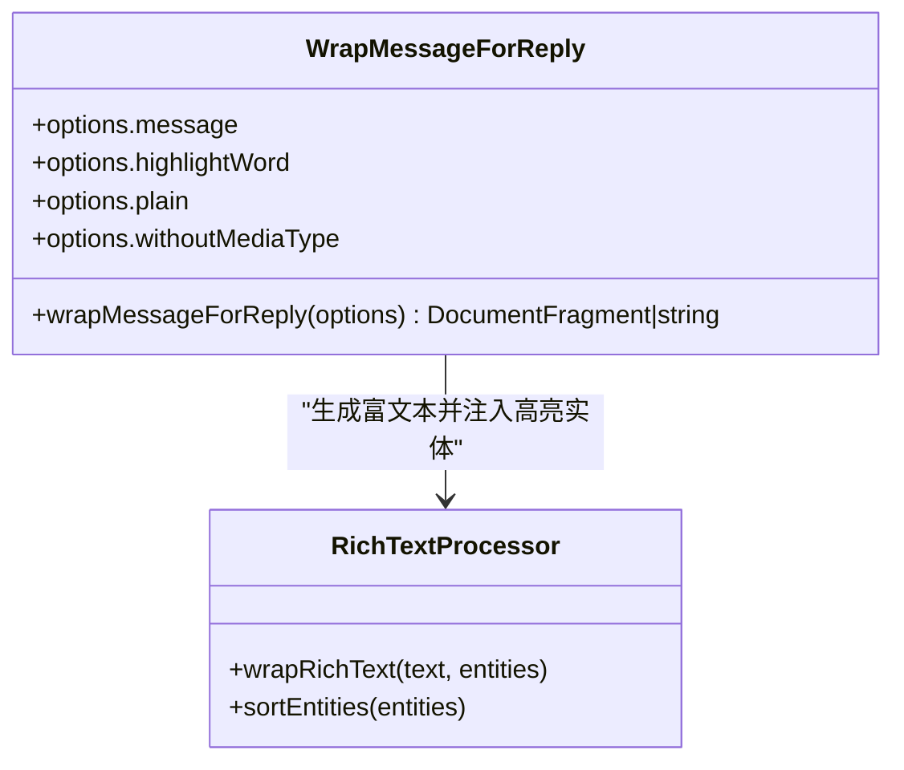
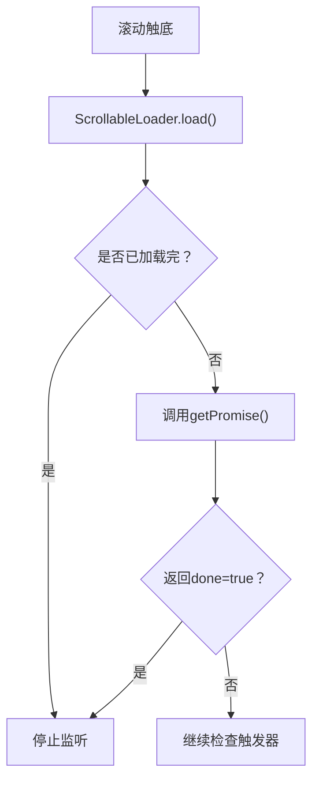
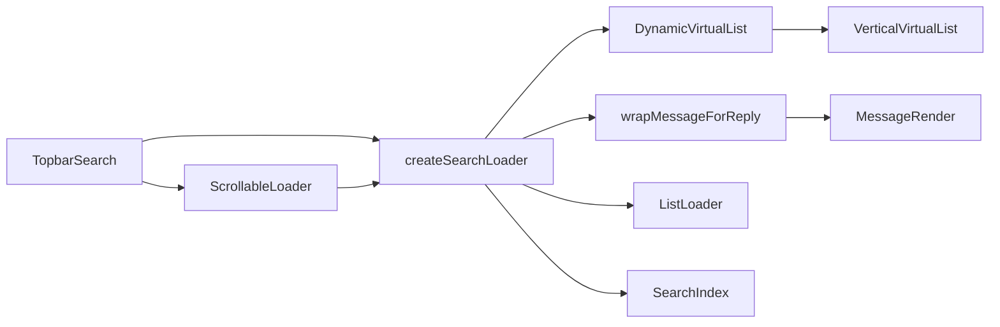

# 搜索结果展示

<cite>
**本文引用的文件**
- [topbarSearch.tsx](file://src/components/chat/topbarSearch.tsx)
- [dynamicVirtualList/index.tsx](file://src/components/dynamicVirtualList/index.tsx)
- [verticalVirtualList.tsx](file://src/components/verticalVirtualList.tsx)
- [deferredSortedVirtualList.tsx](file://src/components/deferredSortedVirtualList.tsx)
- [messageForReply.ts](file://src/components/wrappers/messageForReply.ts)
- [messageRender.ts](file://src/components/chat/messageRender.ts)
- [searchIndex.ts](file://src/lib/searchIndex.ts)
- [listLoader.ts](file://src/helpers/listLoader.ts)
- [scrollableLoader.ts](file://src/helpers/scrollableLoader.ts)
- [appSearchSuper.ts](file://src/components/appSearchSuper.ts)
</cite>

## 目录
1. [简介](#简介)
2. [项目结构](#项目结构)
3. [核心组件](#核心组件)
4. [架构总览](#架构总览)
5. [详细组件分析](#详细组件分析)
6. [依赖关系分析](#依赖关系分析)
7. [性能考量](#性能考量)
8. [故障排查指南](#故障排查指南)
9. [结论](#结论)

## 简介
本文件面向“搜索结果展示”功能，系统化阐述以下内容：
- 分页与无限滚动：如何在大量搜索结果中进行高效加载与翻页
- 虚拟滚动：如何通过动态虚拟列表与垂直虚拟列表降低渲染开销
- 排序策略：时间、相关性等排序的实现思路与扩展点
- 高亮显示：关键词高亮的UI实现细节与跨消息类型的统一展示
- 统一渲染：文本、媒体、文件等不同类型消息在搜索结果中的统一呈现
- 性能优化：批量测量、稳定偏移、滚动阈值、延迟加载等技巧

## 项目结构
搜索结果展示涉及多个层次：
- UI层：顶部搜索面板、结果容器、底部计数与切换按钮
- 列表层：动态虚拟列表、垂直虚拟列表、延迟排序虚拟列表
- 数据层：历史查询加载器、滚动触发加载器、搜索索引
- 渲染层：消息包装与高亮、富文本实体处理

图表来源
- [topbarSearch.tsx](file://src/components/chat/topbarSearch.tsx#L120-L210)
- [dynamicVirtualList/index.tsx](file://src/components/dynamicVirtualList/index.tsx#L348-L388)
- [verticalVirtualList.tsx](file://src/components/verticalVirtualList.tsx#L1-L188)
- [deferredSortedVirtualList.tsx](file://src/components/deferredSortedVirtualList.tsx#L1-L83)
- [messageForReply.ts](file://src/components/wrappers/messageForReply.ts#L338-L397)
- [messageRender.ts](file://src/components/chat/messageRender.ts#L170-L319)
- [listLoader.ts](file://src/helpers/listLoader.ts#L147-L208)
- [scrollableLoader.ts](file://src/helpers/scrollableLoader.ts#L1-L53)
- [searchIndex.ts](file://src/lib/searchIndex.ts#L108-L128)

章节来源
- [topbarSearch.tsx](file://src/components/chat/topbarSearch.tsx#L120-L210)
- [dynamicVirtualList/index.tsx](file://src/components/dynamicVirtualList/index.tsx#L348-L388)
- [verticalVirtualList.tsx](file://src/components/verticalVirtualList.tsx#L1-L188)
- [deferredSortedVirtualList.tsx](file://src/components/deferredSortedVirtualList.tsx#L1-L83)
- [messageForReply.ts](file://src/components/wrappers/messageForReply.ts#L338-L397)
- [messageRender.ts](file://src/components/chat/messageRender.ts#L170-L319)
- [listLoader.ts](file://src/helpers/listLoader.ts#L147-L208)
- [scrollableLoader.ts](file://src/helpers/scrollableLoader.ts#L1-L53)
- [searchIndex.ts](file://src/lib/searchIndex.ts#L108-L128)

## 核心组件
- 顶部搜索面板 TopbarSearch：负责输入、过滤条件（发送者、反应、类型）、结果容器与底部计数/切换按钮
- 动态虚拟列表 DynamicVirtualList：按需渲染可见项，支持批量测量、稳定偏移、近底回调
- 垂直虚拟列表 VerticalVirtualList：固定高度项的快速渲染与可见性判断
- 延迟排序虚拟列表 DeferredSortedVirtualList：先占位后补全，支持排序与可见项跟踪
- 消息包装与高亮 wrapMessageForReply：统一处理文本、媒体、服务动作等，并注入高亮实体
- 搜索索引 SearchIndex：基于全文索引与词序匹配的相关性排序
- 加载器：createSearchLoader（历史查询）、ListLoader（通用加载）、ScrollableLoader（滚动触发）

章节来源
- [topbarSearch.tsx](file://src/components/chat/topbarSearch.tsx#L120-L210)
- [dynamicVirtualList/index.tsx](file://src/components/dynamicVirtualList/index.tsx#L348-L388)
- [verticalVirtualList.tsx](file://src/components/verticalVirtualList.tsx#L1-L188)
- [deferredSortedVirtualList.tsx](file://src/components/deferredSortedVirtualList.tsx#L1-L83)
- [messageForReply.ts](file://src/components/wrappers/messageForReply.ts#L338-L397)
- [searchIndex.ts](file://src/lib/searchIndex.ts#L108-L128)
- [listLoader.ts](file://src/helpers/listLoader.ts#L147-L208)
- [scrollableLoader.ts](file://src/helpers/scrollableLoader.ts#L1-L53)

## 架构总览
搜索结果从输入到渲染的关键流程如下：

图表来源
- [topbarSearch.tsx](file://src/components/chat/topbarSearch.tsx#L127-L196)
- [dynamicVirtualList/index.tsx](file://src/components/dynamicVirtualList/index.tsx#L348-L388)
- [verticalVirtualList.tsx](file://src/components/verticalVirtualList.tsx#L1-L188)
- [messageForReply.ts](file://src/components/wrappers/messageForReply.ts#L338-L397)
- [messageRender.ts](file://src/components/chat/messageRender.ts#L170-L319)

## 详细组件分析

### 顶部搜索面板与结果容器
- 输入与过滤：支持发送者筛选、日期选择、反应选择、搜索类型（本群/我的/公共）
- 结果容器：根据小屏/大屏切换布局；空状态提示；底部计数与“以列表/以聊天”切换
- 加载器：createSearchLoader 负责分页加载，limit=30，offsetId/offsetPeerId 控制翻页
- 近底回调：当滚动至底部阈值附近时触发 onNearBottom，用于懒加载下一页

章节来源
- [topbarSearch.tsx](file://src/components/chat/topbarSearch.tsx#L267-L847)
- [topbarSearch.tsx](file://src/components/chat/topbarSearch.tsx#L1205-L1256)

### 动态虚拟列表 DynamicVirtualList
- 关键机制
  - 估计高度与批量测量：estimateItemHeight + measureElementHeight，避免一次性测量全量元素
  - 稳定偏移与平滑过渡：stableOffset + translation，减少重排抖动
  - 视口阈值：viewportThreshold=0.05，提前渲染少量上下边界
  - 近底阈值：nearBottomThreshold=120，接近底部触发 onNearBottom
  - 滚动调整：scrollTopAdjustment 自适应高度变化，保持滚动位置稳定
- 性能要点
  - 使用 lowerBound 快速定位视口起始索引
  - batch 合并多次更新，减少渲染次数
  - onMeasure 触发重新计算高度并填充视口

图表来源
- [dynamicVirtualList/index.tsx](file://src/components/dynamicVirtualList/index.tsx#L130-L246)
- [dynamicVirtualList/index.tsx](file://src/components/dynamicVirtualList/index.tsx#L247-L346)

章节来源
- [dynamicVirtualList/index.tsx](file://src/components/dynamicVirtualList/index.tsx#L130-L246)
- [dynamicVirtualList/index.tsx](file://src/components/dynamicVirtualList/index.tsx#L247-L346)
- [dynamicVirtualList/index.tsx](file://src/components/dynamicVirtualList/index.tsx#L348-L388)

### 垂直虚拟列表 VerticalVirtualList
- 固定高度项：适合已知高度的消息项，通过 top 动画与可见性判断快速渲染
- 可见性判定：使用 thresholdPadding 与 itemHeight 计算可视区间
- 动画优化：useShouldAnimate 在整体平移时禁用逐项动画，提升滚动流畅度

章节来源
- [verticalVirtualList.tsx](file://src/components/verticalVirtualList.tsx#L1-L188)

### 延迟排序虚拟列表 DeferredSortedVirtualList
- 占位与补全：先以 LoadingDialogSkeleton 占位，再异步请求并排序补全
- 排序策略：sortWith(a.index, b.index) 支持自定义排序函数
- 可见项跟踪：visibleItems 集合用于记录当前可见索引，触发请求补充缺失项
- 缩减策略：EXTRA_ITEMS_TO_KEEP 与 shrinkTimeout 控制内存占用

章节来源
- [deferredSortedVirtualList.tsx](file://src/components/deferredSortedVirtualList.tsx#L1-L83)
- [deferredSortedVirtualList.tsx](file://src/components/deferredSortedVirtualList.tsx#L210-L270)

### 搜索索引与排序
- 全文索引：SearchIndex 将对象文本标准化后存入 Map，支持最小字符数与全词匹配
- 匹配逻辑：逐词查找，校验词边界；统计已匹配字符数与剩余长度
- 排序规则：按“剩余字符数差”和“原文长度”升序排序，优先返回更贴近的匹配

章节来源
- [searchIndex.ts](file://src/lib/searchIndex.ts#L63-L128)

### 消息包装与高亮
- 多媒体统一封装：根据消息媒体类型输出“照片/视频/音频/联系人/投票/故事/待办”等文案
- 高亮注入：当存在 highlightWord 时，为每个匹配位置插入 messageEntityHighlight 实体，随后由富文本处理器渲染为高亮样式
- 特殊处理：对服务号验证码隐藏、对受限消息替换为限制原因等

图表来源
- [messageForReply.ts](file://src/components/wrappers/messageForReply.ts#L338-L397)
- [messageForReply.ts](file://src/components/wrappers/messageForReply.ts#L348-L369)

章节来源
- [messageForReply.ts](file://src/components/wrappers/messageForReply.ts#L338-L397)
- [messageForReply.ts](file://src/components/wrappers/messageForReply.ts#L348-L369)

### 消息时间与效果渲染
- 时间渲染：包含编辑标记、转发原始时间、发布时间等信息
- 效果渲染：支持特效贴纸预加载与播放控制
- 组合渲染：将时间、效果、图标等组合为可复用的时间区域DOM

章节来源
- [messageRender.ts](file://src/components/chat/messageRender.ts#L170-L319)

### 分页与无限滚动
- 通用加载器：ListLoader 提供双向加载能力，自动处理加载状态与边界
- 滚动触发：ScrollableLoader 在滚动到底部时触发加载，避免重复请求
- 搜索加载器：createSearchLoader 使用 offsetId/offsetPeerId 与 limit=30 实现分页

图表来源
- [scrollableLoader.ts](file://src/helpers/scrollableLoader.ts#L1-L53)
- [listLoader.ts](file://src/helpers/listLoader.ts#L147-L208)
- [topbarSearch.tsx](file://src/components/chat/topbarSearch.tsx#L130-L196)

章节来源
- [scrollableLoader.ts](file://src/helpers/scrollableLoader.ts#L1-L53)
- [listLoader.ts](file://src/helpers/listLoader.ts#L147-L208)
- [topbarSearch.tsx](file://src/components/chat/topbarSearch.tsx#L130-L196)

### 搜索结果排序策略
- 相关性排序：SearchIndex.search 返回按“剩余字符差+原文长度”升序的结果集合
- 时间排序：在历史查询中，按消息时间倒序排列（由后端或历史管理器保证）
- 反应/类型筛选：TopbarSearch 支持 reaction 与 searchType（本群/我的/公共），影响最终结果集

章节来源
- [searchIndex.ts](file://src/lib/searchIndex.ts#L108-L128)
- [topbarSearch.tsx](file://src/components/chat/topbarSearch.tsx#L130-L196)

### 高亮显示UI实现细节
- 高亮实体：通过 messageEntityHighlight 注入到 entities 中，交由富文本处理器渲染
- 文本截断：对长文本进行符号限制，避免高亮过多导致性能问题
- 特殊场景：服务号验证码隐藏、受限消息替换为限制原因

章节来源
- [messageForReply.ts](file://src/components/wrappers/messageForReply.ts#L338-L397)
- [messageForReply.ts](file://src/components/wrappers/messageForReply.ts#L348-L369)

### 统一展示不同消息类型
- 文本：普通文本与富文本实体
- 媒体：照片、视频、音频、GIF、轮播图、投票、联系人、地理位置、直播位置、故事、付费媒体、待办
- 服务动作：系统消息、活动结果等
- 统一入口：wrapMessageForReply 将上述类型统一转换为 DOM 片段，再由 Dynamic/Vertical 虚拟列表渲染

章节来源
- [messageForReply.ts](file://src/components/wrappers/messageForReply.ts#L90-L305)

## 依赖关系分析

图表来源
- [topbarSearch.tsx](file://src/components/chat/topbarSearch.tsx#L127-L196)
- [dynamicVirtualList/index.tsx](file://src/components/dynamicVirtualList/index.tsx#L348-L388)
- [verticalVirtualList.tsx](file://src/components/verticalVirtualList.tsx#L1-L188)
- [messageForReply.ts](file://src/components/wrappers/messageForReply.ts#L338-L397)
- [messageRender.ts](file://src/components/chat/messageRender.ts#L170-L319)
- [scrollableLoader.ts](file://src/helpers/scrollableLoader.ts#L1-L53)
- [listLoader.ts](file://src/helpers/listLoader.ts#L147-L208)
- [searchIndex.ts](file://src/lib/searchIndex.ts#L108-L128)

章节来源
- [topbarSearch.tsx](file://src/components/chat/topbarSearch.tsx#L127-L196)
- [dynamicVirtualList/index.tsx](file://src/components/dynamicVirtualList/index.tsx#L348-L388)
- [verticalVirtualList.tsx](file://src/components/verticalVirtualList.tsx#L1-L188)
- [messageForReply.ts](file://src/components/wrappers/messageForReply.ts#L338-L397)
- [messageRender.ts](file://src/components/chat/messageRender.ts#L170-L319)
- [scrollableLoader.ts](file://src/helpers/scrollableLoader.ts#L1-L53)
- [listLoader.ts](file://src/helpers/listLoader.ts#L147-L208)
- [searchIndex.ts](file://src/lib/searchIndex.ts#L108-L128)

## 性能考量
- 虚拟滚动
  - 动态虚拟列表：批量测量、稳定偏移、视口阈值、近底回调，显著降低DOM节点数量
  - 垂直虚拟列表：固定高度项，使用 top 动画与可见性判断，滚动更顺滑
- 懒加载与分页
  - 滚动触发加载：仅在接近底部时发起请求，避免频繁网络请求
  - 历史查询分页：limit=30，offsetId/offsetPeerId 控制翻页，减少单次数据量
- 内存与渲染
  - DeferredSortedVirtualList 的占位与补全策略，避免一次性渲染全部项
  - ListLoader 的双向加载与边界检测，防止重复加载
- 文本与实体
  - 高亮实体按需注入，避免全量扫描；文本截断减少DOM复杂度

[本节为通用性能建议，不直接分析具体文件]

## 故障排查指南
- 搜索无结果
  - 检查输入是否为空或仅为“#”，确认 isHashtag 条件与 count 逻辑
  - 确认 createSearchLoader 是否正确设置 limit/offset 并返回 rendered
- 滚动不触发加载
  - 检查 ScrollableLoader.onScrolledBottom 是否被设置且未被置空
  - 确认 getPromise 返回 done=true 时会清理监听
- 虚拟列表卡顿
  - 确认 estimateItemHeight 返回合理估算值
  - 检查 batch 更新是否生效，避免频繁小更新
  - 确保 onNearBottom 与 nearBottomThreshold 设置合理
- 高亮不生效
  - 确认 highlightWord 存在且非空
  - 检查 entities 中是否成功注入 messageEntityHighlight
  - 确认富文本处理器正确渲染实体

章节来源
- [topbarSearch.tsx](file://src/components/chat/topbarSearch.tsx#L766-L847)
- [scrollableLoader.ts](file://src/helpers/scrollableLoader.ts#L1-L53)
- [dynamicVirtualList/index.tsx](file://src/components/dynamicVirtualList/index.tsx#L348-L388)
- [messageForReply.ts](file://src/components/wrappers/messageForReply.ts#L338-L397)

## 结论
该搜索结果展示体系通过“顶部搜索面板 + 动态/垂直虚拟列表 + 消息包装与高亮 + 搜索索引 + 分页/滚动加载”的组合，实现了：
- 高效分页与无限滚动，兼顾网络与内存开销
- 虚拟滚动带来的流畅体验与低渲染成本
- 统一的消息类型处理与关键词高亮
- 易于扩展的排序与过滤机制

在实际部署中，建议结合业务场景调整：
- 调整 nearBottomThreshold 与 maxBatchSize 以平衡首屏速度与滚动流畅度
- 优化 estimateItemHeight 以减少首次测量误差
- 在高亮场景下限制最大匹配数量，避免过度渲染