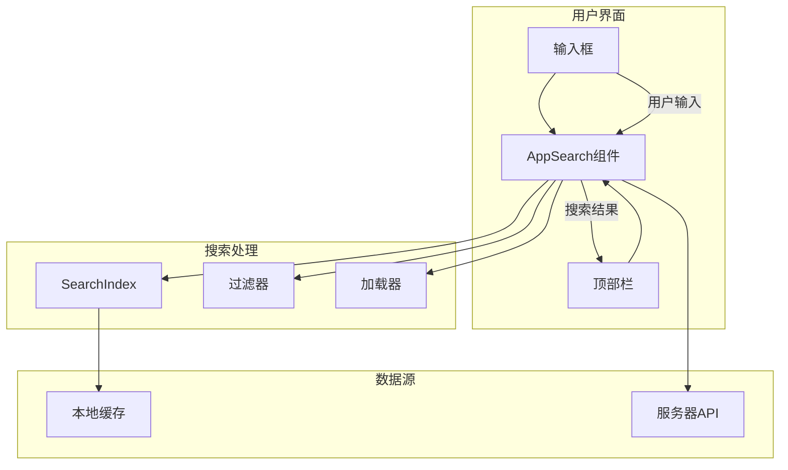
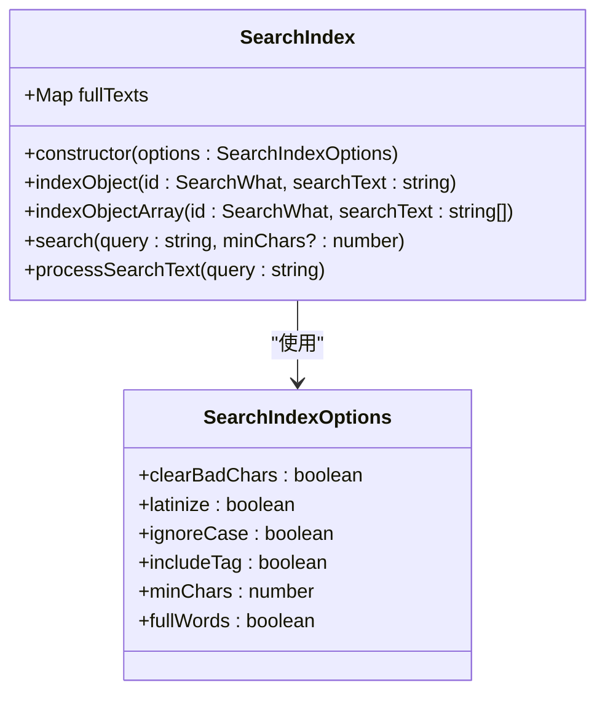
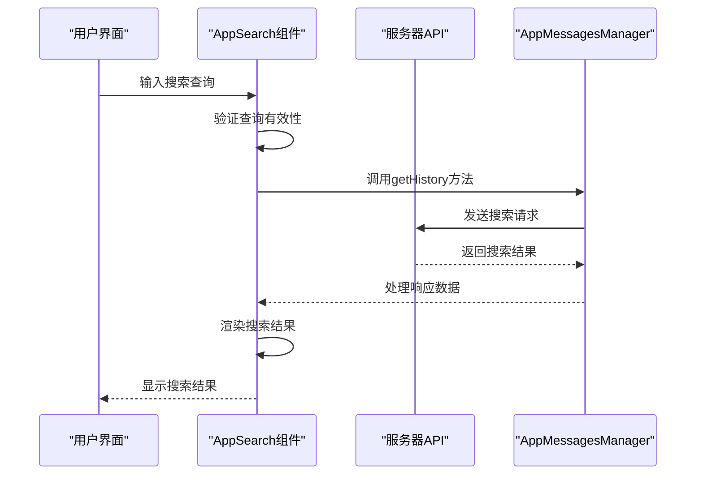
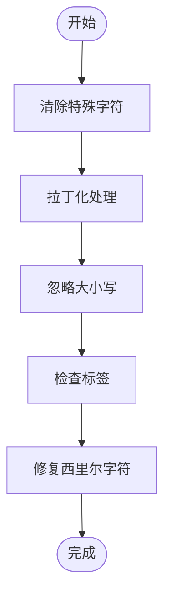
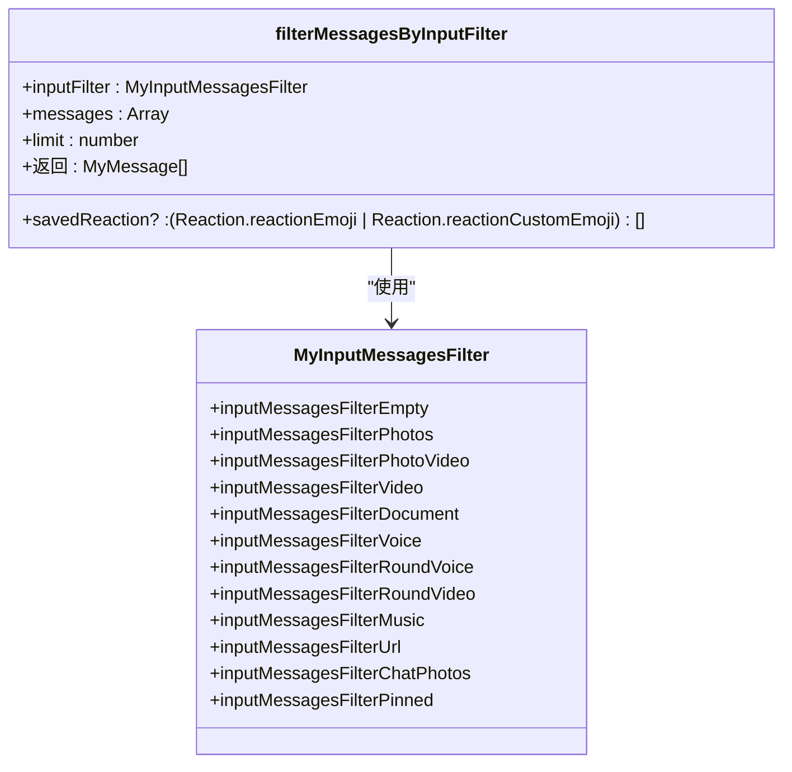
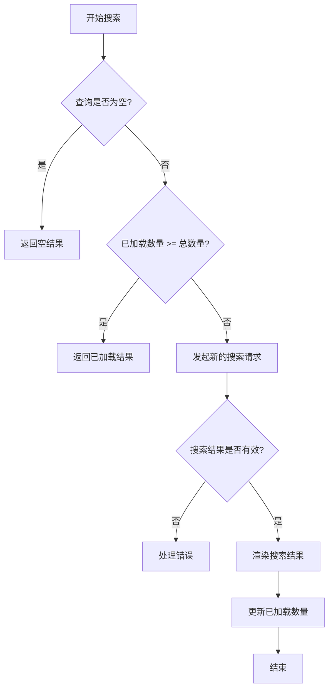

# 查询处理机制

<cite>
**本文档引用的文件**   
- [searchIndex.ts](file://src/lib/searchIndex.ts)
- [cleanSearchText.ts](file://src/helpers/cleanSearchText.ts)
- [appSearch.ts](file://src/components/appSearch.ts)
- [appSearchSuper.ts](file://src/components/appSearchSuper.ts)
- [chat/search.ts](file://src/components/chat/search.ts)
- [chat/topbarSearch.tsx](file://src/components/chat/topbarSearch.tsx)
- [filterMessagesByInputFilter.ts](file://src/lib/appManagers/utils/messages/filterMessagesByInputFilter.ts)
- [getSearchType.ts](file://src/lib/appManagers/utils/messages/getSearchType.ts)
- [inputSearch.ts](file://src/components/inputSearch.ts)
- [searchListLoader.ts](file://src/helpers/searchListLoader.ts)
</cite>

## 目录
1. [简介](#简介)
2. [查询处理架构](#查询处理架构)
3. [本地搜索实现](#本地搜索实现)
4. [服务器搜索实现](#服务器搜索实现)
5. [用户输入解析](#用户输入解析)
6. [过滤条件处理](#过滤条件处理)
7. [查询优化策略](#查询优化策略)
8. [核心逻辑代码示例](#核心逻辑代码示例)

## 简介
本文档详细阐述了Telegram Web客户端中查询处理机制的实现方式。系统提供了两种主要的搜索方式：本地搜索和服务器搜索，以满足不同场景下的需求。查询处理机制涵盖了从用户输入解析、关键词匹配、布尔运算符处理到复杂过滤条件构建的完整流程。系统通过优化策略如短路求值和条件排序来提高搜索效率，确保用户能够快速获得准确的搜索结果。

## 查询处理架构
查询处理机制的核心是`SearchIndex`类，它负责管理搜索索引和执行搜索操作。系统通过`AppSearch`和`AppSearchSuper`组件提供搜索功能，这些组件与用户界面紧密集成。搜索过程涉及多个组件的协作，包括输入处理、结果渲染和性能优化。

**Diagram sources**
- [appSearch.ts](file://src/components/appSearch.ts)
- [searchIndex.ts](file://src/lib/searchIndex.ts)

**Section sources**
- [appSearch.ts](file://src/components/appSearch.ts#L1-L290)
- [searchIndex.ts](file://src/lib/searchIndex.ts#L1-L129)

## 本地搜索实现
本地搜索主要通过`SearchIndex`类实现，该类维护一个完整的文本映射，用于快速查找匹配的搜索项。本地搜索适用于已加载到内存中的数据，能够提供即时的搜索响应。

**Diagram sources**
- [searchIndex.ts](file://src/lib/searchIndex.ts#L20-L128)

**Section sources**
- [searchIndex.ts](file://src/lib/searchIndex.ts#L20-L128)

## 服务器搜索实现
服务器搜索通过`AppSearch`组件与后端API交互，获取远程数据。当本地搜索无法满足需求或需要获取更多结果时，系统会发起服务器请求。服务器搜索支持分页加载，以优化网络性能和用户体验。

**Diagram sources**
- [appSearch.ts](file://src/components/appSearch.ts#L191-L270)
- [appSearchSuper.ts](file://src/components/appSearchSuper.ts)

**Section sources**
- [appSearch.ts](file://src/components/appSearch.ts#L191-L270)
- [appSearchSuper.ts](file://src/components/appSearchSuper.ts#L818-L861)

## 用户输入解析
用户输入解析是查询处理的第一步，系统通过`cleanSearchText`和`processSearchText`函数对用户输入进行预处理。解析过程包括清除特殊字符、大小写转换、拉丁化处理等，以提高搜索的准确性和包容性。

**Diagram sources**
- [cleanSearchText.ts](file://src/helpers/cleanSearchText.ts#L86-L95)

**Section sources**
- [cleanSearchText.ts](file://src/helpers/cleanSearchText.ts#L86-L95)

## 过滤条件处理
系统支持多种过滤条件，包括消息类型、日期范围、发件人等。过滤条件通过`filterMessagesByInputFilter`函数处理，该函数根据不同的输入过滤器类型应用相应的过滤逻辑。

**Diagram sources**
- [filterMessagesByInputFilter.ts](file://src/lib/appManagers/utils/messages/filterMessagesByInputFilter.ts#L13-L171)

**Section sources**
- [filterMessagesByInputFilter.ts](file://src/lib/appManagers/utils/messages/filterMessagesByInputFilter.ts#L13-L171)

## 查询优化策略
系统采用多种优化策略来提高搜索效率，包括短路求值、条件排序和缓存机制。这些策略确保在处理大量数据时仍能保持良好的性能。

**Diagram sources**
- [appSearch.ts](file://src/components/appSearch.ts#L194-L270)

**Section sources**
- [appSearch.ts](file://src/components/appSearch.ts#L194-L270)

## 核心逻辑代码示例
以下是查询处理核心逻辑的代码示例路径，展示了系统如何处理搜索请求和渲染结果。

**Section sources**
- [appSearch.ts](file://src/components/appSearch.ts#L137-L146)
- [searchIndex.ts](file://src/lib/searchIndex.ts#L108-L123)
- [cleanSearchText.ts](file://src/helpers/cleanSearchText.ts#L86-L95)
- [filterMessagesByInputFilter.ts](file://src/lib/appManagers/utils/messages/filterMessagesByInputFilter.ts#L13-L171)
- [getSearchType.ts](file://src/lib/appManagers/utils/messages/getSearchType.ts#L3-L16)