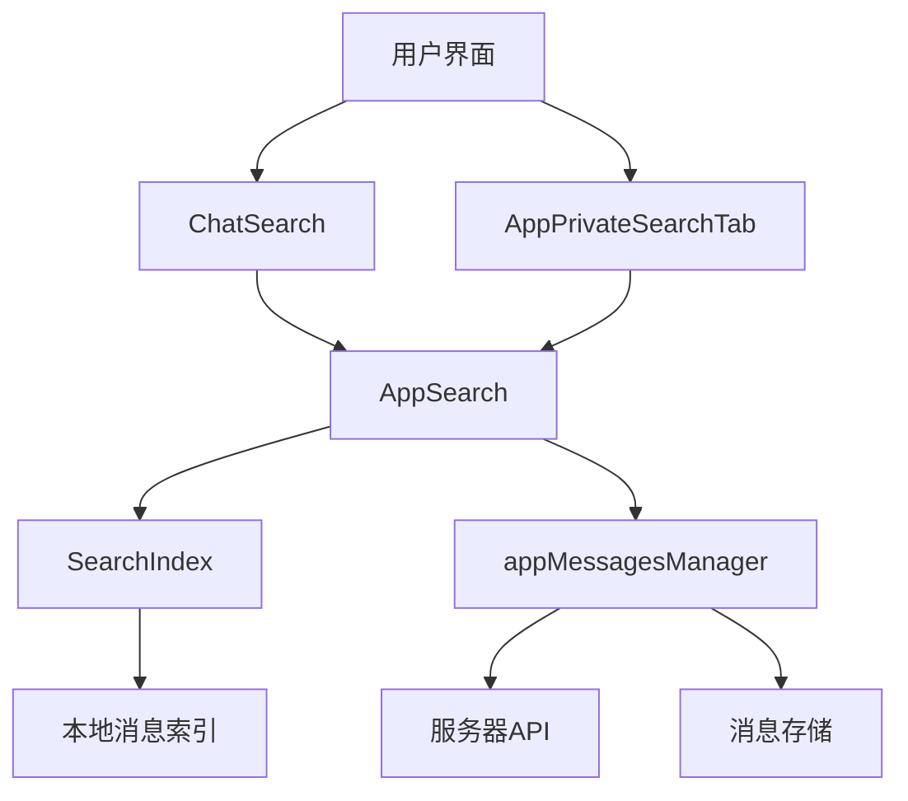
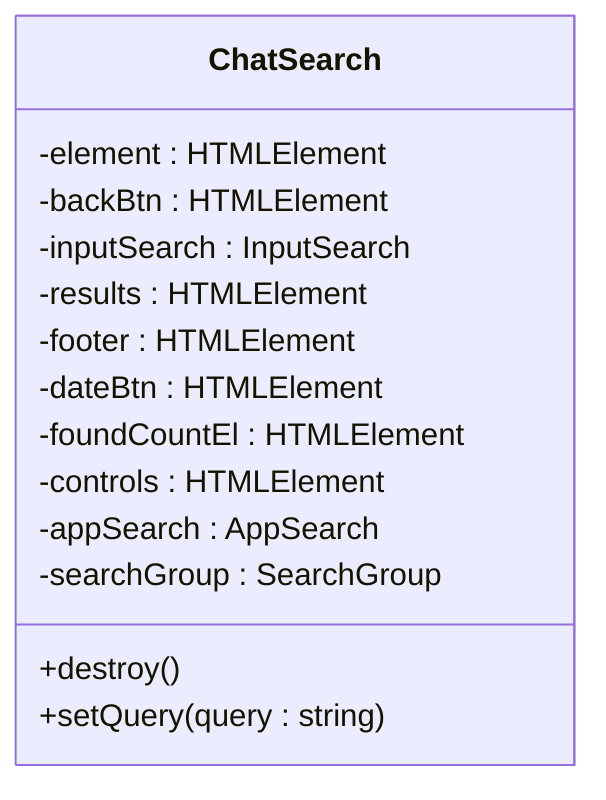
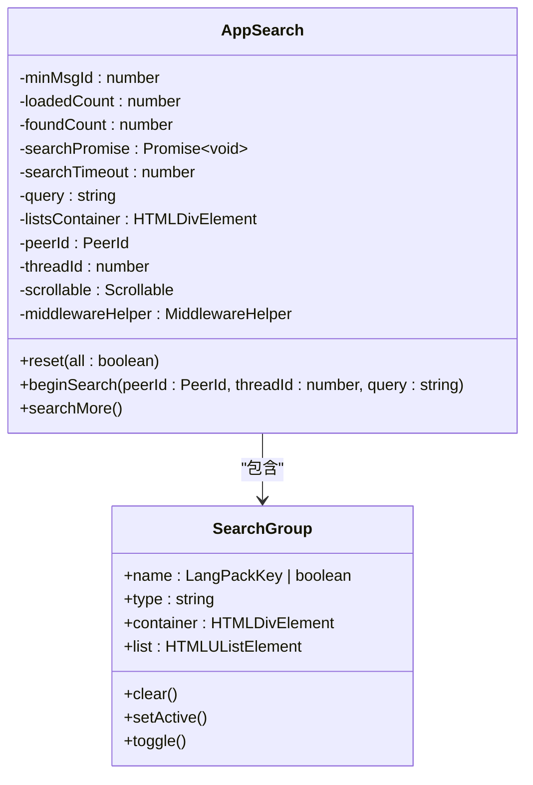
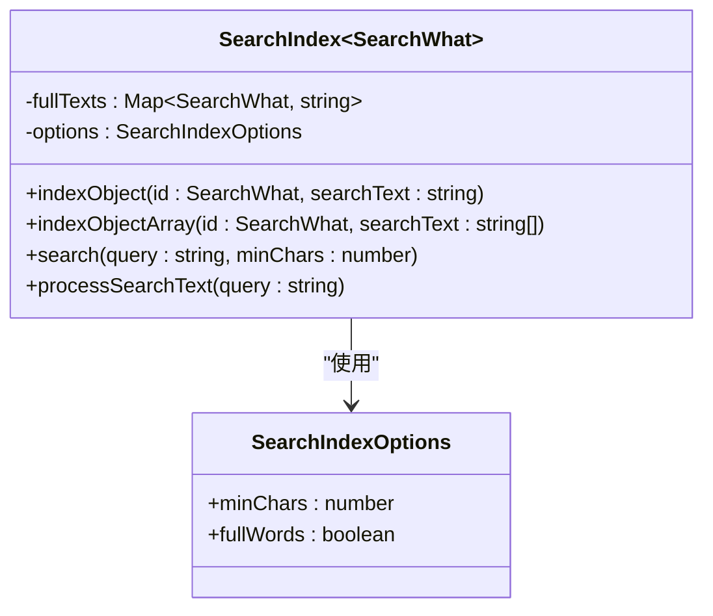
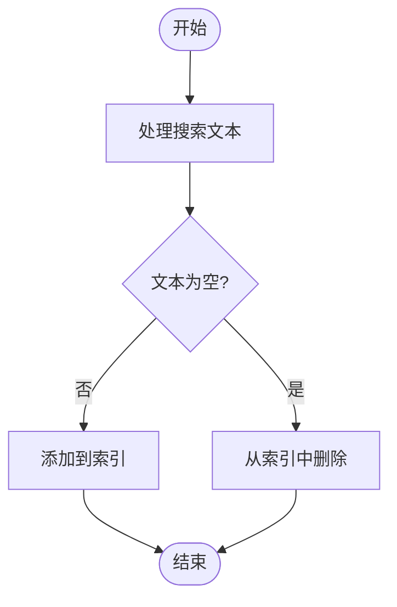
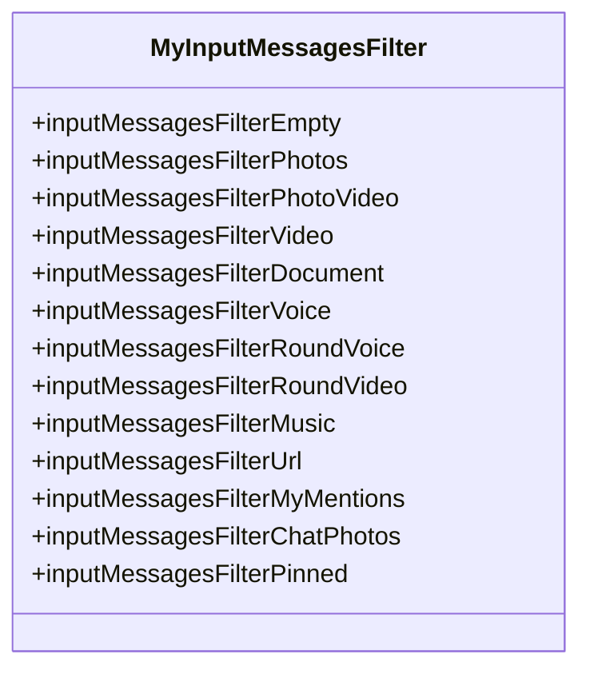
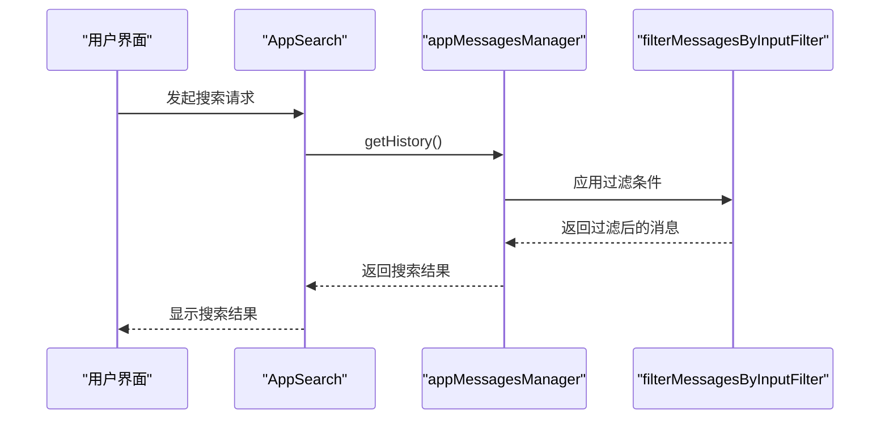
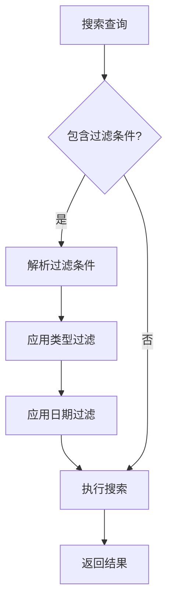
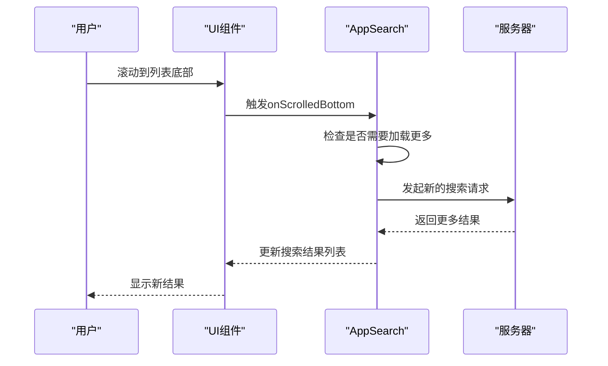
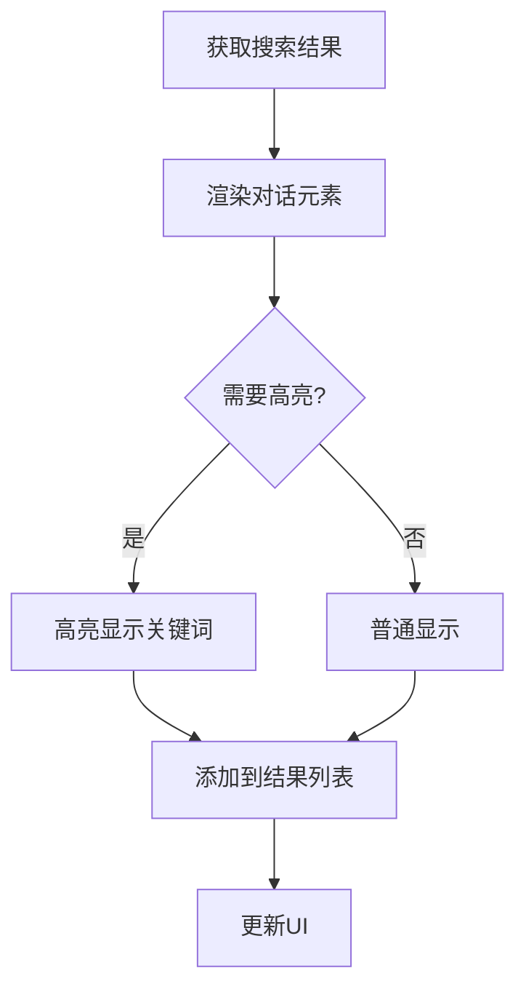

# 聊天搜索与过滤

<cite>
**本文档引用的文件**
- [searchIndex.ts](file://src/lib/searchIndex.ts)
- [appSearch.ts](file://src/components/appSearch.ts)
- [appMessagesManager.ts](file://src/lib/appManagers/appMessagesManager.ts)
- [chat/search.ts](file://src/components/chat/search.ts)
- [sidebarRight/tabs/search.ts](file://src/components/sidebarRight/tabs/search.ts)
- [searchListLoader.ts](file://src/helpers/searchListLoader.ts)
</cite>

## 目录
1. [简介](#简介)
2. [搜索功能架构](#搜索功能架构)
3. [核心组件分析](#核心组件分析)
4. [搜索索引机制](#搜索索引机制)
5. [消息过滤实现](#消息过滤实现)
6. [高级搜索组合](#高级搜索组合)
7. [搜索结果分页与显示](#搜索结果分页与显示)
8. [结论](#结论)

## 简介

本文档详细记录了聊天应用中搜索与过滤功能的实现细节。系统提供了全文搜索、消息类型过滤、日期范围筛选等API，支持在聊天界面中快速定位特定消息。搜索功能分为本地搜索和服务器搜索两种模式，通过高效的索引机制实现快速检索。用户可以通过文本查询、媒体类型过滤、日期选择等多种条件进行精确搜索，并支持组合多种搜索条件进行高级搜索。

**Section sources**
- [chat/search.ts](file://src/components/chat/search.ts#L1-L244)
- [sidebarRight/tabs/search.ts](file://src/components/sidebarRight/tabs/search.ts#L1-L81)

## 搜索功能架构

聊天搜索功能由多个组件协同工作，形成了完整的搜索体系。系统通过AppSearch组件管理搜索流程，ChatSearch组件处理聊天界面的搜索交互，SearchIndex类提供高效的本地搜索能力。

**Diagram sources**
- [appSearch.ts](file://src/components/appSearch.ts#L1-L290)
- [chat/search.ts](file://src/components/chat/search.ts#L1-L244)

## 核心组件分析

### ChatSearch 组件

ChatSearch组件负责聊天界面中的搜索功能，提供了搜索输入框、结果展示和导航控件。该组件在聊天顶部栏下方创建搜索界面，包含返回按钮、搜索输入框、搜索结果列表和底部操作栏。

**Diagram sources**
- [chat/search.ts](file://src/components/chat/search.ts#L28-L244)

### AppSearch 组件

AppSearch组件是搜索功能的核心管理器，负责协调搜索请求、处理搜索结果和管理搜索状态。它支持多种搜索类型，包括联系人、全局联系人和消息搜索。

**Diagram sources**
- [appSearch.ts](file://src/components/appSearch.ts#L1-L290)

## 搜索索引机制

### SearchIndex 类

SearchIndex类实现了高效的本地搜索索引机制，通过预处理和索引构建，实现了快速的全文搜索功能。该类支持自定义搜索选项，如最小字符数、全词匹配等。

**Diagram sources**
- [searchIndex.ts](file://src/lib/searchIndex.ts#L20-L129)

### 索引构建与维护

搜索索引的构建和维护机制确保了搜索结果的实时性和准确性。当新消息到达或消息内容发生变化时，系统会自动更新搜索索引。

**Diagram sources**
- [searchIndex.ts](file://src/lib/searchIndex.ts#L28-L43)

## 消息过滤实现

### 过滤条件支持

系统支持多种消息类型过滤，包括图片、文件、链接等。这些过滤条件通过MyInputMessagesFilter类型定义，实现了对不同类型消息的精确筛选。

**Diagram sources**
- [appMessagesManager.ts](file://src/lib/appManagers/appMessagesManager.ts#L181-L193)

### 过滤逻辑实现

消息过滤逻辑在appMessagesManager中实现，通过filterMessagesByInputFilter函数对消息进行筛选。系统支持组合多种过滤条件，实现复杂的搜索需求。

**Diagram sources**
- [appMessagesManager.ts](file://src/lib/appManagers/appMessagesManager.ts#L44-L45)
- [appSearch.ts](file://src/components/appSearch.ts#L209-L230)

## 高级搜索组合

### 多条件组合搜索

系统支持将文本搜索与类型过滤、日期筛选等条件组合使用，实现高级搜索功能。用户可以通过搜索输入框输入关键词，同时选择特定的消息类型和日期范围。

**Section sources**
- [appSearch.ts](file://src/components/appSearch.ts#L191-L288)
- [searchListLoader.ts](file://src/helpers/searchListLoader.ts#L33-L67)

## 搜索结果分页与显示

### 分页机制

搜索结果采用分页加载机制，每次请求获取固定数量的消息（默认20条）。当用户滚动到列表底部时，系统自动加载更多搜索结果。

**Diagram sources**
- [appSearch.ts](file://src/components/appSearch.ts#L148-L157)
- [searchListLoader.ts](file://src/helpers/searchListLoader.ts#L33-L67)

### 结果显示优化

搜索结果显示经过优化，确保了良好的用户体验。系统会高亮显示搜索关键词，提供搜索结果计数，并支持在聊天界面中直接跳转到匹配的消息。

**Section sources**
- [appSearch.ts](file://src/components/appSearch.ts#L241-L260)
- [chat/search.ts](file://src/components/chat/search.ts#L183-L218)

## 结论

聊天搜索与过滤功能通过本地搜索和服务器搜索相结合的方式，实现了高效的消息检索。SearchIndex类提供了快速的本地搜索能力，而appMessagesManager则负责与服务器通信获取更全面的搜索结果。系统支持多种过滤条件的组合使用，用户可以通过文本、类型、日期等多种维度精确查找所需消息。分页加载机制确保了大量搜索结果的流畅显示，而优化的UI设计则提升了用户的搜索体验。