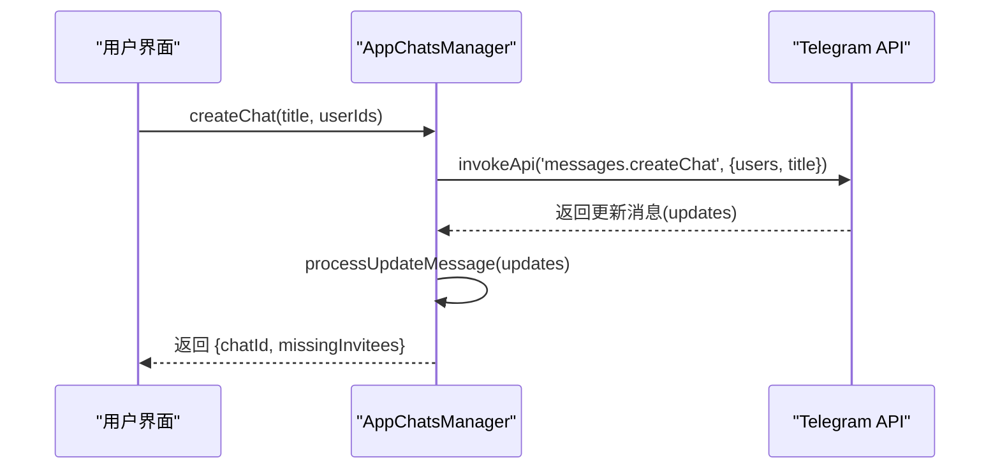
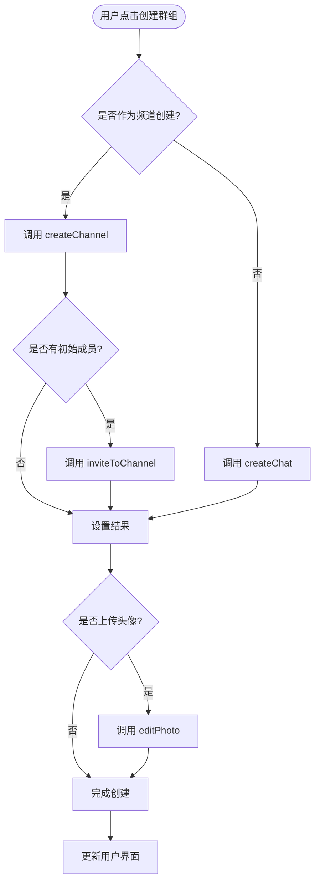
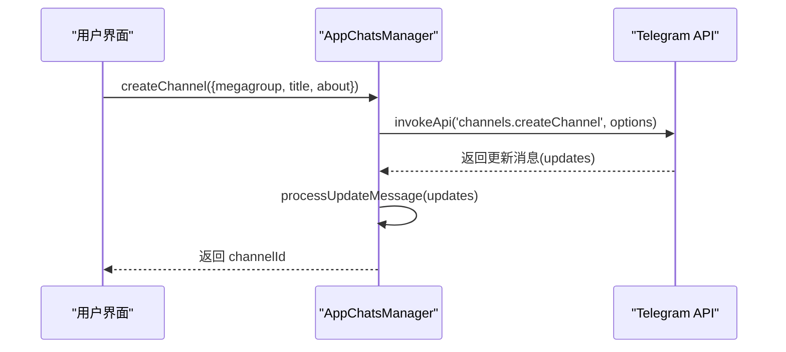
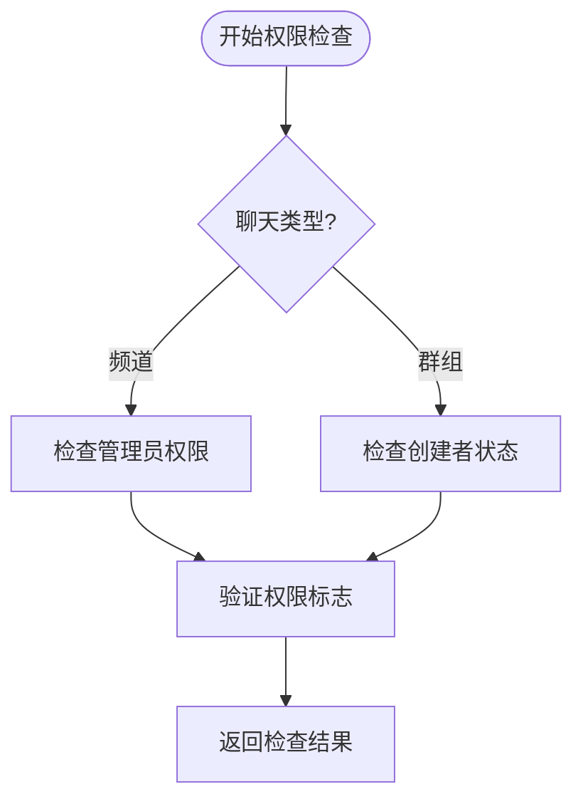
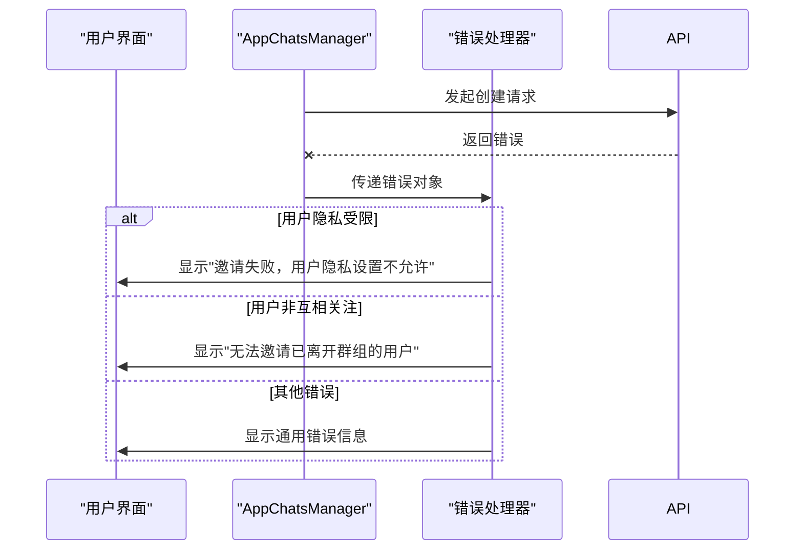
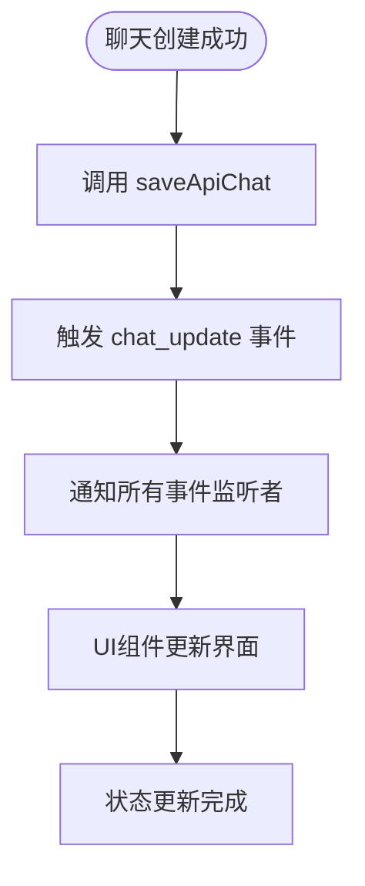
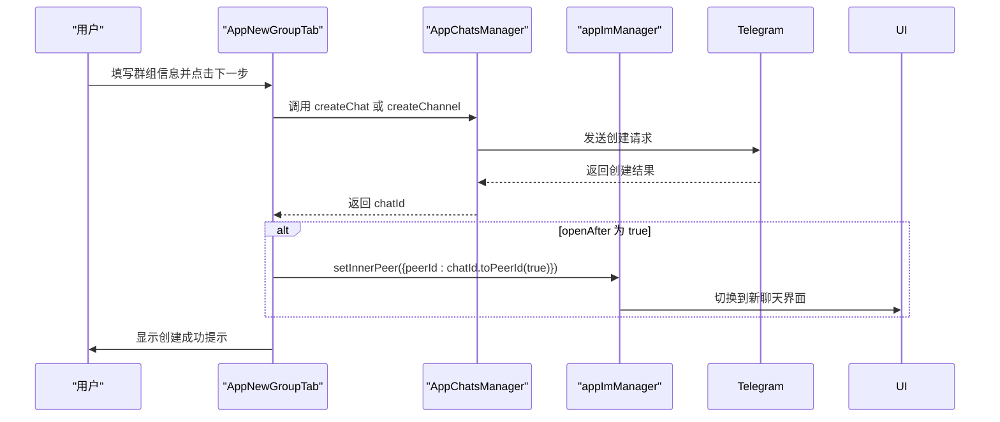

# 聊天创建

<cite>
**本文档引用的文件**   
- [appChatsManager.ts](file://src/lib/appManagers/appChatsManager.ts)
- [newGroup.ts](file://src/components/sidebarLeft/tabs/newGroup.ts)
- [newChannel.ts](file://src/components/sidebarLeft/tabs/newChannel.ts)
- [addChatUsers.ts](file://src/components/addChatUsers.ts)
</cite>

## 目录
1. [简介](#简介)
2. [核心组件](#核心组件)
3. [单聊创建流程](#单聊创建流程)
4. [群组创建流程](#群组创建流程)
5. [频道创建流程](#频道创建流程)
6. [权限检查机制](#权限检查机制)
7. [错误处理与用户反馈](#错误处理与用户反馈)
8. [客户端状态更新](#客户端状态更新)
9. [用户界面交互流程](#用户界面交互流程)
10. [结论](#结论)

## 简介
本文档详细阐述了Telegram Web客户端中聊天创建功能的实现机制。文档深入分析了单聊、群组和频道三种聊天类型的创建流程，重点解析了`appChatsManager`中`createChat`、`createGroup`和`createChannel`等关键方法的实现细节。文档还详细描述了创建过程中的参数验证、权限检查、服务器通信机制以及客户端状态更新逻辑，为开发者提供了全面的技术参考。

**Section sources**
- [appChatsManager.ts](file://src/lib/appManagers/appChatsManager.ts#L431-L479)
- [newGroup.ts](file://src/components/sidebarLeft/tabs/newGroup.ts#L44-L58)

## 核心组件
聊天创建功能的核心是`AppChatsManager`类，它负责管理所有与聊天相关的操作。该类提供了`createChat`、`createChannel`和`inviteToChannel`等关键方法，这些方法通过调用Telegram的MTProto API与服务器进行通信。UI层面，`AppNewGroupTab`和`AppNewChannelTab`组件负责处理用户输入和界面交互，它们在用户完成创建操作后调用`AppChatsManager`中的相应方法。

```mermaid
classDiagram
class AppChatsManager {
+createChat(title : string, userIds : UserId[]) : Promise~{chatId : ChatId, missingInvitees : MissingInvitee[]}~
+createChannel(options : ChannelsCreateChannel) : Promise~ChatId~
+inviteToChannel(id : ChatId, userIds : UserId[]) : Promise~MissingInvitee[]~
+hasRights(id : ChatId, action : ChatRights, rights? : ChatAdminRights | ChatBannedRights, isThread? : boolean) : boolean
}
class AppNewGroupTab {
+init(options : {peerIds : PeerId[], isGeoChat? : boolean, onCreate? : (chatId : ChatId) => void, openAfter? : boolean, title? : string, asChannel? : boolean}) : Promise~void~
+onCloseAfterTimeout() : void
}
class AppNewChannelTab {
+init(options : {onCreate? : (chatId : ChatId) => void, openAfter? : boolean}) : Promise~void~
}
class addChatUsers {
+addChatUsers({peerId, slider} : {peerId : PeerId, slider : SidebarSlider}) : Promise~void~
+handleMissingInvitees(chatId : ChatId, missingInvitees : MissingInvitee[]) : Promise~void~
}
AppNewGroupTab --> AppChatsManager : "调用"
AppNewChannelTab --> AppChatsManager : "调用"
addChatUsers --> AppChatsManager : "调用"
```

**Diagram sources **
- [appChatsManager.ts](file://src/lib/appManagers/appChatsManager.ts#L431-L479)
- [newGroup.ts](file://src/components/sidebarLeft/tabs/newGroup.ts#L44-L58)
- [newChannel.ts](file://src/components/sidebarLeft/tabs/newChannel.ts#L36-L76)
- [addChatUsers.ts](file://src/components/addChatUsers.ts#L142-L238)

**Section sources**
- [appChatsManager.ts](file://src/lib/appManagers/appChatsManager.ts#L57-L81)
- [newGroup.ts](file://src/components/sidebarLeft/tabs/newGroup.ts#L32-L43)

## 单聊创建流程
单聊创建流程通过调用`AppChatsManager`的`createChat`方法实现。该方法接收聊天标题和用户ID列表作为参数，首先将用户ID转换为API所需的`InputPeer`格式，然后调用`messages.createChat` API方法。创建成功后，服务器会返回包含新聊天ID的更新消息，客户端通过`apiUpdatesManager.processUpdateMessage`处理这些更新，并从响应中提取出新的`chatId`。



**Diagram sources **
- [appChatsManager.ts](file://src/lib/appManagers/appChatsManager.ts#L469-L478)

**Section sources**
- [appChatsManager.ts](file://src/lib/appManagers/appChatsManager.ts#L469-L478)

## 群组创建流程
群组创建流程在UI上由`AppNewGroupTab`组件处理。当用户在创建新群组时选择"作为频道"选项，`init`方法会根据`asChannel`参数决定创建群组还是频道。对于普通群组，直接调用`createChat`方法；对于频道，则调用`createChannel`方法，并在创建成功后立即调用`inviteToChannel`邀请初始成员。整个流程通过Promise链式调用确保操作的顺序性。



**Diagram sources **
- [newGroup.ts](file://src/components/sidebarLeft/tabs/newGroup.ts#L128-L148)

**Section sources**
- [newGroup.ts](file://src/components/sidebarLeft/tabs/newGroup.ts#L128-L148)

## 频道创建流程
频道创建流程通过`AppChatsManager`的`createChannel`方法实现。该方法接收一个包含`megagroup`、`title`和`about`等属性的`ChannelsCreateChannel`对象作为参数。当`megagroup`为`true`时，创建的是超级群组（即群组频道）；为`false`时，创建的是广播频道。创建成功后，服务器返回的更新消息会被处理，新的频道ID被提取并返回给调用者。



**Diagram sources **
- [appChatsManager.ts](file://src/lib/appManagers/appChatsManager.ts#L431-L437)

**Section sources**
- [appChatsManager.ts](file://src/lib/appManagers/appChatsManager.ts#L431-L437)

## 权限检查机制
在创建聊天之前，系统会通过`hasRights`方法检查用户的权限。该方法根据聊天类型和用户角色判断用户是否有权执行创建操作。对于频道创建，用户必须具有相应的管理权限。权限检查不仅在创建时进行，也在后续的成员邀请等操作中持续进行，确保整个流程的安全性。



**Diagram sources **
- [appChatsManager.ts](file://src/lib/appManagers/appChatsManager.ts#L263-L265)
- [hasRights.ts](file://src/lib/appManagers/utils/chats/hasRights.ts#L18-L23)

**Section sources**
- [appChatsManager.ts](file://src/lib/appManagers/appChatsManager.ts#L263-L265)

## 错误处理与用户反馈
聊天创建过程中可能遇到各种错误，如网络问题、权限不足或用户名已被占用等。系统通过Promise的catch机制捕获这些错误，并根据错误类型提供相应的用户反馈。例如，当邀请用户失败时，`handleMissingInvitees`函数会被调用，它会分析失败原因并向用户显示友好的提示信息，如"该用户隐私设置不允许被邀请"。



**Diagram sources **
- [addChatUsers.ts](file://src/components/addChatUsers.ts#L209-L217)
- [appChatsManager.ts](file://src/lib/appManagers/appChatsManager.ts#L527-L537)

**Section sources**
- [addChatUsers.ts](file://src/components/addChatUsers.ts#L209-L217)

## 客户端状态更新
聊天创建成功后，客户端状态需要及时更新以反映最新的聊天列表。`AppChatsManager`通过`saveApiChat`方法将新创建的聊天信息保存到本地存储中，并触发`chat_update`事件通知所有监听者。UI组件订阅这些事件，从而实现界面的实时刷新，确保用户能够立即看到新创建的聊天会话。



**Diagram sources **
- [appChatsManager.ts](file://src/lib/appManagers/appChatsManager.ts#L132-L134)
- [appChatsManager.ts](file://src/lib/appManagers/appChatsManager.ts#L203-L204)

**Section sources**
- [appChatsManager.ts](file://src/lib/appManagers/appChatsManager.ts#L132-L134)

## 用户界面交互流程
从用户点击"新建群组"按钮到最终看到新聊天会话的完整流程如下：用户首先在`AppNewGroupTab`中填写群组名称和选择成员，然后点击下一步。UI组件收集所有输入信息，调用`AppChatsManager`的相应方法发起创建请求。请求成功后，如果设置了`openAfter`为`true`，系统会自动跳转到新创建的聊天界面，完成整个交互流程。



**Diagram sources **
- [newGroup.ts](file://src/components/sidebarLeft/tabs/newGroup.ts#L165-L169)
- [appChatsManager.ts](file://src/lib/appManagers/appChatsManager.ts#L470-L477)

**Section sources**
- [newGroup.ts](file://src/components/sidebarLeft/tabs/newGroup.ts#L165-L169)

## 结论
Telegram Web客户端的聊天创建功能通过清晰的分层架构实现了高效且安全的用户体验。`AppChatsManager`作为核心业务逻辑层，封装了与Telegram API的复杂交互，而UI组件则专注于用户交互和数据展示。整个流程通过Promise链式调用确保了操作的顺序性和可靠性，同时完善的错误处理机制保证了系统的健壮性。开发者在实现类似功能时，可以借鉴这种将业务逻辑与UI逻辑分离的设计模式。