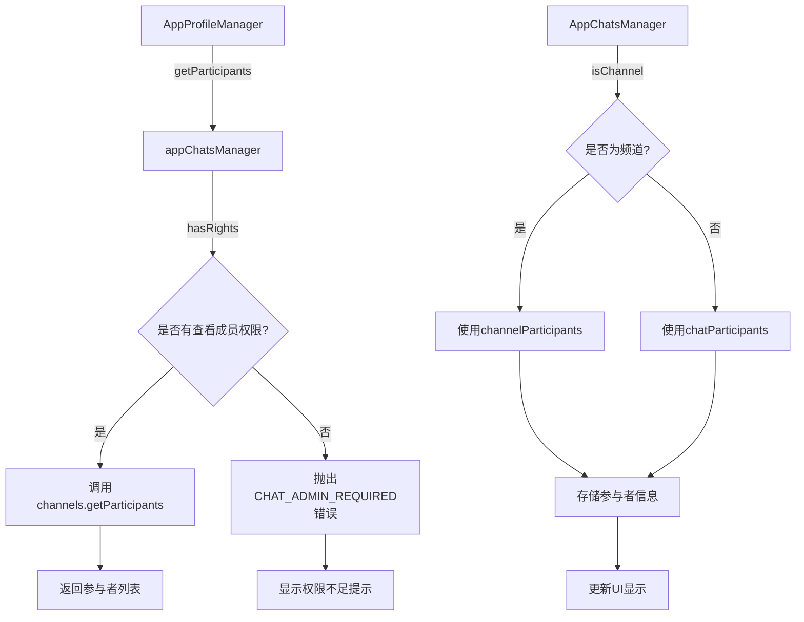
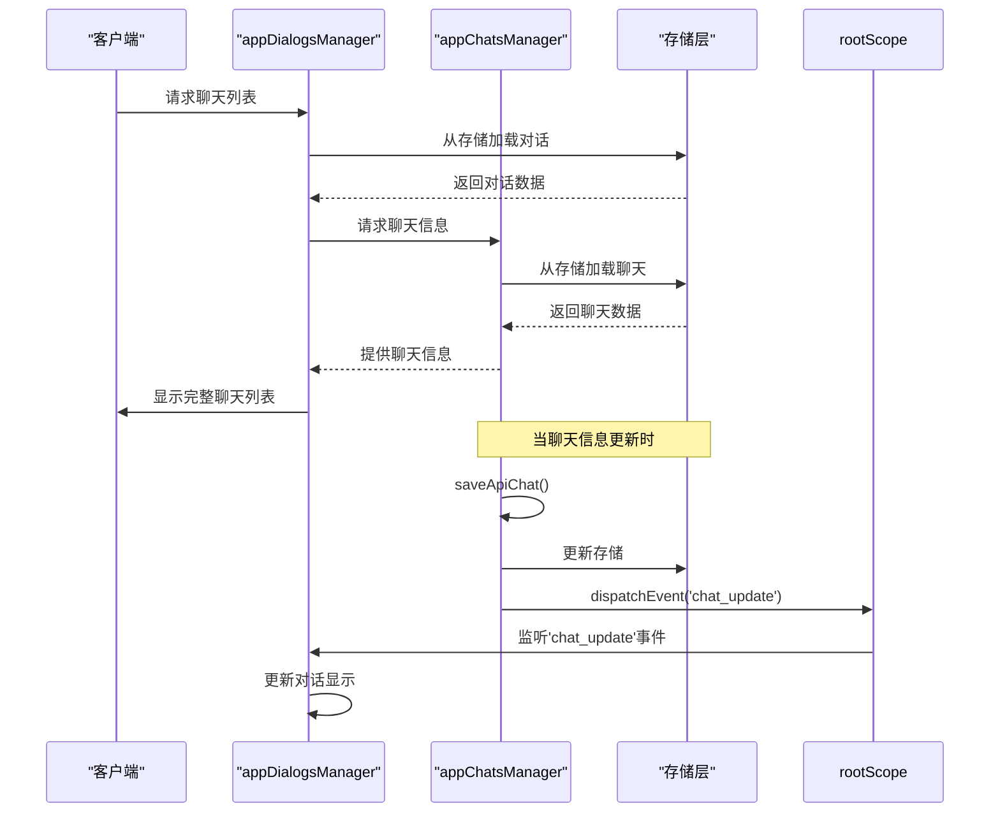
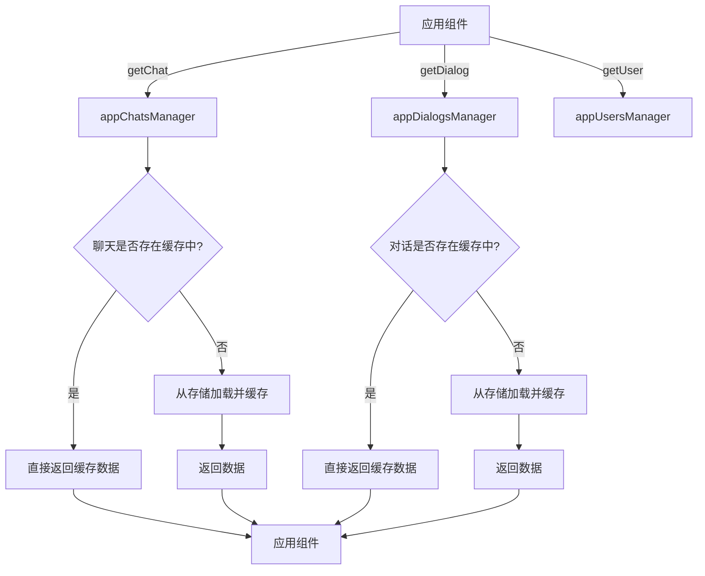
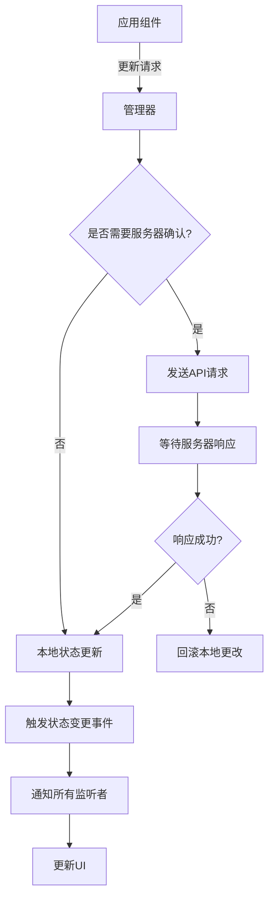
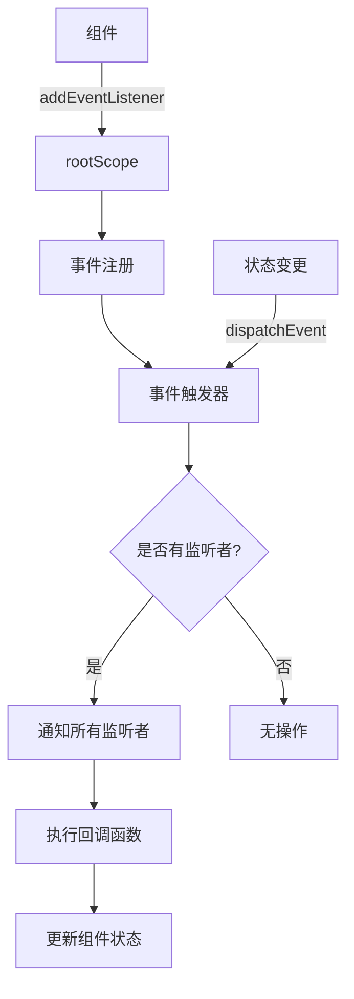
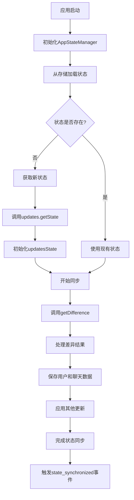
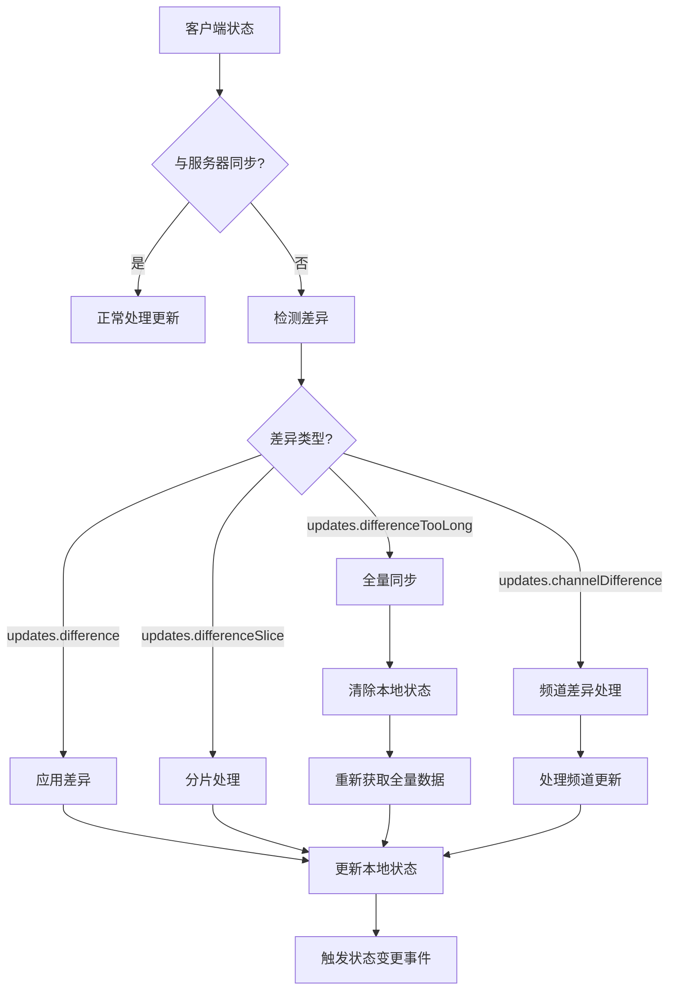

# 聊天状态管理

<cite>
**本文档引用的文件**   
- [appChatsManager.ts](file://src/lib/appManagers/appChatsManager.ts)
- [appDialogsManager.ts](file://src/lib/appManagers/appDialogsManager.ts)
- [dialogs.ts](file://src/lib/storages/dialogs.ts)
- [peers.ts](file://src/lib/storages/peers.ts)
- [appStateManager.ts](file://src/lib/appManagers/appStateManager.ts)
- [apiUpdatesManager.ts](file://src/lib/appManagers/apiUpdatesManager.ts)
- [appMessagesManager.ts](file://src/lib/appManagers/appMessagesManager.ts)
</cite>

## 目录
1. [简介](#简介)
2. [聊天元数据存储结构](#聊天元数据存储结构)
3. [Peers Store中的聊天状态组织](#peers-store中的聊天状态组织)
4. [appChatsManager与appDialogsManager的协同工作](#appchatsmanager与appdialogsmanager的协同工作)
5. [状态读取、更新和监听模式](#状态读取更新和监听模式)
6. [状态持久化机制](#状态持久化机制)
7. [状态同步策略](#状态同步策略)
8. [结论](#结论)

## 简介
本文档深入探讨了Telegram Web客户端中聊天状态管理功能的实现细节。重点分析了聊天元数据在客户端的存储结构和管理机制，包括appChatsManager和appDialogsManager如何协同维护聊天状态的一致性。文档详细描述了peers store中聊天状态的组织方式，涵盖聊天列表、聊天信息和成员列表等数据的存储格式。同时，解释了状态持久化机制和状态同步策略，包括应用重启后恢复聊天状态、从服务器获取更新、处理状态冲突和保持离线状态一致性等关键问题。

## 聊天元数据存储结构
聊天元数据在客户端通过多个管理器和存储层进行组织和管理。核心组件包括appChatsManager、appDialogsManager和相关的存储类。

### 聊天信息存储
聊天信息主要由appChatsManager管理，其内部使用一个私有存储对象来保存聊天数据：

```mermaid
classDiagram
class AppChatsManager {
-storage : AppStoragesManager['storages']['chats']
-chats : {[id : ChatId] : Exclude<Chat, Chat.chatEmpty>}
-recommendations : {[chatId : ChatId] : MaybePromise<MessagesChats>}
+saveApiChats(apiChats : any[]) : void
+saveApiChat(chat : Chat) : void
+getChat(id : ChatId) : Chat
+getChats() : {[id : ChatId] : Exclude<Chat, Chat.chatEmpty>}
+hasRights(id : ChatId, action : ChatRights) : boolean
+isChannel(id : ChatId) : boolean
+isMegagroup(id : ChatId) : boolean
}
class Chat {
+id : ChatId
+title : string
+pFlags : ChatFlags
+participants_count? : number
+default_banned_rights? : ChatBannedRights
+admin_rights? : ChatAdminRights
}
AppChatsManager --> Chat : "管理"
```

**Diagram sources**
- [appChatsManager.ts](file://src/lib/appManagers/appChatsManager.ts#L57-L255)

**Section sources**
- [appChatsManager.ts](file://src/lib/appManagers/appChatsManager.ts#L57-L255)

### 聊天列表存储
聊天列表由appDialogsManager管理，通过DialogsStorage类实现：

```mermaid
classDiagram
class AppDialogsManager {
-filtersRendered : {[filterId : string] : FilterRendered}
-folders : {[k in 'menu' | 'container' | 'menuScrollContainer'] : HTMLElement}
-lastActiveElements : Set<HTMLElement>
-lazyLoadQueue : LazyLoadQueue
+start() : void
+setFilterId(filterId : number) : void
+setFilterIdAndChangeTab(filterId : number) : Promise<void>
+addDialogNew(options : DialogElementOptions) : DialogElement
+createChatList(options : {new? : boolean, dialogSize? : number}) : HTMLElement
+setLastMessage(options : Parameters<AppDialogsManager['setLastMessage']>[0]) : Promise<void>
}
class DialogsStorage {
-storage : AppStoragesManager['storages']['dialogs']
-dialogs : {[peerId : PeerId] : Dialog}
-savedDialogs : {[peerId : PeerId] : SavedDialog}
-folders : {[folderId : number] : Folder}
-allDialogsLoaded : {[folder_id : number] : boolean}
-dialogsOffsetDate : {[folder_id : number] : number}
-pinnedOrders : {[folder_id : number] : PeerId[]}
-dialogsIndex : SearchIndex<PeerId>
+getDialog(peerId : PeerId, folderId? : number, topicOrSavedId? : number) : [AnyDialog, number] | []
+getAnyDialog(peerId : PeerId, topicOrSavedId? : number) : AnyDialog
+getDialogIndex(peerId : PeerId | Parameters<typeof getDialogIndex>[0], indexKey : ReturnType<typeof getDialogIndexKey>, topicOrSavedId? : number) : number
+processDialogForFilters(dialog : AnyDialog, noIndex? : boolean) : void
+processDialogForFilter(dialog : AnyDialog, filter? : MyDialogFilter, noIndex? : boolean) : boolean
+getFolderUnreadCount(filterId : number) : {unreadUnmutedCount : number, unreadCount : number}
}
class Dialog {
+peerId : PeerId
+top_message : number
+read_inbox_max_id : number
+read_outbox_max_id : number
+unread_count : number
+unread_mentions_count : number
+unread_reactions_count : number
+pFlags : DialogFlags
+folder_id : number
+migratedTo? : PeerId
}
AppDialogsManager --> DialogsStorage : "使用"
DialogsStorage --> Dialog : "包含"
```

**Diagram sources**
- [appDialogsManager.ts](file://src/lib/appManagers/appDialogsManager.ts#L500-L793)
- [dialogs.ts](file://src/lib/storages/dialogs.ts#L74-L800)

**Section sources**
- [appDialogsManager.ts](file://src/lib/appManagers/appDialogsManager.ts#L500-L793)
- [dialogs.ts](file://src/lib/storages/dialogs.ts#L74-L800)

## Peers Store中的聊天状态组织
Peers Store是管理所有对等实体（包括用户和聊天）的核心组件，它通过PeersStorage类实现。

### PeersStorage结构
PeersStorage类负责跟踪哪些对等实体是当前需要的，并在需要时通知相应的管理器：

```mermaid
classDiagram
class PeersStorage {
-neededPeers : Map<PeerId, Set<PeersStorageKey>>
-singlePeerMap : Map<PeersStorageKey, Set<PeerId>>
+requestPeer(peerId : PeerId, key : PeersStorageKey) : void
+releasePeer(peerId : PeerId, key : PeersStorageKey) : void
+requestPeersForKey(peerIds : Set<PeerId> | number[], key : PeersStorageKey) : void
+isPeerNeeded(peerId : PeerId) : boolean
}
class AppPeersManager {
+saveApiPeers(object : {chats? : Chat[], users? : User[]}) : void
+canPinMessage(peerId : PeerId) : boolean
+getPeerPhoto(peerId : PeerId) : PhotoSize
+getPeerMigratedTo(peerId : PeerId) : PeerId
+getOutputPeer(peerId : PeerId) : Peer
}
PeersStorage --> AppPeersManager : "集成"
```

**Diagram sources**
- [peers.ts](file://src/lib/storages/peers.ts#L1-L110)
- [appPeersManager.ts](file://src/lib/appManagers/appPeersManager.ts#L28-L71)

**Section sources**
- [peers.ts](file://src/lib/storages/peers.ts#L1-L110)
- [appPeersManager.ts](file://src/lib/appManagers/appPeersManager.ts#L28-L71)

### 聊天成员列表管理
聊天成员列表的管理涉及多个组件的协同工作：



**Diagram sources**
- [appProfileManager.ts](file://src/lib/appManagers/appProfileManager.ts#L375-L420)
- [appChatsManager.ts](file://src/lib/appManagers/appChatsManager.ts#L57-L255)

**Section sources**
- [appProfileManager.ts](file://src/lib/appManagers/appProfileManager.ts#L375-L420)
- [appChatsManager.ts](file://src/lib/appManagers/appChatsManager.ts#L57-L255)

## appChatsManager与appDialogsManager的协同工作
appChatsManager和appDialogsManager通过事件系统和共享存储协同工作，确保聊天状态的一致性。

### 协同工作机制
两个管理器通过rootScope的事件系统进行通信，当聊天状态发生变化时，会触发相应的事件：



**Diagram sources**
- [appChatsManager.ts](file://src/lib/appManagers/appChatsManager.ts#L203-L235)
- [appDialogsManager.ts](file://src/lib/appManagers/appDialogsManager.ts#L1954-L1963)

**Section sources**
- [appChatsManager.ts](file://src/lib/appManagers/appChatsManager.ts#L203-L235)
- [appDialogsManager.ts](file://src/lib/appManagers/appDialogsManager.ts#L1954-L1963)

### 状态一致性维护
两个管理器通过以下机制维护状态一致性：

1. **事件驱动更新**：当appChatsManager中的聊天信息发生变化时，会触发'chat_update'事件，appDialogsManager监听该事件并更新相应的对话显示。

2. **存储同步**：两个管理器都使用AppStoragesManager来持久化数据，确保数据在内存和存储之间保持同步。

3. **依赖管理**：appDialogsManager在需要聊天信息时会通过peersStorage请求相应的聊天数据，确保数据的按需加载。

## 状态读取、更新和监听模式
聊天状态的读取、更新和监听遵循特定的模式，确保数据的一致性和实时性。

### 状态读取模式
状态读取主要通过管理器提供的API进行：



**Diagram sources**
- [appChatsManager.ts](file://src/lib/appManagers/appChatsManager.ts#L247-L255)
- [dialogs.ts](file://src/lib/storages/dialogs.ts#L574-L584)

**Section sources**
- [appChatsManager.ts](file://src/lib/appManagers/appChatsManager.ts#L247-L255)
- [dialogs.ts](file://src/lib/storages/dialogs.ts#L574-L584)

### 状态更新模式
状态更新遵循"先本地更新，再同步服务器"的模式：



**Diagram sources**
- [appChatsManager.ts](file://src/lib/appManagers/appChatsManager.ts#L237-L236)
- [apiUpdatesManager.ts](file://src/lib/appManagers/apiUpdatesManager.ts#L172-L180)

**Section sources**
- [appChatsManager.ts](file://src/lib/appManagers/appChatsManager.ts#L237-L236)
- [apiUpdatesManager.ts](file://src/lib/appManagers/apiUpdatesManager.ts#L172-L180)

### 状态监听模式
状态监听通过事件系统实现，组件可以订阅特定的状态变化：



**Diagram sources**
- [appChatsManager.ts](file://src/lib/appManagers/appChatsManager.ts#L203-L204)
- [appDialogsManager.ts](file://src/lib/appManagers/appDialogsManager.ts#L1954-L1963)

**Section sources**
- [appChatsManager.ts](file://src/lib/appManagers/appChatsManager.ts#L203-L204)
- [appDialogsManager.ts](file://src/lib/appManagers/appDialogsManager.ts#L1954-L1963)

## 状态持久化机制
聊天状态的持久化机制确保应用重启后能够恢复之前的聊天状态。

### 持久化架构
持久化机制由多个组件协同工作：

```mermaid
classDiagram
class AppStateManager {
-state : State
-storage : StateStorage
+getState() : Promise<State>
+pushToState(key : keyof State, value : State[keyof State]) : Promise<void>
+setKeyValueToStorage(key : keyof State, value : State[keyof State], onlyLocal? : boolean) : Promise<void>
}
class StateStorage {
+set(data : Partial<State>, onlyLocal? : boolean) : Promise<void>
+get(key : keyof State) : Promise<State[keyof State]>
+getAll() : Promise<State>
}
class AppStoragesManager {
+loadStorage(name : keyof StoragesStorages) : Promise<{results : any[], storage : AppStorage<any, any>}>
+createStorages() : StoragesStorages
}
class AppStorage {
+set(data : any) : Promise<void>
+get(key : string) : Promise<any>
+getAll() : Promise<any[]>
+clear() : Promise<void>
}
AppStateManager --> StateStorage : "使用"
AppStoragesManager --> AppStorage : "创建"
AppStateManager --> AppStoragesManager : "协调"
```

**Diagram sources**
- [appStateManager.ts](file://src/lib/appManagers/appStateManager.ts#L25-L133)
- [stateStorage.ts](file://src/lib/stateStorage.ts)
- [appStoragesManager.ts](file://src/lib/appManagers/appStoragesManager.ts)

**Section sources**
- [appStateManager.ts](file://src/lib/appManagers/appStateManager.ts#L25-L133)

### 应用重启恢复流程
应用重启后恢复聊天状态的流程如下：



**Diagram sources**
- [apiUpdatesManager.ts](file://src/lib/appManagers/apiUpdatesManager.ts#L700-L758)
- [appStateManager.ts](file://src/lib/appManagers/appStateManager.ts#L43-L45)

**Section sources**
- [apiUpdatesManager.ts](file://src/lib/appManagers/apiUpdatesManager.ts#L700-L758)
- [appStateManager.ts](file://src/lib/appManagers/appStateManager.ts#L43-L45)

## 状态同步策略
状态同步策略确保客户端与服务器之间的状态一致性，处理各种网络和状态冲突情况。

### 状态同步机制
状态同步通过updates系统实现，主要包括以下组件：

```mermaid
classDiagram
class ApiUpdatesManager {
-updatesState : UpdatesState
-channelStates : {[channelId : ChatId] : UpdatesState}
-subscriptions : {[channelId : ChatId] : {count : number, interval? : number}}
+getDifference(first? : boolean) : Promise<void>
+getChannelDifference(channelId : ChatId) : Promise<void>
+processUpdateMessage(updateMessage : any, options? : any) : void
+processUpdate(update : Update, options? : any) : boolean
+saveUpdate(update : Update) : void
+subscribeToChannelUpdates(channelId : ChatId) : void
+unsubscribeFromChannelUpdates(channelId : ChatId, force? : boolean) : void
}
class UpdatesState {
+pendingPtsUpdates : (Update & {pts : number, pts_count : number})[]
+pendingSeqUpdates : {[seq : number] : {seq : number, date : number, updates : any[]}}
+syncPending : {seqAwaiting? : number, ptsAwaiting? : boolean, timeout : number}
+syncLoading : Promise<void>
+seq? : number
+pts? : number
+date? : number
+lastPtsUpdateTime? : number
+lastDifferenceTime? : number
}
ApiUpdatesManager --> UpdatesState : "包含"
```

**Diagram sources**
- [apiUpdatesManager.ts](file://src/lib/appManagers/apiUpdatesManager.ts#L45-L818)

**Section sources**
- [apiUpdatesManager.ts](file://src/lib/appManagers/apiUpdatesManager.ts#L45-L818)

### 同步策略详解
状态同步策略包括以下几个关键方面：

1. **差异同步**：使用`getDifference`和`getChannelDifference`方法获取服务器与客户端之间的状态差异。

2. **增量更新**：通过处理`update`消息实现增量状态更新，避免全量同步。

3. **冲突处理**：当检测到状态冲突时（如pts hole或seq hole），会触发重新同步。

4. **离线支持**：在离线状态下，本地状态继续更新，待网络恢复后与服务器同步。



**Diagram sources**
- [apiUpdatesManager.ts](file://src/lib/appManagers/apiUpdatesManager.ts#L279-L372)
- [apiUpdatesManager.ts](file://src/lib/appManagers/apiUpdatesManager.ts#L381-L450)

**Section sources**
- [apiUpdatesManager.ts](file://src/lib/appManagers/apiUpdatesManager.ts#L279-L450)

## 结论
Telegram Web客户端的聊天状态管理系统通过精心设计的架构实现了高效、可靠的状态管理。系统采用分层架构，将聊天信息、对话列表和对等实体管理分离到不同的管理器中，通过事件系统实现组件间的松耦合通信。状态持久化机制确保了应用重启后能够快速恢复用户状态，而复杂的状态同步策略则保证了客户端与服务器之间的数据一致性。整个系统设计充分考虑了性能、可靠性和用户体验，为用户提供流畅的聊天体验。