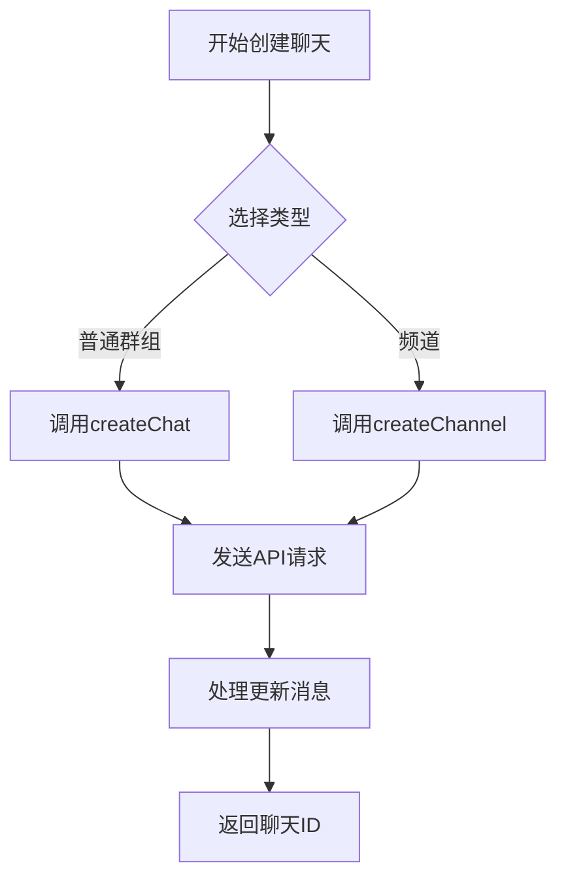
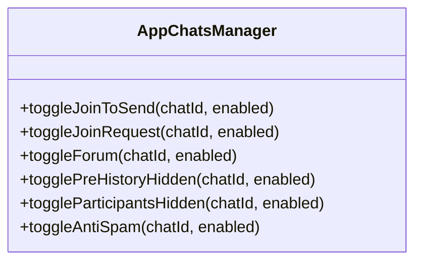
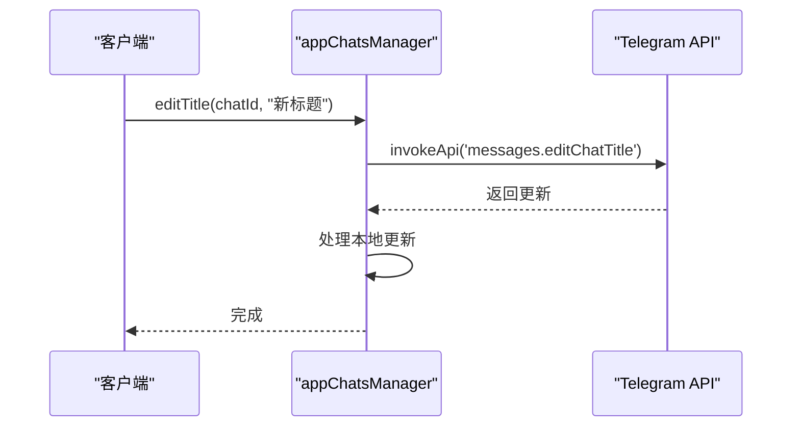
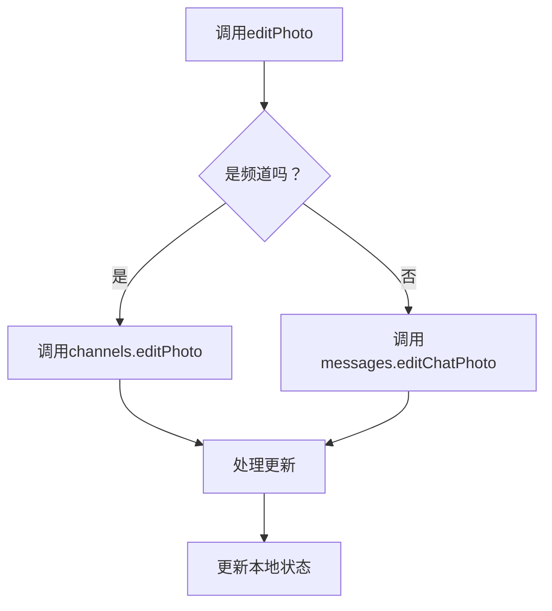
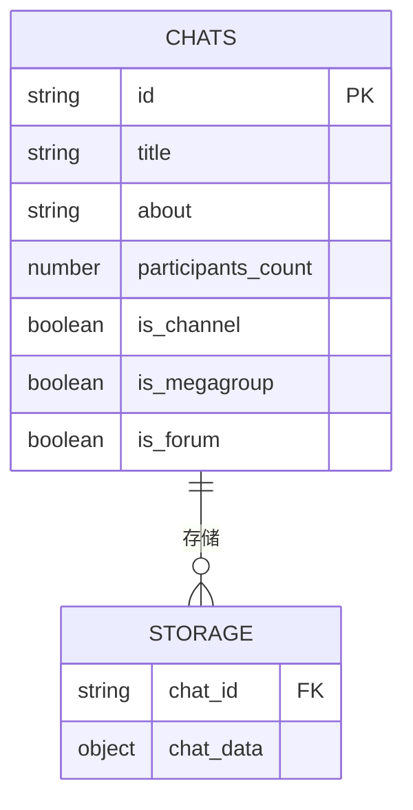
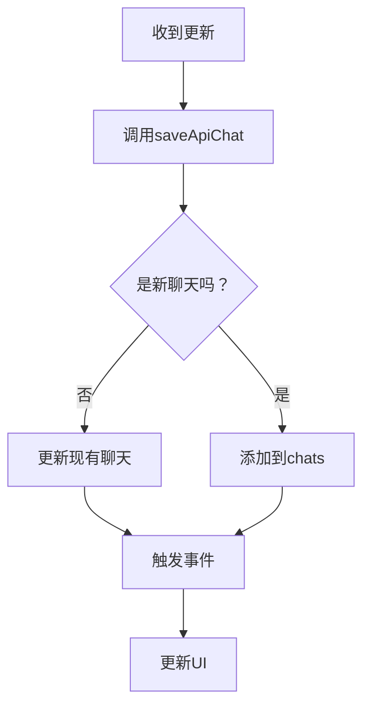
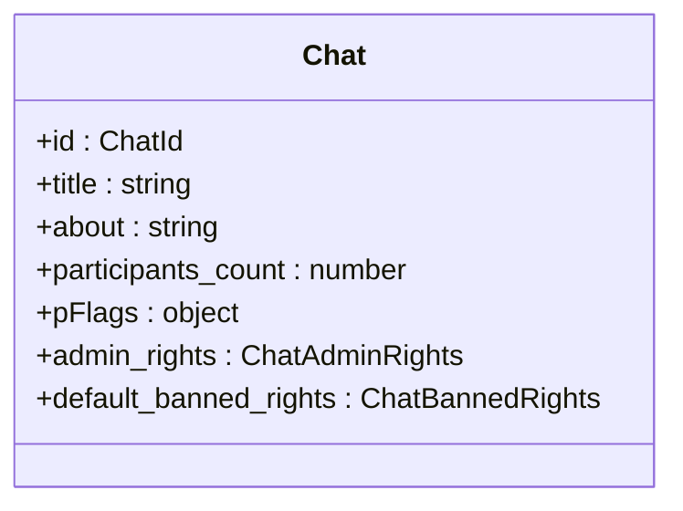
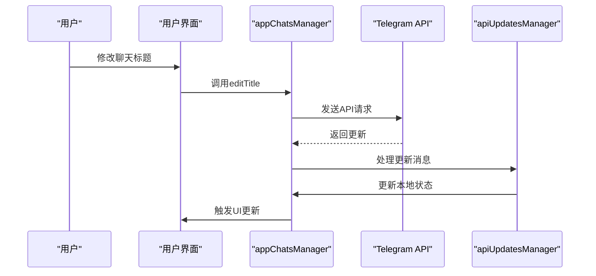

# 聊天管理

<cite>
**本文档引用的文件**   
- [appChatsManager.ts](file://src/lib/appManagers/appChatsManager.ts)
- [appDialogsManager.ts](file://src/lib/appManagers/appDialogsManager.ts)
- [appImManager.ts](file://src/lib/appManagers/appImManager.ts)
- [appMessagesManager.ts](file://src/lib/appManagers/appMessagesManager.ts)
</cite>

## 目录
1. [简介](#简介)
2. [核心组件](#核心组件)
3. [群组创建与频道设置](#群组创建与频道设置)
4. [聊天信息编辑](#聊天信息编辑)
5. [聊天状态存储结构](#聊天状态存储结构)
6. [聊天元数据管理](#聊天元数据管理)
7. [API使用示例](#api使用示例)
8. [结论](#结论)

## 简介
本文档详细阐述了Telegram Web客户端中聊天管理功能的实现机制。重点分析了`appChatsManager`和`appDialogsManager`两个核心管理器，深入解释了群组创建、频道设置、聊天信息编辑等关键功能的实现方式。文档还详细描述了聊天状态在stores中的存储结构和更新逻辑，以及聊天元数据的管理方式，包括标题、描述、成员数量等属性的同步机制。通过实际代码示例，展示了如何通过API创建不同类型的聊天会话。

## 核心组件

### appChatsManager
`appChatsManager`是处理所有与聊天（包括群组和频道）相关操作的核心管理器。它负责聊天的创建、信息更新、成员管理、权限设置等核心功能。

**Section sources**
- [appChatsManager.ts](file://src/lib/appManagers/appChatsManager.ts#L57-L1103)

### appDialogsManager
`appDialogsManager`负责管理对话列表的显示和交互，包括对话的渲染、排序、状态更新（如已读/未读、置顶等）以及用户界面的交互逻辑。

**Section sources**
- [appDialogsManager.ts](file://src/lib/appManagers/appDialogsManager.ts#L500-L2621)

## 群组创建与频道设置

### 创建聊天
`appChatsManager`提供了创建不同类型聊天会话的API。创建普通群组使用`createChat`方法，而创建频道则使用`createChannel`方法。



**Diagram sources**
- [appChatsManager.ts](file://src/lib/appManagers/appChatsManager.ts#L431-L478)

### 频道设置
频道的设置功能通过一系列`toggle`方法实现，这些方法可以启用或禁用频道的特定功能，如加入时发送消息、加入请求、论坛模式、隐藏历史消息等。



**Diagram sources**
- [appChatsManager.ts](file://src/lib/appManagers/appChatsManager.ts#L857-L924)

## 聊天信息编辑

### 更新聊天信息
`appChatsManager`提供了多种方法来更新聊天信息，包括标题、简介、照片等。



**Diagram sources**
- [appChatsManager.ts](file://src/lib/appManagers/appChatsManager.ts#L658-L674)

### 设置聊天照片
通过`editPhoto`方法可以设置聊天的头像照片。该方法会根据聊天类型（群组或频道）调用不同的API。



**Diagram sources**
- [appChatsManager.ts](file://src/lib/appManagers/appChatsManager.ts#L636-L656)

## 聊天状态存储结构

### 存储结构
聊天状态主要存储在`appChatsManager`的`chats`对象和`storage`中。`chats`对象以聊天ID为键，存储聊天的详细信息，而`storage`则用于持久化存储。



**Diagram sources**
- [appChatsManager.ts](file://src/lib/appManagers/appChatsManager.ts#L60-L65)

### 更新逻辑
当聊天信息发生变化时，系统会通过`saveApiChat`方法更新本地存储，并触发相应的事件通知UI更新。



**Diagram sources**
- [appChatsManager.ts](file://src/lib/appManagers/appChatsManager.ts#L127-L236)

## 聊天元数据管理

### 元数据属性
聊天元数据包括标题、描述、成员数量、权限设置等属性。这些属性在聊天对象中以不同的字段存储。



**Diagram sources**
- [appChatsManager.ts](file://src/lib/appManagers/appChatsManager.ts#L29-L32)

### 同步机制
元数据的同步通过API调用和本地事件系统实现。当用户修改元数据时，会调用相应的API，服务器返回更新后，通过`apiUpdatesManager`处理并同步到本地。



**Diagram sources**
- [appChatsManager.ts](file://src/lib/appManagers/appChatsManager.ts#L675-L674)

## API使用示例

### 创建普通群组
```typescript
// 创建包含指定用户的普通群组
appChatsManager.createChat("我的群组", [userId1, userId2]).then(({chatId, missingInvitees}) => {
  console.log("群组创建成功，ID:", chatId);
});
```

### 创建频道
```typescript
// 创建公开频道
const options = {
  _: 'channels.createChannel',
  title: '我的频道',
  about: '这是一个测试频道',
  pFlags: {
    broadcast: true,
    megagroup: false
  }
};
appChatsManager.createChannel(options).then((channelId) => {
  console.log("频道创建成功，ID:", channelId);
});
```

### 编辑聊天信息
```typescript
// 更新聊天标题
appChatsManager.editTitle(chatId, "新标题").then(() => {
  console.log("标题更新成功");
});

// 设置聊天照片
appChatsManager.editPhoto(chatId, inputFile).then(() => {
  console.log("照片设置成功");
});
```

**Section sources**
- [appChatsManager.ts](file://src/lib/appManagers/appChatsManager.ts#L431-L656)

## 结论
本文档详细介绍了Telegram Web客户端中聊天管理功能的实现机制。通过分析`appChatsManager`和`appDialogsManager`两个核心组件，我们了解了群组创建、频道设置、聊天信息编辑等核心功能的实现方式。聊天状态的存储和更新逻辑清晰，通过本地存储和事件系统实现了高效的状态管理。聊天元数据的管理方式也体现了系统的模块化和可扩展性。这些设计使得聊天管理功能既强大又灵活，能够满足各种复杂的使用场景。