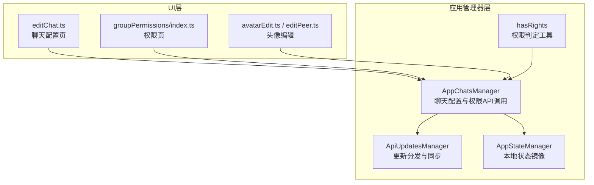
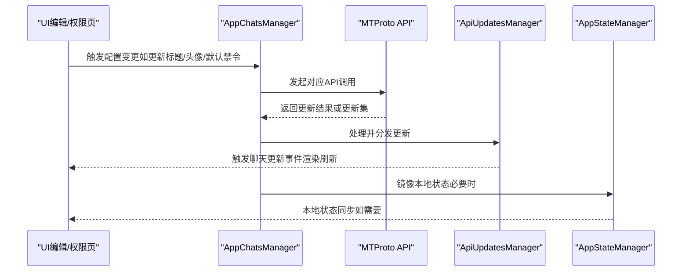
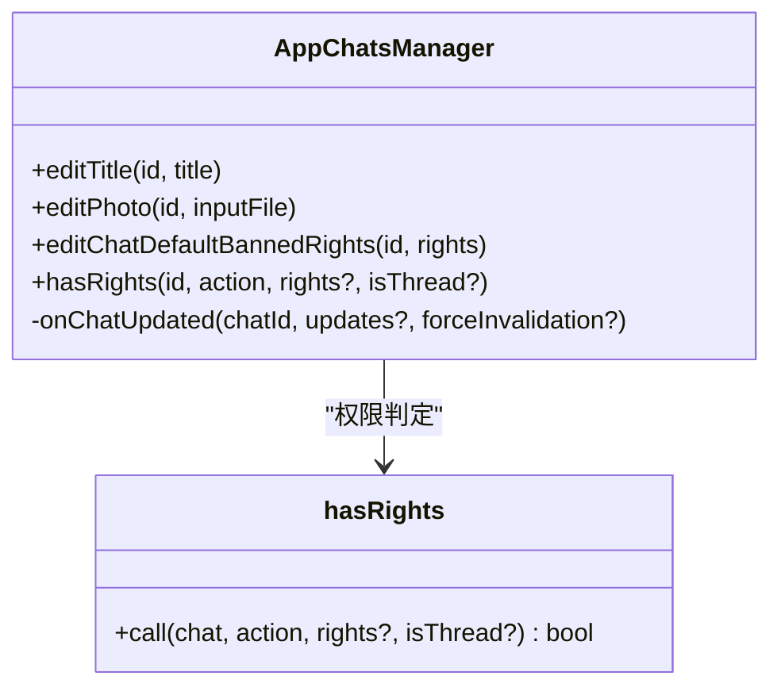
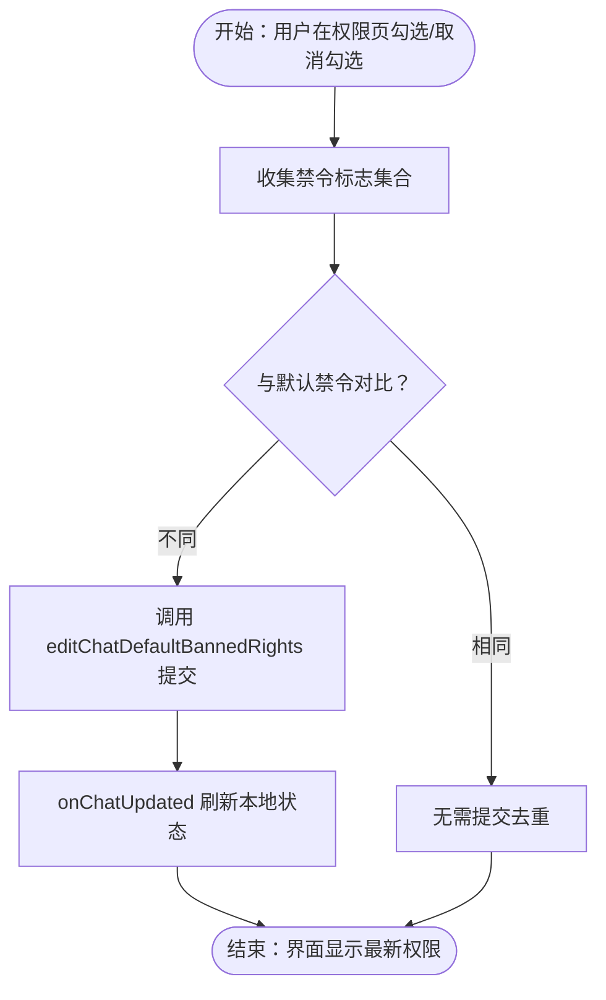
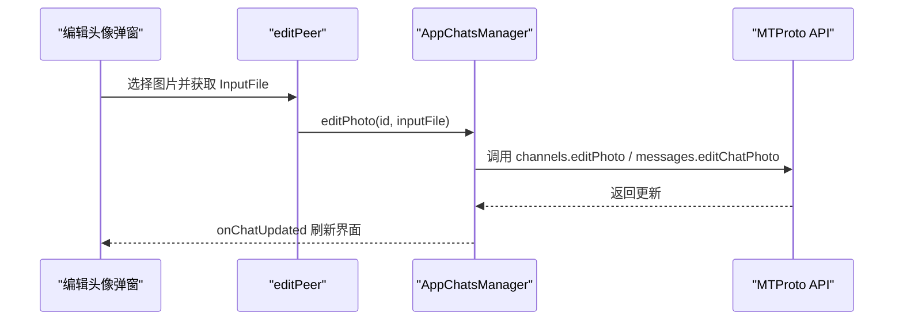
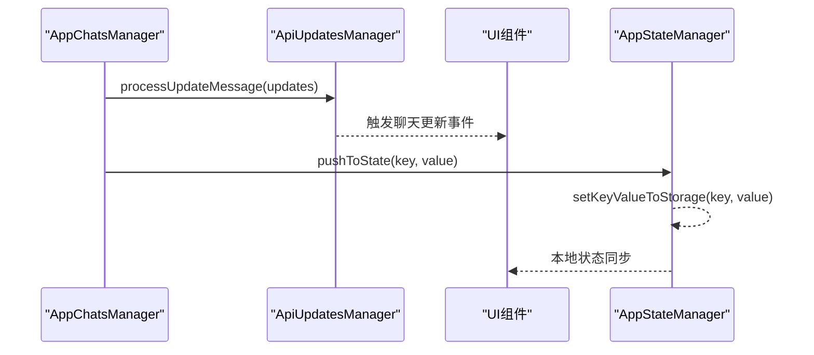
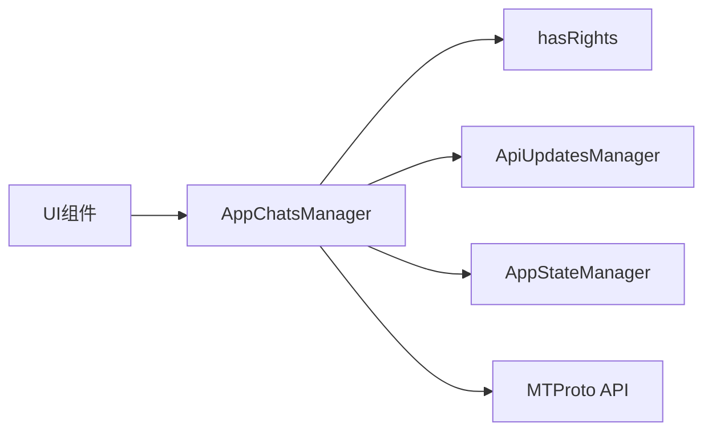

# 聊天配置

<cite>
**本文引用的文件**
- [appChatsManager.ts](file://src/lib/appManagers/appChatsManager.ts)
- [hasRights.ts](file://src/lib/appManagers/utils/chats/hasRights.ts)
- [editChat.ts](file://src/components/sidebarRight/tabs/editChat.ts)
- [groupPermissions/index.ts](file://src/components/sidebarRight/tabs/groupPermissions/index.ts)
- [apiUpdatesManager.ts](file://src/lib/appManagers/apiUpdatesManager.ts)
- [appStateManager.ts](file://src/lib/appManagers/appStateManager.ts)
- [loadState.ts](file://src/lib/appManagers/utils/state/loadState.ts)
- [avatarEdit.ts](file://src/components/avatarEdit.ts)
- [editPeer.ts](file://src/components/editPeer.ts)
</cite>

## 目录
1. [简介](#简介)
2. [项目结构](#项目结构)
3. [核心组件](#核心组件)
4. [架构总览](#架构总览)
5. [详细组件分析](#详细组件分析)
6. [依赖关系分析](#依赖关系分析)
7. [性能考量](#性能考量)
8. [故障排查指南](#故障排查指南)
9. [结论](#结论)
10. [附录](#附录)

## 简介
本文件围绕“聊天配置”能力进行系统化技术文档梳理，重点覆盖以下方面：
- 聊天信息编辑：标题、描述、可用反应等
- 聊天照片设置：头像上传与更新
- 权限管理：默认禁令、管理员权限、成员限制与例外
- 同步机制：本地状态更新与服务器同步的协调
- 并发修改处理：UI交互与后台请求的并发一致性
- 用户界面映射：配置变更在界面层的反馈与联动

## 项目结构
与聊天配置相关的核心模块分布如下：
- 应用管理器层：负责调用MTProto API并维护本地聊天状态
- 工具函数层：权限判定与组合逻辑
- UI 层：侧边栏聊天配置页、权限页、头像编辑弹窗等

图表来源
- [appChatsManager.ts](file://src/lib/appManagers/appChatsManager.ts#L1-L120)
- [hasRights.ts](file://src/lib/appManagers/utils/chats/hasRights.ts#L1-L60)
- [editChat.ts](file://src/components/sidebarRight/tabs/editChat.ts#L309-L354)
- [groupPermissions/index.ts](file://src/components/sidebarRight/tabs/groupPermissions/index.ts#L360-L420)
- [apiUpdatesManager.ts](file://src/lib/appManagers/apiUpdatesManager.ts#L456-L504)
- [appStateManager.ts](file://src/lib/appManagers/appStateManager.ts#L33-L77)
- [avatarEdit.ts](file://src/components/avatarEdit.ts#L1-L39)
- [editPeer.ts](file://src/components/editPeer.ts#L1-L45)

章节来源
- [appChatsManager.ts](file://src/lib/appManagers/appChatsManager.ts#L1-L120)
- [editChat.ts](file://src/components/sidebarRight/tabs/editChat.ts#L309-L354)
- [groupPermissions/index.ts](file://src/components/sidebarRight/tabs/groupPermissions/index.ts#L360-L420)

## 核心组件
- AppChatsManager：统一的聊天配置入口，封装标题、描述、头像、默认禁令、管理员/禁令编辑、频道特性开关等API调用；负责在本地存储与事件系统中同步聊天状态。
- hasRights：权限判定工具，根据聊天类型（群组/频道）、是否为创建者、是否为广播频道、当前用户权限等，综合判断某项操作是否允许。
- UI 组件：
  - editChat.ts：聊天配置页，支持标题/描述编辑、权限入口跳转、保存按钮等。
  - groupPermissions/index.ts：权限页，支持默认禁令编辑、慢速模式、异常列表等。
  - avatarEdit.ts / editPeer.ts：头像编辑弹窗与容器，用于选择图片并触发上传与更新。

章节来源
- [appChatsManager.ts](file://src/lib/appManagers/appChatsManager.ts#L255-L279)
- [hasRights.ts](file://src/lib/appManagers/utils/chats/hasRights.ts#L18-L63)
- [editChat.ts](file://src/components/sidebarRight/tabs/editChat.ts#L309-L354)
- [groupPermissions/index.ts](file://src/components/sidebarRight/tabs/groupPermissions/index.ts#L360-L420)
- [avatarEdit.ts](file://src/components/avatarEdit.ts#L1-L39)
- [editPeer.ts](file://src/components/editPeer.ts#L1-L45)

## 架构总览
聊天配置的调用链路遵循“UI -> 管理器 -> API -> 更新分发 -> 本地状态”的闭环，确保变更既即时反映到界面，又持久同步到服务器。

图表来源
- [appChatsManager.ts](file://src/lib/appManagers/appChatsManager.ts#L481-L493)
- [apiUpdatesManager.ts](file://src/lib/appManagers/apiUpdatesManager.ts#L456-L504)
- [appStateManager.ts](file://src/lib/appManagers/appStateManager.ts#L33-L77)

## 详细组件分析

### AppChatsManager 关键方法解析
- updateChatTitle（对应 editTitle）
  - 功能：对群组或频道分别调用不同API以更新标题；随后通过 onChatUpdated 将服务端返回的更新集交由更新管理器处理，保证本地状态与服务器一致。
  - 关键路径：[editTitle](file://src/lib/appManagers/appChatsManager.ts#L658-L674) -> [onChatUpdated](file://src/lib/appManagers/appChatsManager.ts#L481-L493)
- updateChatPhoto（对应 editPhoto）
  - 功能：根据聊天类型选择频道或群组的编辑照片API；成功后同样通过 onChatUpdated 刷新本地状态。
  - 关键路径：[editPhoto](file://src/lib/appManagers/appChatsManager.ts#L636-L656)
- setChatPermissions（对应 editChatDefaultBannedRights）
  - 功能：设置默认禁令（如禁止发送消息/媒体/邀请等），避免重复请求；提交后通过 onChatUpdated 刷新。
  - 关键路径：[editChatDefaultBannedRights](file://src/lib/appManagers/appChatsManager.ts#L267-L279) -> [onChatUpdated](file://src/lib/appManagers/appChatsManager.ts#L481-L493)
- hasRights（权限判定）
  - 功能：综合聊天类型、是否为创建者、是否为广播频道、当前用户权限等，判定某项操作是否允许。
  - 关键路径：[hasRights](file://src/lib/appManagers/utils/chats/hasRights.ts#L18-L63) -> [hasRights 分支](file://src/lib/appManagers/utils/chats/hasRights.ts#L63-L165)

图表来源
- [appChatsManager.ts](file://src/lib/appManagers/appChatsManager.ts#L255-L279)
- [hasRights.ts](file://src/lib/appManagers/utils/chats/hasRights.ts#L18-L63)

章节来源
- [appChatsManager.ts](file://src/lib/appManagers/appChatsManager.ts#L255-L279)
- [hasRights.ts](file://src/lib/appManagers/utils/chats/hasRights.ts#L18-L63)

### 权限系统实现细节
- 默认禁令（ChatBannedRights）
  - UI 通过 ChatPermissions 收集勾选状态，生成禁令标志集合；保存时调用 editChatDefaultBannedRights 提交。
  - 关键路径：[ChatPermissions.takeOut](file://src/components/sidebarRight/tabs/groupPermissions/index.ts#L146-L173) -> [保存回调](file://src/components/sidebarRight/tabs/groupPermissions/index.ts#L386-L388)
- 管理员权限（ChatAdminRights）
  - UI 通过 ChatAdministratorRights 构建管理员权限表单，保存时调用 channels.editAdmin 或其他相关接口（管理器内部封装）。
  - 关键路径：[ChatAdministratorRights 构造与保存](file://src/components/sidebarRight/tabs/groupPermissions/index.ts#L176-L299)
- 权限判定规则
  - hasRights 对不同动作（如 pin_messages、ban_users、change_info 等）给出明确的允许/拒绝条件，区分群组与频道、是否为广播频道、是否为创建者等。
  - 关键路径：[hasRights 分支逻辑](file://src/lib/appManagers/utils/chats/hasRights.ts#L63-L165)

图表来源
- [groupPermissions/index.ts](file://src/components/sidebarRight/tabs/groupPermissions/index.ts#L146-L173)
- [appChatsManager.ts](file://src/lib/appManagers/appChatsManager.ts#L267-L279)
- [appChatsManager.ts](file://src/lib/appManagers/appChatsManager.ts#L481-L493)

章节来源
- [groupPermissions/index.ts](file://src/components/sidebarRight/tabs/groupPermissions/index.ts#L146-L173)
- [groupPermissions/index.ts](file://src/components/sidebarRight/tabs/groupPermissions/index.ts#L386-L388)
- [hasRights.ts](file://src/lib/appManagers/utils/chats/hasRights.ts#L63-L165)

### 聊天信息编辑与照片设置
- 标题与描述
  - UI 在聊天配置页提供输入框，标题/描述变更后通过管理器调用相应API；描述变更还会更新全量聊天信息缓存。
  - 关键路径：[editAbout](file://src/lib/appManagers/appChatsManager.ts#L676-L686)
- 头像编辑
  - UI 使用 AvatarEdit 与 editPeer 容器，点击后弹出图片选择器，返回 InputFile 后调用 editPhoto 更新头像。
  - 关键路径：[editPhoto](file://src/lib/appManagers/appChatsManager.ts#L636-L656) -> [editChat.ts 保存头像](file://src/components/sidebarRight/tabs/editChat.ts#L483-L495)

图表来源
- [editPeer.ts](file://src/components/editPeer.ts#L1-L45)
- [avatarEdit.ts](file://src/components/avatarEdit.ts#L1-L39)
- [appChatsManager.ts](file://src/lib/appManagers/appChatsManager.ts#L636-L656)
- [editChat.ts](file://src/components/sidebarRight/tabs/editChat.ts#L483-L495)

章节来源
- [editChat.ts](file://src/components/sidebarRight/tabs/editChat.ts#L483-L495)
- [appChatsManager.ts](file://src/lib/appManagers/appChatsManager.ts#L636-L656)

### 配置变更的同步机制
- 本地状态更新
  - AppChatsManager 在收到API响应后，通过 ApiUpdatesManager.processUpdateMessage 分发更新，触发聊天更新事件，驱动UI刷新。
  - 关键路径：[onChatUpdated](file://src/lib/appManagers/appChatsManager.ts#L481-L493) -> [processUpdateMessage](file://src/lib/appManagers/apiUpdatesManager.ts#L669-L673)
- 服务器同步
  - AppStateManager 将关键状态写入本地存储并通过消息端口镜像到 Worker，确保跨标签页与持久化一致。
  - 关键路径：[pushToState](file://src/lib/appManagers/appStateManager.ts#L58-L71) -> [setKeyValueToStorage](file://src/lib/appManagers/appStateManager.ts#L73-L77)

图表来源
- [appChatsManager.ts](file://src/lib/appManagers/appChatsManager.ts#L481-L493)
- [apiUpdatesManager.ts](file://src/lib/appManagers/apiUpdatesManager.ts#L669-L673)
- [appStateManager.ts](file://src/lib/appManagers/appStateManager.ts#L58-L77)

章节来源
- [appChatsManager.ts](file://src/lib/appManagers/appChatsManager.ts#L481-L493)
- [apiUpdatesManager.ts](file://src/lib/appManagers/apiUpdatesManager.ts#L669-L673)
- [appStateManager.ts](file://src/lib/appManagers/appStateManager.ts#L58-L77)

### 并发修改与UI一致性
- UI 侧采用 SolidJS 响应式状态与节流策略，避免频繁变更导致的抖动与重复提交。
- 权限页使用 createSignal/Store 记录初始状态，仅当变更发生时显示保存按钮；同时通过节流函数控制变更事件频率。
- 关键路径：[权限页状态与节流](file://src/components/sidebarRight/tabs/groupPermissions/index.ts#L322-L333)

章节来源
- [groupPermissions/index.ts](file://src/components/sidebarRight/tabs/groupPermissions/index.ts#L322-L333)

## 依赖关系分析
- 模块耦合
  - AppChatsManager 依赖 hasRights 进行权限判定，依赖 ApiUpdatesManager 进行更新分发，依赖 AppStateManager 进行本地状态镜像。
  - UI 层通过 AppManagers 注入的实例调用管理器方法，形成清晰的单向数据流。
- 可能的循环依赖
  - 当前结构以管理器为中心，UI 仅依赖管理器接口，未见直接循环依赖迹象。
- 外部依赖
  - MTProto API：所有配置变更最终通过 API 调用完成。
  - 浏览器消息端口：用于跨标签页状态同步。

图表来源
- [appChatsManager.ts](file://src/lib/appManagers/appChatsManager.ts#L1-L120)
- [hasRights.ts](file://src/lib/appManagers/utils/chats/hasRights.ts#L1-L60)
- [apiUpdatesManager.ts](file://src/lib/appManagers/apiUpdatesManager.ts#L456-L504)
- [appStateManager.ts](file://src/lib/appManagers/appStateManager.ts#L33-L77)

章节来源
- [appChatsManager.ts](file://src/lib/appManagers/appChatsManager.ts#L1-L120)
- [hasRights.ts](file://src/lib/appManagers/utils/chats/hasRights.ts#L1-L60)
- [apiUpdatesManager.ts](file://src/lib/appManagers/apiUpdatesManager.ts#L456-L504)
- [appStateManager.ts](file://src/lib/appManagers/appStateManager.ts#L33-L77)

## 性能考量
- 去重与幂等
  - 默认禁令提交前会比较时间戳与标志位，避免重复请求。
  - 关键路径：[editChatDefaultBannedRights 去重](file://src/lib/appManagers/appChatsManager.ts#L267-L279)
- 批量更新
  - UI 侧通过节流与状态合并减少频繁渲染与请求。
- 状态镜像
  - 本地状态通过消息端口镜像，降低跨标签页同步成本。

[本节为通用指导，不涉及具体文件分析]

## 故障排查指南
- 标题/描述未生效
  - 检查 editTitle/editAbout 是否被调用，确认 onChatUpdated 是否触发；查看 ApiUpdatesManager 的更新分发日志。
  - 关键路径参考：[editTitle](file://src/lib/appManagers/appChatsManager.ts#L658-L674)、[editAbout](file://src/lib/appManagers/appChatsManager.ts#L676-L686)、[processUpdateMessage](file://src/lib/appManagers/apiUpdatesManager.ts#L669-L673)
- 头像未更新
  - 确认 editPeer 获取到 InputFile 并调用 editPhoto；检查 onChatUpdated 是否触发头像更新事件。
  - 关键路径参考：[editPhoto](file://src/lib/appManagers/appChatsManager.ts#L636-L656)、[editChat.ts 保存头像](file://src/components/sidebarRight/tabs/editChat.ts#L483-L495)
- 权限未生效
  - 检查 ChatPermissions.takeOut 生成的禁令标志是否与默认禁令不同；确认 hasRights 判定逻辑是否符合预期。
  - 关键路径参考：[takeOut](file://src/components/sidebarRight/tabs/groupPermissions/index.ts#L146-L173)、[hasRights](file://src/lib/appManagers/utils/chats/hasRights.ts#L63-L165)
- 并发冲突
  - 若出现 UI 闪烁或重复提交，检查节流与状态变更监听逻辑；确认 saveCallbacks 仅在有变化时执行。
  - 关键路径参考：[权限页节流与保存](file://src/components/sidebarRight/tabs/groupPermissions/index.ts#L322-L333)

章节来源
- [appChatsManager.ts](file://src/lib/appManagers/appChatsManager.ts#L636-L686)
- [editChat.ts](file://src/components/sidebarRight/tabs/editChat.ts#L483-L495)
- [groupPermissions/index.ts](file://src/components/sidebarRight/tabs/groupPermissions/index.ts#L146-L173)
- [hasRights.ts](file://src/lib/appManagers/utils/chats/hasRights.ts#L63-L165)
- [apiUpdatesManager.ts](file://src/lib/appManagers/apiUpdatesManager.ts#L669-L673)

## 结论
本项目的聊天配置能力以 AppChatsManager 为核心，结合 hasRights 权限判定与 UI 层的响应式状态管理，实现了对聊天标题、描述、头像、默认禁令、管理员权限等的完整配置流程。通过 ApiUpdatesManager 与 AppStateManager 的协同，确保了本地状态与服务器状态的一致性与可追溯性。UI 层通过节流与状态对比避免了不必要的请求与渲染，提升了用户体验与性能稳定性。

[本节为总结性内容，不涉及具体文件分析]

## 附录
- 实际调用示例（以路径代替代码）
  - 更新标题：[editTitle](file://src/lib/appManagers/appChatsManager.ts#L658-L674)
  - 更新头像：[editPhoto](file://src/lib/appManagers/appChatsManager.ts#L636-L656)
  - 设置默认禁令：[editChatDefaultBannedRights](file://src/lib/appManagers/appChatsManager.ts#L267-L279)
  - 权限判定：[hasRights](file://src/lib/appManagers/utils/chats/hasRights.ts#L18-L63)
  - 聊天配置页保存头像：[editChat.ts](file://src/components/sidebarRight/tabs/editChat.ts#L483-L495)
  - 权限页保存默认禁令：[groupPermissions/index.ts](file://src/components/sidebarRight/tabs/groupPermissions/index.ts#L386-L388)