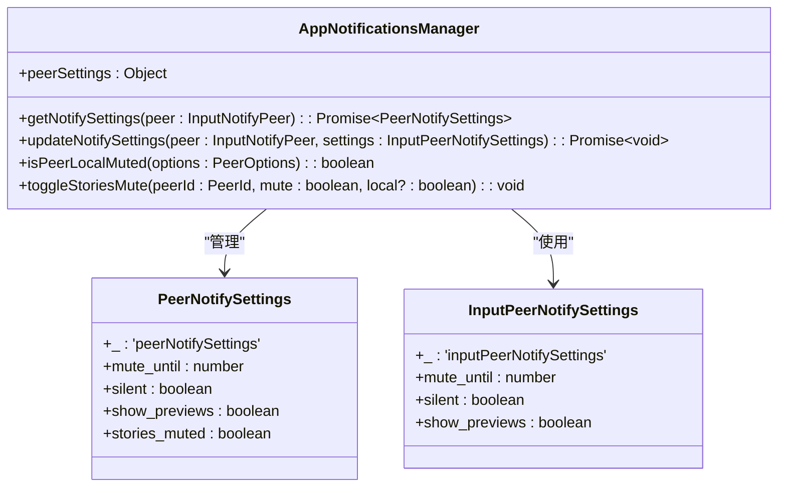
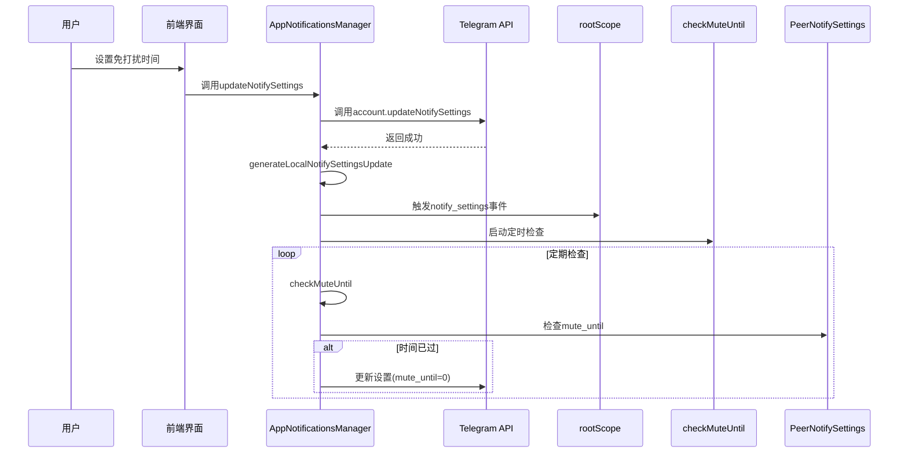
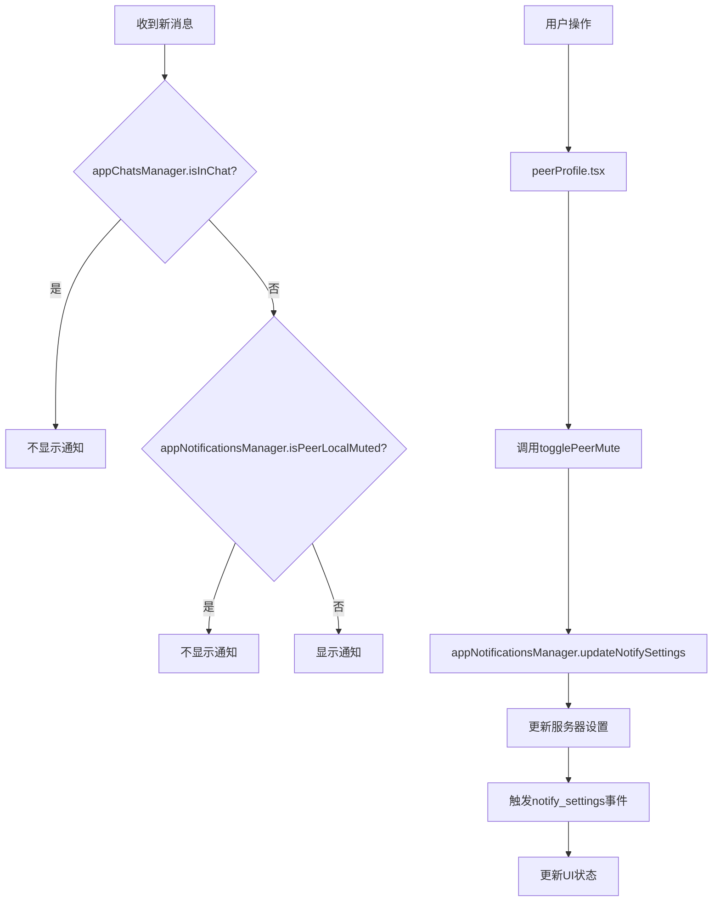
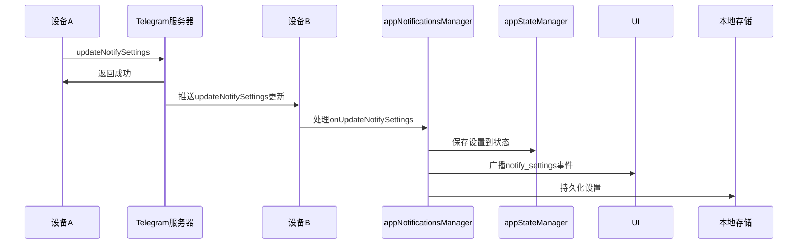

# 免打扰模式

<cite>
**本文档引用的文件**   
- [appNotificationsManager.ts](file://src/lib/appManagers/appNotificationsManager.ts)
- [appChatsManager.ts](file://src/lib/appManagers/appChatsManager.ts)
- [uiNotificationsManager.ts](file://src/lib/appManagers/uiNotificationsManager.ts)
- [mute.ts](file://src/components/popups/mute.ts)
- [notifications.tsx](file://src/components/sidebarLeft/tabs/notifications.tsx)
- [peerProfile.tsx](file://src/components/peerProfile.tsx)
- [mtproto_config.ts](file://src/lib/mtproto/mtproto_config.ts)
</cite>

## 目录
1. [简介](#简介)
2. [全局免打扰与特定聊天免打扰机制](#全局免打扰与特定聊天免打扰机制)
3. [appNotificationsManager中的时间设置与静音周期配置](#appnotificationsmanager中的时间设置与静音周期配置)
4. [与appChatsManager的协同工作](#与appchatsmanager的协同工作)
5. [API使用示例](#api使用示例)
6. [多设备同步与数据一致性](#多设备同步与数据一致性)

## 简介
免打扰模式是Telegram Web客户端中的核心功能之一，允许用户在全局或特定聊天级别控制通知行为。该功能通过`appNotificationsManager`和`appChatsManager`等核心组件实现，支持定时免打扰、特定联系人静音以及与聊天管理器的深度集成。本文档将深入解析该功能的实现机制，包括免打扰时间设置、静音周期配置、跨组件协同工作原理以及多设备间的数据同步机制。

**Section sources**
- [appNotificationsManager.ts](file://src/lib/appManagers/appNotificationsManager.ts#L1-L352)
- [appChatsManager.ts](file://src/lib/appManagers/appChatsManager.ts#L1-L1103)

## 全局免打扰与特定聊天免打扰机制

免打扰模式分为全局和特定聊天两个层级。全局免打扰通过`appNotificationsManager`管理，影响所有聊天的通知行为；特定聊天免打扰则针对单个聊天或联系人，通过`PeerNotifySettings`进行精细化控制。

全局免打扰状态由`appNotificationsManager`的`peerSettings`对象管理，其中包含`notifyUsers`、`notifyChats`和`notifyBroadcasts`等键，分别对应不同类型的全局通知设置。当用户启用全局免打扰时，系统会将这些设置的`mute_until`字段设置为一个未来时间戳（如`MUTE_UNTIL`常量定义的`0x7FFFFFFF`），从而在指定时间内屏蔽所有通知。

特定聊天免打扰通过`notifyPeer`对象管理，每个聊天或联系人都有独立的`PeerNotifySettings`。当用户为特定聊天设置免打扰时，系统会调用`updateNotifySettings`方法，将该聊天的`mute_until`字段更新为指定时间。这种设计允许用户在全局开启通知的同时，为特定高频率聊天设置静音。



**Diagram sources **
- [appNotificationsManager.ts](file://src/lib/appManagers/appNotificationsManager.ts#L25-L31)
- [mtproto_config.ts](file://src/lib/mtproto/mtproto_config.ts#L21)

## appNotificationsManager中的时间设置与静音周期配置

`appNotificationsManager`是免打扰功能的核心管理器，负责处理免打扰时间设置和静音周期配置。其主要方法包括`updateNotifySettings`、`isPeerLocalMuted`和`toggleStoriesMute`。

`updateNotifySettings`方法用于更新指定聊天或联系人的通知设置。该方法首先调用`account.updateNotifySettings` API，然后通过`generateLocalNotifySettingsUpdate`生成本地更新事件，确保UI立即响应。当设置`mute_until`字段时，可以实现定时免打扰功能。例如，设置`mute_until`为当前时间戳加3600秒，即可实现一小时的免打扰。

`isPeerLocalMuted`方法用于检查特定聊天是否处于免打扰状态。该方法首先调用`getPeerLocalSettings`获取本地设置，然后通过`isMuted`方法判断是否满足免打扰条件。判断逻辑包括检查`silent`标志和`mute_until`时间戳是否大于当前时间。

`checkMuteUntil`方法是免打扰功能的关键定时器，负责定期检查所有聊天的`mute_until`设置。该方法通过`throttle`函数进行节流，避免频繁执行。当检测到某个聊天的`mute_until`时间已过时，会自动清除其静音状态，并触发`updateNotifySettings`更新服务器设置。



**Diagram sources **
- [appNotificationsManager.ts](file://src/lib/appManagers/appNotificationsManager.ts#L116-L128)
- [appNotificationsManager.ts](file://src/lib/appManagers/appNotificationsManager.ts#L295-L310)
- [appNotificationsManager.ts](file://src/lib/appManagers/appNotificationsManager.ts#L149-L206)

## 与appChatsManager的协同工作

免打扰功能与`appChatsManager`紧密协作，实现精确的通知控制。`appChatsManager`负责管理聊天的基本信息和状态，而`appNotificationsManager`则基于这些信息决定是否显示通知。

当收到新消息时，`appMessagesManager`会调用`notifyAboutMessage`方法。该方法首先通过`appChatsManager.isInChat`检查用户是否仍在聊天中，如果用户已离开聊天，则可能触发通知。同时，`appNotificationsManager.isPeerLocalMuted`方法会被调用，检查该聊天是否设置了免打扰。

在UI层面，`peerProfile.tsx`组件通过`createResource`订阅`isPeerLocalMuted`状态，实时显示免打扰开关。当用户切换免打扰状态时，会调用`appMessagesManager.togglePeerMute`，该方法最终会委托给`appNotificationsManager.updateNotifySettings`。



**Diagram sources **
- [appMessagesManager.ts](file://src/lib/appManagers/appMessagesManager.ts#L8139-L8178)
- [peerProfile.tsx](file://src/components/peerProfile.tsx#L1085-L1113)
- [appChatsManager.ts](file://src/lib/appManagers/appChatsManager.ts#L329-L343)

## API使用示例

以下示例展示如何通过API设置定时免打扰和为特定联系人启用免打扰。

### 设置定时免打扰
```typescript
// 设置一小时免打扰
const ONE_HOUR = 3600;
const muteUntil = tsNow(true) + ONE_HOUR;

appNotificationsManager.updateNotifySettings(
  { _: 'inputNotifyUsers' },
  { 
    _: 'inputPeerNotifySettings',
    mute_until: muteUntil 
  }
);
```

### 为特定联系人启用免打扰
```typescript
// 为特定联系人永久静音
const peerId = userId.toPeerId();
const inputPeer = appPeersManager.getInputPeerById(peerId);

appNotificationsManager.updateNotifySettings(
  { _: 'inputNotifyPeer', peer: inputPeer },
  { 
    _: 'inputPeerNotifySettings',
    mute_until: MUTE_UNTIL // 永久静音
  }
);
```

### 切换故事免打扰
```typescript
// 为联系人切换故事免打扰
const peerId = userId.toPeerId();
appNotificationsManager.toggleStoriesMute(peerId, true); // 启用免打扰
```

**Section sources**
- [mute.ts](file://src/components/popups/mute.ts#L13-L33)
- [notifications.tsx](file://src/components/sidebarLeft/tabs/notifications.tsx#L26-L66)
- [appNotificationsManager.ts](file://src/lib/appManagers/appNotificationsManager.ts#L317-L332)

## 多设备同步与数据一致性

免打扰功能通过Telegram的同步机制确保多设备间的数据一致性。当用户在一个设备上更改免打扰设置时，`updateNotifySettings`会调用`account.updateNotifySettings` API，该操作会生成`updateNotifySettings`更新事件。

`appNotificationsManager`通过`onUpdateNotifySettings`事件处理器监听这些更新。当收到更新事件时，`savePeerSettings`方法会更新本地缓存，并通过`rootScope.dispatchEvent`广播`notify_settings`事件，通知所有UI组件更新状态。

为了确保数据一致性，`appNotificationsManager`使用`appStateManager`将通知设置持久化到本地存储。`after`方法在初始化时会从状态存储中恢复之前的设置，确保应用重启后仍能保持正确的免打扰状态。



**Diagram sources **
- [appNotificationsManager.ts](file://src/lib/appManagers/appNotificationsManager.ts#L336-L349)
- [appNotificationsManager.ts](file://src/lib/appManagers/appNotificationsManager.ts#L48-L58)
- [uiNotificationsManager.ts](file://src/lib/appManagers/uiNotificationsManager.ts#L183-L184)