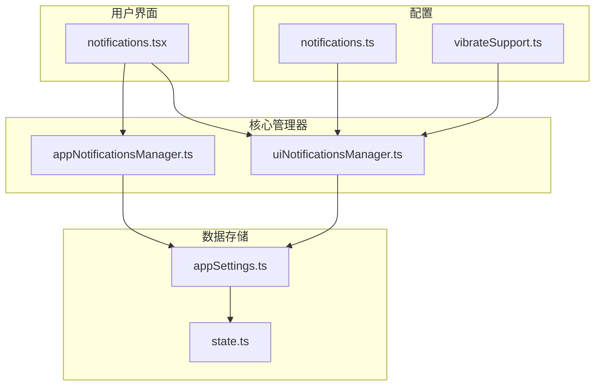
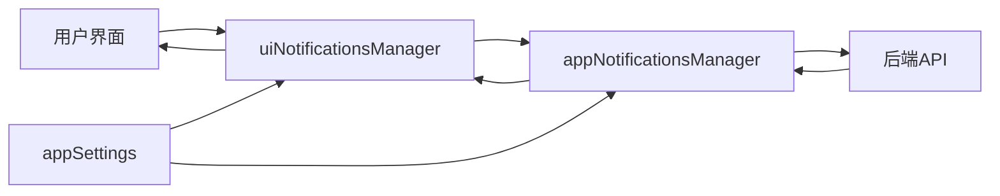
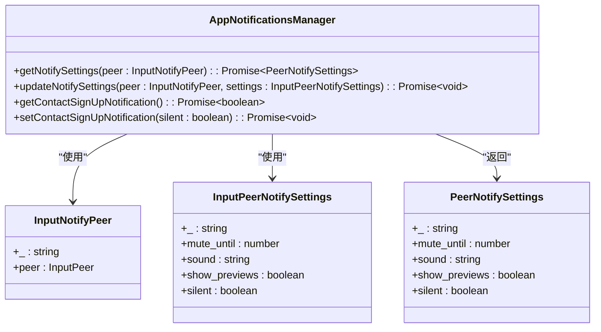
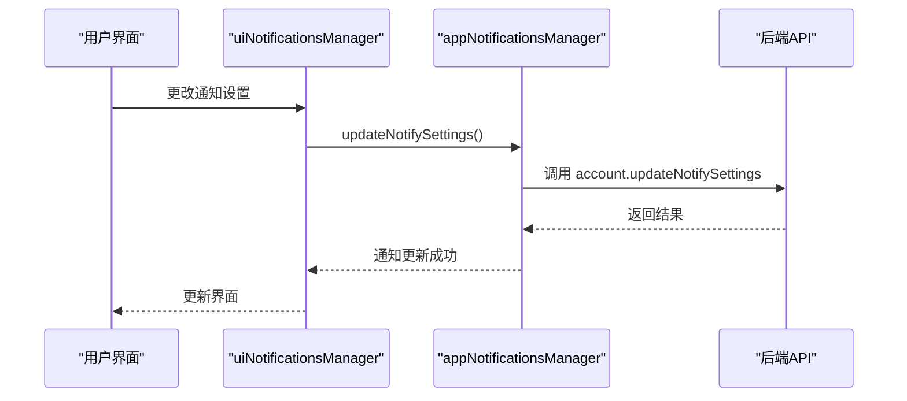
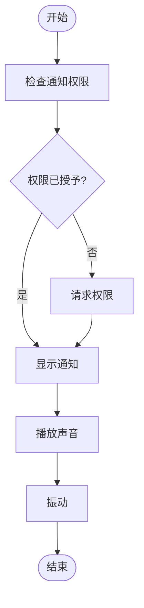
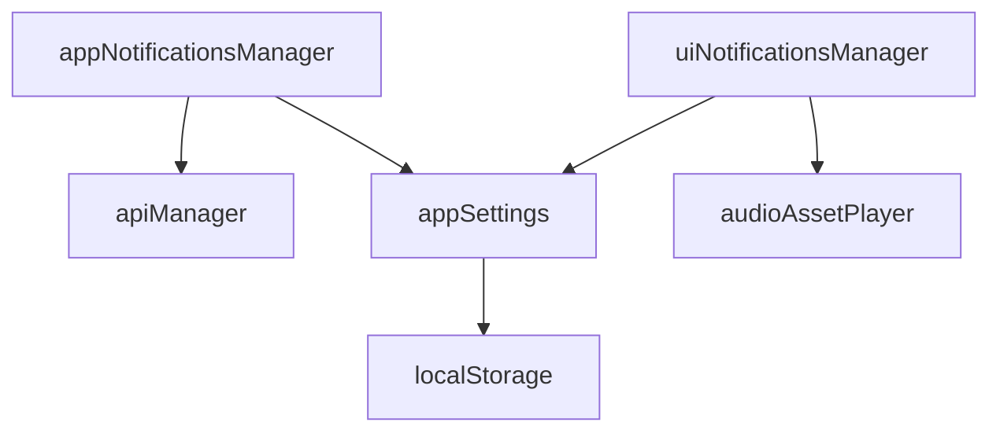

# 基本通知设置

<cite>
**本文档中引用的文件**  
- [appNotificationsManager.ts](file://src/lib/appManagers/appNotificationsManager.ts)
- [uiNotificationsManager.ts](file://src/lib/appManagers/uiNotificationsManager.ts)
- [notifications.tsx](file://src/components/sidebarLeft/tabs/notifications.tsx)
- [appSettings.ts](file://src/stores/appSettings.ts)
- [state.ts](file://src/config/state.ts)
- [vibrateSupport.ts](file://src/environment/vibrateSupport.ts)
- [notifications.ts](file://src/config/notifications.ts)
</cite>

## 目录
1. [简介](#简介)
2. [项目结构](#项目结构)
3. [核心组件](#核心组件)
4. [架构概述](#架构概述)
5. [详细组件分析](#详细组件分析)
6. [依赖分析](#依赖分析)
7. [性能考虑](#性能考虑)
8. [故障排除指南](#故障排除指南)
9. [结论](#结论)

## 简介
本文档详细介绍了基本通知设置功能的实现机制，包括消息提醒开关、通知预览、振动模式等基础配置选项。文档深入分析了 `appNotificationsManager` 中 `enableNotifications`、`setNotificationSettings` 等核心方法的工作原理和调用关系，解释了通知设置数据在 `appSettings` 中的存储结构和持久化方式。此外，文档还提供了实际使用示例，展示如何通过 API 配置全局通知偏好和特定聊天的通知设置，并说明这些设置如何影响用户界面的提示行为。

## 项目结构
项目结构清晰地组织了通知设置相关的文件和模块。核心通知管理器位于 `src/lib/appManagers` 目录下，而用户界面相关的通知设置组件则位于 `src/components/sidebarLeft/tabs` 目录中。设置数据的存储和管理由 `src/stores/appSettings.ts` 文件负责，而通知相关的常量和配置则定义在 `src/config` 目录下。

**图源**  
- [appNotificationsManager.ts](file://src/lib/appManagers/appNotificationsManager.ts)
- [uiNotificationsManager.ts](file://src/lib/appManagers/uiNotificationsManager.ts)
- [notifications.tsx](file://src/components/sidebarLeft/tabs/notifications.tsx)
- [appSettings.ts](file://src/stores/appSettings.ts)
- [state.ts](file://src/config/state.ts)
- [notifications.ts](file://src/config/notifications.ts)
- [vibrateSupport.ts](file://src/environment/vibrateSupport.ts)

**本节来源**  
- [appNotificationsManager.ts](file://src/lib/appManagers/appNotificationsManager.ts)
- [uiNotificationsManager.ts](file://src/lib/appManagers/uiNotificationsManager.ts)
- [notifications.tsx](file://src/components/sidebarLeft/tabs/notifications.tsx)
- [appSettings.ts](file://src/stores/appSettings.ts)
- [state.ts](file://src/config/state.ts)
- [notifications.ts](file://src/config/notifications.ts)
- [vibrateSupport.ts](file://src/environment/vibrateSupport.ts)

## 核心组件
核心组件包括 `appNotificationsManager` 和 `uiNotificationsManager`，它们分别负责通知设置的逻辑处理和用户界面的交互。`appNotificationsManager` 提供了获取和更新通知设置的方法，而 `uiNotificationsManager` 则负责处理通知的显示和声音播放。

**本节来源**  
- [appNotificationsManager.ts](file://src/lib/appManagers/appNotificationsManager.ts)
- [uiNotificationsManager.ts](file://src/lib/appManagers/uiNotificationsManager.ts)

## 架构概述
系统架构采用了分层设计，将通知管理的逻辑与用户界面分离。`appNotificationsManager` 负责与后端 API 交互，获取和更新通知设置，而 `uiNotificationsManager` 则负责处理前端的通知显示和用户交互。设置数据通过 `appSettings` 存储在本地，并在用户更改设置时同步到后端。

**图源**  
- [appNotificationsManager.ts](file://src/lib/appManagers/appNotificationsManager.ts)
- [uiNotificationsManager.ts](file://src/lib/appManagers/uiNotificationsManager.ts)
- [appSettings.ts](file://src/stores/appSettings.ts)

## 详细组件分析
### appNotificationsManager 分析
`appNotificationsManager` 是通知设置的核心管理器，提供了获取和更新通知设置的方法。`getNotifySettings` 方法用于获取特定用户的当前通知设置，而 `updateNotifySettings` 方法则用于更新这些设置。

#### 类图

**图源**  
- [appNotificationsManager.ts](file://src/lib/appManagers/appNotificationsManager.ts)

#### 序列图

**图源**  
- [appNotificationsManager.ts](file://src/lib/appManagers/appNotificationsManager.ts)
- [uiNotificationsManager.ts](file://src/lib/appManagers/uiNotificationsManager.ts)

### uiNotificationsManager 分析
`uiNotificationsManager` 负责处理通知的显示和声音播放。它通过 `testSound` 方法测试通知声音，并通过 `cancel` 方法取消显示的通知。

#### 流程图

**图源**  
- [uiNotificationsManager.ts](file://src/lib/appManagers/uiNotificationsManager.ts)

**本节来源**  
- [appNotificationsManager.ts](file://src/lib/appManagers/appNotificationsManager.ts)
- [uiNotificationsManager.ts](file://src/lib/appManagers/uiNotificationsManager.ts)

## 依赖分析
通知设置功能依赖于多个模块和外部 API。`appNotificationsManager` 依赖于 `apiManager` 与后端进行通信，而 `uiNotificationsManager` 依赖于 `audioAssetPlayer` 播放声音。此外，`appSettings` 依赖于 `localStorage` 进行数据持久化。

**图源**  
- [appNotificationsManager.ts](file://src/lib/appManagers/appNotificationsManager.ts)
- [uiNotificationsManager.ts](file://src/lib/appManagers/uiNotificationsManager.ts)
- [appSettings.ts](file://src/stores/appSettings.ts)

**本节来源**  
- [appNotificationsManager.ts](file://src/lib/appManagers/appNotificationsManager.ts)
- [uiNotificationsManager.ts](file://src/lib/appManagers/uiNotificationsManager.ts)
- [appSettings.ts](file://src/stores/appSettings.ts)

## 性能考虑
在实现通知设置功能时，需要考虑性能问题。例如，`uiNotificationsManager` 使用 `throttle` 函数来限制通知检查的频率，避免频繁的 API 调用。此外，`appSettings` 使用 `setAppSettings` 方法来批量更新设置，减少对 `localStorage` 的写入次数。

**本节来源**  
- [appNotificationsManager.ts](file://src/lib/appManagers/appNotificationsManager.ts)
- [uiNotificationsManager.ts](file://src/lib/appManagers/uiNotificationsManager.ts)
- [appSettings.ts](file://src/stores/appSettings.ts)

## 故障排除指南
### 通知无法显示
如果通知无法显示，请检查以下几点：
1. 确保浏览器已授予通知权限。
2. 检查 `appSettings` 中的通知设置是否正确。
3. 确认 `uiNotificationsManager` 的 `notificationsUiSupport` 属性为 `true`。

### 声音无法播放
如果通知声音无法播放，请检查以下几点：
1. 确保 `appSettings` 中的声音设置已启用。
2. 检查 `audioAssetPlayer` 是否正确初始化。
3. 确认浏览器的音频播放功能正常。

**本节来源**  
- [uiNotificationsManager.ts](file://src/lib/appManagers/uiNotificationsManager.ts)
- [appSettings.ts](file://src/stores/appSettings.ts)

## 结论
本文档详细介绍了基本通知设置功能的实现机制，包括核心组件、架构设计、依赖关系和性能考虑。通过理解这些内容，开发者可以更好地维护和扩展通知设置功能，确保用户获得良好的使用体验。