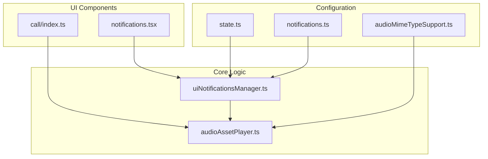
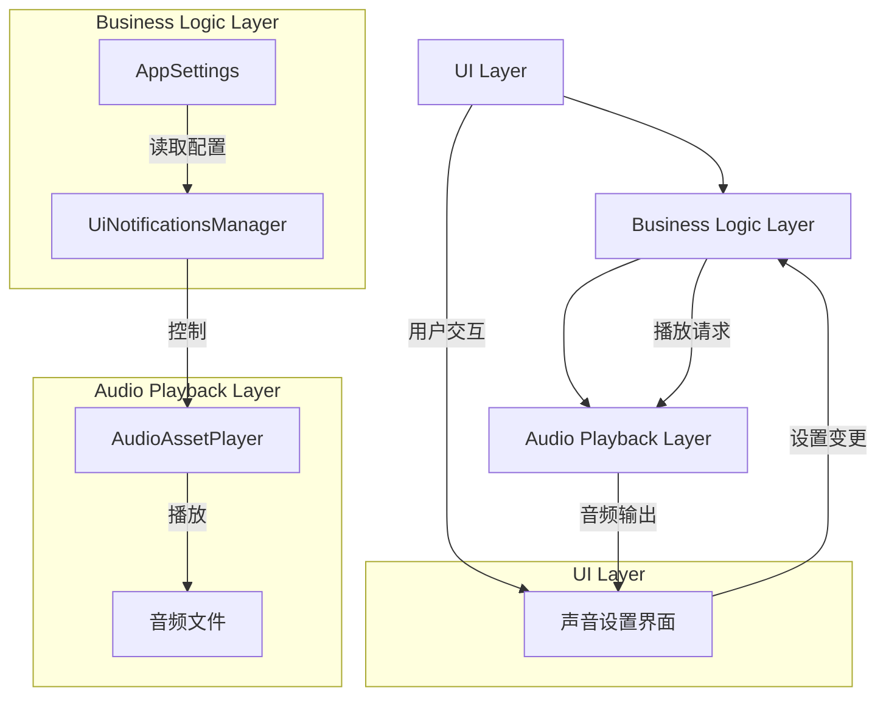
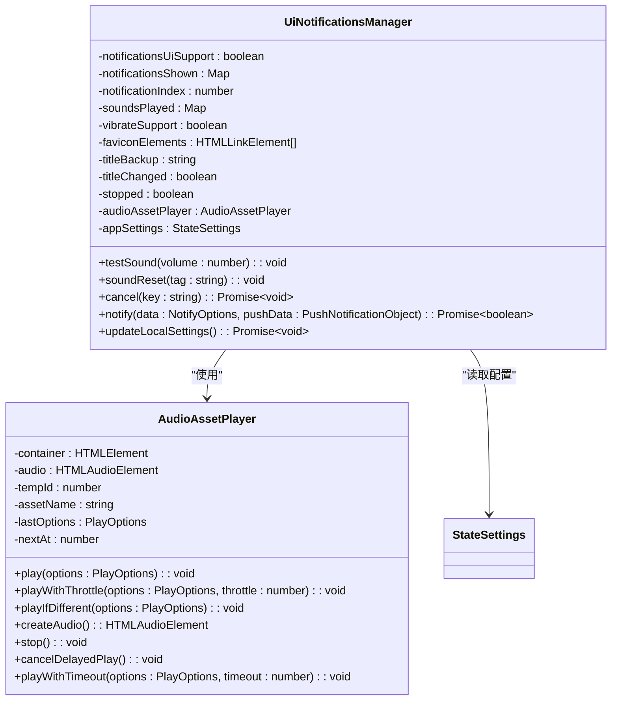
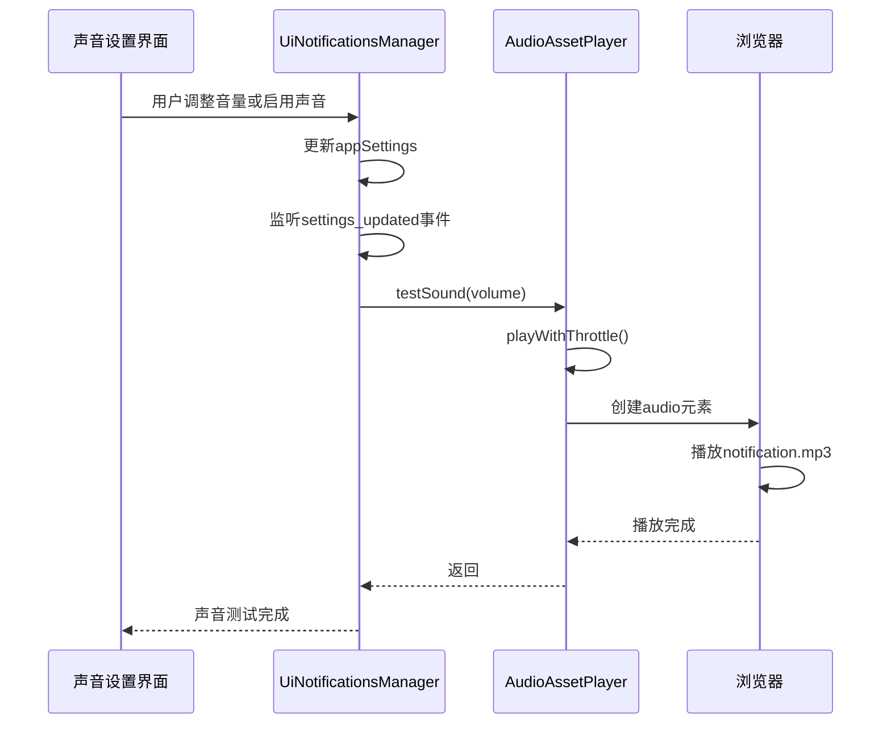
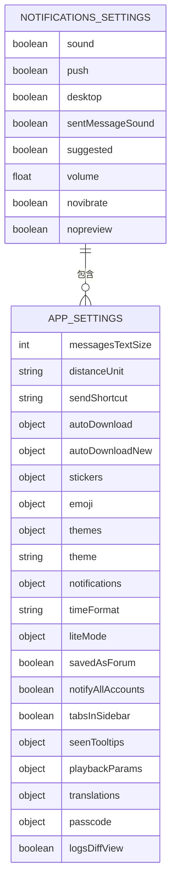
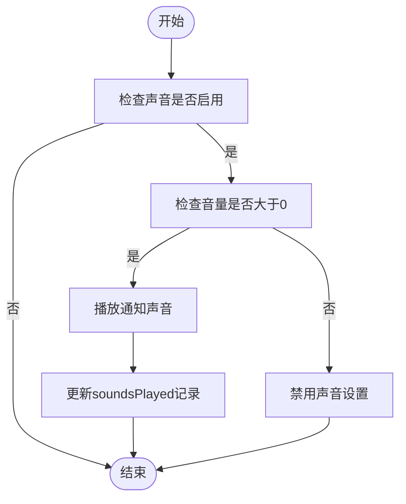
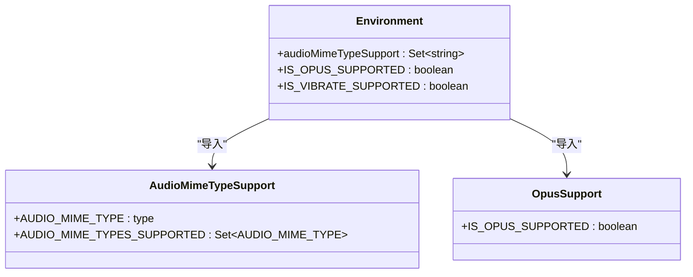
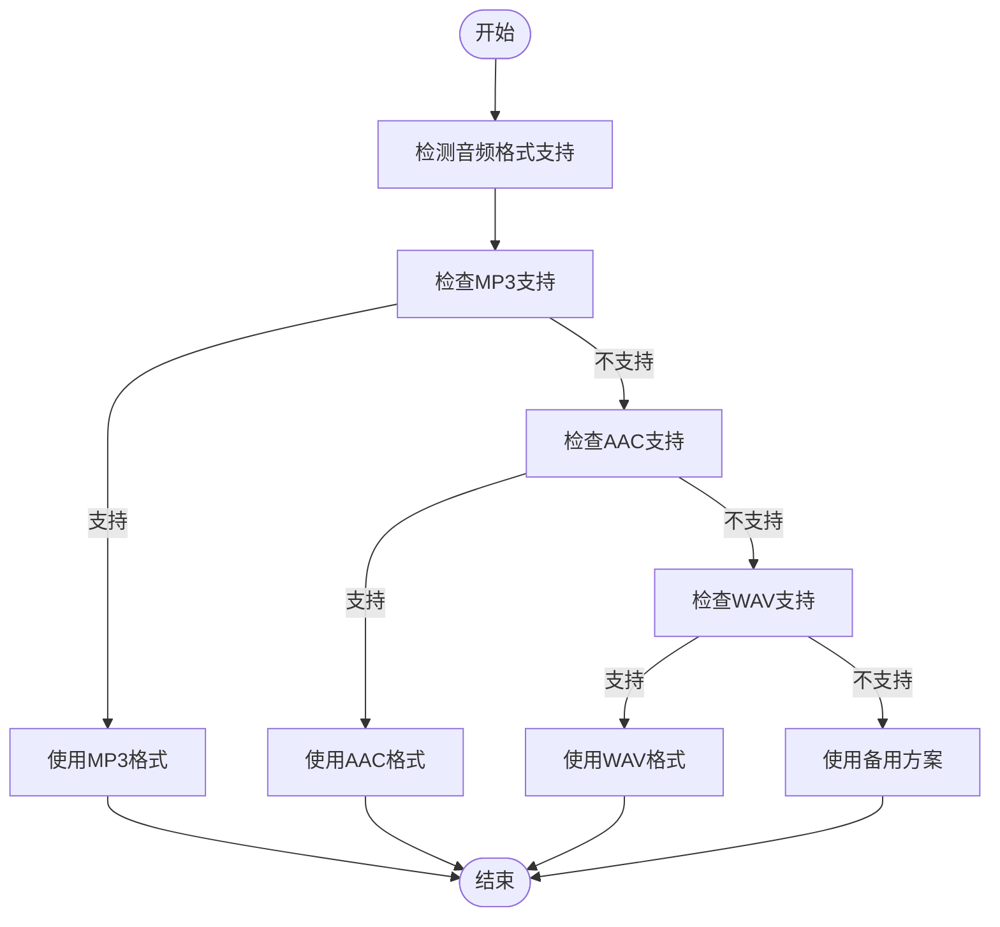
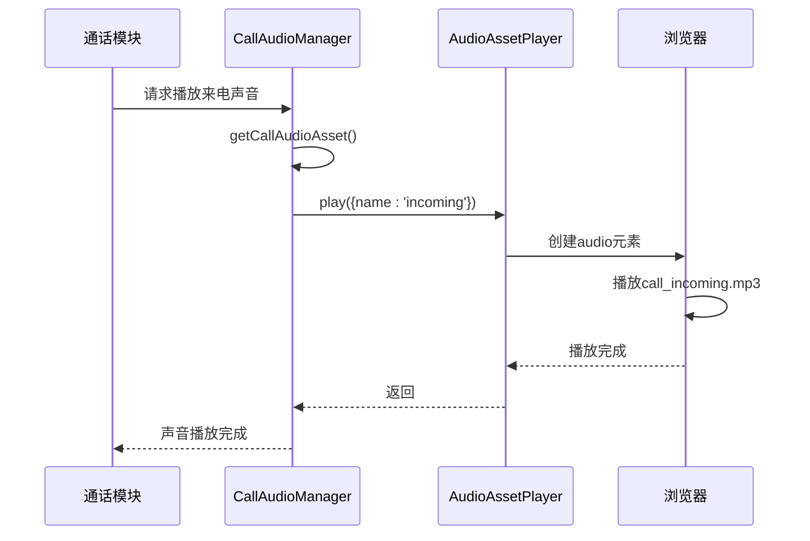
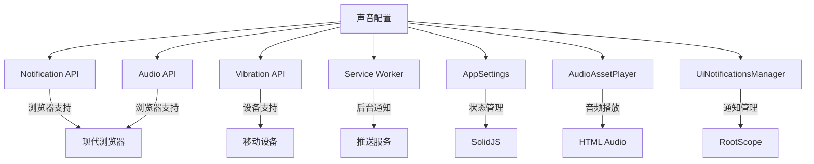

# 声音配置

<cite>
**本文档中引用的文件**   
- [uiNotificationsManager.ts](file://src/lib/appManagers/uiNotificationsManager.ts)
- [audioAssetPlayer.ts](file://src/helpers/audioAssetPlayer.ts)
- [notifications.tsx](file://src/components/sidebarLeft/tabs/notifications.tsx)
- [state.ts](file://src/config/state.ts)
- [audioMimeTypeSupport.ts](file://src/environment/audioMimeTypeSupport.ts)
- [getCallAudioAsset.ts](file://src/components/call/getAudioAsset.ts)
- [notifications.ts](file://src/config/notifications.ts)
</cite>

## 目录
1. [简介](#简介)
2. [项目结构](#项目结构)
3. [核心组件](#核心组件)
4. [架构概述](#架构概述)
5. [详细组件分析](#详细组件分析)
6. [依赖分析](#依赖分析)
7. [性能考虑](#性能考虑)
8. [故障排除指南](#故障排除指南)
9. [结论](#结论)

## 简介
本文档详细介绍了应用程序中声音配置功能的实现方式，包括通知铃声选择、自定义声音上传、音量调节等音频相关设置。文档深入分析了appNotificationsManager中管理声音配置的方法，包括声音文件的存储路径、格式支持和播放机制。同时，说明了声音设置在appSettings中的数据结构和序列化方式，并提供了通过API为不同类型事件（消息、来电等）配置个性化铃声的实际使用示例。最后，解释了该功能在不同平台和浏览器环境下的兼容性处理。

## 项目结构
项目中的声音配置功能主要分布在以下几个目录中：
- `src/components/sidebarLeft/tabs/`：包含通知设置的UI组件
- `src/lib/appManagers/`：包含通知管理的核心逻辑
- `src/helpers/`：包含音频播放的辅助工具
- `src/config/`：包含通知相关的配置常量
- `src/environment/`：包含音频格式支持的环境检测



**Diagram sources**
- [notifications.tsx](file://src/components/sidebarLeft/tabs/notifications.tsx)
- [uiNotificationsManager.ts](file://src/lib/appManagers/uiNotificationsManager.ts)
- [audioAssetPlayer.ts](file://src/helpers/audioAssetPlayer.ts)
- [state.ts](file://src/config/state.ts)
- [notifications.ts](file://src/config/notifications.ts)
- [audioMimeTypeSupport.ts](file://src/environment/audioMimeTypeSupport.ts)

**Section sources**
- [uiNotificationsManager.ts](file://src/lib/appManagers/uiNotificationsManager.ts)
- [audioAssetPlayer.ts](file://src/helpers/audioAssetPlayer.ts)
- [notifications.tsx](file://src/components/sidebarLeft/tabs/notifications.tsx)
- [state.ts](file://src/config/state.ts)

## 核心组件
声音配置功能的核心组件包括：
- `UiNotificationsManager`：负责管理所有通知相关的逻辑，包括声音播放
- `AudioAssetPlayer`：通用的音频播放器，用于播放各种系统声音
- `appSettings`：存储用户的声音配置偏好
- `audioMimeTypeSupport`：检测浏览器对不同音频格式的支持情况

这些组件协同工作，实现了完整的音频通知功能。

**Section sources**
- [uiNotificationsManager.ts](file://src/lib/appManagers/uiNotificationsManager.ts)
- [audioAssetPlayer.ts](file://src/helpers/audioAssetPlayer.ts)
- [state.ts](file://src/config/state.ts)
- [audioMimeTypeSupport.ts](file://src/environment/audioMimeTypeSupport.ts)

## 架构概述
声音配置功能的架构分为三个主要层次：UI层、业务逻辑层和音频播放层。UI层负责展示声音设置界面，业务逻辑层处理通知事件和声音播放决策，音频播放层负责实际的音频文件播放。



**Diagram sources**
- [uiNotificationsManager.ts](file://src/lib/appManagers/uiNotificationsManager.ts)
- [audioAssetPlayer.ts](file://src/helpers/audioAssetPlayer.ts)
- [notifications.tsx](file://src/components/sidebarLeft/tabs/notifications.tsx)

## 详细组件分析

### UiNotificationsManager 分析
`UiNotificationsManager` 是声音配置功能的核心管理器，负责处理所有通知相关的逻辑，包括声音播放的决策和控制。

#### 类图


**Diagram sources**
- [uiNotificationsManager.ts](file://src/lib/appManagers/uiNotificationsManager.ts)
- [audioAssetPlayer.ts](file://src/helpers/audioAssetPlayer.ts)
- [state.ts](file://src/config/state.ts)

#### 通知声音播放流程


**Diagram sources**
- [notifications.tsx](file://src/components/sidebarLeft/tabs/notifications.tsx)
- [uiNotificationsManager.ts](file://src/lib/appManagers/uiNotificationsManager.ts)
- [audioAssetPlayer.ts](file://src/helpers/audioAssetPlayer.ts)

**Section sources**
- [uiNotificationsManager.ts](file://src/lib/appManagers/uiNotificationsManager.ts)
- [audioAssetPlayer.ts](file://src/helpers/audioAssetPlayer.ts)
- [notifications.tsx](file://src/components/sidebarLeft/tabs/notifications.tsx)

### 声音设置数据结构分析
声音设置在appSettings中的数据结构定义了用户的所有音频相关偏好。

#### 数据结构


**Diagram sources**
- [state.ts](file://src/config/state.ts)

#### 声音设置流程图


**Diagram sources**
- [uiNotificationsManager.ts](file://src/lib/appManagers/uiNotificationsManager.ts)
- [state.ts](file://src/config/state.ts)

**Section sources**
- [state.ts](file://src/config/state.ts)
- [uiNotificationsManager.ts](file://src/lib/appManagers/uiNotificationsManager.ts)

### 音频格式支持分析
系统通过环境检测模块来确定浏览器对不同音频格式的支持情况，确保音频文件能够在各种环境下正常播放。

#### 音频格式支持检测


**Diagram sources**
- [audioMimeTypeSupport.ts](file://src/environment/audioMimeTypeSupport.ts)
- [opusSupport.ts](file://src/environment/opusSupport.ts)

#### 音频格式兼容性流程


**Diagram sources**
- [audioMimeTypeSupport.ts](file://src/environment/audioMimeTypeSupport.ts)
- [uiNotificationsManager.ts](file://src/lib/appManagers/uiNotificationsManager.ts)

**Section sources**
- [audioMimeTypeSupport.ts](file://src/environment/audioMimeTypeSupport.ts)
- [opusSupport.ts](file://src/environment/opusSupport.ts)

### 通话声音管理分析
除了通知声音外，系统还管理着通话相关的各种声音，如来电、挂断等。

#### 通话声音管理器
```mermaid
classDiagram
class CallAudioManager {
-assetPlayer : AudioAssetPlayer
+getCallAudioAsset() : AudioAssetPlayer
}
class AudioAssetPlayer {
-assets : Map~string, string~
+play(options : PlayOptions) : void
+playWithThrottle(options : PlayOptions, throttle : number) : void
}
CallAudioManager --> AudioAssetPlayer : "创建"
AudioAssetPlayer : assets = {
busy : 'call_busy.mp3',
connect : 'call_connect.mp3',
end : 'call_end.mp3',
incoming : 'call_incoming.mp3',
outgoing : 'call_outgoing.mp3',
failed : 'voip_failed.mp3'
}
```

**Diagram sources**
- [getCallAudioAsset.ts](file://src/components/call/getAudioAsset.ts)
- [audioAssetPlayer.ts](file://src/helpers/audioAssetPlayer.ts)

#### 通话声音播放序列


**Diagram sources**
- [getCallAudioAsset.ts](file://src/components/call/getAudioAsset.ts)
- [audioAssetPlayer.ts](file://src/helpers/audioAssetPlayer.ts)

**Section sources**
- [getCallAudioAsset.ts](file://src/components/call/getAudioAsset.ts)
- [audioAssetPlayer.ts](file://src/helpers/audioAssetPlayer.ts)

## 依赖分析
声音配置功能依赖于多个核心模块和外部API，这些依赖关系确保了功能的完整性和兼容性。



**Diagram sources**
- [uiNotificationsManager.ts](file://src/lib/appManagers/uiNotificationsManager.ts)
- [audioAssetPlayer.ts](file://src/helpers/audioAssetPlayer.ts)
- [notifications.tsx](file://src/components/sidebarLeft/tabs/notifications.tsx)
- [state.ts](file://src/config/state.ts)

**Section sources**
- [uiNotificationsManager.ts](file://src/lib/appManagers/uiNotificationsManager.ts)
- [audioAssetPlayer.ts](file://src/helpers/audioAssetPlayer.ts)
- [state.ts](file://src/config/state.ts)

## 性能考虑
在实现声音配置功能时，需要考虑以下几个性能方面：

1. **音频预加载**：系统在初始化时预加载常用的音频文件，避免在需要播放时出现延迟。
2. **播放节流**：使用`playWithThrottle`方法防止短时间内重复播放相同的声音。
3. **内存管理**：及时清理不再使用的音频元素，避免内存泄漏。
4. **资源优化**：使用适当压缩的音频文件格式，在音质和文件大小之间取得平衡。
5. **异步处理**：将音频播放操作异步化，避免阻塞主线程。

这些性能优化措施确保了声音功能的流畅性和响应性。

## 故障排除指南
当声音配置功能出现问题时，可以按照以下步骤进行排查：

1. **检查浏览器权限**：确保浏览器已授予通知和音频播放权限。
2. **验证音频文件路径**：确认音频文件存在于指定路径且可访问。
3. **检查格式兼容性**：确认浏览器支持所使用的音频格式。
4. **调试设置状态**：检查appSettings中的声音相关设置是否正确。
5. **查看控制台日志**：检查是否有相关的错误或警告信息。
6. **测试环境兼容性**：在不同浏览器和设备上测试功能是否正常工作。

通过这些步骤，可以快速定位和解决大多数声音配置相关的问题。

**Section sources**
- [uiNotificationsManager.ts](file://src/lib/appManagers/uiNotificationsManager.ts)
- [audioAssetPlayer.ts](file://src/helpers/audioAssetPlayer.ts)
- [notifications.tsx](file://src/components/sidebarLeft/tabs/notifications.tsx)

## 结论
本文档详细介绍了应用程序中声音配置功能的实现方式。通过分析`UiNotificationsManager`、`AudioAssetPlayer`等核心组件，我们了解了声音设置的完整工作流程。系统通过合理的架构设计和依赖管理，实现了跨平台的音频通知功能。同时，通过环境检测和格式兼容性处理，确保了功能在各种浏览器环境下的稳定运行。未来可以考虑增加更多个性化选项，如自定义铃声上传和更多音频格式支持，以进一步提升用户体验。