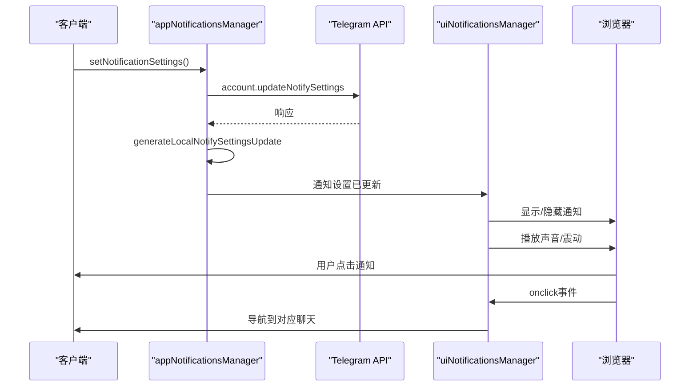
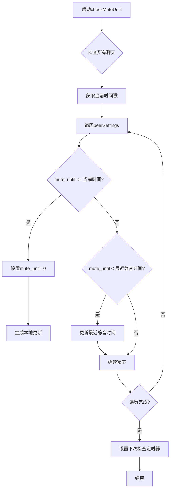
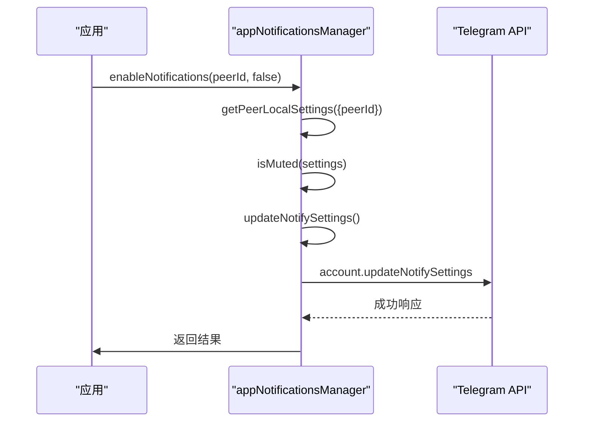
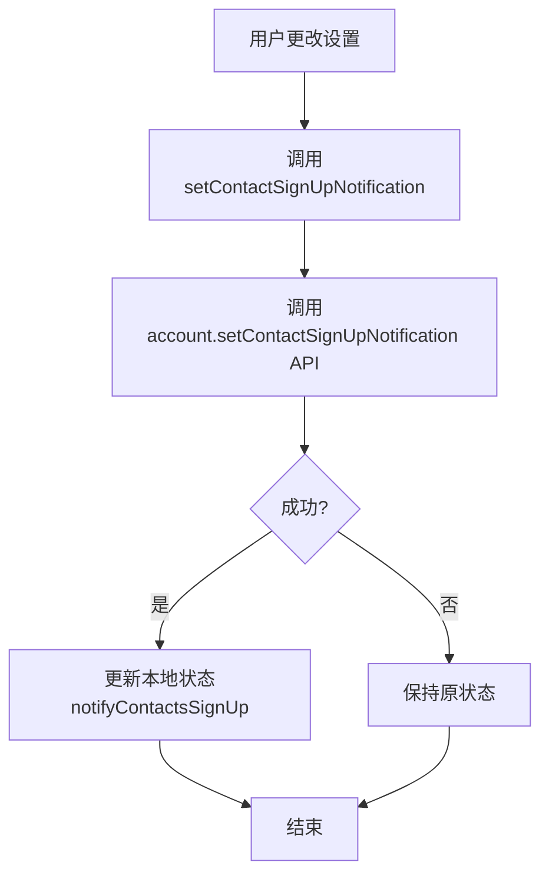

# 通知设置

<cite>
**本文档中引用的文件**  
- [appNotificationsManager.ts](file://src/lib/appManagers/appNotificationsManager.ts)
- [uiNotificationsManager.ts](file://src/lib/appManagers/uiNotificationsManager.ts)
- [notifications.ts](file://src/config/notifications.ts)
</cite>

## 目录
1. [简介](#简介)
2. [核心组件](#核心组件)
3. [通知设置的API实现](#通知设置的api实现)
4. [存储结构与同步机制](#存储结构与同步机制)
5. [高级功能实现](#高级功能实现)
6. [使用示例](#使用示例)

## 简介
本文档详细介绍了Telegram Web客户端中通知设置功能的实现。重点分析了消息提醒、声音设置、通知预览等配置选项的API实现，深入解析了`appNotificationsManager`和`uiNotificationsManager`两个核心管理器的功能与交互方式。文档还说明了通知设置的本地存储结构和跨设备同步机制，以及免打扰模式、自定义通知铃声等高级功能的实现原理。

## 核心组件

本系统主要由两个核心管理器构成：`appNotificationsManager`负责处理与Telegram服务器的通信和通知设置的逻辑管理，而`uiNotificationsManager`则负责用户界面级别的通知展示、声音播放和视觉反馈。

**Section sources**
- [appNotificationsManager.ts](file://src/lib/appManagers/appNotificationsManager.ts#L24-L351)
- [uiNotificationsManager.ts](file://src/lib/appManagers/uiNotificationsManager.ts#L71-L831)

## 通知设置的API实现

### appNotificationsManager核心方法
`appNotificationsManager`类提供了管理通知设置的核心API，主要方法包括：

- **getNotifySettings**: 获取指定联系人或聊天的通知设置。该方法会首先检查本地缓存，若无缓存则向服务器发起`account.getNotifySettings`请求。
- **updateNotifySettings**: 更新指定联系人或聊天的通知设置。该方法会调用`account.updateNotifySettings` API，并生成本地更新以立即反映更改。
- **isPeerLocalMuted**: 判断指定聊天是否被静音。该方法结合了聊天自身的静音设置和其所属类型（用户、群组、频道）的通用设置。
- **toggleStoriesMute**: 切换指定用户的动态通知静音状态。

这些方法通过`apiUpdatesManager`监听服务器推送的`updateNotifySettings`事件，确保客户端状态与服务器保持同步。

### uiNotificationsManager功能
`uiNotificationsManager`负责处理用户界面级别的通知，主要功能包括：

- **构建和显示桌面通知**
- **管理通知声音和震动**
- **在浏览器标签页上显示未读消息计数**
- **处理推送通知的点击事件**

该管理器通过`Notification` API显示系统级通知，并使用`AudioAssetPlayer`播放通知音效。



**Diagram sources**
- [appNotificationsManager.ts](file://src/lib/appManagers/appNotificationsManager.ts#L116-L127)
- [uiNotificationsManager.ts](file://src/lib/appManagers/uiNotificationsManager.ts#L634-L749)

**Section sources**
- [appNotificationsManager.ts](file://src/lib/appManagers/appNotificationsManager.ts#L61-L351)
- [uiNotificationsManager.ts](file://src/lib/appManagers/uiNotificationsManager.ts#L53-L800)

## 存储结构与同步机制

### 本地存储结构
通知设置在本地通过以下结构进行存储和管理：

```mermaid
classDiagram
class AppNotificationsManager {
+peerSettings : Object
+getNotifySettings(peer)
+updateNotifySettings(peer, settings)
+isPeerLocalMuted(options)
+savePeerSettings(options)
}
class PeerSettings {
+notifyPeer : {[peerId : string] : PeerNotifySettings}
+notifyUsers : PeerNotifySettings
+notifyChats : PeerNotifySettings
+notifyBroadcasts : PeerNotifySettings
+notifyForumTopic : {[peerId_threadId : string] : PeerNotifySettings}
}
class PeerNotifySettings {
+_ : 'peerNotifySettings'
+mute_until : number
+show_previews : boolean
+silent : boolean
+sound : string
+stories_muted : boolean
}
AppNotificationsManager --> PeerSettings : "包含"
PeerSettings --> PeerNotifySettings : "包含"
```

**Diagram sources**
- [appNotificationsManager.ts](file://src/lib/appManagers/appNotificationsManager.ts#L25-L30)
- [appNotificationsManager.ts](file://src/lib/appManagers/appNotificationsManager.ts#L212-L238)

### 同步机制
系统通过以下机制确保不同设备间的通知设置一致性：

1. **服务器同步**: 所有通知设置的更改都会通过`account.updateNotifySettings` API同步到服务器。
2. **更新监听**: `appNotificationsManager`通过`apiUpdatesManager`监听`updateNotifySettings`事件，当其他设备更改设置时，本设备会收到实时更新。
3. **本地状态持久化**: 通知设置会存储在`appStateManager`中，确保页面刷新后设置不丢失。
4. **跨账户管理**: `uiNotificationsManager`能够管理多个账户的通知状态，确保在多账户环境下正确显示通知计数。

**Section sources**
- [appNotificationsManager.ts](file://src/lib/appManagers/appNotificationsManager.ts#L44-L58)
- [appNotificationsManager.ts](file://src/lib/appManagers/appNotificationsManager.ts#L336-L349)
- [uiNotificationsManager.ts](file://src/lib/appManagers/uiNotificationsManager.ts#L104-L148)

## 高级功能实现

### 免打扰模式
免打扰模式的实现基于`mute_until`字段，该字段存储一个时间戳，表示静音截止时间。系统通过`checkMuteUntil`方法定期检查所有聊天的静音状态，当发现有聊天的静音时间已过时，会自动取消静音并通知UI更新。



**Diagram sources**
- [appNotificationsManager.ts](file://src/lib/appManagers/appNotificationsManager.ts#L149-L206)

### 自定义通知铃声
虽然当前代码库中未直接实现自定义铃声功能，但系统架构已为此功能预留了支持。`PeerNotifySettings`结构中包含`sound`字段，可用于存储自定义铃声的标识符。`uiNotificationsManager`中的`testSound`方法可以扩展以支持播放不同的音效文件。

### 通知预览控制
通知预览功能由`show_previews`设置控制。当该设置为`true`时，通知会显示消息内容预览；当为`false`或用户启用了密码锁时，通知仅显示"新消息"的通用提示。

**Section sources**
- [appNotificationsManager.ts](file://src/lib/appManagers/appNotificationsManager.ts#L149-L206)
- [uiNotificationsManager.ts](file://src/lib/appManagers/uiNotificationsManager.ts#L311-L342)

## 使用示例

### 配置特定聊天的通知偏好
以下示例展示了如何通过API配置特定聊天的通知偏好：



**Diagram sources**
- [appNotificationsManager.ts](file://src/lib/appManagers/appNotificationsManager.ts#L116-L127)

### 设置全局通知选项


**Diagram sources**
- [appNotificationsManager.ts](file://src/lib/appManagers/appNotificationsManager.ts#L142-L147)

**Section sources**
- [appNotificationsManager.ts](file://src/lib/appManagers/appNotificationsManager.ts#L137-L147)
- [uiNotificationsManager.ts](file://src/lib/appManagers/uiNotificationsManager.ts#L267-L282)