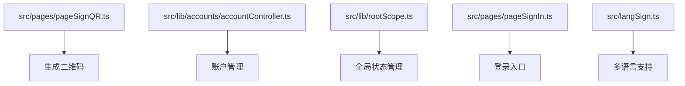
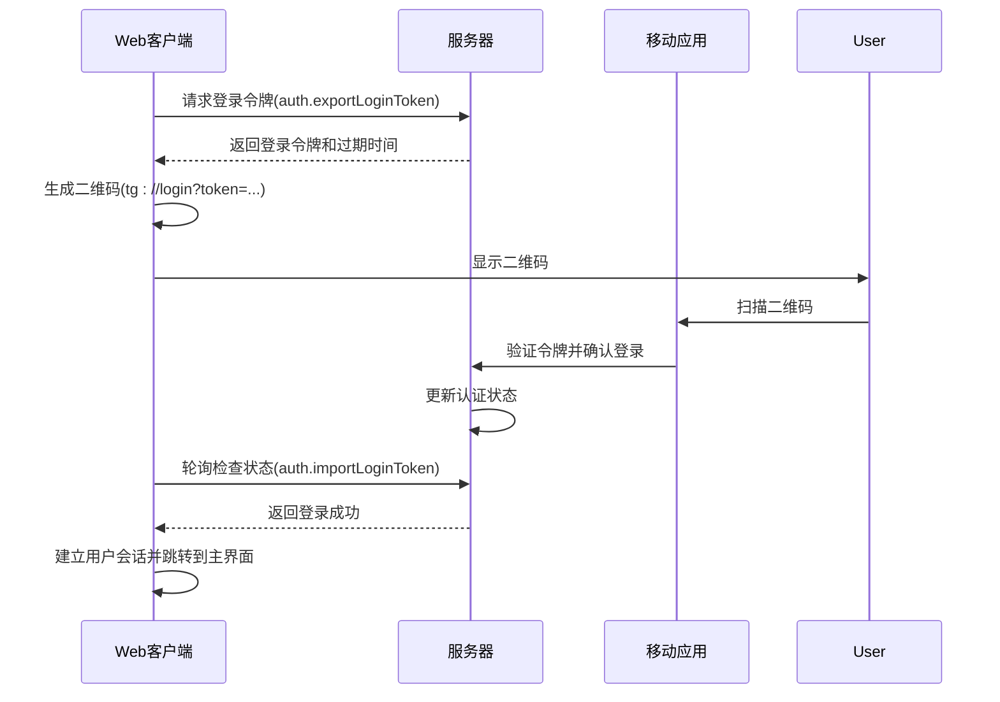
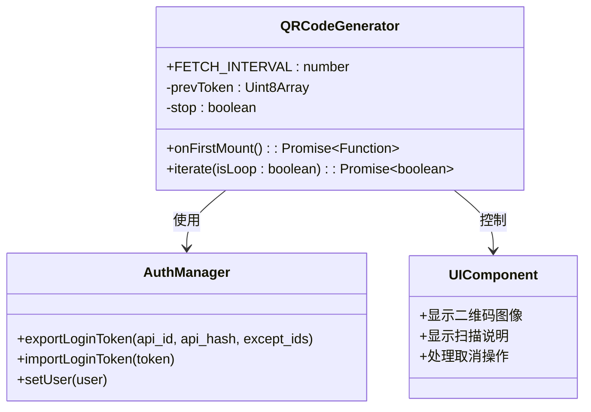
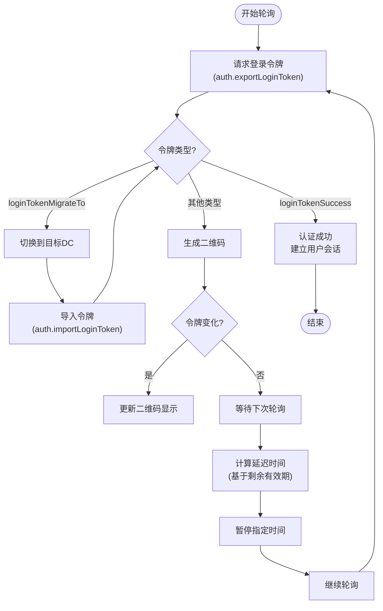
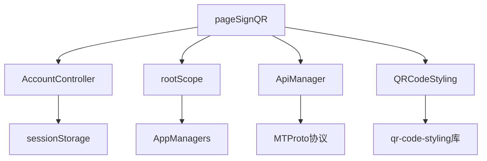

# 二维码认证

<cite>
**本文档引用的文件**  
- [pageSignQR.ts](file://src/pages/pageSignQR.ts)
- [index.ts](file://src/index.ts)
- [langSign.ts](file://src/langSign.ts)
- [accountController.ts](file://src/lib/accounts/accountController.ts)
- [rootScope.ts](file://src/lib/rootScope.ts)
- [pageSignIn.ts](file://src/pages/pageSignIn.ts)
</cite>

## 目录
1. [简介](#简介)
2. [项目结构](#项目结构)
3. [核心组件](#核心组件)
4. [架构概述](#架构概述)
5. [详细组件分析](#详细组件分析)
6. [依赖分析](#依赖分析)
7. [性能考虑](#性能考虑)
8. [故障排除指南](#故障排除指南)
9. [结论](#结论)

## 简介
本文档详细说明了基于二维码的用户认证流程的技术实现。该系统允许用户通过扫描网页界面上显示的二维码，使用移动设备上的Telegram应用完成登录过程。整个流程涉及二维码生成、移动端扫描、状态同步和会话建立等关键环节。

## 项目结构
本项目采用模块化前端架构，二维码认证功能主要分布在`src/pages`和`src/lib`目录下。核心认证逻辑位于`pageSignQR.ts`文件中，负责生成和刷新二维码。语言资源文件`langSign.ts`提供了用户界面的多语言支持，包括二维码扫描说明等文本。

**Diagram sources**
- [pageSignQR.ts](file://src/pages/pageSignQR.ts)
- [accountController.ts](file://src/lib/accounts/accountController.ts)
- [rootScope.ts](file://src/lib/rootScope.ts)
- [pageSignIn.ts](file://src/pages/pageSignIn.ts)
- [langSign.ts](file://src/langSign.ts)

**Section sources**
- [pageSignQR.ts](file://src/pages/pageSignQR.ts)
- [index.ts](file://src/index.ts)

## 核心组件
二维码认证的核心组件包括二维码生成器、登录令牌管理器和状态同步机制。系统通过调用`auth.exportLoginToken` API生成一次性登录令牌，并将其编码为二维码。当用户在移动设备上扫描二维码并确认登录后，系统会通过轮询机制检测认证状态的变化，完成用户会话的建立。

**Section sources**
- [pageSignQR.ts](file://src/pages/pageSignQR.ts)
- [accountController.ts](file://src/lib/accounts/accountController.ts)

## 架构概述
二维码认证流程采用客户端-服务器协同架构。Web客户端定期向服务器请求新的登录令牌，将令牌编码为二维码展示给用户。移动客户端扫描二维码后，通过Telegram的设备链接功能验证身份。Web客户端通过轮询检测认证状态，一旦认证成功，立即建立用户会话。

**Diagram sources**
- [pageSignQR.ts](file://src/pages/pageSignQR.ts)
- [accountController.ts](file://src/lib/accounts/accountController.ts)

## 详细组件分析
### 二维码生成与管理组件分析
该组件负责生成、更新和显示二维码，确保其在有效期内持续可用。

**Diagram sources**
- [pageSignQR.ts](file://src/pages/pageSignQR.ts)

**Section sources**
- [pageSignQR.ts](file://src/pages/pageSignQR.ts)

### 认证状态同步机制
系统通过定期轮询服务器来检测认证状态的变化。轮询间隔根据令牌的剩余有效期动态调整，确保在令牌过期前完成认证检测。

**Diagram sources**
- [pageSignQR.ts](file://src/pages/pageSignQR.ts)

**Section sources**
- [pageSignQR.ts](file://src/pages/pageSignQR.ts)

## 依赖分析
二维码认证功能依赖于多个核心模块和外部库。主要依赖关系包括账户管理、全局状态管理、API调用管理和UI组件库。

**Diagram sources**
- [pageSignQR.ts](file://src/pages/pageSignQR.ts)
- [accountController.ts](file://src/lib/accounts/accountController.ts)
- [rootScope.ts](file://src/lib/rootScope.ts)

**Section sources**
- [pageSignQR.ts](file://src/pages/pageSignQR.ts)
- [accountController.ts](file://src/lib/accounts/accountController.ts)
- [rootScope.ts](file://src/lib/rootScope.ts)

## 性能考虑
二维码认证流程在性能方面进行了多项优化。系统采用动态轮询间隔，根据令牌的剩余有效期调整请求频率，减少不必要的服务器请求。二维码生成使用了缓存机制，只有当令牌发生变化时才重新生成二维码，避免了频繁的图像渲染操作。

## 故障排除指南
### 常见问题及解决方案
- **二维码过期**：系统会自动刷新二维码，用户只需重新扫描新生成的二维码。
- **扫描失败**：检查移动设备的相机权限和网络连接，确保能够访问Telegram服务器。
- **设备不匹配**：确保扫描二维码的设备已登录与目标账户关联的Telegram账户。
- **网络问题**：检查Web客户端与服务器的连接状态，确保能够正常进行API调用。

**Section sources**
- [pageSignQR.ts](file://src/pages/pageSignQR.ts)
- [pageSignIn.ts](file://src/pages/pageSignIn.ts)

## 结论
二维码认证提供了一种安全便捷的登录方式，通过将复杂的认证流程简化为简单的扫描操作，极大地提升了用户体验。该实现充分利用了Telegram的设备链接功能，结合前端轮询和状态管理机制，构建了一个稳定可靠的认证系统。未来可以考虑增加二维码失效通知、多设备并发认证等高级功能，进一步完善用户体验。