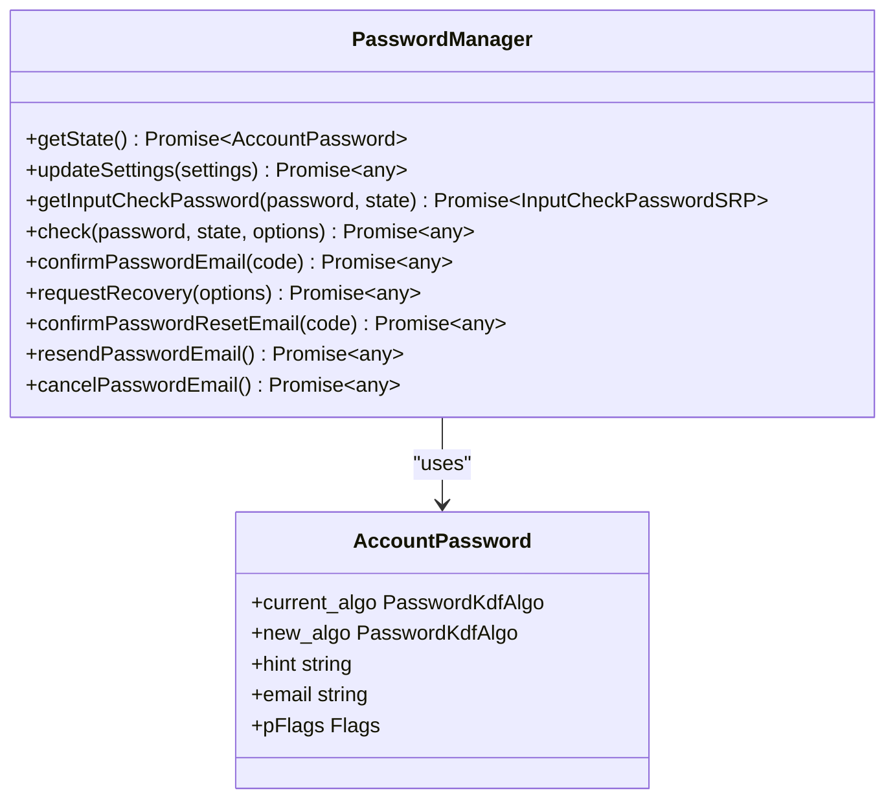
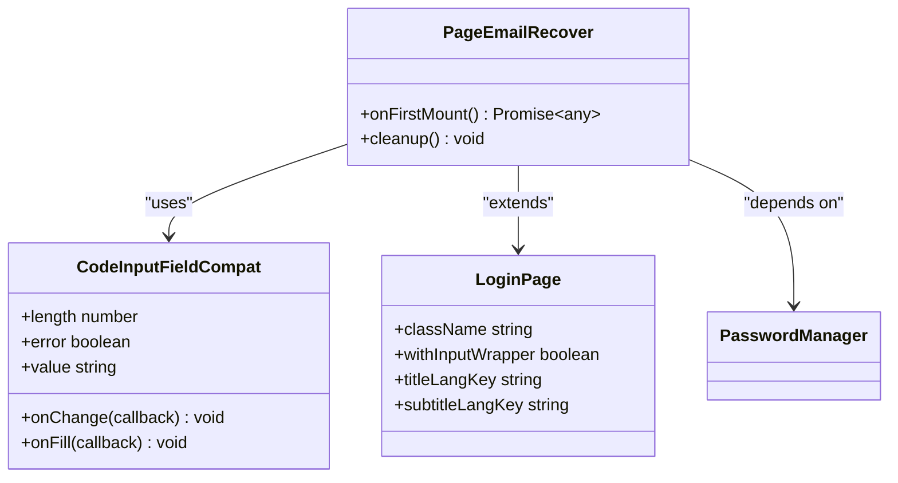
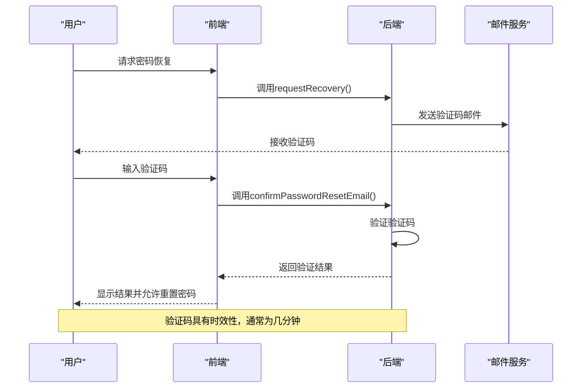
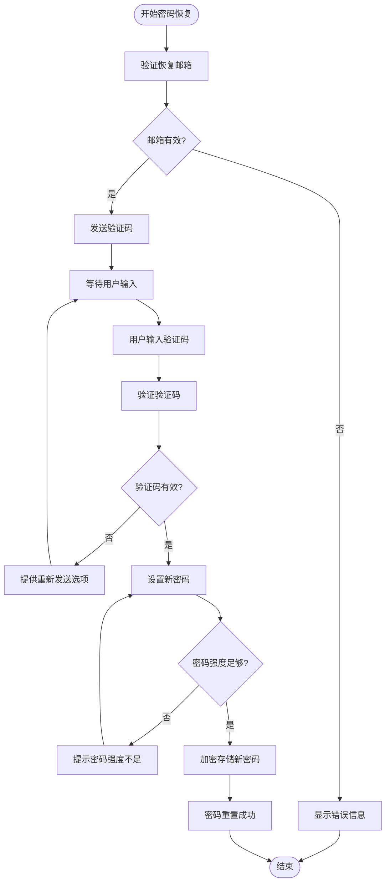
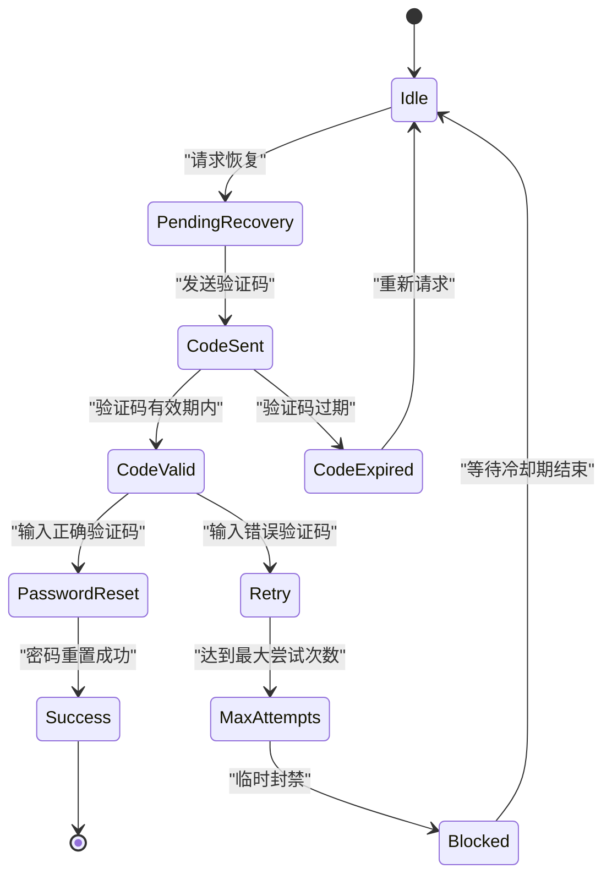
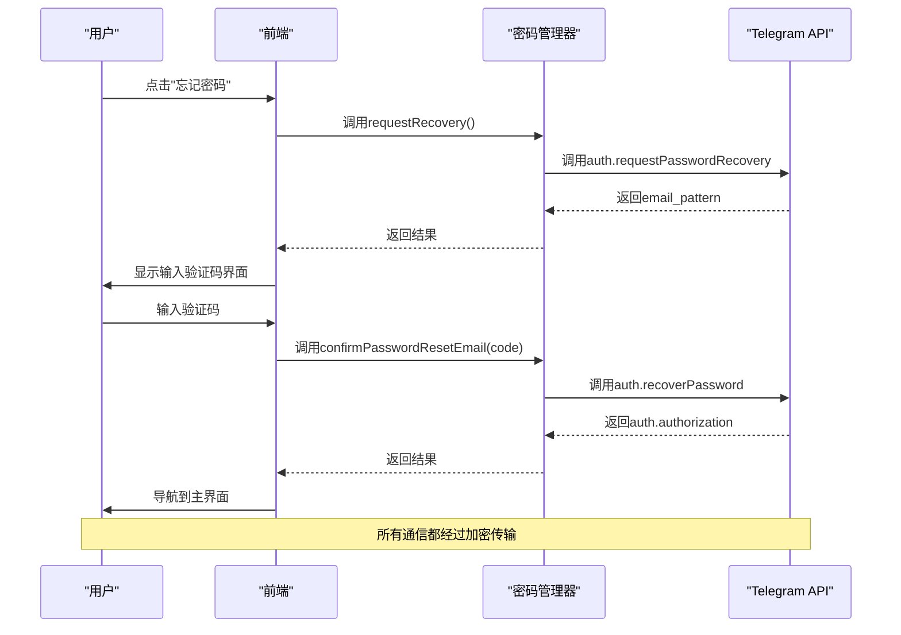
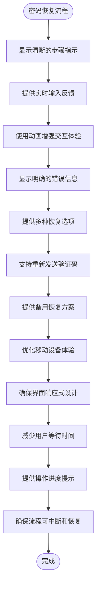
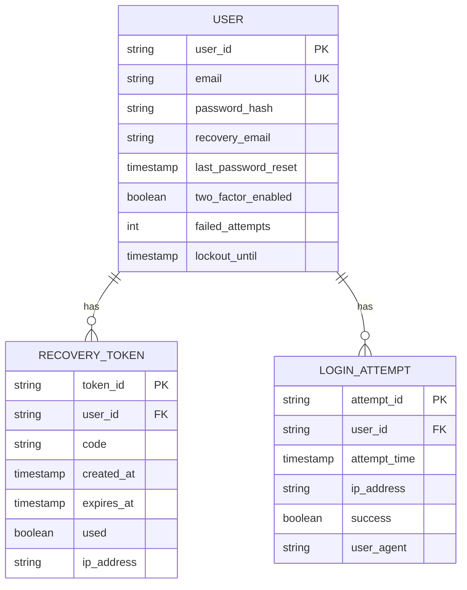

# 密码恢复

<cite>
**本文档引用的文件**   
- [pageEmailRecover.ts](file://src/pages/pageEmailRecover.ts)
- [passwordManager.ts](file://src/lib/mtproto/passwordManager.ts)
- [pagePassword.ts](file://src/pages/pagePassword.ts)
- [emailConfirmation.ts](file://src/components/sidebarLeft/tabs/2fa/emailConfirmation.ts)
- [enterPassword.ts](file://src/components/sidebarLeft/tabs/2fa/enterPassword.ts)
- [lang.ts](file://src/lang.ts)
- [langSign.ts](file://src/langSign.ts)
</cite>

## 目录
1. [简介](#简介)
2. [密码恢复流程概述](#密码恢复流程概述)
3. [核心组件分析](#核心组件分析)
4. [恢复令牌生成与验证机制](#恢复令牌生成与验证机制)
5. [用户身份验证与新密码设置](#用户身份验证与新密码设置)
6. [恢复链接有效期与防滥用策略](#恢复链接有效期与防滥用策略)
7. [前后端交互流程](#前后端交互流程)
8. [用户体验优化](#用户体验优化)
9. [安全最佳实践](#安全最佳实践)
10. [错误处理与异常情况](#错误处理与异常情况)

## 简介
本文档全面记录了Telegram Web客户端通过邮箱验证进行密码重置的完整流程。文档详细说明了恢复令牌的生成、发送和验证机制，包括安全时效性和传输加密。同时描述了用户身份验证步骤和新密码设置的安全要求，以及恢复链接的有效期、使用限制和防滥用策略。文档还提供了前后端交互的代码示例，以及用户体验优化和安全最佳实践的实施指南。

## 密码恢复流程概述
Telegram Web客户端的密码恢复功能通过邮箱验证实现，为用户提供了一种安全可靠的账户恢复机制。当用户忘记密码时，系统会通过预先设置的恢复邮箱发送包含验证码的邮件。用户需要在指定时间内输入正确的验证码来验证身份，然后才能重置密码。

该流程设计考虑了多种安全因素，包括恢复邮箱的验证、验证码的有效期限制、重置请求的频率控制等。系统还提供了备用方案，当用户无法访问恢复邮箱时，可以选择等待7天后重置账户。整个流程通过前端界面与后端API的协同工作实现，确保了用户体验的流畅性和安全性。

**Section sources**
- [pageEmailRecover.ts](file://src/pages/pageEmailRecover.ts#L1-L109)
- [lang.ts](file://src/lang.ts#L4098-L4106)

## 核心组件分析

### 密码管理器组件
密码管理器是密码恢复功能的核心组件，负责处理所有与密码相关的操作。该组件提供了获取账户密码状态、更新密码设置、验证密码以及处理密码恢复请求等方法。通过与Telegram API的交互，密码管理器确保了密码操作的安全性和可靠性。

**Diagram sources **
- [passwordManager.ts](file://src/lib/mtproto/passwordManager.ts#L15-L119)

### 邮箱恢复页面组件
邮箱恢复页面组件负责处理用户通过邮箱验证进行密码重置的界面交互。该组件显示验证码输入框，处理用户输入，并与密码管理器通信以验证验证码。页面还提供了取消操作的选项，允许用户返回密码输入页面。

**Diagram sources **
- [pageEmailRecover.ts](file://src/pages/pageEmailRecover.ts#L1-L109)

**Section sources**
- [pageEmailRecover.ts](file://src/pages/pageEmailRecover.ts#L1-L109)
- [passwordManager.ts](file://src/lib/mtproto/passwordManager.ts#L15-L119)

## 恢复令牌生成与验证机制
密码恢复功能的令牌生成与验证机制基于Telegram的API系统实现。当用户请求密码恢复时，后端服务会生成一个唯一的验证码，并通过加密通道发送到用户预先设置的恢复邮箱。验证码的生成遵循严格的安全标准，确保其随机性和不可预测性。

验证过程采用安全的API调用机制，前端将用户输入的验证码发送到后端进行验证。验证成功后，系统会立即激活密码重置流程，允许用户设置新密码。整个过程中的数据传输都经过加密，防止中间人攻击和数据泄露。

**Diagram sources **
- [passwordManager.ts](file://src/lib/mtproto/passwordManager.ts#L98-L102)
- [pageEmailRecover.ts](file://src/pages/pageEmailRecover.ts#L63-L79)

**Section sources**
- [passwordManager.ts](file://src/lib/mtproto/passwordManager.ts#L98-L102)
- [pageEmailRecover.ts](file://src/pages/pageEmailRecover.ts#L63-L79)

## 用户身份验证与新密码设置
用户身份验证是密码恢复流程中的关键环节。系统通过多因素验证确保只有合法用户才能重置密码。首先，用户必须能够访问预先设置的恢复邮箱，这是第一层验证。其次，用户需要在规定时间内输入正确的验证码，这是第二层验证。

新密码设置过程遵循严格的安全标准。系统要求新密码具有足够的复杂度，通常包括大小写字母、数字和特殊字符的组合。密码在传输和存储过程中都经过加密处理，使用安全的哈希算法（如SHA256和PBKDF2）进行存储，防止密码泄露。

**Diagram sources **
- [passwordManager.ts](file://src/lib/mtproto/passwordManager.ts#L80-L92)
- [pagePassword.ts](file://src/pages/pagePassword.ts#L166-L182)

**Section sources**
- [passwordManager.ts](file://src/lib/mtproto/passwordManager.ts#L80-L92)
- [pagePassword.ts](file://src/pages/pagePassword.ts#L166-L182)

## 恢复链接有效期与防滥用策略
恢复链接的有效期和防滥用策略是确保密码恢复功能安全的重要措施。系统为验证码设置了严格的时效性，通常为几分钟，过期后需要重新请求。这种设计防止了验证码被长期保存和滥用。

防滥用策略包括多个层面：首先，系统限制了密码恢复请求的频率，防止暴力破解；其次，对于频繁请求的IP地址，系统会实施临时封禁；最后，当检测到异常行为时，系统会要求额外的身份验证，如短信验证码。

**Diagram sources **
- [enterPassword.ts](file://src/components/sidebarLeft/tabs/2fa/enterPassword.ts#L142-L163)
- [passwordManager.ts](file://src/lib/mtproto/passwordManager.ts#L113-L118)

**Section sources**
- [enterPassword.ts](file://src/components/sidebarLeft/tabs/2fa/enterPassword.ts#L142-L163)
- [passwordManager.ts](file://src/lib/mtproto/passwordManager.ts#L113-L118)

## 前后端交互流程
前后端交互流程是密码恢复功能的技术基础。前端通过调用密码管理器提供的API方法与后端服务通信。当用户触发密码恢复请求时，前端调用`requestRecovery()`方法，后端生成验证码并发送邮件。

用户输入验证码后，前端调用`confirmPasswordResetEmail()`方法进行验证。验证成功后，后端返回授权信息，前端据此引导用户完成密码重置。整个交互过程采用异步模式，确保用户界面的响应性。

**Diagram sources **
- [pagePassword.ts](file://src/pages/pagePassword.ts#L58-L63)
- [pageEmailRecover.ts](file://src/pages/pageEmailRecover.ts#L63-L68)
- [passwordManager.ts](file://src/lib/mtproto/passwordManager.ts#L98-L102)

**Section sources**
- [pagePassword.ts](file://src/pages/pagePassword.ts#L58-L63)
- [pageEmailRecover.ts](file://src/pages/pageEmailRecover.ts#L63-L68)

## 用户体验优化
用户体验优化是密码恢复功能设计的重要考虑因素。系统通过直观的界面设计、清晰的提示信息和流畅的交互流程，确保用户能够轻松完成密码恢复操作。动画效果的使用增强了用户的操作反馈，提高了整体体验。

错误处理机制经过精心设计，为用户提供明确的错误原因和解决方案。例如，当验证码错误时，系统会提示"验证码无效"，并提供重新发送的选项。对于无法访问恢复邮箱的用户，系统提供了等待7天后重置账户的备用方案。

**Diagram sources **
- [pageEmailRecover.ts](file://src/pages/pageEmailRecover.ts#L42-L52)
- [enterPassword.ts](file://src/components/sidebarLeft/tabs/2fa/enterPassword.ts#L206-L208)

**Section sources**
- [pageEmailRecover.ts](file://src/pages/pageEmailRecover.ts#L42-L52)
- [enterPassword.ts](file://src/components/sidebarLeft/tabs/2fa/enterPassword.ts#L206-L208)

## 安全最佳实践
安全最佳实践贯穿于密码恢复功能的每个环节。系统采用端到端加密确保数据传输安全，使用安全的哈希算法存储密码，实施严格的访问控制防止未授权访问。多因素验证机制进一步增强了账户安全性。

定期的安全审计和漏洞扫描确保系统始终处于最新防护状态。日志记录和监控系统能够及时发现和响应异常行为。用户教育也是重要的一环，系统通过提示信息帮助用户了解安全最佳实践，如使用强密码和保护恢复邮箱。

**Diagram sources **
- [passwordManager.ts](file://src/lib/mtproto/passwordManager.ts#L44-L67)
- [lang.ts](file://src/lang.ts#L4098-L4106)

**Section sources**
- [passwordManager.ts](file://src/lib/mtproto/passwordManager.ts#L44-L67)
- [lang.ts](file://src/lang.ts#L4098-L4106)

## 错误处理与异常情况
错误处理与异常情况的管理确保了密码恢复功能的健壮性。系统预定义了多种错误类型，如验证码无效、验证码过期、请求频率过高等，并为每种错误提供了相应的处理策略。

对于无法访问恢复邮箱的特殊情况，系统提供了明确的指引和备用方案。当检测到潜在的安全威胁时，系统会暂时锁定恢复功能，并要求用户通过其他验证方式证明身份。详细的错误日志有助于快速定位和解决问题。

**Section sources**
- [pageEmailRecover.ts](file://src/pages/pageEmailRecover.ts#L73-L78)
- [enterPassword.ts](file://src/components/sidebarLeft/tabs/2fa/enterPassword.ts#L90-L92)
- [langSign.ts](file://src/langSign.ts#L20-L22)