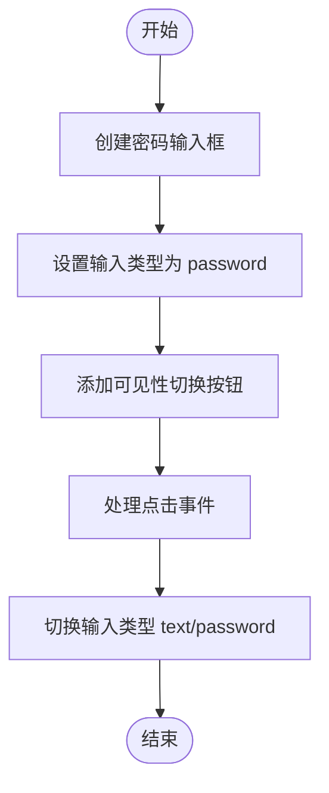
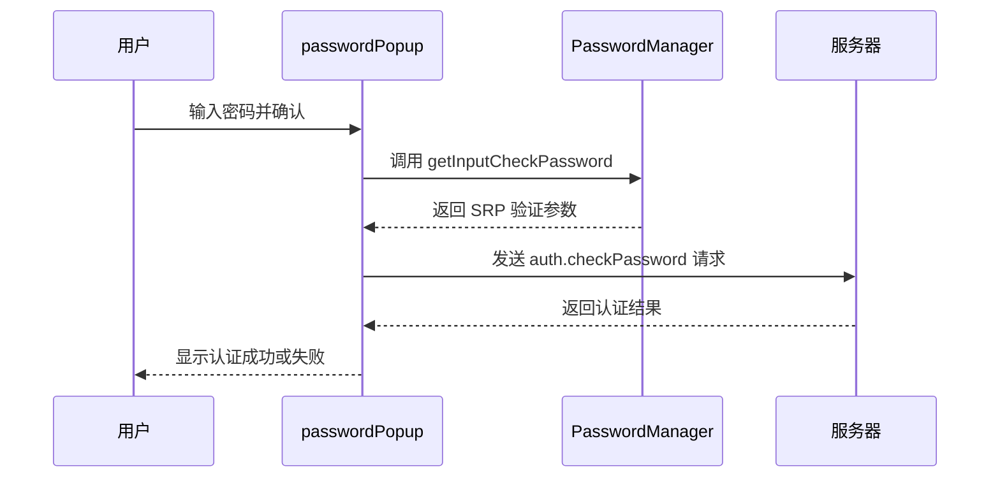
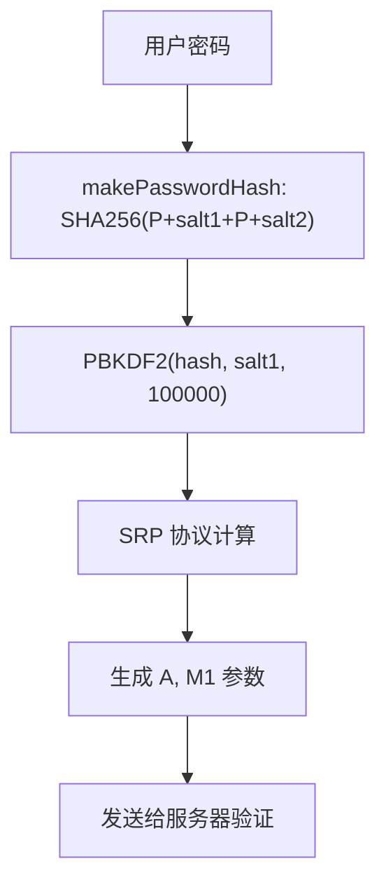

# 密码认证

<cite>
**本文档中引用的文件**  
- [passwordInputField.ts](file://src/components/passwordInputField.ts)
- [password.tsx](file://src/components/popups/password.tsx)
- [passwordManager.ts](file://src/lib/mtproto/passwordManager.ts)
- [srp.ts](file://src/lib/crypto/srp.ts)
- [authorizer.ts](file://src/lib/mtproto/authorizer.ts)
- [loginPage.ts](file://src/pages/loginPage.ts)
- [password.ts](file://src/components/monkeys/password.ts)
- [passwordSet.ts](file://src/components/sidebarLeft/tabs/2fa/passwordSet.ts)
</cite>

## 目录
1. [简介](#简介)
2. [密码输入与前端组件](#密码输入与前端组件)
3. [密码验证流程](#密码验证流程)
4. [加密算法与安全策略](#加密算法与安全策略)
5. [错误处理与账户锁定机制](#错误处理与账户锁定机制)
6. [双因素认证集成](#双因素认证集成)
7. [前端与后端交互示例](#前端与后端交互示例)
8. [密码强度与用户体验](#密码强度与用户体验)
9. [结论](#结论)

## 简介
本文档详细描述了密码认证机制的实现，包括密码输入、验证、加密存储与传输、错误处理、重试限制、账户锁定以及双因素认证中的密码验证集成。系统采用安全的加密算法和密钥管理策略，确保用户凭证的安全性。

## 密码输入与前端组件
密码输入功能由 `PasswordInputField` 组件实现，该组件封装了密码输入框及其相关行为。用户可以通过点击眼睛图标切换密码可见性，提升用户体验。



**Diagram sources**
- [passwordInputField.ts](file://src/components/passwordInputField.ts#L1-L71)

**Section sources**
- [passwordInputField.ts](file://src/components/passwordInputField.ts#L1-L71)

## 密码验证流程
密码验证通过 `passwordPopup` 函数触发，该函数创建一个弹窗让用户输入密码，并调用 `passwordManager` 进行验证。验证过程包括获取当前密码状态、计算 SRP 哈希并发送到服务器进行检查。



**Diagram sources**
- [password.tsx](file://src/components/popups/password.tsx#L1-L69)
- [passwordManager.ts](file://src/lib/mtproto/passwordManager.ts#L1-L121)

**Section sources**
- [password.tsx](file://src/components/popups/password.tsx#L1-L69)
- [passwordManager.ts](file://src/lib/mtproto/passwordManager.ts#L1-L121)

## 加密算法与安全策略
系统使用安全的加密算法来保护密码。密码通过 SRP（Secure Remote Password）协议进行处理，结合 PBKDF2、SHA256 和模幂运算，确保即使在不安全的通道中也能安全地验证密码。



**Diagram sources**
- [srp.ts](file://src/lib/crypto/srp.ts#L1-L167)

**Section sources**
- [srp.ts](file://src/lib/crypto/srp.ts#L1-L167)

## 错误处理与账户锁定机制
系统对密码错误进行了详细的错误处理，包括密码哈希无效、洪水等待（FLOOD_WAIT）等情况。当用户多次输入错误密码时，系统会返回 `FLOOD_WAIT` 错误，提示用户等待一段时间后重试，从而实现账户锁定机制。

```mermaid
flowchart TD
输入密码 --> 验证失败?
验证失败? --> |是| 检查错误类型
检查错误类型 --> |PASSWORD_HASH_INVALID| 显示"密码错误"
检查错误类型 --> |FLOOD_WAIT_*| 显示"尝试次数过多，请稍后再试"
检查错误类型 --> |其他错误| 显示"发生错误"
```

**Diagram sources**
- [password.tsx](file://src/components/popups/password.tsx#L1-L69)
- [passwordManager.ts](file://src/lib/mtproto/passwordManager.ts#L1-L121)

**Section sources**
- [password.tsx](file://src/components/popups/password.tsx#L1-L69)
- [passwordManager.ts](file://src/lib/mtproto/passwordManager.ts#L1-L121)

## 双因素认证集成
在双因素认证流程中，密码验证作为关键环节被集成。用户在设置或验证双因素认证时，系统会调用 `passwordPopup` 弹窗获取密码，并通过 SRP 协议与服务器完成安全验证。

**Section sources**
- [passwordSet.ts](file://src/components/sidebarLeft/tabs/2fa/passwordSet.ts#L1-L60)
- [password.tsx](file://src/components/popups/password.tsx#L1-L69)

## 前端与后端交互示例
前端通过 `PasswordInputField` 收集用户输入，使用 `passwordManager.getInputCheckPassword` 生成 SRP 验证参数，然后通过 `auth.checkPassword` API 发送到后端进行验证。整个过程通过 MTProto 协议加密传输。

**Section sources**
- [passwordInputField.ts](file://src/components/passwordInputField.ts#L1-L71)
- [passwordManager.ts](file://src/lib/mtproto/passwordManager.ts#L1-L121)
- [authorizer.ts](file://src/lib/mtproto/authorizer.ts#L1-L662)

## 密码强度与用户体验
系统通过动画反馈（如猴子动画）增强用户体验。密码输入框支持切换可见性，帮助用户确认输入内容。虽然文档中未明确提及密码强度验证，但前端组件设计注重可用性和安全性平衡。

**Section sources**
- [password.ts](file://src/components/monkeys/password.ts#L1-L69)
- [passwordInputField.ts](file://src/components/passwordInputField.ts#L1-L71)

## 结论
本系统实现了安全、可靠的密码认证机制，采用 SRP 协议确保密码在传输过程中的安全性，结合 PBKDF2 和 SHA256 提供强大的密码哈希保护。通过合理的错误处理和重试限制机制，有效防止暴力破解攻击。前端组件设计注重用户体验，同时保证安全性。