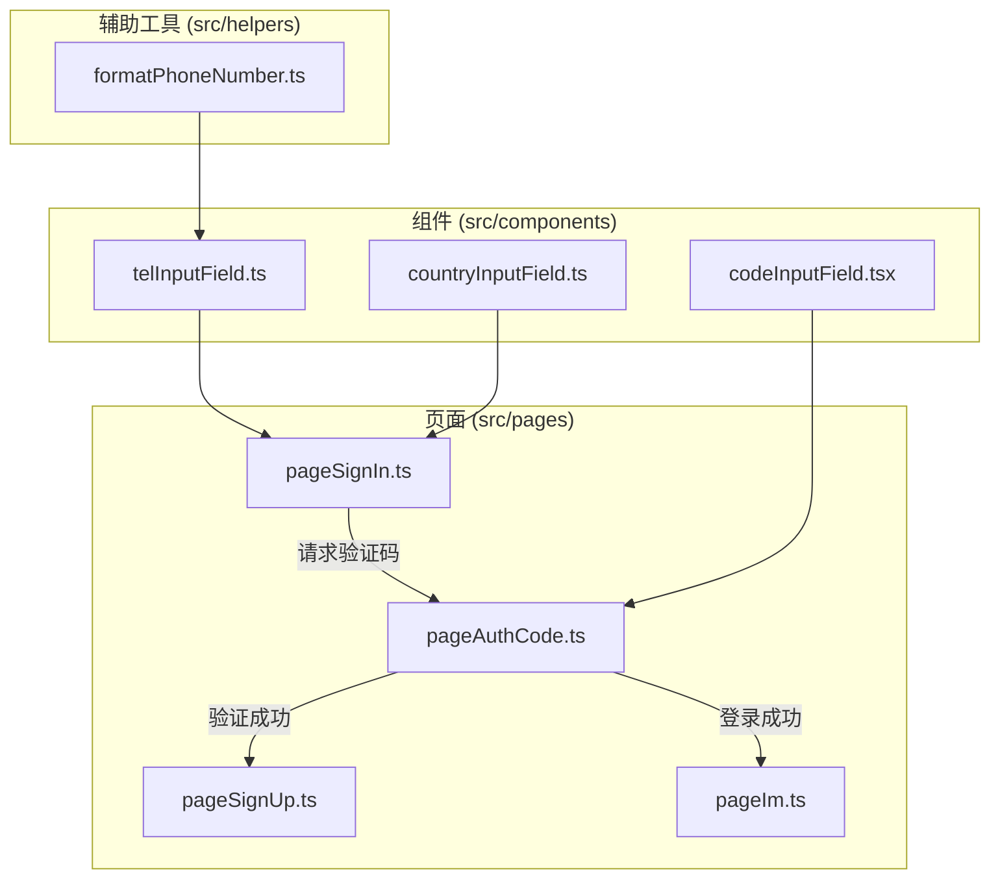
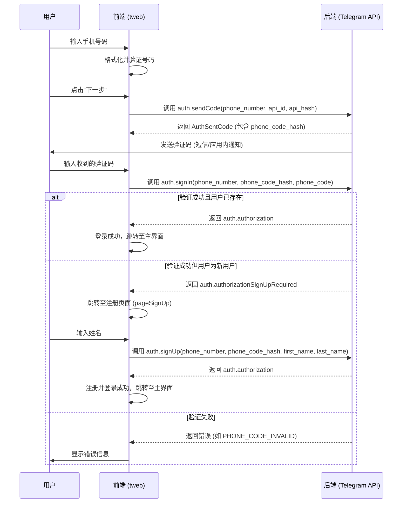
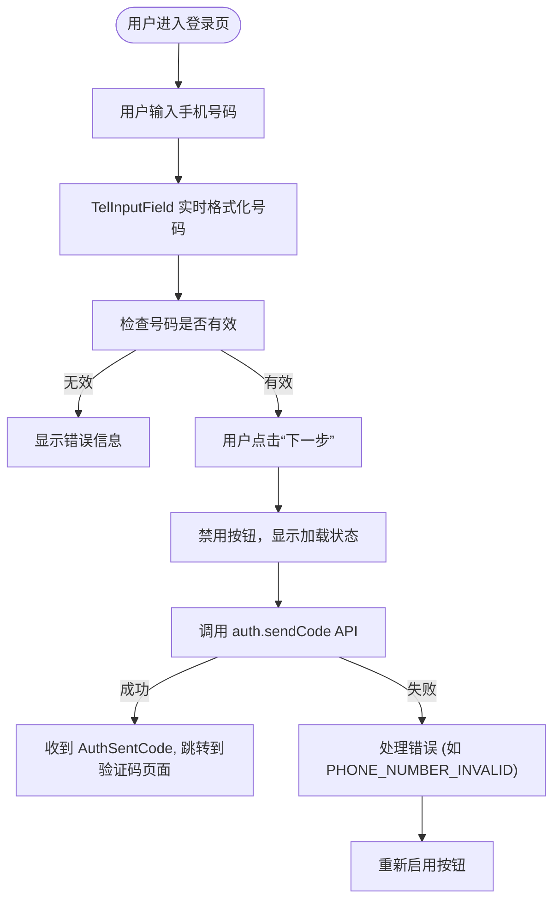
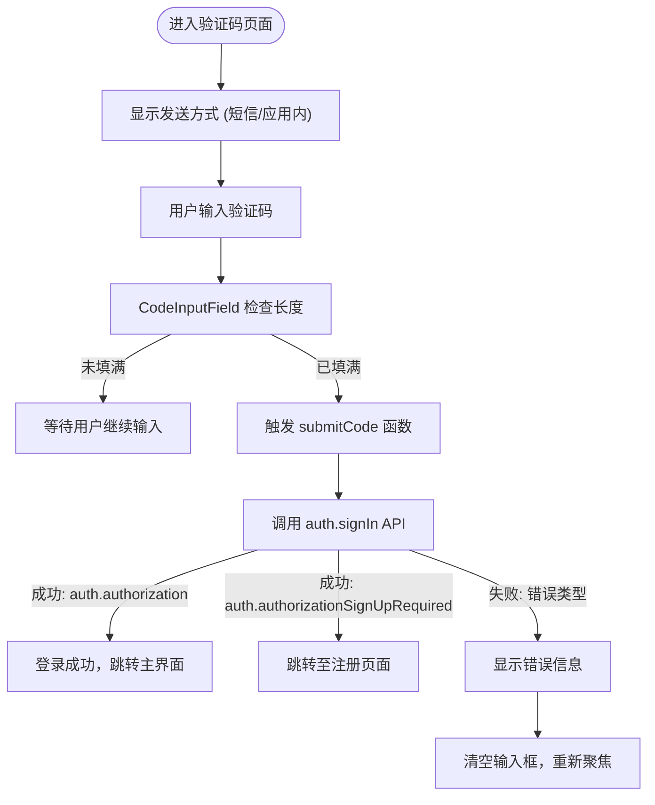
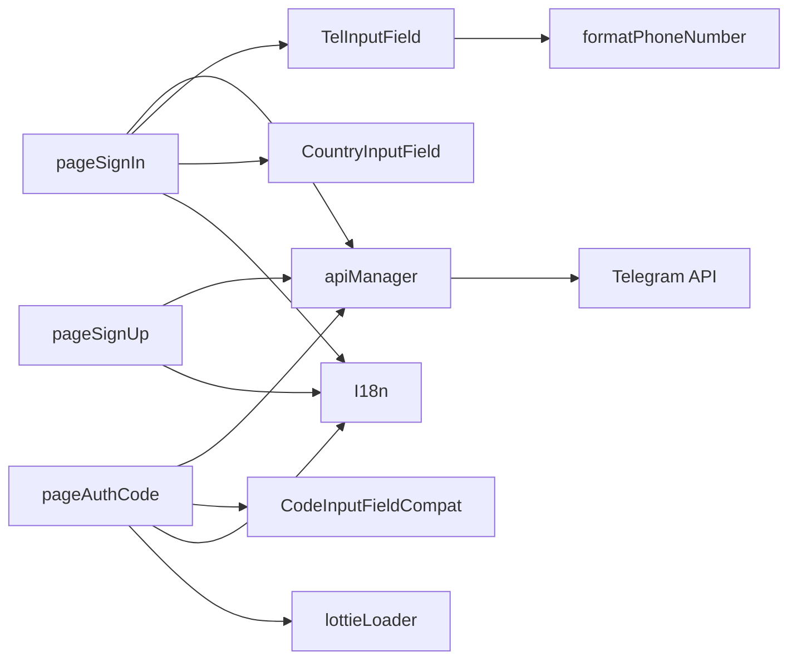

# 手机号认证

<cite>
**本文档引用的文件**  
- [pageSignIn.ts](file://src/pages/pageSignIn.ts)
- [pageAuthCode.ts](file://src/pages/pageAuthCode.ts)
- [pageSignUp.ts](file://src/pages/pageSignUp.ts)
- [telInputField.ts](file://src/components/telInputField.ts)
- [codeInputField.tsx](file://src/components/codeInputField.tsx)
- [countryInputField.ts](file://src/components/countryInputField.ts)
- [formatPhoneNumber.ts](file://src/helpers/formatPhoneNumber.ts)
- [authorizer.ts](file://src/lib/mtproto/authorizer.ts)
- [loginPage.ts](file://src/pages/loginPage.ts)
</cite>

## 目录
1. [简介](#简介)
2. [项目结构](#项目结构)
3. [核心组件](#核心组件)
4. [架构概述](#架构概述)
5. [详细组件分析](#详细组件分析)
6. [依赖分析](#依赖分析)
7. [性能考虑](#性能考虑)
8. [故障排除指南](#故障排除指南)
9. [结论](#结论)

## 简介
本文档详细描述了基于 `tweb` 项目的手机号认证流程实现。该流程涵盖了从用户输入手机号码、请求验证码、输入验证码到最终登录或注册的完整过程。系统通过前端组件与后端 API 的紧密协作，实现了安全、流畅的用户认证体验。文档深入分析了 API 调用序列、请求/响应格式、状态转换机制、验证码的生成与验证逻辑，以及针对各种错误情况的处理方案。

## 项目结构
手机号认证功能主要由 `src/pages` 目录下的登录相关页面和 `src/components` 目录下的输入组件构成。核心逻辑分布在 `pageSignIn.ts`（手机号输入与验证码请求）、`pageAuthCode.ts`（验证码输入与验证）和 `pageSignUp.ts`（用户信息注册）三个页面文件中。相关的 UI 组件，如电话号码输入框和验证码输入框，则位于 `src/components` 目录下。

**Diagram sources**
- [pageSignIn.ts](file://src/pages/pageSignIn.ts)
- [pageAuthCode.ts](file://src/pages/pageAuthCode.ts)
- [pageSignUp.ts](file://src/pages/pageSignUp.ts)
- [telInputField.ts](file://src/components/telInputField.ts)
- [codeInputField.tsx](file://src/components/codeInputField.tsx)
- [countryInputField.ts](file://src/components/countryInputField.ts)
- [formatPhoneNumber.ts](file://src/helpers/formatPhoneNumber.ts)

**Section sources**
- [pageSignIn.ts](file://src/pages/pageSignIn.ts)
- [pageAuthCode.ts](file://src/pages/pageAuthCode.ts)
- [pageSignUp.ts](file://src/pages/pageSignUp.ts)
- [telInputField.ts](file://src/components/telInputField.ts)
- [codeInputField.tsx](file://src/components/codeInputField.tsx)
- [countryInputField.ts](file://src/components/countryInputField.ts)
- [formatPhoneNumber.ts](file://src/helpers/formatPhoneNumber.ts)

## 核心组件
手机号认证流程的核心组件包括：
- **`TelInputField`**: 用于输入和格式化手机号码的组件。
- **`CodeInputFieldCompat`**: 用于输入和验证验证码的组件。
- **`pageSignIn`**: 处理手机号输入和验证码请求的主页面。
- **`pageAuthCode`**: 处理验证码输入和验证的主页面。
- **`pageSignUp`**: 在用户首次注册时，用于收集用户姓名信息的页面。

这些组件协同工作，引导用户完成整个认证流程。

**Section sources**
- [pageSignIn.ts](file://src/pages/pageSignIn.ts)
- [pageAuthCode.ts](file://src/pages/pageAuthCode.ts)
- [pageSignUp.ts](file://src/pages/pageSignUp.ts)
- [telInputField.ts](file://src/components/telInputField.ts)
- [codeInputField.tsx](file://src/components/codeInputField.tsx)

## 架构概述
手机号认证流程遵循一个清晰的客户端-服务器交互模式。前端负责收集用户输入并展示状态，后端 API 负责处理认证逻辑。整个流程可以分为三个主要阶段：手机号输入与请求、验证码验证、以及用户注册（如果需要）。

**Diagram sources**
- [pageSignIn.ts](file://src/pages/pageSignIn.ts#L130-L153)
- [pageAuthCode.ts](file://src/pages/pageAuthCode.ts#L50-L89)
- [pageSignUp.ts](file://src/pages/pageSignUp.ts#L124-L136)

## 详细组件分析

### 手机号输入与请求分析
`pageSignIn.ts` 是认证流程的入口。它使用 `TelInputField` 和 `CountryInputField` 组件来收集用户的手机号码。`TelInputField` 组件会实时调用 `formatPhoneNumber` 工具函数来格式化输入的号码，并根据号码前缀自动选择对应的国家。

当用户点击“下一步”按钮时，`onSubmit` 函数会被触发。该函数会禁用按钮以防止重复提交，然后调用 `rootScope.managers.apiManager.invokeApi('auth.sendCode', ...)` 方法，向 Telegram 服务器发起 `auth.sendCode` 请求。此请求包含用户的手机号码、应用的 `api_id` 和 `api_hash`。服务器验证手机号码后，会生成一个验证码并通过短信或应用内通知发送给用户，同时返回一个包含 `phone_code_hash` 的 `AuthSentCode` 对象，该对象被传递给 `pageAuthCode` 页面用于后续验证。

**Diagram sources**
- [pageSignIn.ts](file://src/pages/pageSignIn.ts#L117-L169)
- [telInputField.ts](file://src/components/telInputField.ts#L55-L87)
- [formatPhoneNumber.ts](file://src/helpers/formatPhoneNumber.ts#L23-L127)

**Section sources**
- [pageSignIn.ts](file://src/pages/pageSignIn.ts#L34-L294)
- [telInputField.ts](file://src/components/telInputField.ts#L13-L112)
- [formatPhoneNumber.ts](file://src/helpers/formatPhoneNumber.ts#L7-L128)

### 验证码输入与验证分析
`pageAuthCode.ts` 负责处理验证码的输入和验证。它接收来自 `pageSignIn` 的 `AuthSentCode` 对象，并根据 `authSentCode.type._` 的值（如 `auth.sentCodeTypeSms`, `auth.sentCodeTypeApp`）向用户展示验证码的发送方式。

用户在 `CodeInputFieldCompat` 组件中输入验证码。当输入框被填满时，`onFill` 回调会被触发，进而调用 `submitCode` 函数。该函数会调用 `auth.signIn` API，将手机号码、`phone_code_hash` 和用户输入的 `phone_code` 发送给服务器进行验证。

服务器的响应决定了后续流程：
- 如果返回 `auth.authorization`，表示用户已存在，直接登录成功。
- 如果返回 `auth.authorizationSignUpRequired`，表示这是一个新用户，需要跳转到 `pageSignUp` 进行注册。
- 如果返回错误（如 `PHONE_CODE_INVALID` 或 `PHONE_CODE_EXPIRED`），则在输入框下方显示相应的错误信息，并允许用户重新输入。

**Diagram sources**
- [pageAuthCode.ts](file://src/pages/pageAuthCode.ts#L49-L123)
- [codeInputField.tsx](file://src/components/codeInputField.tsx#L262-L271)

**Section sources**
- [pageAuthCode.ts](file://src/pages/pageAuthCode.ts#L126-L328)
- [codeInputField.tsx](file://src/components/codeInputField.tsx#L13-L297)

### 用户注册分析
当 `auth.signIn` 验证成功但用户是新用户时，系统会调用 `pageSignUp.ts`。该页面允许用户输入他们的名字和姓氏。

用户填写完信息并点击“注册”按钮后，`btnSignUp` 的点击事件处理器会被触发。它会收集用户输入的姓名，并结合之前从 `pageAuthCode` 传递过来的 `phone_number` 和 `phone_code_hash`，调用 `auth.signUp` API 完成注册。注册成功后，服务器会返回 `auth.authorization`，用户随即被登录并跳转至主界面。

**Section sources**
- [pageSignUp.ts](file://src/pages/pageSignUp.ts#L97-L158)

## 依赖分析
手机号认证流程依赖于多个关键模块：
- **`rootScope.managers.apiManager`**: 提供了与 Telegram MTProto API 通信的核心方法，如 `invokeApi`。
- **`I18n`**: 用于国际化，确保所有用户界面文本（如按钮、提示）都能根据用户的语言设置正确显示。
- **`lottieLoader` 和 `TrackingMonkey`**: 用于在验证码页面加载和播放动画，提升用户体验。
- **`formatPhoneNumber`**: 一个关键的辅助函数，用于解析和格式化全球范围内的手机号码。

**Diagram sources**
- [pageSignIn.ts](file://src/pages/pageSignIn.ts#L24-L25)
- [pageAuthCode.ts](file://src/pages/pageAuthCode.ts#L15-L16)
- [pageSignUp.ts](file://src/pages/pageSignUp.ts#L13-L14)
- [formatPhoneNumber.ts](file://src/helpers/formatPhoneNumber.ts#L8)

**Section sources**
- [pageSignIn.ts](file://src/pages/pageSignIn.ts#L7-L294)
- [pageAuthCode.ts](file://src/pages/pageAuthCode.ts#L7-L328)
- [pageSignUp.ts](file://src/pages/pageSignUp.ts#L7-L173)
- [formatPhoneNumber.ts](file://src/helpers/formatPhoneNumber.ts#L7-L128)

## 性能考虑
为了优化性能和用户体验，代码库中采用了以下策略：
- **懒加载**: `pageSignUp` 和 `pagePassword` 等页面使用 `import()` 动态导入，只有在需要时才加载，减少了初始加载时间。
- **动画预加载**: 在用户开始输入手机号码时，`pageSignIn` 会提前调用 `lottieLoader.loadLottieWorkers()`，为后续可能的动画播放做好准备。
- **防抖与节流**: 虽然在提供的代码片段中不明显，但 `helpers/schedulers` 模块的存在表明系统可能在处理高频事件（如输入、滚动）时使用了防抖或节流技术。

## 故障排除指南
以下是常见错误及其处理方式：

| 错误类型 | 触发条件 | 处理方式 |
| :--- | :--- | :--- |
| `PHONE_NUMBER_INVALID` | 用户输入了格式错误或不存在的手机号码 | 前端高亮电话号码输入框，显示“无效的电话号码”错误信息。 |
| `PHONE_CODE_INVALID` | 用户输入的验证码不正确 | 前端高亮验证码输入框，显示“验证码错误”信息，并清空输入框。 |
| `PHONE_CODE_EXPIRED` | 用户输入的验证码已过期（通常为5分钟） | 前端高亮验证码输入框，显示“验证码已过期”信息，用户需要返回上一步重新请求。 |
| `SESSION_PASSWORD_NEEDED` | 用户账户启用了两步验证 | 系统会自动跳转到密码输入页面，要求用户输入两步验证密码。 |
| `TASK_ALREADY_EXISTS` (在重置邮箱时) | 用户尝试过于频繁地重置登录邮箱 | 弹出提示框，告知用户需要等待一段时间或升级到高级账户。 |

**Section sources**
- [pageSignIn.ts](file://src/pages/pageSignIn.ts#L158-L167)
- [pageAuthCode.ts](file://src/pages/pageAuthCode.ts#L91-L113)
- [pageAuthCode.ts](file://src/pages/pageAuthCode.ts#L197-L208)

## 结论
`tweb` 项目的手机号认证流程实现了一个健壮、用户友好的身份验证系统。通过清晰的页面划分、模块化的组件设计和对 API 错误的细致处理，该流程为用户提供了顺畅的登录和注册体验。其架构设计合理，依赖关系明确，易于维护和扩展。对性能的优化（如懒加载）也确保了应用的响应速度。整体实现符合现代 Web 应用的安全和用户体验标准。